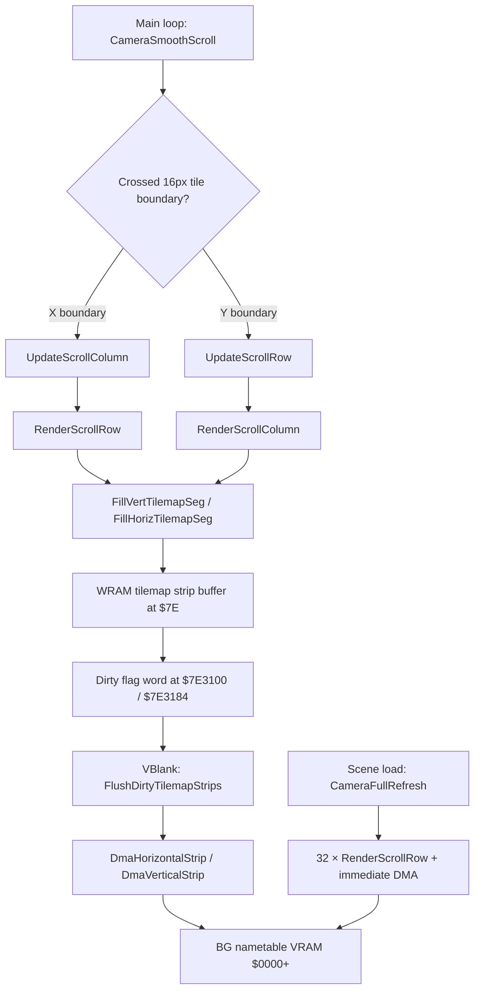
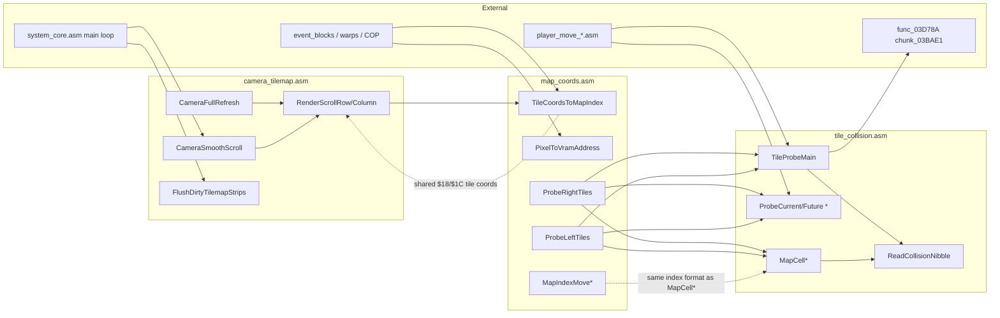

# Bank $02 — Camera, Map Coordinates & Tile Collision

**Bank:** `$02` (FastROM; accessed via `$@` long calls from other banks)  
**Document scope:** Incremental tilemap scrolling, map coordinate/index helpers, and tile collision probing in the `engine` scene.  
**Last updated:** 2026-09-07

This document covers three ASM compilation units that implement Illusion of Gaia's **field rendering and movement physics substrate**:

1. **`camera_tilemap.asm`** — Smooth camera follow, dirty-strip tilemap buffering, and DMA upload to BG nametables during scroll.
2. **`map_coords.asm`** — Tile/pixel coordinate transforms, map-buffer index navigation, and directional collision cascade probes used by diagonal movement.
3. **`tile_collision.asm`** — Position→tile conversion, collision nibble lookup at `$7FC000`, and movement delta finalization.

These routines sit above the hardware math layer ([`hardware-and-init.md`](hardware-and-init.md)) and below the player movement dispatchers in `player_move_*.asm`. Scene load triggers a full tilemap refresh via [`chunk_03BAE1.asm`](../../../extracted/system/chunk_03BAE1.asm); the main loop in [`system_core.asm`](../../../extracted/system/engine/system_core.asm) calls smooth scroll and VBlank DMA every frame.

**Related:** [`scene-engine.md`](scene-engine.md) · [`../bank00/camera-scroll-system.md`](../bank00/camera-scroll-system.md) · [`../bank00/direction-collision.md`](../bank00/direction-collision.md) · [`../bank00/data-tables-memory.md`](../bank00/data-tables-memory.md) · [`../bank2-code-analysis.md`](../bank2-code-analysis.md) · [`../../cop-commands-reference.md`](../../cop-commands-reference.md)

---

## Block Layout Overview

```
$02AB8A ┌─ CameraFullRefresh ──────────────────────────┐
        │  CameraSmoothScroll / UpdateScroll*          │
        │  RenderScrollColumn / RenderScrollRow        │  camera_tilemap
        │  Fill*TilemapSeg / FlushDirtyTilemapStrips   │
        │  DmaHorizontalStrip / DmaVerticalStrip       │
        │  SpriteVramDma                               │
$02B0A3 ├─ TileCoordsToMapIndex ───────────────────────┤
        │  PixelToVramAddress / MapIndexMove*          │  map_coords
        │  ProbeRightTiles / ProbeLeftTiles            │
$02B20E ├─ (dark_space_palette, player_move, …) ───────┤  ← other blocks
        │                                              │
$02E102 ├─ CombinedProbe_Unused … CheckSubTileAlignY  │  tile_collision
$02E396 └─ (inventory_menu continues) ────────────────┘
```

> **Note:** `map_coords` and `tile_collision` are **not contiguous** in ROM. Roughly 12 KB of unrelated engine code sits between `$02B20E` and `$02E102`. They link at compile time via `?INCLUDE 'tile_collision'` in `map_coords.asm`.

---

## Shared Memory Map

### Camera & Scroll State

| Address | Size | Name / Role |
|---------|------|-------------|
| `$068A`–`$068F` | 6 | Current smoothed scroll position (BG1/BG2 H/V pairs; indexed by `X`) |
| `$0692` | 2 | `map_bounds_x` — map width in pixels |
| `$0693` | 1 | Map row width in **columns** (layer 0); byte stride for index math |
| `$0695` | 1 | Map row width for **layer 1** |
| `$0696` | 2 | `map_bounds_y` — map height in pixels |
| `$069A`–`$069D` | 4 | Map origin / extent helpers for wrap calculations |
| `$069E`–`$06B8` | 26 | Map buffer pointers, VRAM layout bases, dirty-strip queue heads |
| `$06AE` | 2 | Tile graphics source base (map tileset in `$7E`) |
| `$06BA` | 2 | VRAM nametable base address for queued tile writes |
| `$06BE` | 2 | Camera **target** X (follows player) |
| `$06C2` | 2 | Camera **target** Y |
| `$06CE` | 2 | Per-frame scroll delta X (clamped ±16 px) |
| `$06D2` | 2 | Per-frame scroll delta Y (clamped ±16 px) |
| `$06D6` | 2 | `camera_offset_x` — left edge of active map window |
| `$06D8` | 2 | `camera_offset_y` — top edge of active map window |
| `$06DA` | 2 | `camera_bounds_x` — right edge of active map window |
| `$06DE` | 2 | Camera lower Y bound for collision probes |
| `$06EE` | 2 | Scene display flags; bit `$0008` = skip smooth scroll |
| `$06EF` | 2 | Scene system flags; bit `$0001` = BG2 active |
| `$7E3100` / `$7E3288` | 2 | Horizontal dirty-strip VRAM address queue (BG1 / BG2) |
| `$7E3184` / `$7E330C` | 2 | Vertical dirty-strip VRAM address queue (BG1 / BG2) |

### Player Movement & Probe Scratch

| Address | Size | Role |
|---------|------|------|
| `$20` | 2 | Horizontal movement delta (sub-pixel, ×4 scale) |
| `$22` | 2 | Player X position |
| `$24` | 2 | Vertical movement delta |
| `$26` | 2 | Player Y position |
| `$1A` | 2 | Probe X coordinate (pixel space, tile-aligned) |
| `$1E` | 2 | Probe Y coordinate (pixel space, tile-aligned) |
| `$18` | 2 | Tile column scratch |
| `$1C` | 2 | Tile row scratch |
| `$00`–`$04` | 5 | Map cell index / alignment scratch |
| `$7FC000`+ | — | Runtime collision overlay (high nibble = dynamic block; low nibble = base tile type) |

---

## Scrolling Pipeline

The camera system uses a **two-phase** update: logical scroll during the main loop, physical VRAM upload during VBlank.



**Phase 1 — Smooth Scroll (main loop):** `CameraSmoothScroll` compares camera target against current scroll, clamps delta to ±16 px, and on tile-boundary crossing triggers `UpdateScrollColumn` / `UpdateScrollRow` → render helpers.

**Phase 2 — Strip DMA (VBlank):** `FlushDirtyTilemapStrips` uploads queued WRAM strips via horizontal or vertical DMA and clears dirty flags.

**Full Refresh (scene load):** `CameraFullRefresh` loops 32 rows with immediate DMA and uploads CGRAM palette.

---

## Collision Type Reference

| Type | Meaning | Direction Handling |
|------|---------|-------------------|
| `$00` | Passable (empty) | Free movement |
| `$01` | Passable (variant) | Free movement (down-left special) |
| `$02` | Interactive tile | Redirect to alternate animation |
| `$03` | Slope (right / ascending east) | Computed sub-pixel Y correction |
| `$05` | Semi-solid / ramp entry | Ramp passability checks |
| `$06` | Wall (south-facing) | Block southward, allow eastward slide |
| `$07` | Ladder / climbable | Auto-climb state change |
| `$08` | Stairs | Stair-step movement redirect |
| `$09` | Wall (north-facing) | Block northward, allow slide |
| `$0A` | Ramp / passable slope | Full ramp movement with Y tracking |
| `$0C` | Slope (left / ascending west) | Computed sub-pixel Y correction with accumulator |
| `$0E`+ | Solid wall | Full block, zero speed |
| `$0F` | Out of bounds / solid | Returned for OOB probes |

Dynamic collision (COP `$0B`/`$0C`/`$11` handlers) ORs `$F0` into the high nibble at `$7FC000`. `ReadCollisionNibble` prefers the high nibble when non-zero. See [`direction-collision.md`](../bank00/direction-collision.md).

---

## Probe Corner Layout

Player collision uses four corner probes offset from the 16×16 pixel footbox:

```
        TL (−8, −16)    TR (+7, −16)
              ┌──────────────┐
              │   16×16 px   │
              │   footbox    │
              └──────────────┘
        BL (−8, −1)     BR (+7, −1)
```

Coordinates are in **tile-pixel space** (`$22`/`$26` divided by 4).

---

## camera_tilemap.asm

| Property | Value |
|----------|-------|
| **Path** | [`extracted/system/engine/camera_tilemap.asm`](../../../extracted/system/engine/camera_tilemap.asm) |
| **Block** | `camera_tilemap` |
| **Scene** | `engine` |
| **Address range** | `$02AB8A`–`$02B0A3` |
| **Includes** | `hardware_math`, `system_init` |

### CameraFullRefresh

| Property | Value |
|----------|-------|
| **Name** | `CameraFullRefresh` |
| **Address** | `$02AB8A` |
| **Decimal** | 174986 |
| **Size** | 164 bytes |
| **Type** | Code |
| **ASM file** | [`camera_tilemap.asm`](../../../extracted/system/engine/camera_tilemap.asm) |

**Description**

`CameraFullRefresh` performs a complete BG nametable rebuild when a scene loads. It is invoked from `chunk_03BAE1.asm` after map and tilemap decompression, before the player can move. The routine first clamps the camera target coordinates (`$06BE`/`$06C2`) to the map pixel bounds stored in `$0692`/`$0696`, then copies the clamped values into the current scroll registers `$068A`/`$068E`.

After clamping, the function tile-aligns the camera by masking off the low four bits of each axis into scratch variables `$18` (column) and `$1C` (row). These coordinates drive the scroll-row renderer for the remainder of the function. DMA channel 0 is configured once for word-mode writes to VRAM register `$2118`, with source bank `$7E`.

The main loop runs 32 iterations — one per visible tile row. Each iteration calls `RenderScrollRow` to populate a WRAM strip buffer, reads the queued VRAM destination address from the dirty-queue head at `$7E0000,X`, and immediately DMAs the strip via `DmaHorizontalStrip`. The column counter `$18` advances by 16 pixels per iteration, wrapping at `$map_bounds_x` when the camera crosses the second nametable half.

On completion, all four dirty-flag words (`$7E3100`, `$7E3288`, `$7E3184`, `$7E330C`) are cleared, and CGRAM palette is uploaded via `system_init.UploadCgramPalette`.

**Algorithm**

| Step | Action |
|------|--------|
| 1 | Save P register; enter 16-bit accumulator mode |
| 2 | Clamp `$06BE,X` to `$0692,X`; copy to `$068A,X`; tile-align → `$18` |
| 3 | Clamp `$06C2,X` to `$0696,X`; copy to `$068E,X`; tile-align → `$1C` |
| 4 | Configure DMA channel 0: VMAIN=`$81`, DMAP0=`$01`, BBAD0=`$18`, A1B0=`$7E` |
| 5 | Loop 32×: `RenderScrollRow` → read VRAM addr from `$7E0000,X` → `DmaHorizontalStrip` |
| 6 | Advance `$18` by `$0010`; wrap against `$map_bounds_x,X` |
| 7 | Clear four dirty-flag words; JSL `UploadCgramPalette`; restore and RTL |

**Source**

```19:97:extracted/system/engine/camera_tilemap.asm
CameraFullRefresh {
    PHP 
    REP #$20
    LDA $06BE, X
    CMP $map_bounds_x, X
    // ... clamp, 32-row loop, palette upload ...
    PLP 
    RTL 
}
```

**Variables**

| Location | Direction | Role |
|----------|-----------|------|
| `$06BE,X` | In | Camera target X |
| `$06C2,X` | In | Camera target Y |
| `$068A,X` / `$068E,X` | Out | Current scroll position |
| `$18` / `$1C` | Out | Tile-aligned column / row |
| `$0692,X` / `$0696,X` | In | Map pixel bounds |
| `$06B2,X` | In | Horizontal dirty-queue head pointer |
| `$7E0000,X` | In | Queued VRAM destination address |
| `$7E3100`–`$7E330C` | Out | Cleared dirty flags |

**Cross-References**

| Symbol | Relationship |
|--------|--------------|
| `RenderScrollRow` | Called 32× to build each row strip |
| `DmaHorizontalStrip` | Called 32× for immediate row upload |
| `system_init.UploadCgramPalette` | JSL after refresh completes |
| `chunk_03BAE1.asm` | Primary caller on scene load |

---

### CameraSmoothScroll

| Property | Value |
|----------|-------|
| **Name** | `CameraSmoothScroll` |
| **Address** | `$02AC2E` |
| **Decimal** | 175150 |
| **Size** | 158 bytes |
| **Type** | Code |
| **ASM file** | [`camera_tilemap.asm`](../../../extracted/system/engine/camera_tilemap.asm) |

**Description**

`CameraSmoothScroll` is the per-frame camera follow routine called from `system_core.asm` for both BG1 (`X=0`) and BG2 (`X=2`). It smoothly interpolates the current scroll position toward the camera target, producing a lagged follow effect rather than instant snapping.

Two early-exit paths bypass smooth scrolling. If `$06EF` bit `$0008` is set (instant snap flag), the target coordinates are copied directly to `$068A`/`$068E`. If `X≠0` (BG2 layer) and `$06EE` bit `$0400` is set, BG2 scroll is copied from alternate registers `$06C0`/`$06C4`.

For the normal path, the X-axis delta is computed as `$06BE − $068A`, then clamped to the range `[−16, +16]` and stored in `$06CE`. The clamped delta is added to `$068A`. An XOR test between the old and new scroll values detects crossing of a 16-pixel tile boundary (bit `$0010`); when set, `UpdateScrollColumn` is invoked to queue a new column strip.

The Y axis follows the identical pattern using `$06C2`, `$068E`, `$06D2`, and `UpdateScrollRow`.

**Algorithm**

| Step | Action |
|------|--------|
| 1 | If `$06EF` bit `$0008`: snap target → scroll; RTL |
| 2 | If BG2 + `$06EE` bit `$0400`: copy alt scroll; RTL |
| 3 | Compute X delta; clamp to `[−16, +16]` → `$06CE`; update `$068A` |
| 4 | If tile boundary crossed on X: `UpdateScrollColumn` |
| 5 | Compute Y delta; clamp → `$06D2`; update `$068E` |
| 6 | If tile boundary crossed on Y: `UpdateScrollRow` |

**Source**

```99:184:extracted/system/engine/camera_tilemap.asm
CameraSmoothScroll {
    PHP 
    REP #$20
    LDA $06EF
    BIT #$0008
    // ... clamp deltas, boundary detect, UpdateScroll* ...
    PLP 
    RTL 
}
```

**Variables**

| Location | Direction | Role |
|----------|-----------|------|
| `$06BE,X` / `$06C2,X` | In | Camera target |
| `$068A,X` / `$068E,X` | In/Out | Current scroll |
| `$06CE,X` / `$06D2,X` | Out | Clamped per-frame deltas |
| `$06EF` | In | Snap flag (bit `$0008`) |
| `$06EE` | In | BG2 disable flag (bit `$0400`) |
| `X` | In | BG layer index (`0`=BG1, `2`=BG2) |

**Cross-References**

| Symbol | Relationship |
|--------|--------------|
| `UpdateScrollColumn` | Called on horizontal tile-boundary cross |
| `UpdateScrollRow` | Called on vertical tile-boundary cross |
| `system_core.asm` | Caller — twice per frame (BG1 + BG2) |

---

### UpdateScrollRow

| Property | Value |
|----------|-------|
| **Name** | `UpdateScrollRow` |
| **Address** | `$02ACCC` |
| **Decimal** | 175308 |
| **Size** | 37 bytes |
| **Type** | Code |
| **ASM file** | [`camera_tilemap.asm`](../../../extracted/system/engine/camera_tilemap.asm) |

**Description**

`UpdateScrollRow` is the vertical-scroll dirty-strip trigger. When `CameraSmoothScroll` detects that the smoothed Y position crossed a 16-pixel tile boundary, this routine determines which map row needs to be rendered and calls `RenderScrollColumn`.

The current scroll X is copied to `$18` so the column renderer knows the horizontal position. The Y coordinate is adjusted by `$00E0` (scrolling down, +224 px) or `$FFF0` (scrolling up, −16 px) depending on the sign of `$06D2`. The result is stored in `$1C` and wrapped modulo `$map_bounds_y` in a subtract loop before calling `RenderScrollColumn`.

**Algorithm**

| Step | Action |
|------|--------|
| 1 | `$18` ← `$068A,X` |
| 2 | If `$06D2,X` negative: Y offset = `$FFF0`; else `$00E0` |
| 3 | Add offset to `$068E,X` → `$1C`; wrap against `$map_bounds_y,X` |
| 4 | JSR `RenderScrollColumn` |

**Source**

```186:209:extracted/system/engine/camera_tilemap.asm
UpdateScrollRow {
    LDA $068A, X
    STA $18
    LDA #$FFF0
    LDY $06D2, X
    // ... wrap Y, RenderScrollColumn ...
    RTS 
}
```

**Variables**

| Location | Direction | Role |
|----------|-----------|------|
| `$068A,X` | In | Current scroll X |
| `$068E,X` | In | Current scroll Y |
| `$06D2,X` | In | Y scroll delta (sign selects direction) |
| `$18` / `$1C` | Out | Tile column / row for renderer |
| `$map_bounds_y,X` | In | Map height for wrap |

**Cross-References**

| Symbol | Relationship |
|--------|--------------|
| `CameraSmoothScroll` | Caller on Y tile-boundary cross |
| `RenderScrollColumn` | Called to build vertical strip |

---

### UpdateScrollColumn

| Property | Value |
|----------|-------|
| **Name** | `UpdateScrollColumn` |
| **Address** | `$02ACF1` |
| **Decimal** | 175345 |
| **Size** | 26 bytes |
| **Type** | Code |
| **ASM file** | [`camera_tilemap.asm`](../../../extracted/system/engine/camera_tilemap.asm) |

**Description**

`UpdateScrollColumn` is the horizontal-scroll dirty-strip trigger, symmetric to `UpdateScrollRow`. When the camera crosses a 16-pixel column boundary, this routine computes the new column coordinate and invokes `RenderScrollRow`.

The X offset is `$0100` (scrolling right, +256 px in fixed-point) when `$06CE` is non-negative, or `$0000` (no offset, scrolling left) when negative. The offset is added to `$068A` and stored in `$18`. Current scroll Y is copied to `$1C`, then `RenderScrollRow` builds the horizontal strip.

**Algorithm**

| Step | Action |
|------|--------|
| 1 | If `$06CE,X` negative: X offset = `$0000`; else `$0100` |
| 2 | Add offset to `$068A,X` → `$18` |
| 3 | `$1C` ← `$068E,X` |
| 4 | JSR `RenderScrollRow` |

**Source**

```211:225:extracted/system/engine/camera_tilemap.asm
UpdateScrollColumn {
    LDA #$0000
    LDY $06CE, X
    // ... compute $18, copy Y, RenderScrollRow ...
    RTS 
}
```

**Variables**

| Location | Direction | Role |
|----------|-----------|------|
| `$06CE,X` | In | X scroll delta (sign selects direction) |
| `$068A,X` / `$068E,X` | In | Current scroll position |
| `$18` / `$1C` | Out | Tile column / row for renderer |

**Cross-References**

| Symbol | Relationship |
|--------|--------------|
| `CameraSmoothScroll` | Caller on X tile-boundary cross |
| `RenderScrollRow` | Called to build horizontal strip |

---

### RenderScrollColumn

| Property | Value |
|----------|-------|
| **Name** | `RenderScrollColumn` |
| **Address** | `$02AD0B` |
| **Decimal** | 175371 |
| **Size** | 130 bytes |
| **Type** | Code |
| **ASM file** | [`camera_tilemap.asm`](../../../extracted/system/engine/camera_tilemap.asm) |

**Description**

`RenderScrollColumn` renders one 16-tile vertical column into the WRAM strip buffer when the camera scrolls vertically. It computes the map buffer index from tile row (`$1C`) and column (`$18`), wraps the index via `WrapMapIndex`, and writes VRAM destination addresses to both BG1 and BG2 strip queue heads.

The VRAM address calculation uses `$06BA` (nametable base) plus the row component of `$1C` shifted left by two bits. When `$18` bit `$0100` is set (second nametable half), the primary and secondary VRAM addresses are swapped between buffer slots `$0000` and `$0082`.

Two `FillHorizTilemapSeg` calls populate the strip: the first for the primary 16-tile segment, the second after advancing the map index by `$0100` and re-wrapping for the toroidal edge case.

**Algorithm**

| Step | Action |
|------|--------|
| 1 | Save P/B/X; set DBR=`$7E`; load tileset base `$06AE,X` → `$02` |
| 2 | Map index = row(`$1D`) × `$0693` + col(`$19`) + origin `$069F` |
| 3 | `WrapMapIndex`; compute VRAM dest from `$06BA` + row nibble |
| 4 | Write VRAM addrs to strip buffer (swap if `$18` bit `$0100`) |
| 5 | `FillHorizTilemapSeg` × 16 tiles; advance index `$0100`; wrap; fill again |
| 6 | Restore registers |

**Source**

```227:300:extracted/system/engine/camera_tilemap.asm
RenderScrollColumn {
    PHP 
    PHB 
    PHX 
    // ... index calc, VRAM addr queue, FillHorizTilemapSeg ×2 ...
    PLP 
    RTS 
}
```

**Variables**

| Location | Direction | Role |
|----------|-----------|------|
| `$18` / `$1C` | In | Tile column / row |
| `$0693,X` | In | Map row width (columns) |
| `$069F,X` | In | Map buffer origin offset |
| `$06AE,X` | In | Tileset graphics base in `$7E` |
| `$06BA,X` / `$06B6,X` | In/Out | VRAM base / vertical queue head |
| `$04` | In/Out | Map index for fill segment |
| `$02` | In | Tileset pointer for 8-byte tile records |

**Cross-References**

| Symbol | Relationship |
|--------|--------------|
| `UpdateScrollRow` | Caller |
| `WrapMapIndex` | Index toroidal wrap |
| `FillHorizTilemapSeg` | Called twice for 16-tile column |
| `hardware_math.SignedMultiply` | Row × width multiplication |

---

### WrapMapIndex

| Property | Value |
|----------|-------|
| **Name** | `WrapMapIndex` |
| **Address** | `$02AD8D` |
| **Decimal** | 175501 |
| **Size** | 21 bytes |
| **Type** | Code |
| **ASM file** | [`camera_tilemap.asm`](../../../extracted/system/engine/camera_tilemap.asm) |

**Description**

`WrapMapIndex` ensures a 16-bit map buffer index stays within the toroidal map extent. It subtracts the combined map origin and size (`$069E` + `$069A`) from the accumulator. If the result is still non-negative (borrow clear), the index is in range and the routine returns.

If the subtraction underflows (borrow set), the extent is added back and the routine recurses until the index falls within bounds. This handles maps that wrap horizontally, vertically, or both.

**Algorithm**

| Step | Action |
|------|--------|
| 1 | A ← A − `$069E,X` − `$069A,X` |
| 2 | If no borrow: RTS (index valid in A) |
| 3 | A ← A + `$069E,X`; store in `$04`; Y ← A; goto step 1 |

**Source**

```302:316:extracted/system/engine/camera_tilemap.asm
WrapMapIndex {
    SEC 
    SBC $069E, X
    SEC 
    SBC $069A, X
    BCS loc_02AD98
    RTS 
  loc_02AD98:
    CLC 
    ADC $069E, X
    // ... recurse ...
}
```

**Variables**

| Location | Direction | Role |
|----------|-----------|------|
| A | In/Out | Map index to wrap |
| `$069E,X` / `$069A,X` | In | Map extent dimensions |
| `$04` | Out | Wrapped index scratch |
| X | In | BG layer index |

**Cross-References**

| Symbol | Relationship |
|--------|--------------|
| `RenderScrollColumn` | Caller |
| `RenderScrollRow` | Caller (multiple sites) |

---

### RenderScrollRow

| Property | Value |
|----------|-------|
| **Name** | `RenderScrollRow` |
| **Address** | `$02ADA2` |
| **Decimal** | 175522 |
| **Size** | 335 bytes |
| **Type** | Code |
| **ASM file** | [`camera_tilemap.asm`](../../../extracted/system/engine/camera_tilemap.asm) |

**Description**

`RenderScrollRow` is the largest scrolling function (335 bytes). It renders one 16-tile horizontal row into the WRAM strip buffer when the camera scrolls horizontally. The routine handles map edge wrapping, partial segments at row boundaries, and dual nametable layout for both BG1 and BG2.

The starting map index is computed from `$18`/`$1C` via `SignedMultiply` (row × `$0693` + column) plus origin `$069F`, then wrapped. Map bounds helpers `$069A`/`$069E` and `$map_bounds_x` track the visible window edges for partial fills.

VRAM destination addresses are written to the horizontal dirty-queue at `$06B2`. The nametable half is selected by testing `$18` bit `$0020` (column 32 boundary): BG1 uses direct offset from `$06BA`; BG2 adds `$0400` for the second nametable page.

The row is filled via `FillVertTilemapSeg`, which writes tiles in column-stride layout. When the row crosses a map edge (`$10` nibble offset non-zero), a second partial segment is rendered after re-wrapping the map index. A final single-tile fill handles the trailing edge case when the row nibble is zero but the index high nibble is set.

**Algorithm**

| Step | Action |
|------|--------|
| 1 | Load bounds: `$1A`←`$map_bounds_x`, `$08`←`$069A`, `$1E`←`$069A+$069E` |
| 2 | Compute map index from `$18`/`$1C`; `WrapMapIndex` → `$04`/`$06` |
| 3 | Queue VRAM addrs at `$06B2` head (BG1 or BG2 path via bit `$0020`) |
| 4 | Primary fill: `(16 − row_nibble)` tiles via `FillVertTilemapSeg` |
| 5 | If row_nibble ≠ 0: wrap index at map edge; partial fill for remainder |
| 6 | Trailing edge: if index nibble zero, optional 1-tile wrap fill |

**Source**

```318:525:extracted/system/engine/camera_tilemap.asm
RenderScrollRow {
    PHP 
    PHB 
    PHX 
    // ... index calc, VRAM queue, FillVertTilemapSeg segments ...
    PLP 
    RTS 
}
```

**Variables**

| Location | Direction | Role |
|----------|-----------|------|
| `$18` / `$1C` | In | Tile column / row (pixel coords) |
| `$04` / `$06` | In/Out | Map index and saved copy |
| `$10` | Temp | Row nibble offset within 16-tile block |
| `$06B2,X` / `$06BA,X` | In/Out | Horizontal queue head / VRAM base |
| `$1A` / `$1E` / `$08` | Temp | Map width and extent bounds |
| `$02` | In | Tileset base pointer |

**Cross-References**

| Symbol | Relationship |
|--------|--------------|
| `UpdateScrollColumn` | Caller |
| `CameraFullRefresh` | Caller (32× in load loop) |
| `WrapMapIndex` | Index wrap at map edges |
| `FillVertTilemapSeg` | Primary tile copy helper |

---

### FillHorizTilemapSeg

| Property | Value |
|----------|-------|
| **Name** | `FillHorizTilemapSeg` |
| **Address** | `$02AEF1` |
| **Decimal** | 175857 |
| **Size** | 53 bytes |
| **Type** | Code |
| **ASM file** | [`camera_tilemap.asm`](../../../extracted/system/engine/camera_tilemap.asm) |

**Description**

`FillHorizTilemapSeg` copies a run of map tile entries from the decompressed map buffer into a WRAM strip buffer using horizontal (sequential) layout. The tile count is passed in the accumulator; the map index is in `$04`; the strip write pointer is in `X`.

For each tile, the map byte at `$0000,Y` indexes an 8-byte tile record in the tileset (`$02` base in `$7E` bank). Four words are written to the strip buffer: tile number, attributes, and their BG2 counterparts at offset `$0040` within the strip entry.

**Algorithm**

| Step | Action |
|------|--------|
| 1 | `$0E` ← tile count (from A); Y ← map index `$04` |
| 2 | Loop: read map byte → ×8 + tileset base → read 8-byte record |
| 3 | Write 4 words to strip at X (`$0002`, `$0004`, `$0042`, `$0044`) |
| 4 | X += 4; Y++; decrement count; repeat |

**Source**

```527:558:extracted/system/engine/camera_tilemap.asm
FillHorizTilemapSeg {
    LDY $04
    STA $0E
  loc_02AEF5:
    // ... read tileset, write 4 words, advance ...
    RTS 
}
```

**Variables**

| Location | Direction | Role |
|----------|-----------|------|
| A (on entry) | In | Tile count |
| `$04` | In | Map buffer index |
| `$02` | In | Tileset base offset in `$7E` |
| X | In/Out | Strip buffer write pointer |
| `$0E` | Temp | Remaining tile count |

**Cross-References**

| Symbol | Relationship |
|--------|--------------|
| `RenderScrollColumn` | Caller (twice per column) |

---

### FillVertTilemapSeg

| Property | Value |
|----------|-------|
| **Name** | `FillVertTilemapSeg` |
| **Address** | `$02AF26` |
| **Decimal** | 175910 |
| **Size** | 57 bytes |
| **Type** | Code |
| **ASM file** | [`camera_tilemap.asm`](../../../extracted/system/engine/camera_tilemap.asm) |

**Description**

`FillVertTilemapSeg` is the vertical-layout counterpart to `FillHorizTilemapSeg`. It copies tiles into a strip buffer where each successive tile advances the map index by `$0010` (one map row) rather than by one byte. This matches the column-stride layout required for vertical DMA strips.

The tile record read and 4-word strip write pattern is identical to the horizontal variant, but the map index Y register is advanced by `$0010` after each tile instead of incrementing by 1.

**Algorithm**

| Step | Action |
|------|--------|
| 1 | `$0E` ← tile count; Y ← map index `$04` |
| 2 | Loop: read map byte → tileset lookup → write 4 words to strip |
| 3 | Map index Y += `$0010` (next row); decrement count; repeat |

**Source**

```560:593:extracted/system/engine/camera_tilemap.asm
FillVertTilemapSeg {
    LDY $04
    STA $0E
  loc_02AF2A:
    // ... tileset read, strip write, Y += $0010 ...
    RTS 
}
```

**Variables**

| Location | Direction | Role |
|----------|-----------|------|
| A (on entry) | In | Tile count |
| `$04` | In | Starting map index |
| `$02` | In | Tileset base |
| X | In/Out | Strip buffer write pointer |

**Cross-References**

| Symbol | Relationship |
|--------|--------------|
| `RenderScrollRow` | Caller (multiple segments per row) |

---

### FlushDirtyTilemapStrips

| Property | Value |
|----------|-------|
| **Name** | `FlushDirtyTilemapStrips` |
| **Address** | `$02AF5F` |
| **Decimal** | 175967 |
| **Size** | 104 bytes |
| **Type** | Code |
| **ASM file** | [`camera_tilemap.asm`](../../../extracted/system/engine/camera_tilemap.asm) |

**Description**

`FlushDirtyTilemapStrips` is the VBlank entry point that uploads all queued tilemap strips from WRAM to VRAM. Called from the NMI path in `system_core.asm`, it processes four dirty-queue heads: two horizontal (BG1 at `$06B2`, BG2 at `$06B4`) and two vertical (BG1 at `$06B6`, BG2 at `$06B8`).

For horizontal strips, VMAIN is set to `$81` (word increment, `$2118` dest). Each non-zero VRAM address at the queue head triggers `DmaHorizontalStrip`. For vertical strips, VMAIN switches to `$0080` (byte increment) and `DmaVerticalStrip` is used instead.

After all transfers, the four dirty-flag words at `$7E3100`, `$7E3288`, `$7E3184`, and `$7E330C` are zeroed.

**Algorithm**

| Step | Action |
|------|--------|
| 1 | Configure DMA channel 0 (word mode, `$2118`, source `$7E`) |
| 2 | Process `$06B2` queue → `DmaHorizontalStrip` if addr ≠ 0 |
| 3 | Process `$06B4` queue → `DmaHorizontalStrip` if addr ≠ 0 |
| 4 | VMAIN ← `$0080` (byte mode) |
| 5 | Process `$06B6` queue → `DmaVerticalStrip` if addr ≠ 0 |
| 6 | Process `$06B8` queue → `DmaVerticalStrip` if addr ≠ 0 |
| 7 | Clear all four dirty-flag words |

**Source**

```595:644:extracted/system/engine/camera_tilemap.asm
FlushDirtyTilemapStrips {
    PHP 
    SEP #$20
    // ... four queue drains, clear flags ...
    PLP 
    RTL 
}
```

**Variables**

| Location | Direction | Role |
|----------|-----------|------|
| `$06B2`–`$06B8` | In | Dirty-queue head pointers |
| `$7E0000,X` | In | Queued VRAM destination per strip |
| `$7E3100`–`$7E330C` | Out | Cleared dirty flags |
| `$VMAIN` / `$DMAP0` | Out | Hardware DMA configuration |

**Cross-References**

| Symbol | Relationship |
|--------|--------------|
| `DmaHorizontalStrip` | Called for horizontal queue entries |
| `DmaVerticalStrip` | Called for vertical queue entries |
| `system_core.asm` | VBlank/NMI caller |

---

### DmaHorizontalStrip

| Property | Value |
|----------|-------|
| **Name** | `DmaHorizontalStrip` |
| **Address** | `$02AFC7` |
| **Decimal** | 176071 |
| **Size** | 57 bytes |
| **Type** | Code |
| **ASM file** | [`camera_tilemap.asm`](../../../extracted/system/engine/camera_tilemap.asm) |

**Description**

`DmaHorizontalStrip` performs two back-to-back 64-byte DMA transfers from the WRAM strip buffer to VRAM. Entry requires Y = target VRAM address and X = strip buffer offset. The routine writes `$0040` (64) bytes per transfer in word mode to `$2118`.

The first transfer uses the entry X/Y values directly. After the first transfer completes, X advances by `$0040` and the next queued VRAM address is read from `$7E0000,X` for the second 64-byte block. This covers a full 128-byte horizontal nametable row segment (32 tile words).

**Algorithm**

| Step | Action |
|------|--------|
| 1 | X += 2; push X; write Y → `$2116`; X → `$4302`; size `$40` → `$4305` |
| 2 | Trigger MDMAEN |
| 3 | Pop X; X += `$0040`; read next VRAM addr from `$7E0000,X` |
| 4 | Second 64-byte DMA transfer |

**Source**

```646:676:extracted/system/engine/camera_tilemap.asm
DmaHorizontalStrip {
    PHP 
    SEP #$20
    // ... two 64-byte DMA blocks ...
    PLP 
    RTS 
}
```

**Variables**

| Location | Direction | Role |
|----------|-----------|------|
| Y | In | VRAM destination address |
| X | In | WRAM strip buffer offset |
| `$VMADDL` / `$A1T0L` / `$DAS0L` | Out | SNES DMA channel 0 registers |

**Cross-References**

| Symbol | Relationship |
|--------|--------------|
| `FlushDirtyTilemapStrips` | Primary caller |
| `CameraFullRefresh` | Direct caller during scene load |

---

### DmaVerticalStrip

| Property | Value |
|----------|-------|
| **Name** | `DmaVerticalStrip` |
| **Address** | `$02B000` |
| **Decimal** | 176128 |
| **Size** | 56 bytes |
| **Type** | Code |
| **ASM file** | [`camera_tilemap.asm`](../../../extracted/system/engine/camera_tilemap.asm) |

**Description**

`DmaVerticalStrip` performs two back-to-back 128-byte DMA transfers in byte mode for column-oriented nametable updates. Like the horizontal variant, it takes Y = VRAM address and X = strip buffer offset on entry.

Each transfer moves `$0080` (128) bytes. The second block reads its VRAM destination from the queue and writes it directly to `$VMADDL` before triggering the second DMA. Two 128-byte blocks cover the full vertical strip (16 tiles × 2 bytes × 4 words per tile entry).

**Algorithm**

| Step | Action |
|------|--------|
| 1 | First 128-byte byte-mode DMA (Y → VRAM, X → source) |
| 2 | X += `$0080`; read next VRAM addr → `$VMADDL` |
| 3 | Second 128-byte DMA |

**Source**

```678:707:extracted/system/engine/camera_tilemap.asm
DmaVerticalStrip {
    PHP 
    SEP #$20
    // ... two 128-byte DMA blocks ...
    PLP 
    RTS 
}
```

**Variables**

| Location | Direction | Role |
|----------|-----------|------|
| Y | In | VRAM destination address |
| X | In | WRAM strip buffer offset |

**Cross-References**

| Symbol | Relationship |
|--------|--------------|
| `FlushDirtyTilemapStrips` | Primary caller |

---

### SpriteVramDma

| Property | Value |
|----------|-------|
| **Name** | `SpriteVramDma` |
| **Address** | `$02B038` |
| **Decimal** | 176184 |
| **Size** | 107 bytes |
| **Type** | Code |
| **ASM file** | [`camera_tilemap.asm`](../../../extracted/system/engine/camera_tilemap.asm) |

**Description**

`SpriteVramDma` uploads pending sprite tile patches from WRAM bank `$7F` to sprite VRAM during VBlank. It is called from `system_core.asm` alongside `FlushDirtyTilemapStrips`.

The routine early-exits if `$09ED` is negative (upload disabled) or if no request flags are set in `$09EC` (bits `$01`, `$10`, `$20`). Three upload paths exist: bit `$01` transfers 2048 bytes to VRAM `$7800`; bit `$20` transfers 320 bytes to VRAM `$7840`; the default path also transfers 320 bytes to `$7840`.

After selecting source offset (`$0200` or `$0280` in `$7F`) and size, the request flags are cleared via `TRB $09EC`, DMA channel 0 is configured for byte-mode `$2118` writes from `$7F`, and MDMAEN triggers the transfer.

**Algorithm**

| Step | Action |
|------|--------|
| 1 | If `$09ED` < 0 or `$09EC` bits `$31` all clear: RTL |
| 2 | If bit `$01`: 2048 B → VRAM `$7800`, source `$7F:$0200` |
| 3 | Else if bit `$20`: 320 B → VRAM `$7840`, source `$7F:$0280`; clear bit |
| 4 | Else: 320 B → VRAM `$7840`, source `$7F:$0280` |
| 5 | TRB `$09EC` with `$31`; configure DMA; trigger |

**Source**

```709:765:extracted/system/engine/camera_tilemap.asm
SpriteVramDma {
    LDA $09ED
    BPL loc_02B03E
    RTL 
  loc_02B03E:
    // ... flag decode, DMA setup ...
    RTL 
}
```

**Variables**

| Location | Direction | Role |
|----------|-----------|------|
| `$09ED` | In | Upload enable flag (negative = disabled) |
| `$09EC` | In/Out | Request flags (cleared after upload) |
| `$DAS0L` / `$VMADDL` / `$A1T0L` | Out | DMA size, VRAM dest, source addr |

**Cross-References**

| Symbol | Relationship |
|--------|--------------|
| `system_core.asm` | VBlank caller |
| `FlushDirtyTilemapStrips` | Sibling VBlank upload routine |

---

## map_coords.asm

| Property | Value |
|----------|-------|
| **Path** | [`extracted/system/engine/map_coords.asm`](../../../extracted/system/engine/map_coords.asm) |
| **Block** | `map_coords` |
| **Scene** | `engine` |
| **Address range** | `$02B0A3`–`$02B20E` |
| **Includes** | `hardware_math`, `tile_collision` |

Map coordinate helpers serve scrolling (shared `$18`/`$1C`), event/COP scripts, and player movement collision cascades. The `?INCLUDE 'tile_collision'` directive makes this file the bridge between scroll math and collision probing.

### TileCoordsToMapIndex

| Property | Value |
|----------|-------|
| **Name** | `TileCoordsToMapIndex` |
| **Address** | `$02B0A3` |
| **Decimal** | 176291 |
| **Size** | 44 bytes |
| **Type** | Code |
| **ASM file** | [`map_coords.asm`](../../../extracted/system/engine/map_coords.asm) |

**Description**

`TileCoordsToMapIndex` converts tile coordinates in `$18` (column) and `$1C` (row) into a 16-bit byte offset into the decompressed map buffer. The row is multiplied by the map width in columns (`$0693`) via `SignedMultiply`; the column nibble (`$18 & $0F`) and row high nibble (`$18 >> 4`) are added to form the final index.

The result is returned in the X register (low byte) with the high byte on the stack. This packed index format is shared across scrolling, collision, and event systems. Event blocks, warps, and COP collision handlers JSL to this routine.

**Algorithm**

| Step | Action |
|------|--------|
| 1 | Row `$1C` × 16 → push; multiply by `$0693` via `SignedMultiply` |
| 2 | Add column nibble `$18 & $0F` to low byte |
| 3 | Add row high nibble `$18 >> 4` to high byte |
| 4 | Return index in X (PLX restores high byte to X) |

**Source**

```8:37:extracted/system/engine/map_coords.asm
TileCoordsToMapIndex {
    PHP 
    REP #$20
    LDA $1C
    // ... multiply, nibble add, return in X ...
    PLP 
    RTL 
}
```

**Variables**

| Location | Direction | Role |
|----------|-----------|------|
| `$18` | In | Tile column (packed: low nibble = col, high nibble = row fragment) |
| `$1C` | In | Tile row |
| `$0693,X` | In | Map width in columns |
| X | Out | 16-bit map byte index |

**Cross-References**

| Symbol | Relationship |
|--------|--------------|
| `hardware_math.SignedMultiply` | Row × width |
| `event_blocks.asm` / `warps_interaction.asm` | External JSL callers |
| `RenderScrollRow` / `RenderScrollColumn` | Share `$18`/`$1C` convention |

---

### PixelToVramAddress

| Property | Value |
|----------|-------|
| **Name** | `PixelToVramAddress` |
| **Address** | `$02B0CF` |
| **Decimal** | 176335 |
| **Size** | 39 bytes |
| **Type** | Code |
| **ASM file** | [`map_coords.asm`](../../../extracted/system/engine/map_coords.asm) |

**Description**

`PixelToVramAddress` converts pixel coordinates in `$1A` (X) and `$1E` (Y) to a BG1 nametable VRAM word address. Both coordinates are aligned to the 8-pixel grid (`& $F8`), then combined into a 32×32 tilemap offset formula.

The X component contributes via `(Y & $F8) × 4 + (X & $F8) >> 3`, plus `$0100` if X bit 8 is set (second nametable column). The final address adds the BG1 base `$1000`. Used for queued dynamic tile writes such as chests and event blocks.

**Algorithm**

| Step | Action |
|------|--------|
| 1 | Y aligned = `$1E & $F8`; × 4 → stack |
| 2 | X aligned = `$1A & $F8`; >> 3; add to stack |
| 3 | If `$1A` bit 8: add `$0100` |
| 4 | Pop Y component; add `$1000`; return in A |

**Source**

```39:64:extracted/system/engine/map_coords.asm
PixelToVramAddress {
    LDA $1E
    AND #$00F8
    // ... tilemap offset calc, +$1000 ...
    RTL 
}
```

**Variables**

| Location | Direction | Role |
|----------|-----------|------|
| `$1A` | In | Pixel X |
| `$1E` | In | Pixel Y |
| A | Out | VRAM word address (BG1 base `$1000`) |

**Cross-References**

| Symbol | Relationship |
|--------|--------------|
| `event_blocks.asm` | Dynamic tile write caller |
| `cop_handlers_collision.asm` | COP tile overlay caller |

---

### MapIndexMoveRight

| Property | Value |
|----------|-------|
| **Name** | `MapIndexMoveRight` |
| **Address** | `$02B0F6` |
| **Decimal** | 176374 |
| **Size** | 29 bytes |
| **Type** | Code |
| **ASM file** | [`map_coords.asm`](../../../extracted/system/engine/map_coords.asm) |

**Description**

`MapIndexMoveRight` advances a 16-bit packed map index in `$02` one cell to the right. The low byte column nibble is incremented; if it overflows past `$0F`, the high byte (row) is incremented and `$F0` is added to realign the column nibble to the next row start.

This navigation convention matches the collision overlay layout at `$7FC000` and mirrors `MapCellRight` in `tile_collision.asm`.

**Algorithm**

| Step | Action |
|------|--------|
| 1 | Increment low byte of `$02` |
| 2 | If column nibble ≠ overflow (`BIT $0F` = 0): return |
| 3 | Increment high byte; add `$F0` to low byte for row alignment |

**Source**

```66:89:extracted/system/engine/map_coords.asm
MapIndexMoveRight {
    PHP 
    SEP #$20
    LDA $02
    INC 
    // ... nibble overflow, row carry ...
    PLP 
    RTL 
}
```

**Variables**

| Location | Direction | Role |
|----------|-----------|------|
| `$02` | In/Out | 16-bit packed map index |
| X | Out | Updated index (on return) |

**Cross-References**

| Symbol | Relationship |
|--------|--------------|
| `MapCellRight` | Parallel cell navigation in tile_collision |
| `ProbeRightTiles` | Uses index navigation indirectly via MapCell* |

---

### MapIndexMoveLeft

| Property | Value |
|----------|-------|
| **Name** | `MapIndexMoveLeft` |
| **Address** | `$02B113` |
| **Decimal** | 176403 |
| **Size** | 31 bytes |
| **Type** | Code |
| **ASM file** | [`map_coords.asm`](../../../extracted/system/engine/map_coords.asm) |

**Description**

`MapIndexMoveLeft` is the mirror of `MapIndexMoveRight`. It decrements the column nibble in the packed index at `$02`. When the nibble underflows to `$0F` (past column 0), the high byte row is decremented and `$F0` is subtracted to align to the previous row's last column.

**Algorithm**

| Step | Action |
|------|--------|
| 1 | Decrement low byte of `$02` |
| 2 | If column nibble ≠ `$0F`: return |
| 3 | Decrement high byte; subtract `$F0` from low byte |

**Source**

```91:117:extracted/system/engine/map_coords.asm
MapIndexMoveLeft {
    PHP 
    REP #$20
    LDA $02
    // ... decrement, underflow check ...
    PLP 
    RTL 
}
```

**Variables**

| Location | Direction | Role |
|----------|-----------|------|
| `$02` | In/Out | 16-bit packed map index |

**Cross-References**

| Symbol | Relationship |
|--------|--------------|
| `MapCellLeft` | Parallel in tile_collision |

---

### MapIndexMoveDown

| Property | Value |
|----------|-------|
| **Name** | `MapIndexMoveDown` |
| **Address** | `$02B132` |
| **Decimal** | 176434 |
| **Size** | 28 bytes |
| **Type** | Code |
| **ASM file** | [`map_coords.asm`](../../../extracted/system/engine/map_coords.asm) |

**Description**

`MapIndexMoveDown` advances the map index at `$02` one row downward on layer 0. It adds `$10` to the low byte (next row within the same 16-column page). On carry (crossing a 16-row page boundary), it adds the map width in columns (`$0693`) to the high byte.

**Algorithm**

| Step | Action |
|------|--------|
| 1 | `$02` low byte += `$10` |
| 2 | If no carry: return |
| 3 | High byte += `$0693` (map row stride) |

**Source**

```119:141:extracted/system/engine/map_coords.asm
MapIndexMoveDown {
    PHP 
    REP #$20
    LDA $02
    // ... +$10, width carry ...
    PLP 
    RTL 
}
```

**Variables**

| Location | Direction | Role |
|----------|-----------|------|
| `$02` | In/Out | Map index |
| `$0693` | In | Layer 0 row width |

**Cross-References**

| Symbol | Relationship |
|--------|--------------|
| `MapCellDown` | Parallel cell navigation |
| `MapIndexMoveDown_L1` | Layer 1 variant using `$0695` |

---

### MapIndexMoveDown_L1

| Property | Value |
|----------|-------|
| **Name** | `MapIndexMoveDown_L1` |
| **Address** | `$02B14E` |
| **Decimal** | 176462 |
| **Size** | 26 bytes |
| **Type** | Code |
| **ASM file** | [`map_coords.asm`](../../../extracted/system/engine/map_coords.asm) |

**Description**

`MapIndexMoveDown_L1` is identical to `MapIndexMoveDown` except it uses `$0695` (layer 1 map row width) as the page-carry stride instead of `$0693`. Layer 1 maps may have a different column count than layer 0, requiring a separate navigation helper.

**Algorithm**

| Step | Action |
|------|--------|
| 1 | `$02` += `$10` |
| 2 | If carry: high byte += `$0695` |

**Source**

```143:164:extracted/system/engine/map_coords.asm
MapIndexMoveDown_L1 {
    PHP 
    LDA $02
    // ... +$10, $0695 carry ...
    PLP 
    RTL 
}
```

**Variables**

| Location | Direction | Role |
|----------|-----------|------|
| `$02` | In/Out | Map index |
| `$0695` | In | Layer 1 row width |

**Cross-References**

| Symbol | Relationship |
|--------|--------------|
| `MapIndexMoveDown` | Layer 0 counterpart |

---

### ProbeRightTiles

| Property | Value |
|----------|-------|
| **Name** | `ProbeRightTiles` |
| **Address** | `$02B168` |
| **Decimal** | 176488 |
| **Size** | 83 bytes |
| **Type** | Code |
| **ASM file** | [`map_coords.asm`](../../../extracted/system/engine/map_coords.asm) |

**Description**

`ProbeRightTiles` implements a rightward collision cascade for diagonal movement. It is the primary cross-chunk entry from `player_move_diag.asm`. The routine probes multiple tile positions in sequence, looking for passable ramp (`$0A`) or semi-solid (`$05`) tiles that allow sliding around north-facing walls (`$09`).

The cascade begins at the current top-left corner via `ProbeCurrentTL`, then offsets X by +8 pixels and re-probes via `TileProbeMain`. If blocked by a north wall, it checks the cell to the left. It then walks right through adjacent cells and future-position corners (`ProbeFutureTL`, `ProbeFutureBL`), returning carry clear when a ramp path is found.

**Algorithm**

| Step | Action |
|------|--------|
| 1 | `ProbeCurrentTL`; offset `$1A` += 8; `TileProbeMain` |
| 2 | If type `$0A` or `$05`: pass (CLC/RTS) |
| 3 | If type `$09`: check left cell for `$0A` |
| 4 | `MapCellRight` → `ReadCollisionNibble`; check `$0A`/`$05` |
| 5 | `ProbeFutureTL` / `ProbeFutureBL`; check `$0A`/`$05` |
| 6 | Default: SEC (blocked) or CLC (ramp found) |

**Source**

```166:218:extracted/system/engine/map_coords.asm
ProbeRightTiles {
    JSR $&tile_collision.ProbeCurrentTL
    // ... cascade through cells and future probes ...
    RTS 
}
```

**Variables**

| Location | Direction | Role |
|----------|-----------|------|
| `$1A` | In/Out | Probe X (adjusted +8 mid-routine) |
| `$00` | Temp | Map cell index (via TileProbeMain) |
| A | Out | Collision type from last probe |

**Cross-References**

| Symbol | Relationship |
|--------|--------------|
| `ProbeCurrentTL` | Initial corner probe |
| `TileProbeMain` | Direct probe after X offset |
| `MapCellRight` / `MapCellLeft` | Adjacent cell walk |
| `ProbeFutureTL` / `ProbeFutureBL` | Destination corner probes |
| `player_move_diag.asm` | Primary caller |

---

### ProbeLeftTiles

| Property | Value |
|----------|-------|
| **Name** | `ProbeLeftTiles` |
| **Address** | `$02B1BB` |
| **Decimal** | 176571 |
| **Size** | 83 bytes |
| **Type** | Code |
| **ASM file** | [`map_coords.asm`](../../../extracted/system/engine/map_coords.asm) |

**Description**

`ProbeLeftTiles` is the mirror cascade for leftward diagonal movement. It begins at `ProbeCurrentTR`, offsets X by −8 pixels, and walks adjacent cells looking for ramp (`$0A`) or semi-solid (`$05`) passability.

South-facing walls (`$06`) receive special handling: when encountered, the routine checks the cell to the left for semi-solid (`$05`) before continuing the cascade. Future-position probes use `ProbeFutureTR` and `ProbeFutureBR`.

**Algorithm**

| Step | Action |
|------|--------|
| 1 | `ProbeCurrentTR`; `$1A` −= 8; `TileProbeMain` |
| 2 | If `$0A`: CLC return; if `$05`: return |
| 3 | If `$06`: check left cell for `$05` |
| 4 | `MapCellRight` → probe; check `$0A`/`$05` |
| 5 | `ProbeFutureTR` / `ProbeFutureBR`; check passability |

**Source**

```220:272:extracted/system/engine/map_coords.asm
ProbeLeftTiles {
    JSR $&tile_collision.ProbeCurrentTR
    // ... leftward cascade ...
    RTS 
}
```

**Variables**

| Location | Direction | Role |
|----------|-----------|------|
| `$1A` | In/Out | Probe X (adjusted −8) |
| A | Out | Collision type |

**Cross-References**

| Symbol | Relationship |
|--------|--------------|
| `ProbeRightTiles` | Mirror cascade |
| `ProbeCurrentTR` | Initial corner |
| `player_move_diag.asm` | Primary caller |

---

## tile_collision.asm

| Property | Value |
|----------|-------|
| **Path** | [`extracted/system/engine/tile_collision.asm`](../../../extracted/system/engine/tile_collision.asm) |
| **Block** | `tile_collision` |
| **Scene** | `engine` |
| **Address range** | `$02E102`–`$02E396` |
| **Includes** | `chunk_03BAE1` (for `func_03D78A` map cell lookup) |

The most-called subroutines in the player movement system. Every directional handler in `player_move_ns.asm`, `player_move_ew.asm`, and `player_move_diag.asm` depends on `TileProbeMain` and the corner probe helpers.

### CombinedProbe_Unused

| Property | Value |
|----------|-------|
| **Name** | `CombinedProbe_Unused` |
| **Address** | `$02E102` |
| **Decimal** | 188674 |
| **Size** | 61 bytes |
| **Type** | Code |
| **ASM file** | [`tile_collision.asm`](../../../extracted/system/engine/tile_collision.asm) |

**Description**

`CombinedProbe_Unused` is a dead-code combined probe routine with no callers in the extracted ROM. It computes tile coordinates from the future player position (`$22+$20`, `$26+$24`), calls `TileProbeMain`, and rejects collision types ≥ `$0E`.

If the initial probe finds a non-zero type below `$0E`, it falls through to re-probe the cell to the left via `MapCellLeft` and `ReadCollisionNibble`. Returns carry set on solid block, carry clear on passable. Likely a superseded movement helper retained in ROM.

**Algorithm**

| Step | Action |
|------|--------|
| 1 | Compute Y probe coord from `$26+$24`; compute X from `$22+$20` + `$1A` |
| 2 | `TileProbeMain`; if type ≥ `$0E`: SEC return |
| 3 | If type = 0: CLC return |
| 4 | `MapCellLeft` → `ReadCollisionNibble`; if ≥ `$0E`: SEC return |
| 5 | CLC return |

**Source**

```11:52:extracted/system/engine/tile_collision.asm
CombinedProbe_Unused {
    CLC 
    ADC $26
    // ... TileProbeMain, MapCellLeft fallback ...
    RTS 
}
```

**Variables**

| Location | Direction | Role |
|----------|-----------|------|
| `$22` / `$20` | In | Player X + delta |
| `$26` / `$24` | In | Player Y + delta |
| `$1A` / `$1E` | Out | Probe coordinates |
| A | Out | Collision type |

**Cross-References**

| Symbol | Relationship |
|--------|--------------|
| `TileProbeMain` | Primary lookup |
| `MapCellLeft` | Fallback adjacent probe |
| *(none)* | No callers — unused |

---

### CheckTileBoundaryXor

| Property | Value |
|----------|-------|
| **Name** | `CheckTileBoundaryXor` |
| **Address** | `$02E13F` |
| **Decimal** | 188735 |
| **Size** | 21 bytes |
| **Type** | Code |
| **ASM file** | [`tile_collision.asm`](../../../extracted/system/engine/tile_collision.asm) |

**Description**

`CheckTileBoundaryXor` tests whether the player crossed a 64-pixel (16-tile sub-unit) boundary during movement. It compares the current tile coordinate (`$22 >> 2`) XOR'd with the future tile coordinate (`($22+$20) >> 2`). If bit `$0010` differs between the two, carry is set indicating a boundary crossing.

Movement handlers use this to trigger sub-tile alignment checks or alternate collision paths when the player moves between major tile grid sections.

**Algorithm**

| Step | Action |
|------|--------|
| 1 | Push current tile coord: `$22 >> 2` |
| 2 | Compute future: `($22+$20) >> 2` |
| 3 | EOR with stacked current; test bit `$0010` |
| 4 | Carry = boundary crossed |

**Source**

```54:69:extracted/system/engine/tile_collision.asm
CheckTileBoundaryXor {
    LDA $22
    LSR 
    LSR 
    // ... XOR future tile, bit $0010 test ...
    RTS 
}
```

**Variables**

| Location | Direction | Role |
|----------|-----------|------|
| `$22` | In | Player X position |
| `$20` | In | Horizontal movement delta |

**Cross-References**

| Symbol | Relationship |
|--------|--------------|
| `player_move_*.asm` | Called before corner probes |

---

### ClearMovementDeltas

| Property | Value |
|----------|-------|
| **Name** | `ClearMovementDeltas` |
| **Address** | `$02E154` |
| **Decimal** | 188756 |
| **Size** | 7 bytes |
| **Type** | Code |
| **ASM file** | [`tile_collision.asm`](../../../extracted/system/engine/tile_collision.asm) |

**Description**

`ClearMovementDeltas` zeroes both movement delta registers `$20` (horizontal) and `$24` (vertical). Called when a movement frame is rejected due to collision, preventing stale deltas from accumulating across blocked frames.

**Algorithm**

| Step | Action |
|------|--------|
| 1 | Enter 16-bit mode |
| 2 | `$24` ← 0; `$20` ← 0 |
| 3 | RTS |

**Source**

```71:76:extracted/system/engine/tile_collision.asm
ClearMovementDeltas {
    REP #$20
    STZ $24
    STZ $20
    RTS 
}
```

**Variables**

| Location | Direction | Role |
|----------|-----------|------|
| `$20` / `$24` | Out | Zeroed movement deltas |

**Cross-References**

| Symbol | Relationship |
|--------|--------------|
| `player_move_*.asm` | Called on movement rejection |

---

### SetActorCollisionFlag

| Property | Value |
|----------|-------|
| **Name** | `SetActorCollisionFlag` |
| **Address** | `$02E15B` |
| **Decimal** | 188763 |
| **Size** | 19 bytes |
| **Type** | Code |
| **ASM file** | [`tile_collision.asm`](../../../extracted/system/engine/tile_collision.asm) |

**Description**

`SetActorCollisionFlag` marks the current actor (ID at `$000A`) as collision-blocked for this frame by ORing `$0004` into the actor's flags word at `$0010,Y`. This prevents NPCs and the player from passing through each other when tile collision alone would allow movement.

**Algorithm**

| Step | Action |
|------|--------|
| 1 | Save P/Y; 16-bit mode |
| 2 | Y ← actor ID from `$000A` |
| 3 | `$0010,Y` \|= `$0004` |
| 4 | Restore and RTS |

**Source**

```78:89:extracted/system/engine/tile_collision.asm
SetActorCollisionFlag {
    PHP 
    REP #$20
    // ... OR $0004 into actor flags ...
    RTS 
}
```

**Variables**

| Location | Direction | Role |
|----------|-----------|------|
| `$000A` | In | Current actor ID |
| `$0010,Y` | Out | Actor flags (bit `$0004` set) |

**Cross-References**

| Symbol | Relationship |
|--------|--------------|
| Actor system | Flags word at `$0010,Y` |

---

### ApplyMovementDeltas

| Property | Value |
|----------|-------|
| **Name** | `ApplyMovementDeltas` |
| **Address** | `$02E16E` |
| **Decimal** | 188782 |
| **Size** | 21 bytes |
| **Type** | Code |
| **ASM file** | [`tile_collision.asm`](../../../extracted/system/engine/tile_collision.asm) |

**Description**

`ApplyMovementDeltas` commits a accepted movement frame by adding deltas to player position and clearing the deltas. `$22 += $20` and `$26 += $24`, then both delta registers are zeroed. This is the final step after all corner probes pass.

**Algorithm**

| Step | Action |
|------|--------|
| 1 | `$22` ← `$22 + $20` |
| 2 | `$26` ← `$26 + $24` |
| 3 | `$20` ← 0; `$24` ← 0 |

**Source**

```91:104:extracted/system/engine/tile_collision.asm
ApplyMovementDeltas {
    REP #$20
    LDA $22
    CLC 
    ADC $20
    // ... commit Y, zero deltas ...
    RTS 
}
```

**Variables**

| Location | Direction | Role |
|----------|-----------|------|
| `$22` / `$26` | Out | Updated player position |
| `$20` / `$24` | In/Out | Deltas (consumed) |

**Cross-References**

| Symbol | Relationship |
|--------|--------------|
| `player_move_*.asm` | Called when movement accepted |
| `ClearMovementDeltas` | Opposite path on rejection |

---

### ProbeCurrentBR

| Property | Value |
|----------|-------|
| **Name** | `ProbeCurrentBR` |
| **Address** | `$02E183` |
| **Decimal** | 188803 |
| **Size** | 38 bytes |
| **Type** | Code |
| **ASM file** | [`tile_collision.asm`](../../../extracted/system/engine/tile_collision.asm) |

**Description**

`ProbeCurrentBR` probes the bottom-right corner of the player's 16×16 footbox at the **current** position. Probe coordinates are `$22/4 + 7` (X) and `$26/4 − 1` (Y) in tile-pixel space. After `TileProbeMain`, both coordinates are incremented by 1 to check the inner-tile boundary; if the increment wraps (BCC fails), carry is set indicating blockage.

**Algorithm**

| Step | Action |
|------|--------|
| 1 | `$1A` ← `$22>>2 + 7`; `$1E` ← `$26>>2 − 1` |
| 2 | `TileProbeMain` (carry = blocked if type ≠ 0) |
| 3 | `$1A++`; `$1E++`; if overflow: SEC return |
| 4 | CLC return |

**Source**

```106:133:extracted/system/engine/tile_collision.asm
ProbeCurrentBR {
    PHP 
    REP #$20
    // ... BR corner coords, TileProbeMain, increment check ...
    RTS 
}
```

**Variables**

| Location | Direction | Role |
|----------|-----------|------|
| `$22` / `$26` | In | Current player position |
| `$1A` / `$1E` | Out | Probe coordinates |
| Carry | Out | Set = blocked |

**Cross-References**

| Symbol | Relationship |
|--------|--------------|
| `TileProbeMain` | Collision lookup |
| `ProbeFutureBR` | Future-position counterpart |

---

### ProbeCurrentTR

| Property | Value |
|----------|-------|
| **Name** | `ProbeCurrentTR` |
| **Address** | `$02E1A9` |
| **Decimal** | 188841 |
| **Size** | 36 bytes |
| **Type** | Code |
| **ASM file** | [`tile_collision.asm`](../../../extracted/system/engine/tile_collision.asm) |

**Description**

`ProbeCurrentTR` probes the top-right corner at the current position. Coordinates: X = `$22/4 + 7`, Y = `$26/4 − 16`. After probing, X is incremented by 1 for inner-tile boundary check. Used heavily in leftward movement cascades (`ProbeLeftTiles` entry point).

**Algorithm**

| Step | Action |
|------|--------|
| 1 | `$1A` ← `$22>>2 + 7`; `$1E` ← `$26>>2 − 16` |
| 2 | `TileProbeMain` |
| 3 | `$1A++`; if overflow: SEC; else CLC |

**Source**

```135:161:extracted/system/engine/tile_collision.asm
ProbeCurrentTR {
    PHP 
    REP #$20
    // ... TR corner, probe, X increment ...
    RTS 
}
```

**Variables**

| Location | Direction | Role |
|----------|-----------|------|
| `$22` / `$26` | In | Current player position |
| `$1A` / `$1E` | Out | Probe coordinates |

**Cross-References**

| Symbol | Relationship |
|--------|--------------|
| `ProbeLeftTiles` | Entry probe |
| `ProbeFutureTR` | Future counterpart |

---

### ProbeCurrentBL

| Property | Value |
|----------|-------|
| **Name** | `ProbeCurrentBL` |
| **Address** | `$02E1CD` |
| **Decimal** | 188877 |
| **Size** | 36 bytes |
| **Type** | Code |
| **ASM file** | [`tile_collision.asm`](../../../extracted/system/engine/tile_collision.asm) |

**Description**

`ProbeCurrentBL` probes the bottom-left corner. Coordinates: X = `$22/4 − 8`, Y = `$26/4 − 1`. After probing, Y is incremented for inner-tile boundary validation.

**Algorithm**

| Step | Action |
|------|--------|
| 1 | `$1A` ← `$22>>2 − 8`; `$1E` ← `$26>>2 − 1` |
| 2 | `TileProbeMain` |
| 3 | `$1E++`; if overflow: SEC; else CLC |

**Source**

```163:189:extracted/system/engine/tile_collision.asm
ProbeCurrentBL {
    PHP 
    REP #$20
    // ... BL corner, probe, Y increment ...
    RTS 
}
```

**Variables**

| Location | Direction | Role |
|----------|-----------|------|
| `$22` / `$26` | In | Current position |

**Cross-References**

| Symbol | Relationship |
|--------|--------------|
| `ProbeFutureBL` | Future counterpart |

---

### ProbeCurrentTL

| Property | Value |
|----------|-------|
| **Name** | `ProbeCurrentTL` |
| **Address** | `$02E1F1` |
| **Decimal** | 188913 |
| **Size** | 28 bytes |
| **Type** | Code |
| **ASM file** | [`tile_collision.asm`](../../../extracted/system/engine/tile_collision.asm) |

**Description**

`ProbeCurrentTL` probes the top-left corner — the simplest corner probe with no post-increment boundary check. Coordinates: X = `$22/4 − 8`, Y = `$26/4 − 16`. Returns carry directly from `TileProbeMain` (set if collision type non-zero).

Entry point for `ProbeRightTiles` diagonal cascade.

**Algorithm**

| Step | Action |
|------|--------|
| 1 | `$1A` ← `$22>>2 − 8`; `$1E` ← `$26>>2 − 16` |
| 2 | `TileProbeMain`; return carry |

**Source**

```191:209:extracted/system/engine/tile_collision.asm
ProbeCurrentTL {
    PHP 
    REP #$20
    // ... TL corner coords ...
    JSR $&TileProbeMain
    RTS 
}
```

**Variables**

| Location | Direction | Role |
|----------|-----------|------|
| `$22` / `$26` | In | Current position |

**Cross-References**

| Symbol | Relationship |
|--------|--------------|
| `ProbeRightTiles` | Entry probe |
| `ProbeFutureTL` | Future counterpart |

---

### ProbeFutureTR

| Property | Value |
|----------|-------|
| **Name** | `ProbeFutureTR` |
| **Address** | `$02E20D` |
| **Decimal** | 188941 |
| **Size** | 42 bytes |
| **Type** | Code |
| **ASM file** | [`tile_collision.asm`](../../../extracted/system/engine/tile_collision.asm) |

**Description**

`ProbeFutureTR` probes the top-right corner at the **future** position after applying movement deltas. Base coordinates use `($22+$20)/4 + 7` for X and `($26+$24)/4 − 16` for Y. Post-probe X increment validates inner-tile boundary crossing.

Used in leftward diagonal cascades to predict whether the destination position will be blocked.

**Algorithm**

| Step | Action |
|------|--------|
| 1 | `$1A` ← `($22+$20)>>2 + 7`; `$1E` ← `($26+$24)>>2 − 16` |
| 2 | `TileProbeMain` |
| 3 | `$1A++`; overflow → SEC |

**Source**

```211:241:extracted/system/engine/tile_collision.asm
ProbeFutureTR {
    PHP 
    REP #$20
    // ... future TR coords, probe, X++ ...
    RTS 
}
```

**Variables**

| Location | Direction | Role |
|----------|-----------|------|
| `$22+$20` / `$26+$24` | In | Future player position |

**Cross-References**

| Symbol | Relationship |
|--------|--------------|
| `ProbeCurrentTR` | Current-position counterpart |
| `ProbeLeftTiles` | Cascade caller |

---

### ProbeFutureBR

| Property | Value |
|----------|-------|
| **Name** | `ProbeFutureBR` |
| **Address** | `$02E237` |
| **Decimal** | 188983 |
| **Size** | 38 bytes |
| **Type** | Code |
| **ASM file** | [`tile_collision.asm`](../../../extracted/system/engine/tile_collision.asm) |

**Description**

`ProbeFutureBR` probes the bottom-right corner at the future position. Coordinates: X = `($22+$20)/4 + 7`, Y = `($26+$24)/4 − 1`. Both X and Y are incremented post-probe for inner-tile boundary validation.

**Algorithm**

| Step | Action |
|------|--------|
| 1 | Compute future BR coords |
| 2 | `TileProbeMain` |
| 3 | `$1A++`; `$1E++`; overflow → SEC |

**Source**

```243:274:extracted/system/engine/tile_collision.asm
ProbeFutureBR {
    PHP 
    REP #$20
    // ... future BR, probe, increment both ...
    RTS 
}
```

**Variables**

| Location | Direction | Role |
|----------|-----------|------|
| `$20` / `$24` | In | Movement deltas added to position |

**Cross-References**

| Symbol | Relationship |
|--------|--------------|
| `ProbeCurrentBR` | Current-position counterpart |
| `ProbeLeftTiles` | Cascade caller |

---

### ProbeFutureTL

| Property | Value |
|----------|-------|
| **Name** | `ProbeFutureTL` |
| **Address** | `$02E263` |
| **Decimal** | 189027 |
| **Size** | 34 bytes |
| **Type** | Code |
| **ASM file** | [`tile_collision.asm`](../../../extracted/system/engine/tile_collision.asm) |

**Description**

`ProbeFutureTL` probes the top-left corner at the future position. Coordinates: X = `($22+$20)/4 − 8`, Y = `($26+$24)/4 − 16`. No post-increment check — returns carry directly from `TileProbeMain`.

**Algorithm**

| Step | Action |
|------|--------|
| 1 | Compute future TL coords in `$1A`/`$1E` |
| 2 | `TileProbeMain`; return |

**Source**

```276:298:extracted/system/engine/tile_collision.asm
ProbeFutureTL {
    PHP 
    REP #$20
    // ... future TL coords ...
    JSR $&TileProbeMain
    RTS 
}
```

**Variables**

| Location | Direction | Role |
|----------|-----------|------|
| `$22+$20` / `$26+$24` | In | Future position |

**Cross-References**

| Symbol | Relationship |
|--------|--------------|
| `ProbeCurrentTL` | Current counterpart |
| `ProbeRightTiles` | Cascade caller |

---

### ProbeFutureBL

| Property | Value |
|----------|-------|
| **Name** | `ProbeFutureBL` |
| **Address** | `$02E285` |
| **Decimal** | 189061 |
| **Size** | 30 bytes |
| **Type** | Code |
| **ASM file** | [`tile_collision.asm`](../../../extracted/system/engine/tile_collision.asm) |

**Description**

`ProbeFutureBL` probes the bottom-left corner at the future position. Coordinates: X = `($22+$20)/4 − 8`, Y = `($26+$24)/4 − 1`. Post-probe Y increment checks inner-tile boundary.

**Algorithm**

| Step | Action |
|------|--------|
| 1 | Compute future BL coords |
| 2 | `TileProbeMain` |
| 3 | `$1E++`; overflow → SEC |

**Source**

```300:330:extracted/system/engine/tile_collision.asm
ProbeFutureBL {
    PHP 
    REP #$20
    // ... future BL, probe, Y++ ...
    RTS 
}
```

**Variables**

| Location | Direction | Role |
|----------|-----------|------|
| `$20` / `$24` | In | Movement deltas |

**Cross-References**

| Symbol | Relationship |
|--------|--------------|
| `ProbeCurrentBL` | Current counterpart |
| `ProbeRightTiles` | Cascade caller |

---

### TileProbeMain

| Property | Value |
|----------|-------|
| **Name** | `TileProbeMain` |
| **Address** | `$02E2AF` |
| **Decimal** | 189103 |
| **Size** | 77 bytes |
| **Type** | Code |
| **ASM file** | [`tile_collision.asm`](../../../extracted/system/engine/tile_collision.asm) |

**Description**

`TileProbeMain` is the master tile collision probe — the central lookup invoked by every corner probe and cascade routine. It bounds-checks probe coordinates `$1A`/`$1E` against the active camera window (`$camera_offset_x`/`$camera_bounds_x` for X, `$camera_offset_y`/`$06DE` for Y).

In bounds: converts pixel coords to tile col/row (`$18`/`$1C` via >> 4), JSLs to `func_03D78A` in bank `$03` for map cell index resolution, stores result in `$00`, and reads collision via `ReadCollisionNibble`. Carry clear = type `$00` (passable); carry set = blocked.

Out of bounds: stores `$4001` in `$00`, returns type `$0F` (solid) with carry set.

**Algorithm**

| Step | Action |
|------|--------|
| 1 | If `$1A` < 0 or < `$06D6` or ≥ `$06DA`: goto OOB |
| 2 | If `$1E` < 0 or < `$06D8` or ≥ `$06DE`: goto OOB |
| 3 | `$18` ← `$1A >> 4`; `$1C` ← `$1E >> 4` |
| 4 | JSL `func_03D78A`; `$00` ← cell index; `ReadCollisionNibble` |
| 5 | If A = 0: CLC return; else SEC return |
| 6 | OOB: `$00` ← `$4001`; A ← `$0F`; SEC return |

**Source**

```332:382:extracted/system/engine/tile_collision.asm
TileProbeMain {
    PHP 
    REP #$20
    // ... bounds check, func_03D78A, ReadCollisionNibble ...
    RTS 
}
```

**Variables**

| Location | Direction | Role |
|----------|-----------|------|
| `$1A` / `$1E` | In | Probe pixel coordinates |
| `$18` / `$1C` | Out | Tile column / row |
| `$00` | Out | Map cell index |
| A | Out | Collision type nibble |
| Carry | Out | Clear = passable |

**Cross-References**

| Symbol | Relationship |
|--------|--------------|
| `func_03D78A` | JSL map cell resolver (bank `$03`) |
| `ReadCollisionNibble` | Collision byte lookup |
| All `ProbeCurrent*` / `ProbeFuture*` | Callers |

---

### ReadCollisionNibble

| Property | Value |
|----------|-------|
| **Name** | `ReadCollisionNibble` |
| **Address** | `$02E2FC` |
| **Decimal** | 189180 |
| **Size** | 23 bytes |
| **Type** | Code |
| **ASM file** | [`tile_collision.asm`](../../../extracted/system/engine/tile_collision.asm) |

**Description**

`ReadCollisionNibble` reads the collision type for map cell index X from the runtime overlay at `$7FC000`. If X ≥ `$4000`, returns `$0F` (out of bounds / solid).

For valid indices, reads `$7FC000,X`. If the high nibble (bits `$F0`) is non-zero (dynamic overlay from COP handlers), returns the high nibble (shifted right by 4). Otherwise returns the low nibble (base map type). Sets Z/N flags on the result in A.

**Algorithm**

| Step | Action |
|------|--------|
| 1 | If X ≥ `$4000`: A ← `$0F`; return |
| 2 | A ← `$7FC000,X` |
| 3 | If high nibble ≠ 0: A ← high nibble (>> 4) |
| 4 | Return A with Z/N flags set |

**Source**

```384:402:extracted/system/engine/tile_collision.asm
ReadCollisionNibble {
    CPX #$4000
    BCS loc_02E310
    LDA $7FC000, X
    // ... high/low nibble select ...
    RTS 
}
```

**Variables**

| Location | Direction | Role |
|----------|-----------|------|
| X | In | Map cell index |
| A | Out | Collision type (`$00`–`$0F`) |
| `$7FC000,X` | In | Collision overlay byte |

**Cross-References**

| Symbol | Relationship |
|--------|--------------|
| `TileProbeMain` | Primary caller |
| `MapCellRight/Left/Down/Up` | Cascade callers |
| COP collision handlers | Writers of high nibble overlay |

---

### MapCellRight

| Property | Value |
|----------|-------|
| **Name** | `MapCellRight` |
| **Address** | `$02E313` |
| **Decimal** | 189203 |
| **Size** | 24 bytes |
| **Type** | Code |
| **ASM file** | [`tile_collision.asm`](../../../extracted/system/engine/tile_collision.asm) |

**Description**

`MapCellRight` advances the map cell index in `$00` one cell to the right. Adds `$10` to the low byte; on carry (page boundary), adds map width `$0693` to the high byte. Returns updated index in X.

Operates on the cell index format established by `TileProbeMain` / `func_03D78A`, parallel to `MapIndexMoveRight` in map_coords.

**Algorithm**

| Step | Action |
|------|--------|
| 1 | Low byte of `$00` += `$10` |
| 2 | If no carry: return X |
| 3 | High byte += `$0693` |

**Source**

```404:424:extracted/system/engine/tile_collision.asm
MapCellRight {
    PHP 
    REP #$20
    LDA $00
    // ... +$10, width carry ...
    RTS 
}
```

**Variables**

| Location | Direction | Role |
|----------|-----------|------|
| `$00` | In/Out | Map cell index |
| `$0693` | In | Map row width |

**Cross-References**

| Symbol | Relationship |
|--------|--------------|
| `MapIndexMoveRight` | Parallel in map_coords |
| `ProbeRightTiles` / `ProbeLeftTiles` | Cascade callers |

---

### MapCellLeft

| Property | Value |
|----------|-------|
| **Name** | `MapCellLeft` |
| **Address** | `$02E32B` |
| **Decimal** | 189227 |
| **Size** | 24 bytes |
| **Type** | Code |
| **ASM file** | [`tile_collision.asm`](../../../extracted/system/engine/tile_collision.asm) |

**Description**

`MapCellLeft` moves the cell index at `$00` one cell left. Subtracts `$10` from the low byte; on borrow, subtracts `$0693` from the high byte.

**Algorithm**

| Step | Action |
|------|--------|
| 1 | Low byte −= `$10` |
| 2 | If no borrow: return |
| 3 | High byte −= `$0693` |

**Source**

```426:446:extracted/system/engine/tile_collision.asm
MapCellLeft {
    PHP 
    REP #$20
    LDA $00
    // ... -$10, width borrow ...
    RTS 
}
```

**Variables**

| Location | Direction | Role |
|----------|-----------|------|
| `$00` | In/Out | Map cell index |

**Cross-References**

| Symbol | Relationship |
|--------|--------------|
| `MapIndexMoveLeft` | Parallel in map_coords |
| `CombinedProbe_Unused` | Fallback probe path |

---

### MapCellDown

| Property | Value |
|----------|-------|
| **Name** | `MapCellDown` |
| **Address** | `$02E343` |
| **Decimal** | 189251 |
| **Size** | 26 bytes |
| **Type** | Code |
| **ASM file** | [`tile_collision.asm`](../../../extracted/system/engine/tile_collision.asm) |

**Description**

`MapCellDown` moves the cell index at `$00` one row down. Increments the low byte; if the column nibble wraps (`$0F` → `$00`), increments the high byte and adds `$F0` for row alignment.

**Algorithm**

| Step | Action |
|------|--------|
| 1 | Increment low byte of `$00` |
| 2 | If column nibble ≠ wrap: return |
| 3 | High byte++; low byte += `$F0` |

**Source**

```448:470:extracted/system/engine/tile_collision.asm
MapCellDown {
    PHP 
    REP #$20
    LDA $00
    // ... increment, nibble wrap ...
    RTS 
}
```

**Variables**

| Location | Direction | Role |
|----------|-----------|------|
| `$00` | In/Out | Map cell index |

**Cross-References**

| Symbol | Relationship |
|--------|--------------|
| `MapIndexMoveDown` | Parallel in map_coords |

---

### MapCellUp

| Property | Value |
|----------|-------|
| **Name** | `MapCellUp` |
| **Address** | `$02E35D` |
| **Decimal** | 189277 |
| **Size** | 31 bytes |
| **Type** | Code |
| **ASM file** | [`tile_collision.asm`](../../../extracted/system/engine/tile_collision.asm) |

**Description**

`MapCellUp` moves the cell index at `$00` one row up. Decrements the low byte; if the column nibble underflows to `$0F`, decrements the high byte and subtracts `$F0`.

**Algorithm**

| Step | Action |
|------|--------|
| 1 | Decrement low byte |
| 2 | If nibble ≠ `$0F`: return |
| 3 | High byte--; low byte −= `$F0` |

**Source**

```472:498:extracted/system/engine/tile_collision.asm
MapCellUp {
    PHP 
    REP #$20
    LDA $00
    // ... decrement, nibble underflow ...
    RTS 
}
```

**Variables**

| Location | Direction | Role |
|----------|-----------|------|
| `$00` | In/Out | Map cell index |

**Cross-References**

| Symbol | Relationship |
|--------|--------------|
| `MapIndexMoveDown` | Inverse navigation |

---

### CheckSubTileAlignX

| Property | Value |
|----------|-------|
| **Name** | `CheckSubTileAlignX` |
| **Address** | `$02E37C` |
| **Decimal** | 189308 |
| **Size** | 13 bytes |
| **Type** | Code |
| **ASM file** | [`tile_collision.asm`](../../../extracted/system/engine/tile_collision.asm) |

**Description**

`CheckSubTileAlignX` tests whether probe X coordinate `$1A` is aligned to a 16-pixel tile boundary. Carry is clear if `$1A & $0F == 0` (aligned); carry set otherwise. Movement handlers use this to gate slope/ramp physics that require tile alignment.

**Algorithm**

| Step | Action |
|------|--------|
| 1 | Test `$1A & $0F` |
| 2 | Zero → CLC (aligned); non-zero → SEC |

**Source**

```500:513:extracted/system/engine/tile_collision.asm
CheckSubTileAlignX {
    PHA 
    LDA $1A
    BIT #$0F
    // ... CLC if zero, SEC if not ...
    RTS 
}
```

**Variables**

| Location | Direction | Role |
|----------|-----------|------|
| `$1A` | In | Probe X coordinate |
| Carry | Out | Clear = aligned |

**Cross-References**

| Symbol | Relationship |
|--------|--------------|
| `slope_ramp_physics.asm` | Alignment gate |
| `CheckSubTileAlignY` | Y-axis counterpart |

---

### CheckSubTileAlignY

| Property | Value |
|----------|-------|
| **Name** | `CheckSubTileAlignY` |
| **Address** | `$02E389` |
| **Decimal** | 189321 |
| **Size** | 13 bytes |
| **Type** | Code |
| **ASM file** | [`tile_collision.asm`](../../../extracted/system/engine/tile_collision.asm) |

**Description**

`CheckSubTileAlignY` tests whether probe Y coordinate `$1E` is aligned to a 16-pixel tile boundary. Carry clear if `$1E & $0F == 0`. Mirror of `CheckSubTileAlignX` for the vertical axis.

**Algorithm**

| Step | Action |
|------|--------|
| 1 | Test `$1E & $0F` |
| 2 | Zero → CLC; non-zero → SEC |

**Source**

```515:528:extracted/system/engine/tile_collision.asm
CheckSubTileAlignY {
    PHA 
    LDA $1E
    BIT #$0F
    // ... CLC/SEC ...
    RTS 
}
```

**Variables**

| Location | Direction | Role |
|----------|-----------|------|
| `$1E` | In | Probe Y coordinate |
| Carry | Out | Clear = aligned |

**Cross-References**

| Symbol | Relationship |
|--------|--------------|
| `CheckSubTileAlignX` | X-axis counterpart |
| `slope_ramp_physics.asm` | Alignment gate |

---

## Cross-Reference Diagram

How the three files connect scrolling, map indexing, and collision:



**Key bridging points:**

| From | To | Mechanism |
|------|----|-----------|
| `camera_tilemap` | `map_coords` | Shared tile coordinate variables `$18`/`$1C`; both use `$0693` row stride |
| `map_coords` | `tile_collision` | `?INCLUDE 'tile_collision'`; cascade probes JSR into probe helpers |
| `tile_collision` | `chunk_03BAE1` | `TileProbeMain` JSL `func_03D78A` for map cell index |
| `map_coords` | Event/COP layer | `TileCoordsToMapIndex` / `PixelToVramAddress` JSL from event code |
| `tile_collision` | Player movement | Direct JSR from `player_move_ns/ew/diag.asm` |

---

## Summary Statistics

| Metric | Value |
|--------|-------|
| **Files documented** | 3 |
| **Blocks** | `camera_tilemap`, `map_coords`, `tile_collision` |
| **Total parts** | 42 (13 + 8 + 21) |
| **Total code size** | 2,328 bytes |
| **Address span (non-contiguous)** | `$02AB8A`–`$02B20E`, `$02E102`–`$02E396` |
| **Largest function** | `RenderScrollRow` — 335 bytes |
| **Smallest function** | `ClearMovementDeltas` — 7 bytes |
| **Unused parts** | `CombinedProbe_Unused` (61 B) |
| **External JSL dependencies** | `hardware_math.SignedMultiply`, `system_init.UploadCgramPalette`, `chunk_03BAE1.func_03D78A` |

### Size Breakdown by File

| File | Parts | Bytes | Hex Range |
|------|-------|-------|-----------|
| `camera_tilemap.asm` | 13 | 1,305 | `$02AB8A`–`$02B0A3` |
| `map_coords.asm` | 8 | 363 | `$02B0A3`–`$02B20E` |
| `tile_collision.asm` | 21 | 660 | `$02E102`–`$02E396` |

### Size Breakdown by Subgroup (`tile_collision`)

| Subgroup | Parts | Bytes |
|----------|-------|-------|
| State / Finalization | 5 | 129 |
| Current-Position Probes | 4 | 138 |
| Future-Position Probes | 4 | 144 |
| Core Tile Lookup | 2 | 100 |
| Adjacent Cell Navigation | 6 | 131 |
| **Subtotal** | **20 active + 1 unused** | **660** |
