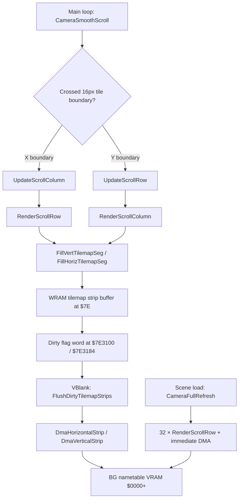
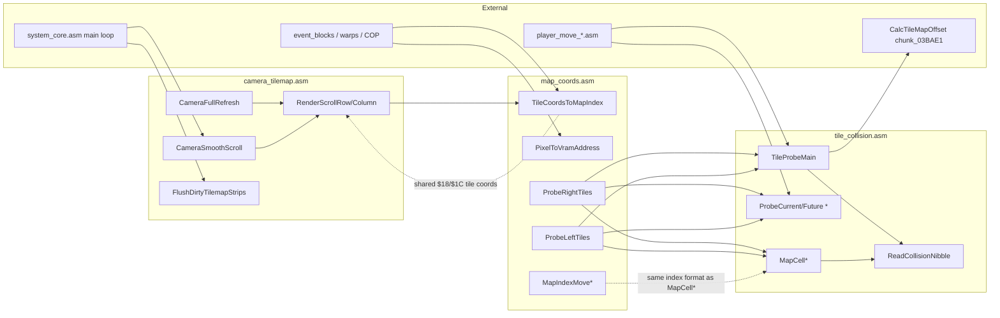

# Bank $02 — Camera Scrolling & Tilemap DMA

*Part of the [Bank $02 Documentation Suite](readme.md)*

**Bank:** `$02` (FastROM; accessed via `$@` long calls from other banks)  
**Document scope:** Incremental tilemap scrolling, dirty-strip buffering, and VBlank DMA upload to BG nametables.  
**ASM source:** [`camera_tilemap.asm`](../../../extracted/system/engine/camera_tilemap.asm) (block: `camera_tilemap`, scene: `engine`)  
**Last updated:** 2026-09-07

This document covers **`camera_tilemap.asm`**, which implements Illusion of Gaia's smooth camera follow, dirty-strip tilemap buffering, and DMA upload during scroll. It sits above the hardware math layer ([`hardware-and-init.md`](hardware-and-init.md)) and below player movement. Scene load triggers a full tilemap refresh via [`chunk_03BAE1.asm`](../../../extracted/system/chunk_03BAE1.asm); the main loop in [`system_core.asm`](../../../extracted/system/engine/system_core.asm) calls smooth scroll and VBlank DMA every frame.

Companion docs: [`map-coordinates.md`](map-coordinates.md) (tile/index helpers) · [`tile-collision.md`](tile-collision.md) (collision probing)

**Related:** [`scene-script.md`](scene-script.md) · [`../bank00/camera-scroll-system.md`](../bank00/camera-scroll-system.md) · [`readme.md`](readme.md) · [`../../cop/index.md`](../../cop/index.md)

## Block Layout (camera_tilemap)

```
$02AB8A ┌─ CameraFullRefresh ──────────────────────────┐
        │  CameraSmoothScroll / UpdateScroll*          │
        │  RenderScrollColumn / RenderScrollRow        │  camera_tilemap
        │  Fill*TilemapSeg / FlushDirtyTilemapStrips   │
        │  DmaHorizontalStrip / DmaVerticalStrip       │
        │  SpriteVramDma                               │
$02B0A3 └──────────────────────────────────────────────┘
```

> **Note:** `map_coords.asm` begins at `$02B0A3` (see [`map-coordinates.md`](map-coordinates.md)). `tile_collision.asm` lives at `$02E102` (see [`tile-collision.md`](tile-collision.md)). Shared WRAM variables below are also used by those compilation units.

## Shared Memory Map

### Camera & Scroll State

| Address | Size | Name / Role |
|---------|------|-------------|
| `$068A`–`$068F` | 6 | Current smoothed scroll position (BG1/BG2 H/V pairs; indexed by `X`) |
| `$0692` | 2 | `map_bounds_x` — map width in pixels |
| `$0693` | 1 | Map row width in **columns** (layer 0); byte stride for index math |
| `$0695` | 1 | Map row width for **layer 1** |
| `$0696` | 2 | `map_bounds_y` — map height in pixels |
| `$069A`–`$069D` | 4 | Map origin / extent helpers for wrap calculations |
| `$069E`–`$06B8` | 26 | Map buffer pointers, VRAM layout bases, dirty-strip queue heads |
| `$06AE` | 2 | Tile graphics source base (map tileset in `$7E`) |
| `$06BA` | 2 | VRAM nametable base address for queued tile writes |
| `$06BE` | 2 | Camera **target** X (follows player) |
| `$06C2` | 2 | Camera **target** Y |
| `$06CE` | 2 | Per-frame scroll delta X (clamped ±16 px) |
| `$06D2` | 2 | Per-frame scroll delta Y (clamped ±16 px) |
| `$06D6` | 2 | `camera_offset_x` — left edge of active map window |
| `$06D8` | 2 | `camera_offset_y` — top edge of active map window |
| `$06DA` | 2 | `camera_bounds_x` — right edge of active map window |
| `$06DE` | 2 | Camera lower Y bound for collision probes |
| `$06EE` | 2 | Scene display flags; bit `$0008` = skip smooth scroll |
| `$06EF` | 2 | Scene system flags; bit `$0001` = BG2 active |
| `$7E3100` / `$7E3288` | 2 | Horizontal dirty-strip VRAM address queue (BG1 / BG2) |
| `$7E3184` / `$7E330C` | 2 | Vertical dirty-strip VRAM address queue (BG1 / BG2) |

### Player Movement & Probe Scratch

| Address | Size | Role |
|---------|------|------|
| `$20` | 2 | Horizontal movement delta (sub-pixel, ×4 scale) |
| `$22` | 2 | Player X position |
| `$24` | 2 | Vertical movement delta |
| `$26` | 2 | Player Y position |
| `$1A` | 2 | Probe X coordinate (pixel space, tile-aligned) |
| `$1E` | 2 | Probe Y coordinate (pixel space, tile-aligned) |
| `$18` | 2 | Tile column scratch |
| `$1C` | 2 | Tile row scratch |
| `$00`–`$04` | 5 | Map cell index / alignment scratch |
| `$7FC000`+ | — | Runtime collision overlay (high nibble = dynamic block; low nibble = base tile type) |

## Scrolling Pipeline

The camera system uses a **two-phase** update: logical scroll during the main loop, physical VRAM upload during VBlank.



**Phase 1 — Smooth Scroll (main loop):** `CameraSmoothScroll` compares camera target against current scroll, clamps delta to ±16 px, and on tile-boundary crossing triggers `UpdateScrollColumn` / `UpdateScrollRow` → render helpers.

**Phase 2 — Strip DMA (VBlank):** `FlushDirtyTilemapStrips` uploads queued WRAM strips via horizontal or vertical DMA and clears dirty flags.

**Full Refresh (scene load):** `CameraFullRefresh` loops 32 rows with immediate DMA and uploads CGRAM palette.

## camera_tilemap.asm

| Address | Name | Description |
|---------|------|-------------|
| `$02AB8A` | CameraFullRefresh | CameraFullRefresh performs a complete BG nametable rebuild when a scene loads. |
| `$02AC2E` | CameraSmoothScroll | CameraSmoothScroll is the per-frame camera follow routine called from system_core.asm for both BG1 (X=0) and BG2 (X=2). |
| `$02ACCC` | UpdateScrollRow | UpdateScrollRow is the vertical-scroll dirty-strip trigger. |
| `$02ACF1` | UpdateScrollColumn | UpdateScrollColumn is the horizontal-scroll dirty-strip trigger, symmetric to UpdateScrollRow. |
| `$02AD0B` | RenderScrollColumn | RenderScrollColumn renders one 16-tile vertical column into the WRAM strip buffer when the camera scrolls vertically. |
| `$02AD8D` | WrapMapIndex | WrapMapIndex ensures a 16-bit map buffer index stays within the toroidal map extent. |
| `$02ADA2` | RenderScrollRow | RenderScrollRow is the largest scrolling function (335 bytes). |
| `$02AEF1` | FillHorizTilemapSeg | FillHorizTilemapSeg copies a run of map tile entries from the decompressed map buffer into a WRAM strip buffer using ... |
| `$02AF26` | FillVertTilemapSeg | FillVertTilemapSeg is the vertical-layout counterpart to FillHorizTilemapSeg. |
| `$02AF5F` | FlushDirtyTilemapStrips | FlushDirtyTilemapStrips is the VBlank entry point that uploads all queued tilemap strips from WRAM to VRAM. |
| `$02AFC7` | DmaHorizontalStrip | DmaHorizontalStrip performs two back-to-back 64-byte DMA transfers from the WRAM strip buffer to VRAM. |
| `$02B000` | DmaVerticalStrip | DmaVerticalStrip performs two back-to-back 128-byte DMA transfers in byte mode for column-oriented nametable updates. |
| `$02B038` | SpriteVramDma | SpriteVramDma uploads pending sprite tile patches from WRAM bank $7F to sprite VRAM during VBlank. |

### CameraFullRefresh

`CameraFullRefresh` performs a complete BG nametable rebuild when a scene loads. It is invoked from `chunk_03BAE1.asm` after map and tilemap decompression, before the player can move. The routine first clamps the camera target coordinates (`$06BE`/`$06C2`) to the map pixel bounds stored in `$0692`/`$0696`, then copies the clamped values into the current scroll registers `$068A`/`$068E`.

After clamping, the function tile-aligns the camera by masking off the low four bits of each axis into scratch variables `$18` (column) and `$1C` (row). These coordinates drive the scroll-row renderer for the remainder of the function. DMA channel 0 is configured once for word-mode writes to VRAM register `$2118`, with source bank `$7E`.

The main loop runs 32 iterations — one per visible tile row. Each iteration calls `RenderScrollRow` to populate a WRAM strip buffer, reads the queued VRAM destination address from the dirty-queue head at `$7E0000,X`, and immediately DMAs the strip via `DmaHorizontalStrip`. The column counter `$18` advances by 16 pixels per iteration, wrapping at `$map_bounds_x` when the camera crosses the second nametable half.

On completion, all four dirty-flag words (`$7E3100`, `$7E3288`, `$7E3184`, `$7E330C`) are cleared, and CGRAM palette is uploaded via `system_init.UploadCgramPalette`.

**Algorithm:**

| Step | Action |
|------|--------|
| 1 | Save P register; enter 16-bit accumulator mode |
| 2 | Clamp `$06BE,X` to `$0692,X`; copy to `$068A,X`; tile-align → `$18` |
| 3 | Clamp `$06C2,X` to `$0696,X`; copy to `$068E,X`; tile-align → `$1C` |
| 4 | Configure DMA channel 0: VMAIN=`$81`, DMAP0=`$01`, BBAD0=`$18`, A1B0=`$7E` |
| 5 | Loop 32×: `RenderScrollRow` → read VRAM addr from `$7E0000,X` → `DmaHorizontalStrip` |
| 6 | Advance `$18` by `$0010`; wrap against `$map_bounds_x,X` |
| 7 | Clear four dirty-flag words; JSL `UploadCgramPalette`; restore and RTL |

**Variables:**

| Location | Direction | Role |
|----------|-----------|------|
| `$06BE,X` | In | Camera target X |
| `$06C2,X` | In | Camera target Y |
| `$068A,X` / `$068E,X` | Out | Current scroll position |
| `$18` / `$1C` | Out | Tile-aligned column / row |
| `$0692,X` / `$0696,X` | In | Map pixel bounds |
| `$06B2,X` | In | Horizontal dirty-queue head pointer |
| `$7E0000,X` | In | Queued VRAM destination address |
| `$7E3100`–`$7E330C` | Out | Cleared dirty flags |

**Cross-References:**

| Symbol | Relationship |
|--------|--------------|
| `RenderScrollRow` | Called 32× to build each row strip |
| `DmaHorizontalStrip` | Called 32× for immediate row upload |
| `system_init.UploadCgramPalette` | JSL after refresh completes |
| `chunk_03BAE1.asm` | Primary caller on scene load |

### CameraSmoothScroll

`CameraSmoothScroll` is the per-frame camera follow routine called from `system_core.asm` for both BG1 (`X=0`) and BG2 (`X=2`). It smoothly interpolates the current scroll position toward the camera target, producing a lagged follow effect rather than instant snapping.

Two early-exit paths bypass smooth scrolling. If `$06EF` bit `$0008` is set (instant snap flag), the target coordinates are copied directly to `$068A`/`$068E`. If `X≠0` (BG2 layer) and `$06EE` bit `$0400` is set, BG2 scroll is copied from alternate registers `$06C0`/`$06C4`.

For the normal path, the X-axis delta is computed as `$06BE − $068A`, then clamped to the range `[−16, +16]` and stored in `$06CE`. The clamped delta is added to `$068A`. An XOR test between the old and new scroll values detects crossing of a 16-pixel tile boundary (bit `$0010`); when set, `UpdateScrollColumn` is invoked to queue a new column strip.

The Y axis follows the identical pattern using `$06C2`, `$068E`, `$06D2`, and `UpdateScrollRow`.

**Algorithm:**

| Step | Action |
|------|--------|
| 1 | If `$06EF` bit `$0008`: snap target → scroll; RTL |
| 2 | If BG2 + `$06EE` bit `$0400`: copy alt scroll; RTL |
| 3 | Compute X delta; clamp to `[−16, +16]` → `$06CE`; update `$068A` |
| 4 | If tile boundary crossed on X: `UpdateScrollColumn` |
| 5 | Compute Y delta; clamp → `$06D2`; update `$068E` |
| 6 | If tile boundary crossed on Y: `UpdateScrollRow` |

**Variables:**

| Location | Direction | Role |
|----------|-----------|------|
| `$06BE,X` / `$06C2,X` | In | Camera target |
| `$068A,X` / `$068E,X` | In/Out | Current scroll |
| `$06CE,X` / `$06D2,X` | Out | Clamped per-frame deltas |
| `$06EF` | In | Snap flag (bit `$0008`) |
| `$06EE` | In | BG2 disable flag (bit `$0400`) |
| `X` | In | BG layer index (`0`=BG1, `2`=BG2) |

**Cross-References:**

| Symbol | Relationship |
|--------|--------------|
| `UpdateScrollColumn` | Called on horizontal tile-boundary cross |
| `UpdateScrollRow` | Called on vertical tile-boundary cross |
| `system_core.asm` | Caller — twice per frame (BG1 + BG2) |

### UpdateScrollRow

`UpdateScrollRow` is the vertical-scroll dirty-strip trigger. When `CameraSmoothScroll` detects that the smoothed Y position crossed a 16-pixel tile boundary, this routine determines which map row needs to be rendered and calls `RenderScrollColumn`.

The current scroll X is copied to `$18` so the column renderer knows the horizontal position. The Y coordinate is adjusted by `$00E0` (scrolling down, +224 px) or `$FFF0` (scrolling up, −16 px) depending on the sign of `$06D2`. The result is stored in `$1C` and wrapped modulo `$map_bounds_y` in a subtract loop before calling `RenderScrollColumn`.

**Algorithm:**

| Step | Action |
|------|--------|
| 1 | `$18` ← `$068A,X` |
| 2 | If `$06D2,X` negative: Y offset = `$FFF0`; else `$00E0` |
| 3 | Add offset to `$068E,X` → `$1C`; wrap against `$map_bounds_y,X` |
| 4 | JSR `RenderScrollColumn` |

**Variables:**

| Location | Direction | Role |
|----------|-----------|------|
| `$068A,X` | In | Current scroll X |
| `$068E,X` | In | Current scroll Y |
| `$06D2,X` | In | Y scroll delta (sign selects direction) |
| `$18` / `$1C` | Out | Tile column / row for renderer |
| `$map_bounds_y,X` | In | Map height for wrap |

**Cross-References:**

| Symbol | Relationship |
|--------|--------------|
| `CameraSmoothScroll` | Caller on Y tile-boundary cross |
| `RenderScrollColumn` | Called to build vertical strip |

### UpdateScrollColumn

`UpdateScrollColumn` is the horizontal-scroll dirty-strip trigger, symmetric to `UpdateScrollRow`. When the camera crosses a 16-pixel column boundary, this routine computes the new column coordinate and invokes `RenderScrollRow`.

The X offset is `$0100` (scrolling right, +256 px in fixed-point) when `$06CE` is non-negative, or `$0000` (no offset, scrolling left) when negative. The offset is added to `$068A` and stored in `$18`. Current scroll Y is copied to `$1C`, then `RenderScrollRow` builds the horizontal strip.

**Algorithm:**

| Step | Action |
|------|--------|
| 1 | If `$06CE,X` negative: X offset = `$0000`; else `$0100` |
| 2 | Add offset to `$068A,X` → `$18` |
| 3 | `$1C` ← `$068E,X` |
| 4 | JSR `RenderScrollRow` |

**Variables:**

| Location | Direction | Role |
|----------|-----------|------|
| `$06CE,X` | In | X scroll delta (sign selects direction) |
| `$068A,X` / `$068E,X` | In | Current scroll position |
| `$18` / `$1C` | Out | Tile column / row for renderer |

**Cross-References:**

| Symbol | Relationship |
|--------|--------------|
| `CameraSmoothScroll` | Caller on X tile-boundary cross |
| `RenderScrollRow` | Called to build horizontal strip |

### RenderScrollColumn

`RenderScrollColumn` renders one 16-tile vertical column into the WRAM strip buffer when the camera scrolls vertically. It computes the map buffer index from tile row (`$1C`) and column (`$18`), wraps the index via `WrapMapIndex`, and writes VRAM destination addresses to both BG1 and BG2 strip queue heads.

The VRAM address calculation uses `$06BA` (nametable base) plus the row component of `$1C` shifted left by two bits. When `$18` bit `$0100` is set (second nametable half), the primary and secondary VRAM addresses are swapped between buffer slots `$0000` and `$0082`.

Two `FillHorizTilemapSeg` calls populate the strip: the first for the primary 16-tile segment, the second after advancing the map index by `$0100` and re-wrapping for the toroidal edge case.

**Algorithm:**

| Step | Action |
|------|--------|
| 1 | Save P/B/X; set DBR=`$7E`; load tileset base `$06AE,X` → `$02` |
| 2 | Map index = row(`$1D`) × `$0693` + col(`$19`) + origin `$069F` |
| 3 | `WrapMapIndex`; compute VRAM dest from `$06BA` + row nibble |
| 4 | Write VRAM addrs to strip buffer (swap if `$18` bit `$0100`) |
| 5 | `FillHorizTilemapSeg` × 16 tiles; advance index `$0100`; wrap; fill again |
| 6 | Restore registers |

**Variables:**

| Location | Direction | Role |
|----------|-----------|------|
| `$18` / `$1C` | In | Tile column / row |
| `$0693,X` | In | Map row width (columns) |
| `$069F,X` | In | Map buffer origin offset |
| `$06AE,X` | In | Tileset graphics base in `$7E` |
| `$06BA,X` / `$06B6,X` | In/Out | VRAM base / vertical queue head |
| `$04` | In/Out | Map index for fill segment |
| `$02` | In | Tileset pointer for 8-byte tile records |

**Cross-References:**

| Symbol | Relationship |
|--------|--------------|
| `UpdateScrollRow` | Caller |
| `WrapMapIndex` | Index toroidal wrap |
| `FillHorizTilemapSeg` | Called twice for 16-tile column |
| `hardware_math.SignedMultiply` | Row × width multiplication |

### WrapMapIndex

`WrapMapIndex` ensures a 16-bit map buffer index stays within the toroidal map extent. It subtracts the combined map origin and size (`$069E` + `$069A`) from the accumulator. If the result is still non-negative (borrow clear), the index is in range and the routine returns.

If the subtraction underflows (borrow set), the extent is added back and the routine recurses until the index falls within bounds. This handles maps that wrap horizontally, vertically, or both.

**Algorithm:**

| Step | Action |
|------|--------|
| 1 | A ← A − `$069E,X` − `$069A,X` |
| 2 | If no borrow: RTS (index valid in A) |
| 3 | A ← A + `$069E,X`; store in `$04`; Y ← A; goto step 1 |

**Variables:**

| Location | Direction | Role |
|----------|-----------|------|
| A | In/Out | Map index to wrap |
| `$069E,X` / `$069A,X` | In | Map extent dimensions |
| `$04` | Out | Wrapped index scratch |
| X | In | BG layer index |

**Cross-References:**

| Symbol | Relationship |
|--------|--------------|
| `RenderScrollColumn` | Caller |
| `RenderScrollRow` | Caller (multiple sites) |

### RenderScrollRow

`RenderScrollRow` is the largest scrolling function (335 bytes). It renders one 16-tile horizontal row into the WRAM strip buffer when the camera scrolls horizontally. The routine handles map edge wrapping, partial segments at row boundaries, and dual nametable layout for both BG1 and BG2.

The starting map index is computed from `$18`/`$1C` via `SignedMultiply` (row × `$0693` + column) plus origin `$069F`, then wrapped. Map bounds helpers `$069A`/`$069E` and `$map_bounds_x` track the visible window edges for partial fills.

VRAM destination addresses are written to the horizontal dirty-queue at `$06B2`. The nametable half is selected by testing `$18` bit `$0020` (column 32 boundary): BG1 uses direct offset from `$06BA`; BG2 adds `$0400` for the second nametable page.

The row is filled via `FillVertTilemapSeg`, which writes tiles in column-stride layout. When the row crosses a map edge (`$10` nibble offset non-zero), a second partial segment is rendered after re-wrapping the map index. A final single-tile fill handles the trailing edge case when the row nibble is zero but the index high nibble is set.

**Algorithm:**

| Step | Action |
|------|--------|
| 1 | Load bounds: `$1A`←`$map_bounds_x`, `$08`←`$069A`, `$1E`←`$069A+$069E` |
| 2 | Compute map index from `$18`/`$1C`; `WrapMapIndex` → `$04`/`$06` |
| 3 | Queue VRAM addrs at `$06B2` head (BG1 or BG2 path via bit `$0020`) |
| 4 | Primary fill: `(16 − row_nibble)` tiles via `FillVertTilemapSeg` |
| 5 | If row_nibble ≠ 0: wrap index at map edge; partial fill for remainder |
| 6 | Trailing edge: if index nibble zero, optional 1-tile wrap fill |

**Variables:**

| Location | Direction | Role |
|----------|-----------|------|
| `$18` / `$1C` | In | Tile column / row (pixel coords) |
| `$04` / `$06` | In/Out | Map index and saved copy |
| `$10` | Temp | Row nibble offset within 16-tile block |
| `$06B2,X` / `$06BA,X` | In/Out | Horizontal queue head / VRAM base |
| `$1A` / `$1E` / `$08` | Temp | Map width and extent bounds |
| `$02` | In | Tileset base pointer |

**Cross-References:**

| Symbol | Relationship |
|--------|--------------|
| `UpdateScrollColumn` | Caller |
| `CameraFullRefresh` | Caller (32× in load loop) |
| `WrapMapIndex` | Index wrap at map edges |
| `FillVertTilemapSeg` | Primary tile copy helper |

### FillHorizTilemapSeg

`FillHorizTilemapSeg` copies a run of map tile entries from the decompressed map buffer into a WRAM strip buffer using horizontal (sequential) layout. The tile count is passed in the accumulator; the map index is in `$04`; the strip write pointer is in `X`.

For each tile, the map byte at `$0000,Y` indexes an 8-byte tile record in the tileset (`$02` base in `$7E` bank). Four words are written to the strip buffer: tile number, attributes, and their BG2 counterparts at offset `$0040` within the strip entry.

**Algorithm:**

| Step | Action |
|------|--------|
| 1 | `$0E` ← tile count (from A); Y ← map index `$04` |
| 2 | Loop: read map byte → ×8 + tileset base → read 8-byte record |
| 3 | Write 4 words to strip at X (`$0002`, `$0004`, `$0042`, `$0044`) |
| 4 | X += 4; Y++; decrement count; repeat |

**Variables:**

| Location | Direction | Role |
|----------|-----------|------|
| A (on entry) | In | Tile count |
| `$04` | In | Map buffer index |
| `$02` | In | Tileset base offset in `$7E` |
| X | In/Out | Strip buffer write pointer |
| `$0E` | Temp | Remaining tile count |

**Cross-References:**

| Symbol | Relationship |
|--------|--------------|
| `RenderScrollColumn` | Caller (twice per column) |

### FillVertTilemapSeg

`FillVertTilemapSeg` is the vertical-layout counterpart to `FillHorizTilemapSeg`. It copies tiles into a strip buffer where each successive tile advances the map index by `$0010` (one map row) rather than by one byte. This matches the column-stride layout required for vertical DMA strips.

The tile record read and 4-word strip write pattern is identical to the horizontal variant, but the map index Y register is advanced by `$0010` after each tile instead of incrementing by 1.

**Algorithm:**

| Step | Action |
|------|--------|
| 1 | `$0E` ← tile count; Y ← map index `$04` |
| 2 | Loop: read map byte → tileset lookup → write 4 words to strip |
| 3 | Map index Y += `$0010` (next row); decrement count; repeat |

**Variables:**

| Location | Direction | Role |
|----------|-----------|------|
| A (on entry) | In | Tile count |
| `$04` | In | Starting map index |
| `$02` | In | Tileset base |
| X | In/Out | Strip buffer write pointer |

**Cross-References:**

| Symbol | Relationship |
|--------|--------------|
| `RenderScrollRow` | Caller (multiple segments per row) |

### FlushDirtyTilemapStrips

`FlushDirtyTilemapStrips` is the VBlank entry point that uploads all queued tilemap strips from WRAM to VRAM. Called from the NMI path in `system_core.asm`, it processes four dirty-queue heads: two horizontal (BG1 at `$06B2`, BG2 at `$06B4`) and two vertical (BG1 at `$06B6`, BG2 at `$06B8`).

For horizontal strips, VMAIN is set to `$81` (word increment, `$2118` dest). Each non-zero VRAM address at the queue head triggers `DmaHorizontalStrip`. For vertical strips, VMAIN switches to `$0080` (byte increment) and `DmaVerticalStrip` is used instead.

After all transfers, the four dirty-flag words at `$7E3100`, `$7E3288`, `$7E3184`, and `$7E330C` are zeroed.

**Algorithm:**

| Step | Action |
|------|--------|
| 1 | Configure DMA channel 0 (word mode, `$2118`, source `$7E`) |
| 2 | Process `$06B2` queue → `DmaHorizontalStrip` if addr ≠ 0 |
| 3 | Process `$06B4` queue → `DmaHorizontalStrip` if addr ≠ 0 |
| 4 | VMAIN ← `$0080` (byte mode) |
| 5 | Process `$06B6` queue → `DmaVerticalStrip` if addr ≠ 0 |
| 6 | Process `$06B8` queue → `DmaVerticalStrip` if addr ≠ 0 |
| 7 | Clear all four dirty-flag words |

**Variables:**

| Location | Direction | Role |
|----------|-----------|------|
| `$06B2`–`$06B8` | In | Dirty-queue head pointers |
| `$7E0000,X` | In | Queued VRAM destination per strip |
| `$7E3100`–`$7E330C` | Out | Cleared dirty flags |
| `$VMAIN` / `$DMAP0` | Out | Hardware DMA configuration |

**Cross-References:**

| Symbol | Relationship |
|--------|--------------|
| `DmaHorizontalStrip` | Called for horizontal queue entries |
| `DmaVerticalStrip` | Called for vertical queue entries |
| `system_core.asm` | VBlank/NMI caller |

### DmaHorizontalStrip

`DmaHorizontalStrip` performs two back-to-back 64-byte DMA transfers from the WRAM strip buffer to VRAM. Entry requires Y = target VRAM address and X = strip buffer offset. The routine writes `$0040` (64) bytes per transfer in word mode to `$2118`.

The first transfer uses the entry X/Y values directly. After the first transfer completes, X advances by `$0040` and the next queued VRAM address is read from `$7E0000,X` for the second 64-byte block. This covers a full 128-byte horizontal nametable row segment (32 tile words).

**Algorithm:**

| Step | Action |
|------|--------|
| 1 | X += 2; push X; write Y → `$2116`; X → `$4302`; size `$40` → `$4305` |
| 2 | Trigger MDMAEN |
| 3 | Pop X; X += `$0040`; read next VRAM addr from `$7E0000,X` |
| 4 | Second 64-byte DMA transfer |

**Variables:**

| Location | Direction | Role |
|----------|-----------|------|
| Y | In | VRAM destination address |
| X | In | WRAM strip buffer offset |
| `$VMADDL` / `$A1T0L` / `$DAS0L` | Out | SNES DMA channel 0 registers |

**Cross-References:**

| Symbol | Relationship |
|--------|--------------|
| `FlushDirtyTilemapStrips` | Primary caller |
| `CameraFullRefresh` | Direct caller during scene load |

### DmaVerticalStrip

`DmaVerticalStrip` performs two back-to-back 128-byte DMA transfers in byte mode for column-oriented nametable updates. Like the horizontal variant, it takes Y = VRAM address and X = strip buffer offset on entry.

Each transfer moves `$0080` (128) bytes. The second block reads its VRAM destination from the queue and writes it directly to `$VMADDL` before triggering the second DMA. Two 128-byte blocks cover the full vertical strip (16 tiles × 2 bytes × 4 words per tile entry).

**Algorithm:**

| Step | Action |
|------|--------|
| 1 | First 128-byte byte-mode DMA (Y → VRAM, X → source) |
| 2 | X += `$0080`; read next VRAM addr → `$VMADDL` |
| 3 | Second 128-byte DMA |

**Variables:**

| Location | Direction | Role |
|----------|-----------|------|
| Y | In | VRAM destination address |
| X | In | WRAM strip buffer offset |

**Cross-References:**

| Symbol | Relationship |
|--------|--------------|
| `FlushDirtyTilemapStrips` | Primary caller |

### SpriteVramDma

`SpriteVramDma` uploads pending sprite tile patches from WRAM bank `$7F` to sprite VRAM during VBlank. It is called from `system_core.asm` alongside `FlushDirtyTilemapStrips`.

The routine early-exits if `$09ED` is negative (upload disabled) or if no request flags are set in `$09EC` (bits `$01`, `$10`, `$20`). Three upload paths exist: bit `$01` transfers 2048 bytes to VRAM `$7800`; bit `$20` transfers 320 bytes to VRAM `$7840`; the default path also transfers 320 bytes to `$7840`.

After selecting source offset (`$0200` or `$0280` in `$7F`) and size, the request flags are cleared via `TRB $09EC`, DMA channel 0 is configured for byte-mode `$2118` writes from `$7F`, and MDMAEN triggers the transfer.

**Algorithm:**

| Step | Action |
|------|--------|
| 1 | If `$09ED` < 0 or `$09EC` bits `$31` all clear: RTL |
| 2 | If bit `$01`: 2048 B → VRAM `$7800`, source `$7F:$0200` |
| 3 | Else if bit `$20`: 320 B → VRAM `$7840`, source `$7F:$0280`; clear bit |
| 4 | Else: 320 B → VRAM `$7840`, source `$7F:$0280` |
| 5 | TRB `$09EC` with `$31`; configure DMA; trigger |

**Variables:**

| Location | Direction | Role |
|----------|-----------|------|
| `$09ED` | In | Upload enable flag (negative = disabled) |
| `$09EC` | In/Out | Request flags (cleared after upload) |
| `$DAS0L` / `$VMADDL` / `$A1T0L` | Out | DMA size, VRAM dest, source addr |

**Cross-References:**

| Symbol | Relationship |
|--------|--------------|
| `system_core.asm` | VBlank caller |
| `FlushDirtyTilemapStrips` | Sibling VBlank upload routine |

## Integration Overview

How `camera_tilemap.asm` connects to map coordinates and collision (see companion docs for detail):



**Key bridging points:**

| From | To | Mechanism |
|------|----|-----------|
| `camera_tilemap` | `map_coords` | Shared tile coordinate variables `$18`/`$1C`; both use `$0693` row stride |
| `map_coords` | `tile_collision` | `?INCLUDE 'tile_collision'`; cascade probes JSR into probe helpers |
| `tile_collision` | `chunk_03BAE1` | `TileProbeMain` JSL `CalcTileMapOffset` for map cell index |
| `map_coords` | Event/COP layer | `TileCoordsToMapIndex` / `PixelToVramAddress` JSL from event code |
| `tile_collision` | Player movement | Direct JSR from `player_move_ns/ew/diag.asm` |

## See Also

- [`map-coordinates.md`](map-coordinates.md) — tile/pixel coordinate transforms, map-buffer index navigation, diagonal cascade probes
- [`tile-collision.md`](tile-collision.md) — corner probes, collision nibble lookup at `$7FC000`, movement delta finalization
- [`player-movement.md`](player-movement.md) — movement physics that calls into `tile_collision`
- [`hardware-and-init.md`](hardware-and-init.md) — `MulDivide`, `UploadCgramPalette` consumers
