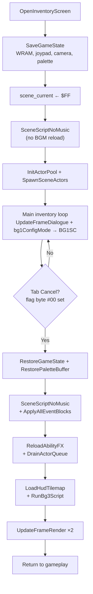

# Inventory Overlay — `inventory_overlay.asm`

*Part of the [Bank $02 Documentation Suite](README.md)*

> Overlay state sandwich — saves/restores WRAM around inventory screen

**Source:** [`inventory_overlay.asm`](../../../extracted/system/inventory/inventory_overlay.asm)

---

## Overview

`OpenInventoryScreen` is the JSL entry point called from gameplay when the player opens inventory. It implements a **state sandwich** — save everything, run an isolated scene, restore everything.



### State Preservation Map

| Saved Region | Source → Backup Location |
|---|---|
| Joypad state | `$0656` / `$0658` → `$7E:38AC` / `$7E:38AE` |
| Joypad mask | `$065A` → `$7E:38B0` |
| Active actor count | `$0DBC` → `$0DBE` |
| Direct-page vars | `$004E`–`$005D` → `$7E:389C` |
| Camera positions | `$06BE`–`$06C9` → `$7E:3890` |
| WRAM `$00:0E00` | → `$7E:3490` |
| WRAM `$7E:3000` | → `$7E:3590` |
| WRAM `$00:1000` | → `$7F:E000` |
| WRAM `$7F:1000` | → `$7F:F000` |
| WRAM `$00:0F00` | → `$7E:3690` |
| WRAM `$7F:0F00` | → `$7E:3790` |
| Palette buffer | `$7F:0A00` → `$7E:38B4` |

---

## Memory Map

| Address | Name | Description |
|---------|------|-------------|
| `$02ED02` | OpenInventoryScreen | Master inventory orchestrator (JSL entry). Implements the state sandwich: save gameplay, switch to scene `$FF`, run inventory UI loop, restore everything on exit. |
| `$02EECC` | ReloadAbilityFX | Post-close ability graphics reload. DMAs Dark Friar or Aura FX tiles and palette based on active ability `$00EA`. |
| `$02EF0B` | DrainActorQueue | Clears the pending actor execution queue left over from the inventory scene. Walks the linked list at `$5A`, zeroing each actor's frame counter so stale inventory actors cannot run after gameplay WRAM is restored. Prevents ghost script ticks from corrupting the overworld on the first frame back. |
| `$02EF1D` | SaveGameState | Snapshots the entire live game before the inventory scene takes over ~5.5 KB of WRAM. Backs up joypad state, camera scroll, the actor table, palette buffer, and hardware-shadow pages to scratch at `$7E:3490`+ because scene `$FF` reuses those same addresses for its own actors and tilemaps. Without this copy, opening inventory would permanently destroy overworld state. |
| `$02EFB2` | RestoreGameState | Reverses `SaveGameState` after the player closes inventory with B/Y/X. Copies all MVN backup regions back to live WRAM, restores joypad masks and camera positions, and reloads the actor count so the overworld resumes exactly where it was paused — same enemies, same scroll, same held inputs. |
| `$02F035` | RestorePaletteBuffer | Copies saved palette from `$7E:38B4` back to `$7F:0A00` after scene script may have overwritten it. |

---

### OpenInventoryScreen

Master inventory orchestrator (JSL entry). Implements the state sandwich: save gameplay, switch to scene `$FF`, run inventory UI loop, restore everything on exit.

**Algorithm:**
1. Disable HDMA; SaveGameState
2. Set inventory joypad mask `$0F00`
3. Push/pop `$06E4`, `$09EC`, `$0A00`, scene ID
4. scene_current ← `$FF`; SceneScriptNoMusic
5. Upload palette, zero camera, ClearVramBufferFull
6. Run actor init chain (chunk_03BAE1)
7. Loop `UpdateFrameDialogue`; copy `bg1ConfigMode` (`$0AE6`) → `BG1SC` each frame until flag byte `#00` is set (`BranchIfFlagByte` / `SetFlagByte #00` from inventory_menu on TabCancel or exit)
8. RestoreGameState, reload scene, event blocks, palette
9. ReloadAbilityFX, ClearVramBufferFull, map refresh
10. DrainActorQueue; `SetFlagByte #FF` before final render frames


**Variables:**
| Location | Direction | Role |
|----------|-----------|------|
| `$0644` | RW | scene_current |
| `$065C` | W | joypad_mask_inv |
| `$0AE6` | RW | bg1ConfigMode — BG1 tilemap base per tab (copied to BG1SC each frame) |
| `$065A` | RW | joypad_mask_std |

**Cross-References:**
| Symbol | Relationship |
|--------|--------------|
| `SaveGameState` | JSR |
| `RestoreGameState` | JSR |
| `ShowDialogueFrame` | Via UpdateFrameDialogue |
| `ClearVramBufferFull` | JSL |

### ReloadAbilityFX

Post-close ability graphics reload. DMAs Dark Friar or Aura FX tiles and palette based on active ability `$00EA`.

**Algorithm:**
1. If `$00EA = 0`: RTS
2. If 1 (Dark Friar): DMA misc_fx_1CC000 → VRAM `$4400`, copy palette
3. If 2 (Aura): DMA misc_fx_1CC480, alternate palette


**Variables:**
| Location | Direction | Role |
|----------|-----------|------|
| `$00EA` | R | Active ability |

**Cross-References:**
| Symbol | Relationship |
|--------|--------------|
| `OpenInventoryScreen` | Caller on exit |
| `DmaWordToVram` | Bank scene_script |

### SaveGameState

Snapshots the entire live game before the inventory scene takes over ~5.5 KB of WRAM. Backs up joypad state, camera scroll, the actor table, palette buffer, and hardware-shadow pages to scratch at `$7E:3490`+ because scene `$FF` reuses those same addresses for its own actors and tilemaps. Without this copy, opening inventory would permanently destroy overworld state. Joypad input is zeroed during the transition so no stray button presses leak into the menu open sequence.

**Algorithm:**
1. Save joypad `$0656`/`$0658`/`065A` (zero live copies)
2. Backup active actor count `$0DBC` → `$0DBE`
3. Copy DP vars `$4E–$5D`, camera `$06BE–$06C9`
4. MVN seven WRAM regions to backup scratch (see state map)
5. Copy palette `$7F:0A00` → `$7E:38B4`


**Variables:**
| Location | Direction | Role |
|----------|-----------|------|
| `$0656` | RW | Joypad held |
| `$0658` | RW | Joypad pressed |
| `$7E:3490` | W | Scratch save area |

**Cross-References:**
| Symbol | Relationship |
|--------|--------------|
| `RestoreGameState` | Inverse |
| `OpenInventoryScreen` | Caller |

### RestoreGameState

Reverses `SaveGameState` after the player closes inventory with B/Y/X. Copies all MVN backup regions back to live WRAM, restores joypad masks and camera positions, and reloads the actor count so the overworld resumes exactly where it was paused — same enemies, same scroll, same held inputs. Runs while the screen is blanked, before the original scene graphics and HUD are reloaded on top.

**Algorithm:**
1. Restore joypad from `$7E:38AC`/`38AE`/`38B0`
2. Restore active actor count from `$0DBE` → `$0DBC`
3. Restore DP + camera
4. Reverse MVN copies from backup scratch to live WRAM (see state map)


**Variables:**
| Location | Direction | Role |
|----------|-----------|------|
| `$0656` | W | Joypad held |
| `$06BE` | W | Camera X |

**Cross-References:**
| Symbol | Relationship |
|--------|--------------|
| `RestorePaletteBuffer` | Separate palette restore |
| `OpenInventoryScreen` | Caller |

### DrainActorQueue

Clears the pending actor execution queue left over from the inventory scene. The engine maintains a linked list of actors scheduled to run on the next frame at direct-page `$5A`; inventory actors may still be queued when the overlay closes. This routine walks that chain and zeroes each actor's frame counter (`$08`), preventing stale inventory script ticks from firing after gameplay WRAM is restored. Called just before HDMA reset and the final render frames so the player returns to a clean overworld update loop.

**Algorithm:**
1. Load list head from `$5A`; exit if zero
2. Walk `$0006` chain via TCD
3. STZ `$0008` on each actor until list end


**Variables:**
| Location | Direction | Role |
|----------|-----------|------|
| `$5A` | R | Actor list head |
| `$08` | W | Frame counter per actor |

**Cross-References:**
| Symbol | Relationship |
|--------|--------------|
| `OpenInventoryScreen` | Caller on exit |

---

## State Sandwich Pattern

The overlay follows a strict save → transform → run → restore sequence:

```
OpenInventoryScreen
  │
  ├─1─ SAVE ─────────────────────────────────────────────
  │     SaveGameState (WRAM, joypad, camera, palette)
  │     Push scene ID, $09EC, $0A00, $06E4 on stack
  │
  ├─2─ TRANSFORM ────────────────────────────────────────
  │     scene_current ← $FF (inventory scene)
  │     SceneScriptNoMusic (load inventory BG, no BGM)
  │     UploadCgramPalette, zero camera, ClearVramBufferFull
  │     Run actor init (chunk_03BAE1 helpers)
  │
  ├─3─ RUN ──────────────────────────────────────────────
  │     Loop: UpdateFrameDialogue + bg1ConfigMode → BG1SC
  │       until flag byte #00 ≠ 0
  │       (inventory_menu TabCancel/exit via SetFlagByte #00)
  │
  ├─4─ RESTORE ──────────────────────────────────────────
  │     RestoreGameState + RestorePaletteBuffer
  │     Pop scene ID → re-run SceneScriptNoMusic
  │     ApplyAllEventBlocks + PlaceBarrierTiles
  │     ReloadAbilityFX, ClearVramBufferFull, map refresh
  │     DrainActorQueue, SetFlagByte #FF
  │
  └─5─ RETURN ───────────────────────────────────────────
        RTL to gameplay caller
```

This ensures the inventory scene can freely reconfigure PPU registers, BG modes, and `$7F:1000+` script space without corrupting overworld state.

---

## See Also

| Document | Relationship |
|----------|-------------|
| [inventory-menu.md](inventory-menu.md) | Menu actor wrapped by the overlay loop |
| [hardware-and-init.md](hardware-and-init.md) | VBlank wait and `system_init` routines used during display sync |
| [game-systems.md](game-systems.md) | Event blocks reapplied on inventory close |
| [scene-script.md](scene-script.md) | `SceneScriptNoMusic` used during inventory scene load |
