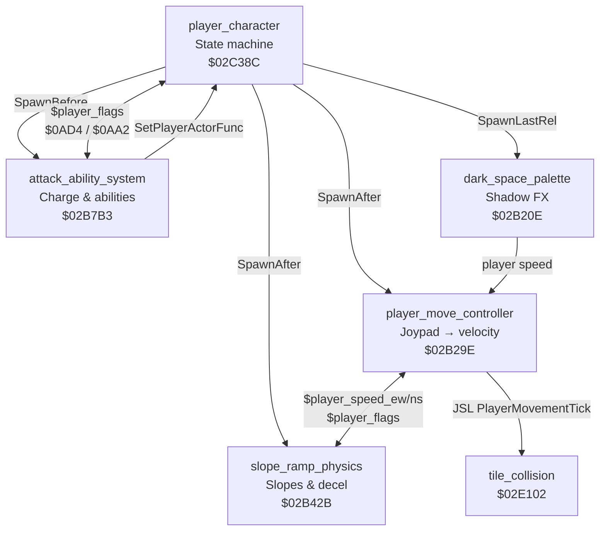

# Bank $02 — Player Character Actor System

**Bank:** `$02` (FastROM; accessed via `$@` long calls from other banks)  
**Document scope:** The five-actor player character architecture in ROM bank `$02`, spanning `$02B20E`–`$02CFD0`.

Illusion of Gaia's playable character is not a single monolithic actor. Instead, **`player_character.asm`** defines the master state machine while four companion actors run in parallel each frame — handling movement physics, terrain slopes, special abilities, and Shadow-form palette effects. All five communicate through shared WRAM variables rather than direct cross-calls.

| # | File | Block | Range | Size |
|---|------|-------|-------|------|
| 1 | `player_character.asm` | `player_character` | `$02C38C`–`$02CFD0` | 3,140 B |
| 2 | `dark_space_palette.asm` | `dark_space_palette` | `$02B20E`–`$02B29E` | 144 B |
| 3 | `player_move_controller.asm` | `player_move_controller` | `$02B29E`–`$02B42B` | 397 B |
| 4 | `slope_ramp_physics.asm` | `slope_ramp_physics` | `$02B42B`–`$02B7B3` | 904 B |
| 5 | `attack_ability_system.asm` | `attack_ability_system` | `$02B7B3`–`$02BDF6` + `$02BE72`–`$02C38C` | 2,909 B |
| 6 | `attack_trail_followers.asm` | `attack_trail_followers` | `$02BDF6`–`$02BE72` | 124 B |

**Related:** [`camera-and-map.md`](camera-and-map.md) · [`hardware-and-init.md`](hardware-and-init.md) · [`../bank2-code-analysis.md`](../bank2-code-analysis.md) (player movement physics `$02CFD0`–`$02E395`) · [`../bank2-actors-and-menus.md`](../bank2-actors-and-menus.md) · [`../../cop-commands-reference.md`](../../cop-commands-reference.md) · [`../../actor-organization-analysis.md`](../../actor-organization-analysis.md)

---

## Architecture Overview

The player uses a **five-actor modular design**. At initialization, `PlayerCharacterDef` spawns four companion actors via COP commands; each companion runs its own per-frame loop while reading and writing shared WRAM state.



### Compilation Unit Root

```
player_character.asm
  ?INCLUDE 'attack_ability_system'
    ?INCLUDE 'attack_trail_followers'
    ?INCLUDE 'ApplyOrbitalOffsetFromRef'
    ?INCLUDE 'cop_handlers_actors'
    ?INCLUDE 'table_01D9A7'    — ability animation data A
    ?INCLUDE 'table_01D9BF'    — ability animation data B
    ?INCLUDE 'table_0EE000'    — guided projectile spritemap
    ?INCLUDE 'table_178000'    — Dark Friar FX spritemap
    ?INCLUDE 'table_179000'    — Aura projectile spritemap
  ?INCLUDE 'dark_space_palette'
  ?INCLUDE 'game_over_sequence'
  ?INCLUDE 'hardware_math'
  ?INCLUDE 'player_move_controller'
  ?INCLUDE 'slope_ramp_physics'
  ?INCLUDE 'table_17D000'      — ranged weapon spritemap
```

### Shared WRAM Variables

| Address | Symbol | Role |
|---------|--------|------|
| `$09AA` | `$player_actor` | Actor slot index for the player character |
| `$09AE` | `$player_flags` | Shared state bitmask |
| `$09B2` | `$player_speed_ew` | East-west velocity (slope physics writes; move controller reads) |
| `$09B4` | `$player_speed_ns` | North-south velocity |
| `$09B6` | — | Slope step counter (indexed into curve tables) |
| `$09B8` | — | Deceleration step counter |
| `$09BA` / `$09BC` | — | Pointers to slope speed delta tables |
| `$09C2` | — | Pointer to flat-ground deceleration table |
| `$09C6` | — | Slope fractional accumulator |
| `$09C8` / `$09CA` | — | Max speed clamps for EW / NS |
| `$0AA2` | — | Ability availability bitmask |
| `$0AD4` | — | Current character form (0=Will, 1=Freedan, 2=Shadow) |
| `$0657` | — | Raw joypad state |
| `$0658` | — | Joypad mask (directional bits stripped during attacks) |
| `$0408` / `$040A` | — | External velocity accumulators (knockback, conveyors) |
| `$040C` | — | Auto-walk / run momentum timer |
| `$14` / `$16` | — | Sub-pixel position scratch (×4 scale) |

### Player Flags Reference (`$player_flags` at `$09AE`)

| Bit | Hex | Meaning |
|-----|-----|---------|
| 0 | `$0001` | Attack system active / attack lock |
| 1 | `$0002` | Attack in progress (combo state) |
| 3 | `$0008` | Player disabled / dead |
| 4 | `$0010` | Terrain shake active |
| 8 | `$0800` | Ability FX active (Aura/charge) |
| 9 | `$0200` | Blocked movement flag |
| 12 | `$1000` | On-slope flag (set by ramp physics) |
| 14 | `$8000` | Damage state / hitstun |

### Ability System (`$0AD4` + `$0AA2`)

| `$0AD4` | Form | Attack Dispatcher | Primary Abilities |
|---------|------|-------------------|-------------------|
| `0` | Will | `WillAttackDispatch` | Basic attack, Psycho Dash, Psycho Slider, running attack |
| `1` | Freedan | `FreedanAttackDispatch` | Basic attack, Dark Friar, Aura Barrier, vine drop-attack |
| `2` | Shadow | `FreedanAttackDispatch` + `dark_space_palette` | Same as Freedan + Dark Space palette cycling |

| `$0AA2` Bit | Hex | Character | Ability |
|-------------|-----|-----------|---------|
| 0 | `$0001` | All | Basic attack |
| 1 | `$0002` | Will | Running attack (Psycho Dash prerequisite) |
| 2 | `$0004` | Will | Psycho Slider |
| 4 | `$0010` | Freedan | Dark Friar |
| 5 | `$0020` | Freedan | Aura Barrier |
| 6 | `$0040` | Freedan/Shadow | Earthquaker (vine drop-attack) |

**Charge timing:** Will abilities charge **28 frames**; Freedan/Shadow charge **40 frames**. L/R shoulder buttons during charge select alternate abilities (Slider vs Dash; Aura vs Dark Friar).

---
## dark_space_palette.asm

| Property | Value |
|----------|-------|
| **Block** | `dark_space_palette` |
| **Range** | `$02B20E`–`$02B29E` (144 B) |
| **Path** | [`extracted/actors/player/dark_space_palette.asm`](../../../extracted/actors/player/dark_space_palette.asm) |

Manages palette cycling when Shadow form stands in Dark Space. Only active when `$0AD4 == 2`.

### DarkSpacePaletteInit

| Name | Address | Decimal | Size | Type | ASM file |
|------|---------|---------|------|------|----------|
| `DarkSpacePaletteInit` | $02B20E | 176654 | 51 B | Code | [`dark_space_palette.asm`](../../../extracted/actors/player/dark_space_palette.asm) |

**Description.** Check `$0AD4==2` (Shadow), else die. Spawn palette marker.

**Source.**

```7:15:../../../extracted/actors/player/dark_space_palette.asm
```

**Variables.**

| Location | Direction | Role |
|----------|-----------|------|
| `$0AD4` | R | Character form (2 = Shadow) |
| `$player_actor` | R | Player slot for validity checks |
| `$player_speed_ew/ns` | R | Movement state for idle/active toggle |

**Cross-References.**

| Symbol | Relationship |
|--------|-------------|
| `dark_space_palette` block | Parent compilation unit |

### DarkSpacePaletteIdle

| Name | Address | Decimal | Size | Type | ASM file |
|------|---------|---------|------|------|----------|
| `DarkSpacePaletteIdle` | $02B21F | 176671 | 34 B | Code | [`dark_space_palette.asm`](../../../extracted/actors/player/dark_space_palette.asm) |

**Description.** Wait: monitor player speed. If moves → active.

**Source.**

```16:30:../../../extracted/actors/player/dark_space_palette.asm
```

**Variables.**

| Location | Direction | Role |
|----------|-----------|------|
| `$player_flags` | R/W | Shared player state bitmask |
| `$player_actor` | R | Player WRAM slot index |

**Cross-References.**

| Symbol | Relationship |
|--------|-------------|
| `dark_space_palette` block | Parent compilation unit |

### DarkSpacePaletteActive

| Name | Address | Decimal | Size | Type | ASM file |
|------|---------|---------|------|------|----------|
| `DarkSpacePaletteActive` | $02B241 | 176705 | 35 B | Code | [`dark_space_palette.asm`](../../../extracted/actors/player/dark_space_palette.asm) |

**Description.** Active: palette `#24` cycling while moving.

**Source.**

```31:48:../../../extracted/actors/player/dark_space_palette.asm
```

**Variables.**

| Location | Direction | Role |
|----------|-----------|------|
| `$player_flags` | R/W | Shared player state bitmask |
| `$player_actor` | R | Player WRAM slot index |

**Cross-References.**

| Symbol | Relationship |
|--------|-------------|
| `dark_space_palette` block | Parent compilation unit |

### DarkSpaceCheckValidity

| Name | Address | Decimal | Size | Type | ASM file |
|------|---------|---------|------|------|----------|
| `DarkSpaceCheckValidity` | $02B264 | 176740 | 41 B | Code | [`dark_space_palette.asm`](../../../extracted/actors/player/dark_space_palette.asm) |

**Description.** Validate `$0AD4==2`, check `$0040` flag. If invalid, `PLA`; `COP [Die]`.

**Source.**

```49:73:../../../extracted/actors/player/dark_space_palette.asm
```

**Variables.**

| Location | Direction | Role |
|----------|-----------|------|
| `$player_flags` | R/W | Shared player state bitmask |
| `$player_actor` | R | Player WRAM slot index |

**Cross-References.**

| Symbol | Relationship |
|--------|-------------|
| `dark_space_palette` block | Parent compilation unit |

### DarkSpacePaletteCycleA

| Name | Address | Size | Type |
|------|---------|------|------|
| `DarkSpacePaletteCycleA` | $02B28D | 7 B | Code |

**Description.** Infinite palette `#23` cycle (idle glow).

**Source.**

```74:78:../../../extracted/actors/player/dark_space_palette.asm
```

**Cross-References.**

| Symbol | Relationship |
|--------|-------------|
| `dark_space_palette` block | Parent compilation unit |

### DarkSpacePaletteCycleB

| Name | Address | Size | Type |
|------|---------|------|------|
| `DarkSpacePaletteCycleB` | $02B294 | 7 B | Code |

**Description.** Infinite palette `#24` cycle (active glow).

**Source.**

```79:83:../../../extracted/actors/player/dark_space_palette.asm
```

**Cross-References.**

| Symbol | Relationship |
|--------|-------------|
| `dark_space_palette` block | Parent compilation unit |

### DarkSpacePaletteNop

| Name | Address | Size | Type |
|------|---------|------|------|
| `DarkSpacePaletteNop` | $02B29B | 3 B | Code |

**Description.** No-op: `COP [SetEntryContinue]`; `RTL`.

**Source.**

```84:87:../../../extracted/actors/player/dark_space_palette.asm
```

**Cross-References.**

| Symbol | Relationship |
|--------|-------------|
| `dark_space_palette` block | Parent compilation unit |

## player_move_controller.asm

| Property | Value |
|----------|-------|
| **Block** | `player_move_controller` |
| **Range** | `$02B29E`–`$02B42B` (397 B) |
| **Path** | [`extracted/actors/player/player_move_controller.asm`](../../../extracted/actors/player/player_move_controller.asm) |

Central per-frame movement pipeline. Scales positions to ×4 sub-pixel resolution.

### PlayerMoveController

| Name | Address | Decimal | Size | Type | ASM file |
|------|---------|---------|------|------|----------|
| `PlayerMoveController` | $02B29E | 176798 | 396 B | Code | [`player_move_controller.asm`](../../../extracted/actors/player/player_move_controller.asm) |

**Description.** Each frame: reads player actor slot, checks paralysis (`$0080`) and death. If `$player_flags` `$0A00` (blocked), zeroes velocity. Otherwise reads joypad, combines with speed accumulators, applies velocity. Calls `PlayerMovementTick` for collision. Writes back positions.

**Algorithm.**

- Scale `$14`/`$16` to ×4 sub-pixel resolution
- Skip frame if player paralyzed (`$0080`) or dead
- If `$player_flags & $0A00`: zero external velocity, return
- Sync scratch position with actor pixel coords
- If not `$3000` locked: `JSR JoypadToVelocity`
- Merge EW velocity from `player_speed_ew×4` or joypad + `$0408`
- Merge NS velocity similarly; clear slope flag `$1000` when slope speed used
- If collision flag `$0008`: `JSL PlayerMovementTick`
- Write positions back to player actor slot (`$0014`/`$0016`)

**Source.**

```10:174:../../../extracted/actors/player/player_move_controller.asm
```

**Variables.**

| Location | Direction | Role |
|----------|-----------|------|
| `$14`/`$16` | R/W | Sub-pixel position scratch (×4) |
| `$player_flags` | R/W | Movement/attack/slope flags |
| `$player_speed_ew/ns` | R | Slope physics override |
| `$0408`/`$040A` | R/W | External velocity accumulators |
| `$0657` | R | Raw joypad |

**Cross-References.**

| Symbol | Relationship |
|--------|-------------|
| `JoypadToVelocity` | JSR each frame when unlocked |
| `PlayerMovementTick` | JSL for tile collision ($02CFD0) |
| `SlopePhysicsEntry` | Writes `$player_speed_*` |

### JoypadToVelocity

| Name | Address | Decimal | Size | Type | ASM file |
|------|---------|---------|------|------|----------|
| `JoypadToVelocity` | $02B3C6 | 177094 | 94 B | Code | [`player_move_controller.asm`](../../../extracted/actors/player/player_move_controller.asm) |

**Description.** Converts joypad state (`$0657`) to 2D velocity. 8 directions: pure cardinal = ±8, diagonals = (±6, ±6) or (6, ±10).

**Algorithm.**

| Direction | X vel | Y vel |
|---|---|---|
| Right | +8 | 0 |
| Left | -8 | 0 |
| Up | 0 | -8 |
| Down | 0 | +8 |
| Right+Up | +6 | -6 |
| Right+Down | +6 | +6 |
| Left+Up | -6 | -6 |
| Left+Down | -6 | +6 |

**Source.**

```175:191:../../../extracted/actors/player/player_move_controller.asm
```

**Variables.**

| Location | Direction | Role |
|----------|-----------|------|
| `$player_flags` | R/W | Shared player state bitmask |
| `$player_actor` | R | Player WRAM slot index |

**Cross-References.**

| Symbol | Relationship |
|--------|-------------|
| `player_move_controller` block | Parent compilation unit |

## slope_ramp_physics.asm

| Property | Value |
|----------|-------|
| **Block** | `slope_ramp_physics` |
| **Range** | `$02B42B`–`$02B7B3` (904 B) |
| **Path** | [`extracted/actors/player/slope_ramp_physics.asm`](../../../extracted/actors/player/slope_ramp_physics.asm) |

Terrain-following slope/ramp physics and flat-ground deceleration.

#### Subgroup 17A — Detection & Dispatch

### SlopePhysicsEntry

| Name | Address | Decimal | Size | Type | ASM file |
|------|---------|---------|------|------|----------|
| `SlopePhysicsEntry` | $02B42B | 177195 | 301 B | Code | [`slope_ramp_physics.asm`](../../../extracted/actors/player/slope_ramp_physics.asm) |

**Description.** Main entry. Checks paralysis/death. If moving: probes tile at player feet, dispatches through `SlopeTileDispatch`. If not moving but `$1000`: probes 4 adjacent tiles for ramp exit.

**Algorithm.**

- Check paralysis/death → flat decelerate if inactive
- If moving: probe tile at feet via `TileProbeMain`
- Dispatch through `SlopeTileDispatch` by collision nibble
- If stopped but on-slope (`$1000`): probe adjacent cells for ramp exit
- Otherwise run `SlopeFlatDecelerate`

**Source.**

```14:152:../../../extracted/actors/player/slope_ramp_physics.asm
```

**Variables.**

| Location | Direction | Role |
|----------|-----------|------|
| `$player_flags` | R/W | Shared player state bitmask |
| `$player_actor` | R | Player WRAM slot index |

**Cross-References.**

| Symbol | Relationship |
|--------|-------------|
| `slope_ramp_physics` block | Parent compilation unit |

### SlopeType03Handler

| Name | Address | Size | Type |
|------|---------|------|------|
| `SlopeType03Handler` | $02B538 | 5 B | Code |

**Description.** Slope `$03` (right ascending).

**Source.**

```153:157:../../../extracted/actors/player/slope_ramp_physics.asm
```

**Cross-References.**

| Symbol | Relationship |
|--------|-------------|
| `slope_ramp_physics` block | Parent compilation unit |

### SlopeType05Handler

| Name | Address | Size | Type |
|------|---------|------|------|
| `SlopeType05Handler` | $02B53D | 5 B | Code |

**Description.** Slope `$05` (semi-solid ramp).

**Source.**

```158:162:../../../extracted/actors/player/slope_ramp_physics.asm
```

**Cross-References.**

| Symbol | Relationship |
|--------|-------------|
| `slope_ramp_physics` block | Parent compilation unit |

### SlopeType0AHandler

| Name | Address | Size | Type |
|------|---------|------|------|
| `SlopeType0AHandler` | $02B542 | 5 B | Code |

**Description.** Slope `$0A` (passable ramp).

**Source.**

```163:166:../../../extracted/actors/player/slope_ramp_physics.asm
```

**Cross-References.**

| Symbol | Relationship |
|--------|-------------|
| `slope_ramp_physics` block | Parent compilation unit |

### SlopeType0CHandler

| Name | Address | Size | Type |
|------|---------|------|------|
| `SlopeType0CHandler` | $02B547 | 3 B | Code |

**Description.** Slope `$0C` (left ascending).

**Source.**

```167:176:../../../extracted/actors/player/slope_ramp_physics.asm
```

**Cross-References.**

| Symbol | Relationship |
|--------|-------------|
| `slope_ramp_physics` block | Parent compilation unit |

### SlopeFlatExit

| Name | Address | Decimal | Size | Type | ASM file |
|------|---------|---------|------|------|----------|
| `SlopeFlatExit` | $02B550 | 177488 | 11 B | Code | [`slope_ramp_physics.asm`](../../../extracted/actors/player/slope_ramp_physics.asm) |

**Description.** No slope: clamp speed, clear `$09C6`/`$09B6`.

**Source.**

```177:184:../../../extracted/actors/player/slope_ramp_physics.asm
```

**Cross-References.**

| Symbol | Relationship |
|--------|-------------|
| `slope_ramp_physics` block | Parent compilation unit |

### SlopeFlatDecelerate

| Name | Address | Decimal | Size | Type | ASM file |
|------|---------|---------|------|------|----------|
| `SlopeFlatDecelerate` | $02B55B | 177499 | 27 B | Code | [`slope_ramp_physics.asm`](../../../extracted/actors/player/slope_ramp_physics.asm) |

**Description.** Flat ground: check EW → `DecelerateEW`. If `$1000` → clear. Check NS → `DecelerateNS`.

**Source.**

```185:207:../../../extracted/actors/player/slope_ramp_physics.asm
```

**Variables.**

| Location | Direction | Role |
|----------|-----------|------|
| `$player_flags` | R/W | Shared player state bitmask |
| `$player_actor` | R | Player WRAM slot index |

**Cross-References.**

| Symbol | Relationship |
|--------|-------------|
| `slope_ramp_physics` block | Parent compilation unit |

### SlopeTileDispatch

| Name | Address | Decimal | Size | Type | ASM file |
|------|---------|---------|------|------|----------|
| `SlopeTileDispatch` | $02B57C | 177532 | 32 B | &Code | [`slope_ramp_physics.asm`](../../../extracted/actors/player/slope_ramp_physics.asm) |

**Description.** 16-entry lookup table by collision type.

**Source.**

```208:226:../../../extracted/actors/player/slope_ramp_physics.asm
```

**Variables.**

| Location | Direction | Role |
|----------|-----------|------|
| `$player_flags` | R/W | Shared player state bitmask |
| `$player_actor` | R | Player WRAM slot index |

**Cross-References.**

| Symbol | Relationship |
|--------|-------------|
| `slope_ramp_physics` block | Parent compilation unit |

#### Subgroup 17B — Speed Curves

### ApplySlopeCurveNegEW

| Name | Address | Decimal | Size | Type | ASM file |
|------|---------|---------|------|------|----------|
| `ApplySlopeCurveNegEW` | $02B59C | 177564 | 32 B | Code | [`slope_ramp_physics.asm`](../../../extracted/actors/player/slope_ramp_physics.asm) |

**Description.** Read decel curve at `$09BA` indexed by `$09B6 & $0F`. Negate, add to `player_speed_ew`.

**Source.**

```227:244:../../../extracted/actors/player/slope_ramp_physics.asm
```

**Variables.**

| Location | Direction | Role |
|----------|-----------|------|
| `$player_flags` | R/W | Shared player state bitmask |
| `$player_actor` | R | Player WRAM slot index |

**Cross-References.**

| Symbol | Relationship |
|--------|-------------|
| `slope_ramp_physics` block | Parent compilation unit |

### ApplySlopeCurvePosEW

| Name | Address | Decimal | Size | Type | ASM file |
|------|---------|---------|------|------|----------|
| `ApplySlopeCurvePosEW` | $02B5BC | 177596 | 28 B | Code | [`slope_ramp_physics.asm`](../../../extracted/actors/player/slope_ramp_physics.asm) |

**Description.** Positive addition to EW speed.

**Source.**

```245:266:../../../extracted/actors/player/slope_ramp_physics.asm
```

**Variables.**

| Location | Direction | Role |
|----------|-----------|------|
| `$player_flags` | R/W | Shared player state bitmask |
| `$player_actor` | R | Player WRAM slot index |

**Cross-References.**

| Symbol | Relationship |
|--------|-------------|
| `slope_ramp_physics` block | Parent compilation unit |

### ApplySlopeCurvePosNS

| Name | Address | Decimal | Size | Type | ASM file |
|------|---------|---------|------|------|----------|
| `ApplySlopeCurvePosNS` | $02B5E2 | 177634 | 28 B | Code | [`slope_ramp_physics.asm`](../../../extracted/actors/player/slope_ramp_physics.asm) |

**Description.** Add to `player_speed_ns` from `$09BC`.

**Source.**

```267:282:../../../extracted/actors/player/slope_ramp_physics.asm
```

**Variables.**

| Location | Direction | Role |
|----------|-----------|------|
| `$player_flags` | R/W | Shared player state bitmask |
| `$player_actor` | R | Player WRAM slot index |

**Cross-References.**

| Symbol | Relationship |
|--------|-------------|
| `slope_ramp_physics` block | Parent compilation unit |

### ApplySlopeCurveNegNS

| Name | Address | Decimal | Size | Type | ASM file |
|------|---------|---------|------|------|----------|
| `ApplySlopeCurveNegNS` | $02B5FE | 177662 | 32 B | Code | [`slope_ramp_physics.asm`](../../../extracted/actors/player/slope_ramp_physics.asm) |

**Description.** Negated addition to NS speed.

**Source.**

```283:300:../../../extracted/actors/player/slope_ramp_physics.asm
```

**Variables.**

| Location | Direction | Role |
|----------|-----------|------|
| `$player_flags` | R/W | Shared player state bitmask |
| `$player_actor` | R | Player WRAM slot index |

**Cross-References.**

| Symbol | Relationship |
|--------|-------------|
| `slope_ramp_physics` block | Parent compilation unit |

#### Subgroup 17C — Clamping

### ClampSpeeds

| Name | Address | Decimal | Size | Type | ASM file |
|------|---------|---------|------|------|----------|
| `ClampSpeeds` | $02B61E | 177694 | 87 B | Code | [`slope_ramp_physics.asm`](../../../extracted/actors/player/slope_ramp_physics.asm) |

**Description.** Clamp `player_speed_ew` to ±`$09C8` and `player_speed_ns` to ±`$09CA`.

**Source.**

```301:362:../../../extracted/actors/player/slope_ramp_physics.asm
```

**Variables.**

| Location | Direction | Role |
|----------|-----------|------|
| `$player_flags` | R/W | Shared player state bitmask |
| `$player_actor` | R | Player WRAM slot index |

**Cross-References.**

| Symbol | Relationship |
|--------|-------------|
| `slope_ramp_physics` block | Parent compilation unit |

#### Subgroup 17D — Deceleration

### DecelerateEW

| Name | Address | Decimal | Size | Type | ASM file |
|------|---------|---------|------|------|----------|
| `DecelerateEW` | $02B675 | 177781 | 140 B | Code | [`slope_ramp_physics.asm`](../../../extracted/actors/player/slope_ramp_physics.asm) |

**Description.** DecelerateEW — Code part in bank $02 player actor system.

**Source.**

```363:455:../../../extracted/actors/player/slope_ramp_physics.asm
```

**Variables.**

| Location | Direction | Role |
|----------|-----------|------|
| `$player_flags` | R/W | Shared player state bitmask |
| `$player_actor` | R | Player WRAM slot index |

**Cross-References.**

| Symbol | Relationship |
|--------|-------------|
| `slope_ramp_physics` block | Parent compilation unit |

### ReadDecelerationStep

| Name | Address | Decimal | Size | Type | ASM file |
|------|---------|---------|------|------|----------|
| `ReadDecelerationStep` | $02B701 | 177921 | 19 B | Code | [`slope_ramp_physics.asm`](../../../extracted/actors/player/slope_ramp_physics.asm) |

**Description.** Read deceleration delta from `$09C2` indexed by `$09B8 & $0F`.

**Source.**

```456:467:../../../extracted/actors/player/slope_ramp_physics.asm
```

**Cross-References.**

| Symbol | Relationship |
|--------|-------------|
| `slope_ramp_physics` block | Parent compilation unit |

### DecelerateNS

| Name | Address | Decimal | Size | Type | ASM file |
|------|---------|---------|------|------|----------|
| `DecelerateNS` | $02B714 | 177940 | 140 B | Code | [`slope_ramp_physics.asm`](../../../extracted/actors/player/slope_ramp_physics.asm) |

**Description.** Mirror of `DecelerateEW` for NS axis.

**Source.**

```468:560:../../../extracted/actors/player/slope_ramp_physics.asm
```

**Variables.**

| Location | Direction | Role |
|----------|-----------|------|
| `$player_flags` | R/W | Shared player state bitmask |
| `$player_actor` | R | Player WRAM slot index |

**Cross-References.**

| Symbol | Relationship |
|--------|-------------|
| `slope_ramp_physics` block | Parent compilation unit |

### ReadDecelerationStepNS

| Name | Address | Decimal | Size | Type | ASM file |
|------|---------|---------|------|------|----------|
| `ReadDecelerationStepNS` | $02B7A0 | 178080 | 19 B | Code | [`slope_ramp_physics.asm`](../../../extracted/actors/player/slope_ramp_physics.asm) |

**Description.** Mirror of `ReadDecelerationStep`.

**Source.**

```561:571:../../../extracted/actors/player/slope_ramp_physics.asm
```

**Cross-References.**

| Symbol | Relationship |
|--------|-------------|
| `slope_ramp_physics` block | Parent compilation unit |

## attack_ability_system.asm

| Property | Value |
|----------|-------|
| **Block** | `attack_ability_system` |
| **Range** | `$02B7B3`–`$02BDF6` + `$02BE72`–`$02C38C` (2,909 B) |
| **Path** | [`extracted/actors/player/attack_ability_system.asm`](../../../extracted/actors/player/attack_ability_system.asm) |

Attack/ability companion actor — runs **before** movement controller via `SpawnBefore`.

#### Subgroup 18A — Attack Dispatcher

### AttackSystemEntry

| Name | Address | Decimal | Size | Type | ASM file |
|------|---------|---------|------|------|----------|
| `AttackSystemEntry` | $02B7B3 | 178099 | 42 B | Code | [`attack_ability_system.asm`](../../../extracted/actors/player/attack_ability_system.asm) |

**Description.** Entry. Check dead → die. Each frame check `$2A00` → skip. Check `$0AD4 < 2` → listen for attack (`$8001`).

**Algorithm.**

- Die if player dead (`$0008` in flags)
- Clear attack lock bit, set continue
- Skip if movement blocked (`$2A00`)
- If Freedan/Shadow (`$0AD4 >= 2`): return (handled elsewhere)
- Else listen for attack button → `WillAttackDispatch`

**Source.**

```23:48:../../../extracted/actors/player/attack_ability_system.asm
```

**Variables.**

| Location | Direction | Role |
|----------|-----------|------|
| `$player_flags` | R/W | Shared player state bitmask |
| `$player_actor` | R | Player WRAM slot index |

**Cross-References.**

| Symbol | Relationship |
|--------|-------------|
| `WillAttackDispatch` | Will form attack path |
| `FreedanAttackDispatch` | Freedan/Shadow attack path |
| `SetPlayerActorFunc` | Hijacks player actor function pointer |

### WillAttackDispatch

| Name | Address | Decimal | Size | Type | ASM file |
|------|---------|---------|------|------|----------|
| `WillAttackDispatch` | $02B7DE | 178142 | 109 B | Code | [`attack_ability_system.asm`](../../../extracted/actors/player/attack_ability_system.asm) |

**Description.** Will's attack. Check `$0AA2` bits `$01`+`$04`. Charge 28 frames. L/R → Slider, else → Dash.

**Source.**

```49:101:../../../extracted/actors/player/attack_ability_system.asm
```

**Variables.**

| Location | Direction | Role |
|----------|-----------|------|
| `$player_flags` | R/W | Shared player state bitmask |
| `$player_actor` | R | Player WRAM slot index |

**Cross-References.**

| Symbol | Relationship |
|--------|-------------|
| `attack_ability_system` block | Parent compilation unit |

### LaunchPsychoDash

| Name | Address | Decimal | Size | Type | ASM file |
|------|---------|---------|------|------|----------|
| `LaunchPsychoDash` | $02B855 | 178261 | 12 B | Code | [`attack_ability_system.asm`](../../../extracted/actors/player/attack_ability_system.asm) |

**Description.** Validate facing, set func to `PsychoDashMain`.

**Source.**

```102:108:../../../extracted/actors/player/attack_ability_system.asm
```

**Cross-References.**

| Symbol | Relationship |
|--------|-------------|
| `attack_ability_system` block | Parent compilation unit |

### LaunchPsychoSlider

| Name | Address | Decimal | Size | Type | ASM file |
|------|---------|---------|------|------|----------|
| `LaunchPsychoSlider` | $02B861 | 178273 | 12 B | Code | [`attack_ability_system.asm`](../../../extracted/actors/player/attack_ability_system.asm) |

**Description.** Set func to `PsychoSliderMain`.

**Source.**

```109:115:../../../extracted/actors/player/attack_ability_system.asm
```

**Cross-References.**

| Symbol | Relationship |
|--------|-------------|
| `attack_ability_system` block | Parent compilation unit |

### FreedanAttackDispatch

| Name | Address | Decimal | Size | Type | ASM file |
|------|---------|---------|------|------|----------|
| `FreedanAttackDispatch` | $02B86D | 178285 | 150 B | Code | [`attack_ability_system.asm`](../../../extracted/actors/player/attack_ability_system.asm) |

**Description.** Freedan/Shadow attack. Check `$0AA2` bits `$10`+`$40`. Charge 40 frames. Dark Friar / Aura / Spin Dash.

**Source.**

```116:159:../../../extracted/actors/player/attack_ability_system.asm
```

**Variables.**

| Location | Direction | Role |
|----------|-----------|------|
| `$player_flags` | R/W | Shared player state bitmask |
| `$player_actor` | R | Player WRAM slot index |

**Cross-References.**

| Symbol | Relationship |
|--------|-------------|
| `attack_ability_system` block | Parent compilation unit |

### LaunchDarkFriar

| Name | Address | Decimal | Size | Type | ASM file |
|------|---------|---------|------|------|----------|
| `LaunchDarkFriar` | $02B8D6 | 178390 | 17 B | Code | [`attack_ability_system.asm`](../../../extracted/actors/player/attack_ability_system.asm) |

**Description.** Set `$00EA=1`, func to `DarkFriarMain`.

**Source.**

```160:168:../../../extracted/actors/player/attack_ability_system.asm
```

**Cross-References.**

| Symbol | Relationship |
|--------|-------------|
| `attack_ability_system` block | Parent compilation unit |

### LaunchAuraBarrier

| Name | Address | Decimal | Size | Type | ASM file |
|------|---------|---------|------|------|----------|
| `LaunchAuraBarrier` | $02B8E7 | 178407 | 26 B | Code | [`attack_ability_system.asm`](../../../extracted/actors/player/attack_ability_system.asm) |

**Description.** Require stopped. Set `$00EA=2`, func to `AuraBarrierMain`.

**Source.**

```169:183:../../../extracted/actors/player/attack_ability_system.asm
```

**Variables.**

| Location | Direction | Role |
|----------|-----------|------|
| `$player_flags` | R/W | Shared player state bitmask |
| `$player_actor` | R | Player WRAM slot index |

**Cross-References.**

| Symbol | Relationship |
|--------|-------------|
| `attack_ability_system` block | Parent compilation unit |

### AttackCleanup

| Name | Address | Decimal | Size | Type | ASM file |
|------|---------|---------|------|------|----------|
| `AttackCleanup` | $02B901 | 178433 | 37 B | Code | [`attack_ability_system.asm`](../../../extracted/actors/player/attack_ability_system.asm) |

**Description.** Kill spawned FX, play palette effect, return to idle.

**Source.**

```184:207:../../../extracted/actors/player/attack_ability_system.asm
```

**Variables.**

| Location | Direction | Role |
|----------|-----------|------|
| `$player_flags` | R/W | Shared player state bitmask |
| `$player_actor` | R | Player WRAM slot index |

**Cross-References.**

| Symbol | Relationship |
|--------|-------------|
| `attack_ability_system` block | Parent compilation unit |

#### Subgroup 18B — Helpers

### SetPlayerActorFunc

| Name | Address | Decimal | Size | Type | ASM file |
|------|---------|---------|------|------|----------|
| `SetPlayerActorFunc` | $02B926 | 178470 | 13 B | Code | [`attack_ability_system.asm`](../../../extracted/actors/player/attack_ability_system.asm) |

**Description.** Write func pointer A to player actor slot.

**Source.**

```208:215:../../../extracted/actors/player/attack_ability_system.asm
```

**Cross-References.**

| Symbol | Relationship |
|--------|-------------|
| `attack_ability_system` block | Parent compilation unit |

### ValidateAttackReady

| Name | Address | Decimal | Size | Type | ASM file |
|------|---------|---------|------|------|----------|
| `ValidateAttackReady` | $02B933 | 178483 | 22 B | Code | [`attack_ability_system.asm`](../../../extracted/actors/player/attack_ability_system.asm) |

**Description.** Check `$3A00` and facing < 4.

**Source.**

```216:229:../../../extracted/actors/player/attack_ability_system.asm
```

**Variables.**

| Location | Direction | Role |
|----------|-----------|------|
| `$player_flags` | R/W | Shared player state bitmask |
| `$player_actor` | R | Player WRAM slot index |

**Cross-References.**

| Symbol | Relationship |
|--------|-------------|
| `attack_ability_system` block | Parent compilation unit |

### ValidateAttackContinue

| Name | Address | Size | Type |
|------|---------|------|------|
| `ValidateAttackContinue` | $02B946 | 9 B | Code |

**Description.** Check `$2B00`.

**Source.**

```230:236:../../../extracted/actors/player/attack_ability_system.asm
```

**Cross-References.**

| Symbol | Relationship |
|--------|-------------|
| `attack_ability_system` block | Parent compilation unit |

### SavePlayerPosition

| Name | Address | Decimal | Size | Type | ASM file |
|------|---------|---------|------|------|----------|
| `SavePlayerPosition` | $02B94F | 178511 | 14 B | Code | [`attack_ability_system.asm`](../../../extracted/actors/player/attack_ability_system.asm) |

**Description.** Copy position to `$14`/`$16`.

**Source.**

```237:245:../../../extracted/actors/player/attack_ability_system.asm
```

**Cross-References.**

| Symbol | Relationship |
|--------|-------------|
| `attack_ability_system` block | Parent compilation unit |

### CheckAttackChargeable

| Name | Address | Decimal | Size | Type | ASM file |
|------|---------|---------|------|------|----------|
| `CheckAttackChargeable` | $02B95D | 178525 | 32 B | Code | [`attack_ability_system.asm`](../../../extracted/actors/player/attack_ability_system.asm) |

**Description.** Check hitstun, death, mid-combo.

**Source.**

```246:270:../../../extracted/actors/player/attack_ability_system.asm
```

**Variables.**

| Location | Direction | Role |
|----------|-----------|------|
| `$player_flags` | R/W | Shared player state bitmask |
| `$player_actor` | R | Player WRAM slot index |

**Cross-References.**

| Symbol | Relationship |
|--------|-------------|
| `attack_ability_system` block | Parent compilation unit |

#### Subgroup 18C — Aura Barrier

### AuraBarrierMain

| Name | Address | Decimal | Size | Type | ASM file |
|------|---------|---------|------|------|----------|
| `AuraBarrierMain` | $02B97F | 178559 | 125 B | Code | [`attack_ability_system.asm`](../../../extracted/actors/player/attack_ability_system.asm) |

**Description.** Set `$0200`+`$0800`. Spawn VRAM DMA. Load FX palette. Spawn rotating children.

**Source.**

```271:317:../../../extracted/actors/player/attack_ability_system.asm
```

**Variables.**

| Location | Direction | Role |
|----------|-----------|------|
| `$player_flags` | R/W | Shared player state bitmask |
| `$player_actor` | R | Player WRAM slot index |

**Cross-References.**

| Symbol | Relationship |
|--------|-------------|
| `attack_ability_system` block | Parent compilation unit |

### AuraBarrierEnd

| Name | Address | Decimal | Size | Type | ASM file |
|------|---------|---------|------|------|----------|
| `AuraBarrierEnd` | $02B9FC | 178684 | 16 B | Code | [`attack_ability_system.asm`](../../../extracted/actors/player/attack_ability_system.asm) |

**Description.** Clear `$0200`. Restore state.

**Source.**

```318:328:../../../extracted/actors/player/attack_ability_system.asm
```

**Cross-References.**

| Symbol | Relationship |
|--------|-------------|
| `attack_ability_system` block | Parent compilation unit |

### AuraVramDmaLoader

| Name | Address | Decimal | Size | Type | ASM file |
|------|---------|---------|------|------|----------|
| `AuraVramDmaLoader` | $02BA0C | 178700 | 11 B | Code | [`attack_ability_system.asm`](../../../extracted/actors/player/attack_ability_system.asm) |

**Description.** DMA `misc_fx_1CC480` to VRAM `$4400`.

**Source.**

```329:333:../../../extracted/actors/player/attack_ability_system.asm
```

**Cross-References.**

| Symbol | Relationship |
|--------|-------------|
| `attack_ability_system` block | Parent compilation unit |

### AuraOrbitalSpawner

| Name | Address | Decimal | Size | Type | ASM file |
|------|---------|---------|------|------|----------|
| `AuraOrbitalSpawner` | $02BA17 | 178711 | 150 B | Code | [`attack_ability_system.asm`](../../../extracted/actors/player/attack_ability_system.asm) |

**Description.** Spawn 2–4 orbital children. Manage orbit rotation.

**Source.**

```334:405:../../../extracted/actors/player/attack_ability_system.asm
```

**Variables.**

| Location | Direction | Role |
|----------|-----------|------|
| `$player_flags` | R/W | Shared player state bitmask |
| `$player_actor` | R | Player WRAM slot index |

**Cross-References.**

| Symbol | Relationship |
|--------|-------------|
| `attack_ability_system` block | Parent compilation unit |

### UpdateOrbitalPositions

| Name | Address | Decimal | Size | Type | ASM file |
|------|---------|---------|------|------|----------|
| `UpdateOrbitalPositions` | $02BABD | 178877 | 65 B | Code | [`attack_ability_system.asm`](../../../extracted/actors/player/attack_ability_system.asm) |

**Description.** Iterate orbital children, compute position.

**Source.**

```406:440:../../../extracted/actors/player/attack_ability_system.asm
```

**Variables.**

| Location | Direction | Role |
|----------|-----------|------|
| `$player_flags` | R/W | Shared player state bitmask |
| `$player_actor` | R | Player WRAM slot index |

**Cross-References.**

| Symbol | Relationship |
|--------|-------------|
| `attack_ability_system` block | Parent compilation unit |

### AuraProjectileChild

| Name | Address | Decimal | Size | Type | ASM file |
|------|---------|---------|------|------|----------|
| `AuraProjectileChild` | $02BAFE | 178942 | 43 B | Code | [`attack_ability_system.asm`](../../../extracted/actors/player/attack_ability_system.asm) |

**Description.** Individual orbiting sprite. 3-frame animation.

**Source.**

```441:462:../../../extracted/actors/player/attack_ability_system.asm
```

**Variables.**

| Location | Direction | Role |
|----------|-----------|------|
| `$player_flags` | R/W | Shared player state bitmask |
| `$player_actor` | R | Player WRAM slot index |

**Cross-References.**

| Symbol | Relationship |
|--------|-------------|
| `attack_ability_system` block | Parent compilation unit |

### AuraProjectileShrink

| Name | Address | Decimal | Size | Type | ASM file |
|------|---------|---------|------|------|----------|
| `AuraProjectileShrink` | $02BB29 | 178985 | 18 B | Code | [`attack_ability_system.asm`](../../../extracted/actors/player/attack_ability_system.asm) |

**Description.** Shrink animation.

**Source.**

```463:473:../../../extracted/actors/player/attack_ability_system.asm
```

**Cross-References.**

| Symbol | Relationship |
|--------|-------------|
| `attack_ability_system` block | Parent compilation unit |

#### Subgroup 18D — Dark Friar

### DarkFriarMain

| Name | Address | Decimal | Size | Type | ASM file |
|------|---------|---------|------|------|----------|
| `DarkFriarMain` | $02BB3B | 179003 | 88 B | Code | [`attack_ability_system.asm`](../../../extracted/actors/player/attack_ability_system.asm) |

**Description.** Set `$2000`. Spawn VRAM DMA. Palette thinker `#4A`. 4-directional dispatch.

**Source.**

```474:509:../../../extracted/actors/player/attack_ability_system.asm
```

**Variables.**

| Location | Direction | Role |
|----------|-----------|------|
| `$player_flags` | R/W | Shared player state bitmask |
| `$player_actor` | R | Player WRAM slot index |

**Cross-References.**

| Symbol | Relationship |
|--------|-------------|
| `attack_ability_system` block | Parent compilation unit |

### DarkFriarDirTable

| Name | Address | Size | Type |
|------|---------|------|------|
| `DarkFriarDirTable` | $02BB93 | 8 B | &Code |

**Description.** Switch table: S/N/W/E.

**Source.**

```510:516:../../../extracted/actors/player/attack_ability_system.asm
```

**Cross-References.**

| Symbol | Relationship |
|--------|-------------|
| `attack_ability_system` block | Parent compilation unit |

### DarkFriarSouth

| Name | Address | Decimal | Size | Type | ASM file |
|------|---------|---------|------|------|----------|
| `DarkFriarSouth` | $02BB9B | 179099 | 25 B | Code | [`attack_ability_system.asm`](../../../extracted/actors/player/attack_ability_system.asm) |

**Description.** Spawn at (−2, +26), sprite `#36`.

**Source.**

```517:524:../../../extracted/actors/player/attack_ability_system.asm
```

**Variables.**

| Location | Direction | Role |
|----------|-----------|------|
| `$player_flags` | R/W | Shared player state bitmask |
| `$player_actor` | R | Player WRAM slot index |

**Cross-References.**

| Symbol | Relationship |
|--------|-------------|
| `attack_ability_system` block | Parent compilation unit |

### DarkFriarNorth

| Name | Address | Decimal | Size | Type | ASM file |
|------|---------|---------|------|------|----------|
| `DarkFriarNorth` | $02BBB4 | 179124 | 25 B | Code | [`attack_ability_system.asm`](../../../extracted/actors/player/attack_ability_system.asm) |

**Description.** Spawn at (0, −64), sprite `#37`.

**Source.**

```525:532:../../../extracted/actors/player/attack_ability_system.asm
```

**Variables.**

| Location | Direction | Role |
|----------|-----------|------|
| `$player_flags` | R/W | Shared player state bitmask |
| `$player_actor` | R | Player WRAM slot index |

**Cross-References.**

| Symbol | Relationship |
|--------|-------------|
| `attack_ability_system` block | Parent compilation unit |

### DarkFriarWest

| Name | Address | Decimal | Size | Type | ASM file |
|------|---------|---------|------|------|----------|
| `DarkFriarWest` | $02BBCD | 179149 | 25 B | Code | [`attack_ability_system.asm`](../../../extracted/actors/player/attack_ability_system.asm) |

**Description.** Spawn at (−52, −22), sprite `#38`.

**Source.**

```533:540:../../../extracted/actors/player/attack_ability_system.asm
```

**Variables.**

| Location | Direction | Role |
|----------|-----------|------|
| `$player_flags` | R/W | Shared player state bitmask |
| `$player_actor` | R | Player WRAM slot index |

**Cross-References.**

| Symbol | Relationship |
|--------|-------------|
| `attack_ability_system` block | Parent compilation unit |

### DarkFriarEast

| Name | Address | Decimal | Size | Type | ASM file |
|------|---------|---------|------|------|----------|
| `DarkFriarEast` | $02BBE6 | 179174 | 17 B | Code | [`attack_ability_system.asm`](../../../extracted/actors/player/attack_ability_system.asm) |

**Description.** Spawn at (+52, −22), sprite `#39`.

**Source.**

```541:547:../../../extracted/actors/player/attack_ability_system.asm
```

**Cross-References.**

| Symbol | Relationship |
|--------|-------------|
| `attack_ability_system` block | Parent compilation unit |

### DarkFriarFinish

| Name | Address | Size | Type |
|------|---------|------|------|
| `DarkFriarFinish` | $02BBFD | 5 B | Code |

**Description.** Wait 7 frames, restore.

**Source.**

```548:552:../../../extracted/actors/player/attack_ability_system.asm
```

**Cross-References.**

| Symbol | Relationship |
|--------|-------------|
| `attack_ability_system` block | Parent compilation unit |

### DarkFriarVramDma

| Name | Address | Decimal | Size | Type | ASM file |
|------|---------|---------|------|------|----------|
| `DarkFriarVramDma` | $02BC02 | 179202 | 11 B | Code | [`attack_ability_system.asm`](../../../extracted/actors/player/attack_ability_system.asm) |

**Description.** DMA `misc_fx_1CC000` to VRAM `$4400`.

**Source.**

```553:557:../../../extracted/actors/player/attack_ability_system.asm
```

**Cross-References.**

| Symbol | Relationship |
|--------|-------------|
| `attack_ability_system` block | Parent compilation unit |

### DarkFriarProjectile

| Name | Address | Decimal | Size | Type | ASM file |
|------|---------|---------|------|------|----------|
| `DarkFriarProjectile` | $02BC0D | 179213 | 26 B | Code | [`attack_ability_system.asm`](../../../extracted/actors/player/attack_ability_system.asm) |

**Description.** Main projectile sprite, `table_178000`. Wait 7 frames.

**Source.**

```558:569:../../../extracted/actors/player/attack_ability_system.asm
```

**Variables.**

| Location | Direction | Role |
|----------|-----------|------|
| `$player_flags` | R/W | Shared player state bitmask |
| `$player_actor` | R | Player WRAM slot index |

**Cross-References.**

| Symbol | Relationship |
|--------|-------------|
| `attack_ability_system` block | Parent compilation unit |

### DarkFriarTrailSouthInit

| Name | Address | Size | Type |
|------|---------|------|------|
| `DarkFriarTrailSouthInit` | $02BC27 | 5 B | Code |

**Description.** Set `$2000` in `$12` (south).

**Source.**

```570:574:../../../extracted/actors/player/attack_ability_system.asm
```

**Cross-References.**

| Symbol | Relationship |
|--------|-------------|
| `attack_ability_system` block | Parent compilation unit |

### DarkFriarTrailSouth

| Name | Address | Decimal | Size | Type | ASM file |
|------|---------|---------|------|------|----------|
| `DarkFriarTrailSouth` | $02BC2C | 179244 | 72 B | Code | [`attack_ability_system.asm`](../../../extracted/actors/player/attack_ability_system.asm) |

**Description.** South trail with collision if upgraded.

**Source.**

```575:604:../../../extracted/actors/player/attack_ability_system.asm
```

**Variables.**

| Location | Direction | Role |
|----------|-----------|------|
| `$player_flags` | R/W | Shared player state bitmask |
| `$player_actor` | R | Player WRAM slot index |

**Cross-References.**

| Symbol | Relationship |
|--------|-------------|
| `attack_ability_system` block | Parent compilation unit |

### DarkFriarTrailWestInit

| Name | Address | Size | Type |
|------|---------|------|------|
| `DarkFriarTrailWestInit` | $02BC74 | 5 B | Code |

**Description.** Set `$4000` in `$12` (west).

**Source.**

```605:609:../../../extracted/actors/player/attack_ability_system.asm
```

**Cross-References.**

| Symbol | Relationship |
|--------|-------------|
| `attack_ability_system` block | Parent compilation unit |

### DarkFriarTrailEastWest

| Name | Address | Decimal | Size | Type | ASM file |
|------|---------|---------|------|------|----------|
| `DarkFriarTrailEastWest` | $02BC79 | 179321 | 72 B | Code | [`attack_ability_system.asm`](../../../extracted/actors/player/attack_ability_system.asm) |

**Description.** EW trail with X-axis movement.

**Source.**

```610:638:../../../extracted/actors/player/attack_ability_system.asm
```

**Variables.**

| Location | Direction | Role |
|----------|-----------|------|
| `$player_flags` | R/W | Shared player state bitmask |
| `$player_actor` | R | Player WRAM slot index |

**Cross-References.**

| Symbol | Relationship |
|--------|-------------|
| `attack_ability_system` block | Parent compilation unit |

#### Subgroup 18E — Dark Friar Bounce

### DarkFriarBounceLoop

| Name | Address | Decimal | Size | Type | ASM file |
|------|---------|---------|------|------|----------|
| `DarkFriarBounceLoop` | $02BCC1 | 179393 | 52 B | Code | [`attack_ability_system.asm`](../../../extracted/actors/player/attack_ability_system.asm) |

**Description.** Bounce animation. If fully upgraded, allows redirect.

**Source.**

```639:668:../../../extracted/actors/player/attack_ability_system.asm
```

**Variables.**

| Location | Direction | Role |
|----------|-----------|------|
| `$player_flags` | R/W | Shared player state bitmask |
| `$player_actor` | R | Player WRAM slot index |

**Cross-References.**

| Symbol | Relationship |
|--------|-------------|
| `attack_ability_system` block | Parent compilation unit |

### DarkFriarDisableCollide

| Name | Address | Size | Type |
|------|---------|------|------|
| `DarkFriarDisableCollide` | $02BCEE | 4 B | Code |

**Description.** Clear collision callback.

**Source.**

```669:672:../../../extracted/actors/player/attack_ability_system.asm
```

**Cross-References.**

| Symbol | Relationship |
|--------|-------------|
| `attack_ability_system` block | Parent compilation unit |

### DarkFriarOnHit

| Name | Address | Decimal | Size | Type | ASM file |
|------|---------|---------|------|------|----------|
| `DarkFriarOnHit` | $02BCF2 | 179442 | 26 B | Code | [`attack_ability_system.asm`](../../../extracted/actors/player/attack_ability_system.asm) |

**Description.** Spawn 4 fragments at 0°/64°/128°/192°.

**Source.**

```673:680:../../../extracted/actors/player/attack_ability_system.asm
```

**Variables.**

| Location | Direction | Role |
|----------|-----------|------|
| `$player_flags` | R/W | Shared player state bitmask |
| `$player_actor` | R | Player WRAM slot index |

**Cross-References.**

| Symbol | Relationship |
|--------|-------------|
| `attack_ability_system` block | Parent compilation unit |

### DarkFriarFragment1

| Name | Address | Size | Type |
|------|---------|------|------|
| `DarkFriarFragment1` | $02BD0C | 5 B | Code |

**Description.** Angle `$40`.

**Source.**

```681:685:../../../extracted/actors/player/attack_ability_system.asm
```

**Cross-References.**

| Symbol | Relationship |
|--------|-------------|
| `attack_ability_system` block | Parent compilation unit |

### DarkFriarFragment2

| Name | Address | Size | Type |
|------|---------|------|------|
| `DarkFriarFragment2` | $02BD11 | 5 B | Code |

**Description.** Angle `$80`.

**Source.**

```686:690:../../../extracted/actors/player/attack_ability_system.asm
```

**Cross-References.**

| Symbol | Relationship |
|--------|-------------|
| `attack_ability_system` block | Parent compilation unit |

### DarkFriarFragment3

| Name | Address | Size | Type |
|------|---------|------|------|
| `DarkFriarFragment3` | $02BD16 | 3 B | Code |

**Description.** Angle `$C0`.

**Source.**

```691:693:../../../extracted/actors/player/attack_ability_system.asm
```

**Cross-References.**

| Symbol | Relationship |
|--------|-------------|
| `attack_ability_system` block | Parent compilation unit |

### DarkFriarFragmentInit

| Name | Address | Decimal | Size | Type | ASM file |
|------|---------|---------|------|------|----------|
| `DarkFriarFragmentInit` | $02BD19 | 179481 | 87 B | Code | [`attack_ability_system.asm`](../../../extracted/actors/player/attack_ability_system.asm) |

**Description.** Set angle, load anim, spawn trails, enable hitbox.

**Source.**

```694:766:../../../extracted/actors/player/attack_ability_system.asm
```

**Variables.**

| Location | Direction | Role |
|----------|-----------|------|
| `$player_flags` | R/W | Shared player state bitmask |
| `$player_actor` | R | Player WRAM slot index |

**Cross-References.**

| Symbol | Relationship |
|--------|-------------|
| `attack_ability_system` block | Parent compilation unit |

### DarkFriarFragmentLoop

| Name | Address | Decimal | Size | Type | ASM file |
|------|---------|---------|------|------|----------|
| `DarkFriarFragmentLoop` | $02BDC9 | 179657 | 43 B | Code | [`attack_ability_system.asm`](../../../extracted/actors/player/attack_ability_system.asm) |

**Description.** Fragment animation with wall-hit velocity.

**Source.**

```767:774:../../../extracted/actors/player/attack_ability_system.asm
```

**Variables.**

| Location | Direction | Role |
|----------|-----------|------|
| `$player_flags` | R/W | Shared player state bitmask |
| `$player_actor` | R | Player WRAM slot index |

**Cross-References.**

| Symbol | Relationship |
|--------|-------------|
| `attack_ability_system` block | Parent compilation unit |

## attack_trail_followers.asm

| Property | Value |
|----------|-------|
| **Block** | `attack_trail_followers` |
| **Range** | `$02BDF6`–`$02BE72` (124 B) |
| **Path** | [`extracted/actors/player/attack_trail_followers.asm`](../../../extracted/actors/player/attack_trail_followers.asm) |

Trail sprite actors for Psycho Dash, Dark Friar, and other ability FX.

#### Subgroup 18F — Trail Followers

### TrailFollowerSprA

| Name | Address | Size | Type |
|------|---------|------|------|
| `TrailFollowerSprA` | $02BDF6 | 5 B | Code |

**Description.** Trail sprite with hitbox `#05`.

**Source.**

```3:7:../../../extracted/actors/player/attack_trail_followers.asm
```

**Cross-References.**

| Symbol | Relationship |
|--------|-------------|
| `attack_trail_followers` block | Parent compilation unit |

### TrailFollowerSprB

| Name | Address | Decimal | Size | Type | ASM file |
|------|---------|---------|------|------|----------|
| `TrailFollowerSprB` | $02BDFB | 179707 | 33 B | Code | [`attack_trail_followers.asm`](../../../extracted/actors/player/attack_trail_followers.asm) |

**Description.** Trail sprite with hitbox `#06`. Init position queue, enter follow loop.

**Source.**

```8:30:../../../extracted/actors/player/attack_trail_followers.asm
```

**Variables.**

| Location | Direction | Role |
|----------|-----------|------|
| `$player_flags` | R/W | Shared player state bitmask |
| `$player_actor` | R | Player WRAM slot index |

**Cross-References.**

| Symbol | Relationship |
|--------|-------------|
| `attack_trail_followers` block | Parent compilation unit |

### TrailPositionCascade

| Name | Address | Decimal | Size | Type | ASM file |
|------|---------|---------|------|------|----------|
| `TrailPositionCascade` | $02BE1A | 179738 | 59 B | Code | [`attack_trail_followers.asm`](../../../extracted/actors/player/attack_trail_followers.asm) |

**Description.** 3-frame position queue cascade: current→slot0→slot1→slot2→render.

**Source.**

```31:50:../../../extracted/actors/player/attack_trail_followers.asm
```

**Variables.**

| Location | Direction | Role |
|----------|-----------|------|
| `$7F0000,X`–`$7F000E,X` | R/W | 3-frame X position queue |
| `$7F0018,X`–`$7F0004,X` | R/W | 3-frame Y position queue |
| `$0014,Y` / `$0016,Y` | R | Parent actor position |

**Cross-References.**

| Symbol | Relationship |
|--------|-------------|
| `attack_trail_followers` block | Parent compilation unit |

### TrailPositionInit

| Name | Address | Decimal | Size | Type | ASM file |
|------|---------|---------|------|------|----------|
| `TrailPositionInit` | $02BE55 | 179797 | 29 B | Code | [`attack_trail_followers.asm`](../../../extracted/actors/player/attack_trail_followers.asm) |

**Description.** Initialize 3 position queue slots to current `$14`/`$16`.

**Source.**

```51:61:../../../extracted/actors/player/attack_trail_followers.asm
```

**Variables.**

| Location | Direction | Role |
|----------|-----------|------|
| `$player_flags` | R/W | Shared player state bitmask |
| `$player_actor` | R | Player WRAM slot index |

**Cross-References.**

| Symbol | Relationship |
|--------|-------------|
| `attack_trail_followers` block | Parent compilation unit |

## attack_ability_system.asm

| Property | Value |
|----------|-------|
| **Block** | `attack_ability_system` |
| **Range** | `$02B7B3`–`$02BDF6` + `$02BE72`–`$02C38C` (2,909 B) |
| **Path** | [`extracted/actors/player/attack_ability_system.asm`](../../../extracted/actors/player/attack_ability_system.asm) |

Attack/ability companion actor — runs **before** movement controller via `SpawnBefore`.

#### Subgroup 18F — Parent Offset Helpers

### ComputeParentOffset

| Name | Address | Decimal | Size | Type | ASM file |
|------|---------|---------|------|------|----------|
| `ComputeParentOffset` | $02BE72 | 179826 | 23 B | Code | [`attack_ability_system.asm`](../../../extracted/actors/player/attack_ability_system.asm) |

**Description.** Store offset from parent actor to current position.

**Source.**

```795:807:../../../extracted/actors/player/attack_ability_system.asm
```

**Variables.**

| Location | Direction | Role |
|----------|-----------|------|
| `$player_flags` | R/W | Shared player state bitmask |
| `$player_actor` | R | Player WRAM slot index |

**Cross-References.**

| Symbol | Relationship |
|--------|-------------|
| `attack_ability_system` block | Parent compilation unit |

### ApplyParentOffset

| Name | Address | Decimal | Size | Type | ASM file |
|------|---------|---------|------|------|----------|
| `ApplyParentOffset` | $02BE89 | 179849 | 23 B | Code | [`attack_ability_system.asm`](../../../extracted/actors/player/attack_ability_system.asm) |

**Description.** Add stored offset back to parent position.

**Source.**

```808:820:../../../extracted/actors/player/attack_ability_system.asm
```

**Variables.**

| Location | Direction | Role |
|----------|-----------|------|
| `$player_flags` | R/W | Shared player state bitmask |
| `$player_actor` | R | Player WRAM slot index |

**Cross-References.**

| Symbol | Relationship |
|--------|-------------|
| `attack_ability_system` block | Parent compilation unit |

#### Subgroup 18G — Psycho Dash

### PsychoDashMain

| Name | Address | Size | Type |
|------|---------|------|------|
| `PsychoDashMain` | $02BEA0 | 9 B | Code |

**Description.** Load anim table 0, disable status, 4-directional dispatch.

**Source.**

```821:830:../../../extracted/actors/player/attack_ability_system.asm
```

**Cross-References.**

| Symbol | Relationship |
|--------|-------------|
| `attack_ability_system` block | Parent compilation unit |

### PsychoDashDirTable

| Name | Address | Size | Type |
|------|---------|------|------|
| `PsychoDashDirTable` | $02BEB7 | 8 B | &Code |

**Description.** Switch S/N/W/E.

**Source.**

```831:837:../../../extracted/actors/player/attack_ability_system.asm
```

**Cross-References.**

| Symbol | Relationship |
|--------|-------------|
| `attack_ability_system` block | Parent compilation unit |

### PsychoDashSouth

| Name | Address | Decimal | Size | Type | ASM file |
|------|---------|---------|------|------|----------|
| `PsychoDashSouth` | $02BEBF | 179903 | 16 B | Code | [`attack_ability_system.asm`](../../../extracted/actors/player/attack_ability_system.asm) |

**Description.** Spawn trail, sprite `#04`, move Y +54.

**Source.**

```838:845:../../../extracted/actors/player/attack_ability_system.asm
```

**Cross-References.**

| Symbol | Relationship |
|--------|-------------|
| `attack_ability_system` block | Parent compilation unit |

### PsychoDashNorth

| Name | Address | Decimal | Size | Type | ASM file |
|------|---------|---------|------|------|----------|
| `PsychoDashNorth` | $02BECF | 179919 | 19 B | Code | [`attack_ability_system.asm`](../../../extracted/actors/player/attack_ability_system.asm) |

**Description.** Set force NE, sprite `#04`, move Y −54.

**Source.**

```846:854:../../../extracted/actors/player/attack_ability_system.asm
```

**Cross-References.**

| Symbol | Relationship |
|--------|-------------|
| `attack_ability_system` block | Parent compilation unit |

### PsychoDashWest

| Name | Address | Decimal | Size | Type | ASM file |
|------|---------|---------|------|------|----------|
| `PsychoDashWest` | $02BEE2 | 179938 | 19 B | Code | [`attack_ability_system.asm`](../../../extracted/actors/player/attack_ability_system.asm) |

**Description.** Set force both, sprite `#04`, move X −54.

**Source.**

```855:863:../../../extracted/actors/player/attack_ability_system.asm
```

**Cross-References.**

| Symbol | Relationship |
|--------|-------------|
| `attack_ability_system` block | Parent compilation unit |

### PsychoDashEast

| Name | Address | Decimal | Size | Type | ASM file |
|------|---------|---------|------|------|----------|
| `PsychoDashEast` | $02BEF5 | 179957 | 14 B | Code | [`attack_ability_system.asm`](../../../extracted/actors/player/attack_ability_system.asm) |

**Description.** Sprite `#04`, move X +54.

**Source.**

```864:874:../../../extracted/actors/player/attack_ability_system.asm
```

**Cross-References.**

| Symbol | Relationship |
|--------|-------------|
| `attack_ability_system` block | Parent compilation unit |

### PsychoDashTrailSouth

| Name | Address | Decimal | Size | Type | ASM file |
|------|---------|---------|------|------|----------|
| `PsychoDashTrailSouth` | $02BF09 | 179977 | 104 B | Code | [`attack_ability_system.asm`](../../../extracted/actors/player/attack_ability_system.asm) |

**Description.** Record 8 Y-position deltas, replay in reverse.

**Source.**

```875:923:../../../extracted/actors/player/attack_ability_system.asm
```

**Variables.**

| Location | Direction | Role |
|----------|-----------|------|
| `$player_flags` | R/W | Shared player state bitmask |
| `$player_actor` | R | Player WRAM slot index |

**Cross-References.**

| Symbol | Relationship |
|--------|-------------|
| `attack_ability_system` block | Parent compilation unit |

### PsychoDashTrailNorth

| Name | Address | Decimal | Size | Type | ASM file |
|------|---------|---------|------|------|----------|
| `PsychoDashTrailNorth` | $02BF71 | 180081 | 104 B | Code | [`attack_ability_system.asm`](../../../extracted/actors/player/attack_ability_system.asm) |

**Description.** Inverted Y deltas.

**Source.**

```924:972:../../../extracted/actors/player/attack_ability_system.asm
```

**Variables.**

| Location | Direction | Role |
|----------|-----------|------|
| `$player_flags` | R/W | Shared player state bitmask |
| `$player_actor` | R | Player WRAM slot index |

**Cross-References.**

| Symbol | Relationship |
|--------|-------------|
| `attack_ability_system` block | Parent compilation unit |

### PsychoDashTrailWest

| Name | Address | Decimal | Size | Type | ASM file |
|------|---------|---------|------|------|----------|
| `PsychoDashTrailWest` | $02BFD9 | 180185 | 104 B | Code | [`attack_ability_system.asm`](../../../extracted/actors/player/attack_ability_system.asm) |

**Description.** X-axis deltas.

**Source.**

```973:1021:../../../extracted/actors/player/attack_ability_system.asm
```

**Variables.**

| Location | Direction | Role |
|----------|-----------|------|
| `$player_flags` | R/W | Shared player state bitmask |
| `$player_actor` | R | Player WRAM slot index |

**Cross-References.**

| Symbol | Relationship |
|--------|-------------|
| `attack_ability_system` block | Parent compilation unit |

### PsychoDashTrailEast

| Name | Address | Decimal | Size | Type | ASM file |
|------|---------|---------|------|------|----------|
| `PsychoDashTrailEast` | $02C041 | 180289 | 104 B | Code | [`attack_ability_system.asm`](../../../extracted/actors/player/attack_ability_system.asm) |

**Description.** Inverted X deltas.

**Source.**

```1022:1069:../../../extracted/actors/player/attack_ability_system.asm
```

**Variables.**

| Location | Direction | Role |
|----------|-----------|------|
| `$player_flags` | R/W | Shared player state bitmask |
| `$player_actor` | R | Player WRAM slot index |

**Cross-References.**

| Symbol | Relationship |
|--------|-------------|
| `attack_ability_system` block | Parent compilation unit |

#### Subgroup 18H — Psycho Slider

### PsychoSliderMain

| Name | Address | Decimal | Size | Type | ASM file |
|------|---------|---------|------|------|----------|
| `PsychoSliderMain` | $02C0A9 | 180393 | 211 B | Code | [`attack_ability_system.asm`](../../../extracted/actors/player/attack_ability_system.asm) |

**Description.** Set `$2002`, spawn guided projectile. Charge loop, L/R direction.

**Source.**

```1070:1165:../../../extracted/actors/player/attack_ability_system.asm
```

**Variables.**

| Location | Direction | Role |
|----------|-----------|------|
| `$player_flags` | R/W | Shared player state bitmask |
| `$player_actor` | R | Player WRAM slot index |

**Cross-References.**

| Symbol | Relationship |
|--------|-------------|
| `attack_ability_system` block | Parent compilation unit |

### PsychoSliderRelease

| Name | Address | Decimal | Size | Type | ASM file |
|------|---------|---------|------|------|----------|
| `PsychoSliderRelease` | $02C17C | 180604 | 29 B | Code | [`attack_ability_system.asm`](../../../extracted/actors/player/attack_ability_system.asm) |

**Description.** Clear `$2800`. Check `$0B1A`: return 12 or 24 frames.

**Source.**

```1166:1181:../../../extracted/actors/player/attack_ability_system.asm
```

**Variables.**

| Location | Direction | Role |
|----------|-----------|------|
| `$player_flags` | R/W | Shared player state bitmask |
| `$player_actor` | R | Player WRAM slot index |

**Cross-References.**

| Symbol | Relationship |
|--------|-------------|
| `attack_ability_system` block | Parent compilation unit |

### PsychoSliderLaunch

| Name | Address | Decimal | Size | Type | ASM file |
|------|---------|---------|------|------|----------|
| `PsychoSliderLaunch` | $02C199 | 180633 | 37 B | Code | [`attack_ability_system.asm`](../../../extracted/actors/player/attack_ability_system.asm) |

**Description.** Set sprite timer, anim set 1. Check joypad for direction.

**Source.**

```1182:1197:../../../extracted/actors/player/attack_ability_system.asm
```

**Variables.**

| Location | Direction | Role |
|----------|-----------|------|
| `$player_flags` | R/W | Shared player state bitmask |
| `$player_actor` | R | Player WRAM slot index |

**Cross-References.**

| Symbol | Relationship |
|--------|-------------|
| `attack_ability_system` block | Parent compilation unit |

### PsychoSliderDirEW

| Name | Address | Decimal | Size | Type | ASM file |
|------|---------|---------|------|------|----------|
| `PsychoSliderDirEW` | $02C1BE | 180670 | 18 B | Code | [`attack_ability_system.asm`](../../../extracted/actors/player/attack_ability_system.asm) |

**Description.** Horizontal launch.

**Source.**

```1198:1209:../../../extracted/actors/player/attack_ability_system.asm
```

**Cross-References.**

| Symbol | Relationship |
|--------|-------------|
| `attack_ability_system` block | Parent compilation unit |

### PsychoSliderDirNS

| Name | Address | Decimal | Size | Type | ASM file |
|------|---------|---------|------|------|----------|
| `PsychoSliderDirNS` | $02C1D0 | 180688 | 20 B | Code | [`attack_ability_system.asm`](../../../extracted/actors/player/attack_ability_system.asm) |

**Description.** Vertical launch.

**Source.**

```1210:1224:../../../extracted/actors/player/attack_ability_system.asm
```

**Cross-References.**

| Symbol | Relationship |
|--------|-------------|
| `attack_ability_system` block | Parent compilation unit |

### PsychoSliderAbort

| Name | Address | Size | Type |
|------|---------|------|------|
| `PsychoSliderAbort` | $02C1E4 | 7 B | Code |

**Description.** Clear `$0200`, restore.

**Source.**

```1225:1230:../../../extracted/actors/player/attack_ability_system.asm
```

**Cross-References.**

| Symbol | Relationship |
|--------|-------------|
| `attack_ability_system` block | Parent compilation unit |

### PsychoSliderChargeTick

| Name | Address | Decimal | Size | Type | ASM file |
|------|---------|---------|------|------|----------|
| `PsychoSliderChargeTick` | $02C1EB | 180715 | 49 B | Code | [`attack_ability_system.asm`](../../../extracted/actors/player/attack_ability_system.asm) |

**Description.** Per-frame: alternate L/R shoulder check.

**Source.**

```1231:1259:../../../extracted/actors/player/attack_ability_system.asm
```

**Variables.**

| Location | Direction | Role |
|----------|-----------|------|
| `$player_flags` | R/W | Shared player state bitmask |
| `$player_actor` | R | Player WRAM slot index |

**Cross-References.**

| Symbol | Relationship |
|--------|-------------|
| `attack_ability_system` block | Parent compilation unit |

### KillSpawnedProjectile

| Name | Address | Decimal | Size | Type | ASM file |
|------|---------|---------|------|------|----------|
| `KillSpawnedProjectile` | $02C21C | 180764 | 19 B | Code | [`attack_ability_system.asm`](../../../extracted/actors/player/attack_ability_system.asm) |

**Description.** Read stored actor ID, `COP [MarkDeath]`.

**Source.**

```1260:1276:../../../extracted/actors/player/attack_ability_system.asm
```

**Cross-References.**

| Symbol | Relationship |
|--------|-------------|
| `attack_ability_system` block | Parent compilation unit |

#### Subgroup 18I — Guided Projectile & Palette FX

### GuidedProjectileActor

| Name | Address | Decimal | Size | Type | ASM file |
|------|---------|---------|------|------|----------|
| `GuidedProjectileActor` | $02C232 | 180786 | 214 B | Code | [`attack_ability_system.asm`](../../../extracted/actors/player/attack_ability_system.asm) |

**Description.** Sprite priority `#30`, joypad-directed. 4 directions with hitbox.

**Source.**

```1277:1312:../../../extracted/actors/player/attack_ability_system.asm
```

**Variables.**

| Location | Direction | Role |
|----------|-----------|------|
| `$player_flags` | R/W | Shared player state bitmask |
| `$player_actor` | R | Player WRAM slot index |

**Cross-References.**

| Symbol | Relationship |
|--------|-------------|
| `attack_ability_system` block | Parent compilation unit |

### ProjectileMoveRight

| Name | Address | Decimal | Size | Type | ASM file |
|------|---------|---------|------|------|----------|
| `ProjectileMoveRight` | $02C288 | 180872 | 32 B | Code | [`attack_ability_system.asm`](../../../extracted/actors/player/attack_ability_system.asm) |

**Description.** Right: sprite `#3D`.

**Source.**

```1313:1331:../../../extracted/actors/player/attack_ability_system.asm
```

**Variables.**

| Location | Direction | Role |
|----------|-----------|------|
| `$player_flags` | R/W | Shared player state bitmask |
| `$player_actor` | R | Player WRAM slot index |

**Cross-References.**

| Symbol | Relationship |
|--------|-------------|
| `attack_ability_system` block | Parent compilation unit |

### ProjectileMoveLeft

| Name | Address | Decimal | Size | Type | ASM file |
|------|---------|---------|------|------|----------|
| `ProjectileMoveLeft` | $02C2A8 | 180904 | 32 B | Code | [`attack_ability_system.asm`](../../../extracted/actors/player/attack_ability_system.asm) |

**Description.** Left: `#3C`.

**Source.**

```1332:1350:../../../extracted/actors/player/attack_ability_system.asm
```

**Variables.**

| Location | Direction | Role |
|----------|-----------|------|
| `$player_flags` | R/W | Shared player state bitmask |
| `$player_actor` | R | Player WRAM slot index |

**Cross-References.**

| Symbol | Relationship |
|--------|-------------|
| `attack_ability_system` block | Parent compilation unit |

### ProjectileMoveUp

| Name | Address | Decimal | Size | Type | ASM file |
|------|---------|---------|------|------|----------|
| `ProjectileMoveUp` | $02C2C8 | 180936 | 32 B | Code | [`attack_ability_system.asm`](../../../extracted/actors/player/attack_ability_system.asm) |

**Description.** Up: `#3B`.

**Source.**

```1351:1369:../../../extracted/actors/player/attack_ability_system.asm
```

**Variables.**

| Location | Direction | Role |
|----------|-----------|------|
| `$player_flags` | R/W | Shared player state bitmask |
| `$player_actor` | R | Player WRAM slot index |

**Cross-References.**

| Symbol | Relationship |
|--------|-------------|
| `attack_ability_system` block | Parent compilation unit |

### ProjectileMoveDown

| Name | Address | Decimal | Size | Type | ASM file |
|------|---------|---------|------|------|----------|
| `ProjectileMoveDown` | $02C2E8 | 180968 | 32 B | Code | [`attack_ability_system.asm`](../../../extracted/actors/player/attack_ability_system.asm) |

**Description.** Down: `#3A`.

**Source.**

```1370:1388:../../../extracted/actors/player/attack_ability_system.asm
```

**Variables.**

| Location | Direction | Role |
|----------|-----------|------|
| `$player_flags` | R/W | Shared player state bitmask |
| `$player_actor` | R | Player WRAM slot index |

**Cross-References.**

| Symbol | Relationship |
|--------|-------------|
| `attack_ability_system` block | Parent compilation unit |

#### Subgroup 18A — Attack Dispatcher

### WillAttackPaletteFX

| Name | Address | Decimal | Size | Type | ASM file |
|------|---------|---------|------|------|----------|
| `WillAttackPaletteFX` | $02C308 | 181000 | 13 B | Code | [`attack_ability_system.asm`](../../../extracted/actors/player/attack_ability_system.asm) |

**Description.** Loop palettes `#2A` then `#2B`.

**Source.**

```1389:1398:../../../extracted/actors/player/attack_ability_system.asm
```

**Cross-References.**

| Symbol | Relationship |
|--------|-------------|
| `attack_ability_system` block | Parent compilation unit |

### FreedanAttackPaletteFX

| Name | Address | Decimal | Size | Type | ASM file |
|------|---------|---------|------|------|----------|
| `FreedanAttackPaletteFX` | $02C315 | 181013 | 13 B | Code | [`attack_ability_system.asm`](../../../extracted/actors/player/attack_ability_system.asm) |

**Description.** Loop `#4B` then `#2C`.

**Source.**

```1399:1408:../../../extracted/actors/player/attack_ability_system.asm
```

**Cross-References.**

| Symbol | Relationship |
|--------|-------------|
| `attack_ability_system` block | Parent compilation unit |

#### Subgroup 18C — Aura Barrier

### AuraBarrierPaletteFX

| Name | Address | Size | Type |
|------|---------|------|------|
| `AuraBarrierPaletteFX` | $02C322 | 7 B | Code |

**Description.** Loop `#5B` infinite.

**Source.**

```1409:1414:../../../extracted/actors/player/attack_ability_system.asm
```

**Cross-References.**

| Symbol | Relationship |
|--------|-------------|
| `attack_ability_system` block | Parent compilation unit |

#### Subgroup 18I — Guided Projectile & Palette FX

### RecomputeProjectilePos

| Name | Address | Decimal | Size | Type | ASM file |
|------|---------|---------|------|------|----------|
| `RecomputeProjectilePos` | $02C329 | 181033 | 21 B | Code | [`attack_ability_system.asm`](../../../extracted/actors/player/attack_ability_system.asm) |

**Description.** Add stored offsets to player position.

**Source.**

```1415:1426:../../../extracted/actors/player/attack_ability_system.asm
```

**Variables.**

| Location | Direction | Role |
|----------|-----------|------|
| `$player_flags` | R/W | Shared player state bitmask |
| `$player_actor` | R | Player WRAM slot index |

**Cross-References.**

| Symbol | Relationship |
|--------|-------------|
| `attack_ability_system` block | Parent compilation unit |

### LoadAbilityAnimTableA

| Name | Address | Decimal | Size | Type | ASM file |
|------|---------|---------|------|------|----------|
| `LoadAbilityAnimTableA` | $02C33E | 181054 | 39 B | Code | [`attack_ability_system.asm`](../../../extracted/actors/player/attack_ability_system.asm) |

**Description.** Read `table_01D9A7` by index.

**Source.**

```1427:1450:../../../extracted/actors/player/attack_ability_system.asm
```

**Variables.**

| Location | Direction | Role |
|----------|-----------|------|
| `$player_flags` | R/W | Shared player state bitmask |
| `$player_actor` | R | Player WRAM slot index |

**Cross-References.**

| Symbol | Relationship |
|--------|-------------|
| `attack_ability_system` block | Parent compilation unit |

### LoadAbilityAnimTableB

| Name | Address | Decimal | Size | Type | ASM file |
|------|---------|---------|------|------|----------|
| `LoadAbilityAnimTableB` | $02C365 | 181093 | 39 B | Code | [`attack_ability_system.asm`](../../../extracted/actors/player/attack_ability_system.asm) |

**Description.** Read `table_01D9BF` by index.

**Source.**

```1451:1471:../../../extracted/actors/player/attack_ability_system.asm
```

**Variables.**

| Location | Direction | Role |
|----------|-----------|------|
| `$player_flags` | R/W | Shared player state bitmask |
| `$player_actor` | R | Player WRAM slot index |

**Cross-References.**

| Symbol | Relationship |
|--------|-------------|
| `attack_ability_system` block | Parent compilation unit |

## player_character.asm

| Property | Value |
|----------|-------|
| **Block** | `player_character` |
| **Range** | `$02C38C`–`$02CFD0` (3,140 B) |
| **Path** | [`extracted/actors/player/player_character.asm`](../../../extracted/actors/player/player_character.asm) |

Master actor definition and state machine for idle, walk, run, climb, ladder, shimmy, and attack.

#### Subgroup 19A — Actor Definition & Init

### PlayerCharacterDef

| Name | Address | Decimal | Size | Type | ASM file |
|------|---------|---------|------|------|----------|
| `PlayerCharacterDef` | $02C38C | 181132 | 60 B | actor_def | [`player_character.asm`](../../../extracted/actors/player/player_character.asm) |

**Description.** Actor definition header (type `$00`, priority `$08`, flags `$85`). Init: sets `$0100` + `$0001`. Stores X to `$player_actor`. Sets `$7F101C,X = 1`. If `$0AF8` (death), spawns `DeathWakeupMessage`. Spawns 4 companion actors via `SpawnBefore`/`SpawnAfter`/`SpawnLastRel`.

**Source.**

```21:44:../../../extracted/actors/player/player_character.asm
```

**Variables.**

| Location | Direction | Role |
|----------|-----------|------|
| `$player_flags` | R/W | Shared player state bitmask |
| `$player_actor` | R | Player WRAM slot index |

**Cross-References.**

| Symbol | Relationship |
|--------|-------------|
| `AttackSystemEntry` | `SpawnBefore` companion |
| `PlayerMoveController` | `SpawnAfter` companion |
| `SlopePhysicsEntry` | `SpawnAfter` companion |
| `DarkSpacePaletteInit` | `SpawnLastRel` companion |

#### Subgroup 19B — Idle State Machine

### PlayerIdleEntry

| Name | Address | Decimal | Size | Type | ASM file |
|------|---------|---------|------|------|----------|
| `PlayerIdleEntry` | $02C3C8 | 181192 | 61 B | Code | [`player_character.asm`](../../../extracted/actors/player/player_character.asm) |

**Description.** Main idle state. Clears joypad mask/flags. Clears `$2800` from `$player_flags`. If EW/NS speed non-zero → walking (`MovingEastWest` / `MovingNorthSouth`), else → directional idle dispatch via facing + joypad.

**Algorithm.**

- Clear joypad mask high bits and composite flags `$2800`
- If `$player_speed_ew` non-zero → `MovingEastWest`
- If `$player_speed_ns` non-zero → `MovingNorthSouth`
- Else compute dispatch index from facing + joypad via `PlayerIdleDispatchTable`

**Source.**

```45:119:../../../extracted/actors/player/player_character.asm
```

**Variables.**

| Location | Direction | Role |
|----------|-----------|------|
| `$player_flags` | R/W | Shared player state bitmask |
| `$player_actor` | R | Player WRAM slot index |

**Cross-References.**

| Symbol | Relationship |
|--------|-------------|
| `player_character` block | Parent compilation unit |

### PlayerIdleDispatchTable

| Name | Address | Decimal | Size | Type | ASM file |
|------|---------|---------|------|------|----------|
| `PlayerIdleDispatchTable` | $02C447 | 181319 | 56 B | &Code | [`player_character.asm`](../../../extracted/actors/player/player_character.asm) |

**Description.** 28-entry table (7 per facing × 4 directions). Selected by combining facing (`$24`) with joypad/action button state.

**Source.**

```120:150:../../../extracted/actors/player/player_character.asm
```

**Variables.**

| Location | Direction | Role |
|----------|-----------|------|
| `$player_flags` | R/W | Shared player state bitmask |
| `$player_actor` | R | Player WRAM slot index |

**Cross-References.**

| Symbol | Relationship |
|--------|-------------|
| `player_character` block | Parent compilation unit |

#### Subgroup 19C — Standing Idle Animations

### IdleStandSouth

| Name | Address | Decimal | Size | Type | ASM file |
|------|---------|---------|------|------|----------|
| `IdleStandSouth` | $02C47F | 181375 | 16 B | Code | [`player_character.asm`](../../../extracted/actors/player/player_character.asm) |

**Description.** South-facing idle. Shadow variant check → sprite `#00` or `#10`.

**Source.**

```151:156:../../../extracted/actors/player/player_character.asm
```

**Cross-References.**

| Symbol | Relationship |
|--------|-------------|
| `player_character` block | Parent compilation unit |

### IdleStandSouthShadow

| Name | Address | Size | Type |
|------|---------|------|------|
| `IdleStandSouthShadow` | $02C48A | 5 B | Code |

**Description.** Shadow: `#10`.

**Source.**

```157:161:../../../extracted/actors/player/player_character.asm
```

**Cross-References.**

| Symbol | Relationship |
|--------|-------------|
| `player_character` block | Parent compilation unit |

### IdleStandNorth

| Name | Address | Decimal | Size | Type | ASM file |
|------|---------|---------|------|------|----------|
| `IdleStandNorth` | $02C48F | 181391 | 16 B | Code | [`player_character.asm`](../../../extracted/actors/player/player_character.asm) |

**Description.** North: `#01` / `#11`.

**Source.**

```162:167:../../../extracted/actors/player/player_character.asm
```

**Cross-References.**

| Symbol | Relationship |
|--------|-------------|
| `player_character` block | Parent compilation unit |

### IdleStandNorthShadow

| Name | Address | Size | Type |
|------|---------|------|------|
| `IdleStandNorthShadow` | $02C49A | 5 B | Code |

**Description.** Shadow: `#11`.

**Source.**

```168:172:../../../extracted/actors/player/player_character.asm
```

**Cross-References.**

| Symbol | Relationship |
|--------|-------------|
| `player_character` block | Parent compilation unit |

### IdleStandWest

| Name | Address | Decimal | Size | Type | ASM file |
|------|---------|---------|------|------|----------|
| `IdleStandWest` | $02C49F | 181407 | 16 B | Code | [`player_character.asm`](../../../extracted/actors/player/player_character.asm) |

**Description.** West: `#02` / `#12`.

**Source.**

```173:178:../../../extracted/actors/player/player_character.asm
```

**Cross-References.**

| Symbol | Relationship |
|--------|-------------|
| `player_character` block | Parent compilation unit |

### IdleStandWestShadow

| Name | Address | Size | Type |
|------|---------|------|------|
| `IdleStandWestShadow` | $02C4AA | 5 B | Code |

**Description.** Shadow: `#12`.

**Source.**

```179:183:../../../extracted/actors/player/player_character.asm
```

**Cross-References.**

| Symbol | Relationship |
|--------|-------------|
| `player_character` block | Parent compilation unit |

### IdleStandEast

| Name | Address | Decimal | Size | Type | ASM file |
|------|---------|---------|------|------|----------|
| `IdleStandEast` | $02C4AF | 181423 | 16 B | Code | [`player_character.asm`](../../../extracted/actors/player/player_character.asm) |

**Description.** East: `#03` / `#13`.

**Source.**

```184:189:../../../extracted/actors/player/player_character.asm
```

**Cross-References.**

| Symbol | Relationship |
|--------|-------------|
| `player_character` block | Parent compilation unit |

### IdleStandEastShadow

| Name | Address | Decimal | Size | Type | ASM file |
|------|---------|---------|------|------|----------|
| `IdleStandEastShadow` | $02C4BA | 181434 | 15 B | Code | [`player_character.asm`](../../../extracted/actors/player/player_character.asm) |

**Description.** Shadow: `#13`. Shared idle animation loop.

**Source.**

```190:212:../../../extracted/actors/player/player_character.asm
```

**Cross-References.**

| Symbol | Relationship |
|--------|-------------|
| `player_character` block | Parent compilation unit |

#### Subgroup 19D — Walking Animations

### WalkSouth

| Name | Address | Decimal | Size | Type | ASM file |
|------|---------|---------|------|------|----------|
| `WalkSouth` | $02C4DD | 181469 | 71 B | Code | [`player_character.asm`](../../../extracted/actors/player/player_character.asm) |

**Description.** Walking south, sprite `#08`. Auto-walk timer, L/R attack check.

**Source.**

```213:249:../../../extracted/actors/player/player_character.asm
```

**Variables.**

| Location | Direction | Role |
|----------|-----------|------|
| `$player_flags` | R/W | Shared player state bitmask |
| `$player_actor` | R | Player WRAM slot index |

**Cross-References.**

| Symbol | Relationship |
|--------|-------------|
| `player_character` block | Parent compilation unit |

### WalkNorth

| Name | Address | Decimal | Size | Type | ASM file |
|------|---------|---------|------|------|----------|
| `WalkNorth` | $02C524 | 181540 | 72 B | Code | [`player_character.asm`](../../../extracted/actors/player/player_character.asm) |

**Description.** North, sprite `#09`.

**Source.**

```250:287:../../../extracted/actors/player/player_character.asm
```

**Variables.**

| Location | Direction | Role |
|----------|-----------|------|
| `$player_flags` | R/W | Shared player state bitmask |
| `$player_actor` | R | Player WRAM slot index |

**Cross-References.**

| Symbol | Relationship |
|--------|-------------|
| `player_character` block | Parent compilation unit |

### WalkWest

| Name | Address | Decimal | Size | Type | ASM file |
|------|---------|---------|------|------|----------|
| `WalkWest` | $02C56C | 181612 | 73 B | Code | [`player_character.asm`](../../../extracted/actors/player/player_character.asm) |

**Description.** West, sprite `#0A`.

**Source.**

```288:326:../../../extracted/actors/player/player_character.asm
```

**Variables.**

| Location | Direction | Role |
|----------|-----------|------|
| `$player_flags` | R/W | Shared player state bitmask |
| `$player_actor` | R | Player WRAM slot index |

**Cross-References.**

| Symbol | Relationship |
|--------|-------------|
| `player_character` block | Parent compilation unit |

### WalkEast

| Name | Address | Decimal | Size | Type | ASM file |
|------|---------|---------|------|------|----------|
| `WalkEast` | $02C5B5 | 181685 | 74 B | Code | [`player_character.asm`](../../../extracted/actors/player/player_character.asm) |

**Description.** East, sprite `#0B`.

**Source.**

```327:366:../../../extracted/actors/player/player_character.asm
```

**Variables.**

| Location | Direction | Role |
|----------|-----------|------|
| `$player_flags` | R/W | Shared player state bitmask |
| `$player_actor` | R | Player WRAM slot index |

**Cross-References.**

| Symbol | Relationship |
|--------|-------------|
| `player_character` block | Parent compilation unit |

### CheckAttackWhileWalking

| Name | Address | Decimal | Size | Type | ASM file |
|------|---------|---------|------|------|----------|
| `CheckAttackWhileWalking` | $02C5FF | 181759 | 21 B | Code | [`player_character.asm`](../../../extracted/actors/player/player_character.asm) |

**Description.** Check attack button (`$8000`) or movement stop. Check slope (`$1000`).

**Source.**

```367:376:../../../extracted/actors/player/player_character.asm
```

**Variables.**

| Location | Direction | Role |
|----------|-----------|------|
| `$player_flags` | R/W | Shared player state bitmask |
| `$player_actor` | R | Player WRAM slot index |

**Cross-References.**

| Symbol | Relationship |
|--------|-------------|
| `player_character` block | Parent compilation unit |

### WalkAbortToIdle

| Name | Address | Size | Type |
|------|---------|------|------|
| `WalkAbortToIdle` | $02C614 | 1 B | Code |

**Description.** `PLA` — drops return address.

**Source.**

```377:380:../../../extracted/actors/player/player_character.asm
```

**Cross-References.**

| Symbol | Relationship |
|--------|-------------|
| `player_character` block | Parent compilation unit |

### WalkRestoreSaved

| Name | Address | Size | Type |
|------|---------|------|------|
| `WalkRestoreSaved` | $02C615 | 2 B | Code |

**Description.** `COP [RestoreSavedPtr]`.

**Source.**

```381:384:../../../extracted/actors/player/player_character.asm
```

**Cross-References.**

| Symbol | Relationship |
|--------|-------------|
| `player_character` block | Parent compilation unit |

### SetAutoWalkTimer

| Name | Address | Size | Type |
|------|---------|------|------|
| `SetAutoWalkTimer` | $02C617 | 7 B | Code |

**Description.** Set `$040C = $000D` (13-frame auto-walk timer).

**Source.**

```385:390:../../../extracted/actors/player/player_character.asm
```

**Cross-References.**

| Symbol | Relationship |
|--------|-------------|
| `player_character` block | Parent compilation unit |

#### Subgroup 19E — Vine/Rope Climbing

### ClimbVineEntry

| Name | Address | Decimal | Size | Type | ASM file |
|------|---------|---------|------|------|----------|
| `ClimbVineEntry` | $02C61E | 181790 | 116 B | Code | [`player_character.asm`](../../../extracted/actors/player/player_character.asm) |

**Description.** Vine climbing: clear `$0008`, set `$0200`. Block joypad `$4000`. Sprites `#18`→`#19`→`#1A`→`#1B` cycle with force-move Y+7.

**Source.**

```391:454:../../../extracted/actors/player/player_character.asm
```

**Variables.**

| Location | Direction | Role |
|----------|-----------|------|
| `$player_flags` | R/W | Shared player state bitmask |
| `$player_actor` | R | Player WRAM slot index |

**Cross-References.**

| Symbol | Relationship |
|--------|-------------|
| `player_character` block | Parent compilation unit |

### ClimbVineLand

| Name | Address | Decimal | Size | Type | ASM file |
|------|---------|---------|------|------|----------|
| `ClimbVineLand` | $02C692 | 181906 | 28 B | Code | [`player_character.asm`](../../../extracted/actors/player/player_character.asm) |

**Description.** Landing: sound `#2C`, sprite `#1C`.

**Source.**

```455:467:../../../extracted/actors/player/player_character.asm
```

**Variables.**

| Location | Direction | Role |
|----------|-----------|------|
| `$player_flags` | R/W | Shared player state bitmask |
| `$player_actor` | R | Player WRAM slot index |

**Cross-References.**

| Symbol | Relationship |
|--------|-------------|
| `player_character` block | Parent compilation unit |

### CheckClimbFrame

| Name | Address | Decimal | Size | Type | ASM file |
|------|---------|---------|------|------|----------|
| `CheckClimbFrame` | $02C6AE | 181934 | 14 B | Code | [`player_character.asm`](../../../extracted/actors/player/player_character.asm) |

**Description.** Animation frame check.

**Source.**

```468:481:../../../extracted/actors/player/player_character.asm
```

**Cross-References.**

| Symbol | Relationship |
|--------|-------------|
| `player_character` block | Parent compilation unit |

### CheckClimbAttack

| Name | Address | Decimal | Size | Type | ASM file |
|------|---------|---------|------|------|----------|
| `CheckClimbAttack` | $02C6BC | 181948 | 25 B | Code | [`player_character.asm`](../../../extracted/actors/player/player_character.asm) |

**Description.** Freedan climb check: if `$0AD4==1` and ability `$0040`, check attack button → drop attack.

**Source.**

```482:498:../../../extracted/actors/player/player_character.asm
```

**Variables.**

| Location | Direction | Role |
|----------|-----------|------|
| `$player_flags` | R/W | Shared player state bitmask |
| `$player_actor` | R | Player WRAM slot index |

**Cross-References.**

| Symbol | Relationship |
|--------|-------------|
| `player_character` block | Parent compilation unit |

### ClimbDropAttack

| Name | Address | Decimal | Size | Type | ASM file |
|------|---------|---------|------|------|----------|
| `ClimbDropAttack` | $02C6D5 | 181973 | 37 B | Code | [`player_character.asm`](../../../extracted/actors/player/player_character.asm) |

**Description.** Freedan's drop-attack from vine: sprite `#06`, hitbox `#00`, force-move Y+7.

**Source.**

```499:524:../../../extracted/actors/player/player_character.asm
```

**Variables.**

| Location | Direction | Role |
|----------|-----------|------|
| `$player_flags` | R/W | Shared player state bitmask |
| `$player_actor` | R | Player WRAM slot index |

**Cross-References.**

| Symbol | Relationship |
|--------|-------------|
| `player_character` block | Parent compilation unit |

### ClimbDropLand

| Name | Address | Decimal | Size | Type | ASM file |
|------|---------|---------|------|------|----------|
| `ClimbDropLand` | $02C6FA | 182010 | 69 B | Code | [`player_character.asm`](../../../extracted/actors/player/player_character.asm) |

**Description.** Drop landing: anim table 2, camera shake spawn. Wait 39 frames.

**Source.**

```525:549:../../../extracted/actors/player/player_character.asm
```

**Variables.**

| Location | Direction | Role |
|----------|-----------|------|
| `$player_flags` | R/W | Shared player state bitmask |
| `$player_actor` | R | Player WRAM slot index |

**Cross-References.**

| Symbol | Relationship |
|--------|-------------|
| `player_character` block | Parent compilation unit |

#### Subgroup 19F — Landing Effects

### ImpactTerrainShake

| Name | Address | Decimal | Size | Type | ASM file |
|------|---------|---------|------|------|----------|
| `ImpactTerrainShake` | $02C73F | 182079 | 18 B | Code | [`player_character.asm`](../../../extracted/actors/player/player_character.asm) |

**Description.** Sets `$player_flags` `$0010`. Waits `$01DF` frames. Clears. Dies.

**Source.**

```550:558:../../../extracted/actors/player/player_character.asm
```

**Cross-References.**

| Symbol | Relationship |
|--------|-------------|
| `player_character` block | Parent compilation unit |

### CameraShakeActor

| Name | Address | Decimal | Size | Type | ASM file |
|------|---------|---------|------|------|----------|
| `CameraShakeActor` | $02C751 | 182097 | 13 B | Code | [`player_character.asm`](../../../extracted/actors/player/player_character.asm) |

**Description.** Sound `#15`. Decrements counter → dies.

**Source.**

```559:569:../../../extracted/actors/player/player_character.asm
```

**Cross-References.**

| Symbol | Relationship |
|--------|-------------|
| `player_character` block | Parent compilation unit |

### CameraShakeFrame

| Name | Address | Decimal | Size | Type | ASM file |
|------|---------|---------|------|------|----------|
| `CameraShakeFrame` | $02C75E | 182110 | 88 B | Code | [`player_character.asm`](../../../extracted/actors/player/player_character.asm) |

**Description.** Random camera offset ±1 to `$06BE`/`$06C2` each frame.

**Source.**

```570:612:../../../extracted/actors/player/player_character.asm
```

**Variables.**

| Location | Direction | Role |
|----------|-----------|------|
| `$player_flags` | R/W | Shared player state bitmask |
| `$player_actor` | R | Player WRAM slot index |

**Cross-References.**

| Symbol | Relationship |
|--------|-------------|
| `player_character` block | Parent compilation unit |

#### Subgroup 19G — Ladder Climbing

### LadderClimbSouth

| Name | Address | Decimal | Size | Type | ASM file |
|------|---------|---------|------|------|----------|
| `LadderClimbSouth` | $02C7B6 | 182198 | 44 B | Code | [`player_character.asm`](../../../extracted/actors/player/player_character.asm) |

**Description.** South-facing ladder.

**Source.**

```613:628:../../../extracted/actors/player/player_character.asm
```

**Variables.**

| Location | Direction | Role |
|----------|-----------|------|
| `$player_flags` | R/W | Shared player state bitmask |
| `$player_actor` | R | Player WRAM slot index |

**Cross-References.**

| Symbol | Relationship |
|--------|-------------|
| `player_character` block | Parent compilation unit |

### LadderClimbNorth

| Name | Address | Decimal | Size | Type | ASM file |
|------|---------|---------|------|------|----------|
| `LadderClimbNorth` | $02C7E2 | 182242 | 43 B | Code | [`player_character.asm`](../../../extracted/actors/player/player_character.asm) |

**Description.** North-facing.

**Source.**

```629:644:../../../extracted/actors/player/player_character.asm
```

**Variables.**

| Location | Direction | Role |
|----------|-----------|------|
| `$player_flags` | R/W | Shared player state bitmask |
| `$player_actor` | R | Player WRAM slot index |

**Cross-References.**

| Symbol | Relationship |
|--------|-------------|
| `player_character` block | Parent compilation unit |

### LadderMoveDown

| Name | Address | Decimal | Size | Type | ASM file |
|------|---------|---------|------|------|----------|
| `LadderMoveDown` | $02C80D | 182285 | 36 B | Code | [`player_character.asm`](../../../extracted/actors/player/player_character.asm) |

**Description.** Move down: sprite `#2D`, force-move Y+29.

**Source.**

```645:666:../../../extracted/actors/player/player_character.asm
```

**Variables.**

| Location | Direction | Role |
|----------|-----------|------|
| `$player_flags` | R/W | Shared player state bitmask |
| `$player_actor` | R | Player WRAM slot index |

**Cross-References.**

| Symbol | Relationship |
|--------|-------------|
| `player_character` block | Parent compilation unit |

### LadderMoveUp

| Name | Address | Decimal | Size | Type | ASM file |
|------|---------|---------|------|------|----------|
| `LadderMoveUp` | $02C831 | 182321 | 36 B | Code | [`player_character.asm`](../../../extracted/actors/player/player_character.asm) |

**Description.** Move up: sprite `#2C`, force-move Y−30.

**Source.**

```667:688:../../../extracted/actors/player/player_character.asm
```

**Variables.**

| Location | Direction | Role |
|----------|-----------|------|
| `$player_flags` | R/W | Shared player state bitmask |
| `$player_actor` | R | Player WRAM slot index |

**Cross-References.**

| Symbol | Relationship |
|--------|-------------|
| `player_character` block | Parent compilation unit |

### LadderIdleSouth

| Name | Address | Decimal | Size | Type | ASM file |
|------|---------|---------|------|------|----------|
| `LadderIdleSouth` | $02C855 | 182357 | 16 B | Code | [`player_character.asm`](../../../extracted/actors/player/player_character.asm) |

**Description.** Idle south: `#2B` / `#2F`.

**Source.**

```689:694:../../../extracted/actors/player/player_character.asm
```

**Cross-References.**

| Symbol | Relationship |
|--------|-------------|
| `player_character` block | Parent compilation unit |

### LadderIdleSouthShadow

| Name | Address | Size | Type |
|------|---------|------|------|
| `LadderIdleSouthShadow` | $02C860 | 5 B | Code |

**Description.** Shadow: `#2F`.

**Source.**

```695:699:../../../extracted/actors/player/player_character.asm
```

**Cross-References.**

| Symbol | Relationship |
|--------|-------------|
| `player_character` block | Parent compilation unit |

### LadderIdleNorth

| Name | Address | Decimal | Size | Type | ASM file |
|------|---------|---------|------|------|----------|
| `LadderIdleNorth` | $02C865 | 182373 | 11 B | Code | [`player_character.asm`](../../../extracted/actors/player/player_character.asm) |

**Description.** Idle north: `#2A` / `#2E`.

**Source.**

```700:705:../../../extracted/actors/player/player_character.asm
```

**Cross-References.**

| Symbol | Relationship |
|--------|-------------|
| `player_character` block | Parent compilation unit |

### LadderIdleNorthShadow

| Name | Address | Size | Type |
|------|---------|------|------|
| `LadderIdleNorthShadow` | $02C870 | 3 B | Code |

**Description.** Shadow: `#2E`.

**Source.**

```706:729:../../../extracted/actors/player/player_character.asm
```

**Cross-References.**

| Symbol | Relationship |
|--------|-------------|
| `player_character` block | Parent compilation unit |

### LadderLandBottom

| Name | Address | Decimal | Size | Type | ASM file |
|------|---------|---------|------|------|----------|
| `LadderLandBottom` | $02C897 | 182423 | 19 B | Code | [`player_character.asm`](../../../extracted/actors/player/player_character.asm) |

**Description.** Landing at bottom.

**Source.**

```730:739:../../../extracted/actors/player/player_character.asm
```

**Cross-References.**

| Symbol | Relationship |
|--------|-------------|
| `player_character` block | Parent compilation unit |

### LadderReachTop

| Name | Address | Decimal | Size | Type | ASM file |
|------|---------|---------|------|------|----------|
| `LadderReachTop` | $02C8AA | 182442 | 19 B | Code | [`player_character.asm`](../../../extracted/actors/player/player_character.asm) |

**Description.** Reaching top.

**Source.**

```740:748:../../../extracted/actors/player/player_character.asm
```

**Cross-References.**

| Symbol | Relationship |
|--------|-------------|
| `player_character` block | Parent compilation unit |

#### Subgroup 19H — Wall Shimmy

### ShimmyRightEntry

| Name | Address | Decimal | Size | Type | ASM file |
|------|---------|---------|------|------|----------|
| `ShimmyRightEntry` | $02C8BD | 182461 | 23 B | Code | [`player_character.asm`](../../../extracted/actors/player/player_character.asm) |

**Description.** Right shimmy. Sprite `#33`, force-move X `$51`.

**Source.**

```749:758:../../../extracted/actors/player/player_character.asm
```

**Variables.**

| Location | Direction | Role |
|----------|-----------|------|
| `$player_flags` | R/W | Shared player state bitmask |
| `$player_actor` | R | Player WRAM slot index |

**Cross-References.**

| Symbol | Relationship |
|--------|-------------|
| `player_character` block | Parent compilation unit |

### ShimmyRightCheckWall

| Name | Address | Decimal | Size | Type | ASM file |
|------|---------|---------|------|------|----------|
| `ShimmyRightCheckWall` | $02C8D4 | 182484 | 24 B | Code | [`player_character.asm`](../../../extracted/actors/player/player_character.asm) |

**Description.** Check east for solid.

**Source.**

```759:769:../../../extracted/actors/player/player_character.asm
```

**Variables.**

| Location | Direction | Role |
|----------|-----------|------|
| `$player_flags` | R/W | Shared player state bitmask |
| `$player_actor` | R | Player WRAM slot index |

**Cross-References.**

| Symbol | Relationship |
|--------|-------------|
| `player_character` block | Parent compilation unit |

### ShimmyRightLoop

| Name | Address | Decimal | Size | Type | ASM file |
|------|---------|---------|------|------|----------|
| `ShimmyRightLoop` | $02C8EC | 182508 | 47 B | Code | [`player_character.asm`](../../../extracted/actors/player/player_character.asm) |

**Description.** Main right loop.

**Source.**

```770:801:../../../extracted/actors/player/player_character.asm
```

**Variables.**

| Location | Direction | Role |
|----------|-----------|------|
| `$player_flags` | R/W | Shared player state bitmask |
| `$player_actor` | R | Player WRAM slot index |

**Cross-References.**

| Symbol | Relationship |
|--------|-------------|
| `player_character` block | Parent compilation unit |

### ShimmyRightUpCheck

| Name | Address | Size | Type |
|------|---------|------|------|
| `ShimmyRightUpCheck` | $02C92D | 7 B | Code |

**Description.** Probe north.

**Source.**

```802:806:../../../extracted/actors/player/player_character.asm
```

**Cross-References.**

| Symbol | Relationship |
|--------|-------------|
| `player_character` block | Parent compilation unit |

### ShimmyRightDownCheck

| Name | Address | Size | Type |
|------|---------|------|------|
| `ShimmyRightDownCheck` | $02C934 | 7 B | Code |

**Description.** Probe south.

**Source.**

```807:810:../../../extracted/actors/player/player_character.asm
```

**Cross-References.**

| Symbol | Relationship |
|--------|-------------|
| `player_character` block | Parent compilation unit |

### ShimmyLeftEntry

| Name | Address | Decimal | Size | Type | ASM file |
|------|---------|---------|------|------|----------|
| `ShimmyLeftEntry` | $02C93B | 182587 | 23 B | Code | [`player_character.asm`](../../../extracted/actors/player/player_character.asm) |

**Description.** Left shimmy. Sprite `#32`, force-move X `$52`.

**Source.**

```811:820:../../../extracted/actors/player/player_character.asm
```

**Variables.**

| Location | Direction | Role |
|----------|-----------|------|
| `$player_flags` | R/W | Shared player state bitmask |
| `$player_actor` | R | Player WRAM slot index |

**Cross-References.**

| Symbol | Relationship |
|--------|-------------|
| `player_character` block | Parent compilation unit |

### ShimmyLeftCheckWall

| Name | Address | Decimal | Size | Type | ASM file |
|------|---------|---------|------|------|----------|
| `ShimmyLeftCheckWall` | $02C952 | 182610 | 23 B | Code | [`player_character.asm`](../../../extracted/actors/player/player_character.asm) |

**Description.** Check west.

**Source.**

```821:831:../../../extracted/actors/player/player_character.asm
```

**Variables.**

| Location | Direction | Role |
|----------|-----------|------|
| `$player_flags` | R/W | Shared player state bitmask |
| `$player_actor` | R | Player WRAM slot index |

**Cross-References.**

| Symbol | Relationship |
|--------|-------------|
| `player_character` block | Parent compilation unit |

### ShimmyLeftLoop

| Name | Address | Decimal | Size | Type | ASM file |
|------|---------|---------|------|------|----------|
| `ShimmyLeftLoop` | $02C969 | 182633 | 46 B | Code | [`player_character.asm`](../../../extracted/actors/player/player_character.asm) |

**Description.** Main left loop.

**Source.**

```832:863:../../../extracted/actors/player/player_character.asm
```

**Variables.**

| Location | Direction | Role |
|----------|-----------|------|
| `$player_flags` | R/W | Shared player state bitmask |
| `$player_actor` | R | Player WRAM slot index |

**Cross-References.**

| Symbol | Relationship |
|--------|-------------|
| `player_character` block | Parent compilation unit |

### ShimmyLeftUpCheck

| Name | Address | Size | Type |
|------|---------|------|------|
| `ShimmyLeftUpCheck` | $02C9A9 | 7 B | Code |

**Description.** Probe north.

**Source.**

```864:868:../../../extracted/actors/player/player_character.asm
```

**Cross-References.**

| Symbol | Relationship |
|--------|-------------|
| `player_character` block | Parent compilation unit |

### ShimmyLeftDownCheck

| Name | Address | Size | Type |
|------|---------|------|------|
| `ShimmyLeftDownCheck` | $02C9B0 | 7 B | Code |

**Description.** Probe south.

**Source.**

```869:873:../../../extracted/actors/player/player_character.asm
```

**Cross-References.**

| Symbol | Relationship |
|--------|-------------|
| `player_character` block | Parent compilation unit |

### ShimmyDetachRight

| Name | Address | Decimal | Size | Type | ASM file |
|------|---------|---------|------|------|----------|
| `ShimmyDetachRight` | $02C9B7 | 182711 | 19 B | Code | [`player_character.asm`](../../../extracted/actors/player/player_character.asm) |

**Description.** Detach right: sprite `#31`/`#35`.

**Source.**

```874:880:../../../extracted/actors/player/player_character.asm
```

**Cross-References.**

| Symbol | Relationship |
|--------|-------------|
| `player_character` block | Parent compilation unit |

### ShimmyDetachRightShadow

| Name | Address | Size | Type |
|------|---------|------|------|
| `ShimmyDetachRightShadow` | $02C9C5 | 5 B | Code |

**Description.** Shadow: `#35`.

**Source.**

```881:885:../../../extracted/actors/player/player_character.asm
```

**Cross-References.**

| Symbol | Relationship |
|--------|-------------|
| `player_character` block | Parent compilation unit |

### ShimmyDetachLeft

| Name | Address | Decimal | Size | Type | ASM file |
|------|---------|---------|------|------|----------|
| `ShimmyDetachLeft` | $02C9CA | 182730 | 14 B | Code | [`player_character.asm`](../../../extracted/actors/player/player_character.asm) |

**Description.** Detach left: sprite `#30`/`#34`.

**Source.**

```886:892:../../../extracted/actors/player/player_character.asm
```

**Cross-References.**

| Symbol | Relationship |
|--------|-------------|
| `player_character` block | Parent compilation unit |

### ShimmyDetachLeftShadow

| Name | Address | Size | Type |
|------|---------|------|------|
| `ShimmyDetachLeftShadow` | $02C9D8 | 3 B | Code |

**Description.** Shadow: `#34`.

**Source.**

```893:930:../../../extracted/actors/player/player_character.asm
```

**Cross-References.**

| Symbol | Relationship |
|--------|-------------|
| `player_character` block | Parent compilation unit |

### ShimmyTopCorner

| Name | Address | Size | Type |
|------|---------|------|------|
| `ShimmyTopCorner` | $02CA19 | 9 B | Code |

**Description.** Corner reached.

**Source.**

```931:936:../../../extracted/actors/player/player_character.asm
```

**Cross-References.**

| Symbol | Relationship |
|--------|-------------|
| `player_character` block | Parent compilation unit |

#### Subgroup 19I — Running / Attack-from-Walk

### AttackFromWalkSouth

| Name | Address | Size | Type |
|------|---------|------|------|
| `AttackFromWalkSouth` | $02CA22 | 6 B | Code |

**Description.** Merge `$0400` joypad.

**Source.**

```937:941:../../../extracted/actors/player/player_character.asm
```

**Cross-References.**

| Symbol | Relationship |
|--------|-------------|
| `player_character` block | Parent compilation unit |

### RunSouth

| Name | Address | Decimal | Size | Type | ASM file |
|------|---------|---------|------|------|----------|
| `RunSouth` | $02CA28 | 182824 | 14 B | Code | [`player_character.asm`](../../../extracted/actors/player/player_character.asm) |

**Description.** Running south: sprite `#3A`.

**Source.**

```942:946:../../../extracted/actors/player/player_character.asm
```

**Cross-References.**

| Symbol | Relationship |
|--------|-------------|
| `player_character` block | Parent compilation unit |

### AttackFromWalkNorth

| Name | Address | Size | Type |
|------|---------|------|------|
| `AttackFromWalkNorth` | $02CA30 | 6 B | Code |

**Description.** Merge `$0800`.

**Source.**

```947:951:../../../extracted/actors/player/player_character.asm
```

**Cross-References.**

| Symbol | Relationship |
|--------|-------------|
| `player_character` block | Parent compilation unit |

### RunNorth

| Name | Address | Decimal | Size | Type | ASM file |
|------|---------|---------|------|------|----------|
| `RunNorth` | $02CA36 | 182838 | 14 B | Code | [`player_character.asm`](../../../extracted/actors/player/player_character.asm) |

**Description.** Sprite `#3B`.

**Source.**

```952:956:../../../extracted/actors/player/player_character.asm
```

**Cross-References.**

| Symbol | Relationship |
|--------|-------------|
| `player_character` block | Parent compilation unit |

### AttackFromWalkWest

| Name | Address | Size | Type |
|------|---------|------|------|
| `AttackFromWalkWest` | $02CA3E | 6 B | Code |

**Description.** Merge `$0200`.

**Source.**

```957:961:../../../extracted/actors/player/player_character.asm
```

**Cross-References.**

| Symbol | Relationship |
|--------|-------------|
| `player_character` block | Parent compilation unit |

### RunWest

| Name | Address | Decimal | Size | Type | ASM file |
|------|---------|---------|------|------|----------|
| `RunWest` | $02CA44 | 182852 | 14 B | Code | [`player_character.asm`](../../../extracted/actors/player/player_character.asm) |

**Description.** Sprite `#3C`.

**Source.**

```962:966:../../../extracted/actors/player/player_character.asm
```

**Cross-References.**

| Symbol | Relationship |
|--------|-------------|
| `player_character` block | Parent compilation unit |

### AttackFromWalkEast

| Name | Address | Size | Type |
|------|---------|------|------|
| `AttackFromWalkEast` | $02CA4C | 6 B | Code |

**Description.** Merge `$0100`.

**Source.**

```967:971:../../../extracted/actors/player/player_character.asm
```

**Cross-References.**

| Symbol | Relationship |
|--------|-------------|
| `player_character` block | Parent compilation unit |

### RunEast

| Name | Address | Decimal | Size | Type | ASM file |
|------|---------|---------|------|------|----------|
| `RunEast` | $02CA52 | 182866 | 42 B | Code | [`player_character.asm`](../../../extracted/actors/player/player_character.asm) |

**Description.** Sprite `#3D`. Sets `$2000` in `$player_flags`.

**Source.**

```972:998:../../../extracted/actors/player/player_character.asm
```

**Variables.**

| Location | Direction | Role |
|----------|-----------|------|
| `$player_flags` | R/W | Shared player state bitmask |
| `$player_actor` | R | Player WRAM slot index |

**Cross-References.**

| Symbol | Relationship |
|--------|-------------|
| `player_character` block | Parent compilation unit |

### RunStopToIdle

| Name | Address | Size | Type |
|------|---------|------|------|
| `RunStopToIdle` | $02CA82 | 2 B | Code |

**Description.** `COP [RestoreSavedPtr]`.

**Source.**

```999:1002:../../../extracted/actors/player/player_character.asm
```

**Cross-References.**

| Symbol | Relationship |
|--------|-------------|
| `player_character` block | Parent compilation unit |

#### Subgroup 19J — Moving East/West & North/South

### MovingEastWest

| Name | Address | Decimal | Size | Type | ASM file |
|------|---------|---------|------|------|----------|
| `MovingEastWest` | $02CA84 | 182916 | 136 B | Code | [`player_character.asm`](../../../extracted/actors/player/player_character.asm) |

**Description.** EW walking with full state machine. Sprite `#0F` (right) / `#0E` (left).

**Source.**

```1003:1078:../../../extracted/actors/player/player_character.asm
```

**Variables.**

| Location | Direction | Role |
|----------|-----------|------|
| `$player_flags` | R/W | Shared player state bitmask |
| `$player_actor` | R | Player WRAM slot index |

**Cross-References.**

| Symbol | Relationship |
|--------|-------------|
| `player_character` block | Parent compilation unit |

### MovingNorthSouth

| Name | Address | Decimal | Size | Type | ASM file |
|------|---------|---------|------|------|----------|
| `MovingNorthSouth` | $02CB0C | 183052 | 136 B | Code | [`player_character.asm`](../../../extracted/actors/player/player_character.asm) |

**Description.** NS walking. Sprite `#0D` (north) / `#0C` (south).

**Source.**

```1079:1151:../../../extracted/actors/player/player_character.asm
```

**Variables.**

| Location | Direction | Role |
|----------|-----------|------|
| `$player_flags` | R/W | Shared player state bitmask |
| `$player_actor` | R | Player WRAM slot index |

**Cross-References.**

| Symbol | Relationship |
|--------|-------------|
| `player_character` block | Parent compilation unit |

#### Subgroup 19K — Running Attack Check

### CheckRunAttack

| Name | Address | Decimal | Size | Type | ASM file |
|------|---------|---------|------|------|----------|
| `CheckRunAttack` | $02CB92 | 183186 | 35 B | Code | [`player_character.asm`](../../../extracted/actors/player/player_character.asm) |

**Description.** Conditions: not hitstun, Will only, has ability `$0002`, not slope.

**Source.**

```1152:1169:../../../extracted/actors/player/player_character.asm
```

**Variables.**

| Location | Direction | Role |
|----------|-----------|------|
| `$player_flags` | R/W | Shared player state bitmask |
| `$player_actor` | R | Player WRAM slot index |

**Cross-References.**

| Symbol | Relationship |
|--------|-------------|
| `player_character` block | Parent compilation unit |

### RunAttackSpeedCheck

| Name | Address | Decimal | Size | Type | ASM file |
|------|---------|---------|------|------|----------|
| `RunAttackSpeedCheck` | $02CBB5 | 183221 | 36 B | Code | [`player_character.asm`](../../../extracted/actors/player/player_character.asm) |

**Description.** RunAttackSpeedCheck — Code part in bank $02 player actor system.

**Source.**

```1170:1194:../../../extracted/actors/player/player_character.asm
```

**Variables.**

| Location | Direction | Role |
|----------|-----------|------|
| `$player_flags` | R/W | Shared player state bitmask |
| `$player_actor` | R | Player WRAM slot index |

**Cross-References.**

| Symbol | Relationship |
|--------|-------------|
| `player_character` block | Parent compilation unit |

### SpeedThresholdEW

| Name | Address | Decimal | Size | Type | ASM file |
|------|---------|---------|------|------|----------|
| `SpeedThresholdEW` | $02CBD9 | 183257 | 11 B | Code | [`player_character.asm`](../../../extracted/actors/player/player_character.asm) |

**Description.** SpeedThresholdEW — Code part in bank $02 player actor system.

**Source.**

```1195:1204:../../../extracted/actors/player/player_character.asm
```

**Cross-References.**

| Symbol | Relationship |
|--------|-------------|
| `player_character` block | Parent compilation unit |

### SpeedThresholdNS

| Name | Address | Decimal | Size | Type | ASM file |
|------|---------|---------|------|------|----------|
| `SpeedThresholdNS` | $02CBE4 | 183268 | 25 B | Code | [`player_character.asm`](../../../extracted/actors/player/player_character.asm) |

**Description.** NS check.

**Source.**

```1205:1227:../../../extracted/actors/player/player_character.asm
```

**Variables.**

| Location | Direction | Role |
|----------|-----------|------|
| `$player_flags` | R/W | Shared player state bitmask |
| `$player_actor` | R | Player WRAM slot index |

**Cross-References.**

| Symbol | Relationship |
|--------|-------------|
| `player_character` block | Parent compilation unit |

#### Subgroup 19L — Running Attacks

### RunAttackNS

| Name | Address | Decimal | Size | Type | ASM file |
|------|---------|---------|------|------|----------|
| `RunAttackNS` | $02CBFF | 183295 | 83 B | Code | [`player_character.asm`](../../../extracted/actors/player/player_character.asm) |

**Description.** NS running attack with anim table 1.

**Source.**

```1228:1262:../../../extracted/actors/player/player_character.asm
```

**Variables.**

| Location | Direction | Role |
|----------|-----------|------|
| `$player_flags` | R/W | Shared player state bitmask |
| `$player_actor` | R | Player WRAM slot index |

**Cross-References.**

| Symbol | Relationship |
|--------|-------------|
| `player_character` block | Parent compilation unit |

### RunAttackEW

| Name | Address | Decimal | Size | Type | ASM file |
|------|---------|---------|------|------|----------|
| `RunAttackEW` | $02CC52 | 183378 | 83 B | Code | [`player_character.asm`](../../../extracted/actors/player/player_character.asm) |

**Description.** EW running attack.

**Source.**

```1263:1297:../../../extracted/actors/player/player_character.asm
```

**Variables.**

| Location | Direction | Role |
|----------|-----------|------|
| `$player_flags` | R/W | Shared player state bitmask |
| `$player_actor` | R | Player WRAM slot index |

**Cross-References.**

| Symbol | Relationship |
|--------|-------------|
| `player_character` block | Parent compilation unit |

### DisableStatusForAttack

| Name | Address | Decimal | Size | Type | ASM file |
|------|---------|---------|------|------|----------|
| `DisableStatusForAttack` | $02CCA5 | 183461 | 11 B | Code | [`player_character.asm`](../../../extracted/actors/player/player_character.asm) |

**Description.** Clears `$0100`, sets `$0200` in `$06EE`.

**Source.**

```1298:1304:../../../extracted/actors/player/player_character.asm
```

**Cross-References.**

| Symbol | Relationship |
|--------|-------------|
| `player_character` block | Parent compilation unit |

### RunAttackFlagSetup

| Name | Address | Decimal | Size | Type | ASM file |
|------|---------|---------|------|------|----------|
| `RunAttackFlagSetup` | $02CCB0 | 183472 | 18 B | Code | [`player_character.asm`](../../../extracted/actors/player/player_character.asm) |

**Description.** Sets `$0200` in `$10`, `$8000` in `$0658`, `$0802` in `$player_flags`.

**Source.**

```1305:1314:../../../extracted/actors/player/player_character.asm
```

**Cross-References.**

| Symbol | Relationship |
|--------|-------------|
| `player_character` block | Parent compilation unit |

### RestoreStatusDisplay

| Name | Address | Size | Type |
|------|---------|------|------|
| `RestoreStatusDisplay` | $02CCC2 | 6 B | Code |

**Description.** Clears `$0200` from `$06EE`.

**Source.**

```1315:1319:../../../extracted/actors/player/player_character.asm
```

**Cross-References.**

| Symbol | Relationship |
|--------|-------------|
| `player_character` block | Parent compilation unit |

### RunAttackCleanup

| Name | Address | Decimal | Size | Type | ASM file |
|------|---------|---------|------|------|----------|
| `RunAttackCleanup` | $02CCC8 | 183496 | 18 B | Code | [`player_character.asm`](../../../extracted/actors/player/player_character.asm) |

**Description.** Clears flags.

**Source.**

```1320:1329:../../../extracted/actors/player/player_character.asm
```

**Cross-References.**

| Symbol | Relationship |
|--------|-------------|
| `player_character` block | Parent compilation unit |

#### Subgroup 19M — Directional Attacks

### AttackSouth

| Name | Address | Decimal | Size | Type | ASM file |
|------|---------|---------|------|------|----------|
| `AttackSouth` | $02CCDA | 183514 | 129 B | Code | [`player_character.asm`](../../../extracted/actors/player/player_character.asm) |

**Description.** South attack. Freedan wall-slash variant.

**Source.**

```1330:1392:../../../extracted/actors/player/player_character.asm
```

**Variables.**

| Location | Direction | Role |
|----------|-----------|------|
| `$player_flags` | R/W | Shared player state bitmask |
| `$player_actor` | R | Player WRAM slot index |

**Cross-References.**

| Symbol | Relationship |
|--------|-------------|
| `player_character` block | Parent compilation unit |

### AttackNorth

| Name | Address | Decimal | Size | Type | ASM file |
|------|---------|---------|------|------|----------|
| `AttackNorth` | $02CD5B | 183643 | 129 B | Code | [`player_character.asm`](../../../extracted/actors/player/player_character.asm) |

**Description.** North.

**Source.**

```1393:1455:../../../extracted/actors/player/player_character.asm
```

**Variables.**

| Location | Direction | Role |
|----------|-----------|------|
| `$player_flags` | R/W | Shared player state bitmask |
| `$player_actor` | R | Player WRAM slot index |

**Cross-References.**

| Symbol | Relationship |
|--------|-------------|
| `player_character` block | Parent compilation unit |

### AttackWest

| Name | Address | Decimal | Size | Type | ASM file |
|------|---------|---------|------|------|----------|
| `AttackWest` | $02CDDC | 183772 | 126 B | Code | [`player_character.asm`](../../../extracted/actors/player/player_character.asm) |

**Description.** West.

**Source.**

```1456:1517:../../../extracted/actors/player/player_character.asm
```

**Variables.**

| Location | Direction | Role |
|----------|-----------|------|
| `$player_flags` | R/W | Shared player state bitmask |
| `$player_actor` | R | Player WRAM slot index |

**Cross-References.**

| Symbol | Relationship |
|--------|-------------|
| `player_character` block | Parent compilation unit |

### AttackEast

| Name | Address | Decimal | Size | Type | ASM file |
|------|---------|---------|------|------|----------|
| `AttackEast` | $02CE5A | 183898 | 126 B | Code | [`player_character.asm`](../../../extracted/actors/player/player_character.asm) |

**Description.** East.

**Source.**

```1518:1579:../../../extracted/actors/player/player_character.asm
```

**Variables.**

| Location | Direction | Role |
|----------|-----------|------|
| `$player_flags` | R/W | Shared player state bitmask |
| `$player_actor` | R | Player WRAM slot index |

**Cross-References.**

| Symbol | Relationship |
|--------|-------------|
| `player_character` block | Parent compilation unit |

### AttackRedirect

| Name | Address | Decimal | Size | Type | ASM file |
|------|---------|---------|------|------|----------|
| `AttackRedirect` | $02CED8 | 184024 | 14 B | Code | [`player_character.asm`](../../../extracted/actors/player/player_character.asm) |

**Description.** If direction pressed, allow movement.

**Source.**

```1580:1587:../../../extracted/actors/player/player_character.asm
```

**Cross-References.**

| Symbol | Relationship |
|--------|-------------|
| `player_character` block | Parent compilation unit |

### AttackFinish

| Name | Address | Size | Type |
|------|---------|------|------|
| `AttackFinish` | $02CEE6 | 8 B | Code |

**Description.** Clears joypad mask, restores idle.

**Source.**

```1588:1593:../../../extracted/actors/player/player_character.asm
```

**Cross-References.**

| Symbol | Relationship |
|--------|-------------|
| `player_character` block | Parent compilation unit |

### AttackInit

| Name | Address | Decimal | Size | Type | ASM file |
|------|---------|---------|------|------|----------|
| `AttackInit` | $02CEEE | 184046 | 33 B | Code | [`player_character.asm`](../../../extracted/actors/player/player_character.asm) |

**Description.** Masks joypad, plays sound.

**Source.**

```1594:1611:../../../extracted/actors/player/player_character.asm
```

**Variables.**

| Location | Direction | Role |
|----------|-----------|------|
| `$player_flags` | R/W | Shared player state bitmask |
| `$player_actor` | R | Player WRAM slot index |

**Cross-References.**

| Symbol | Relationship |
|--------|-------------|
| `player_character` block | Parent compilation unit |

#### Subgroup 19N — Ranged Weapon Launch

### RangedAttackSouth

| Name | Address | Decimal | Size | Type | ASM file |
|------|---------|---------|------|------|----------|
| `RangedAttackSouth` | $02CF0F | 184079 | 10 B | Code | [`player_character.asm`](../../../extracted/actors/player/player_character.asm) |

**Description.** Y force-move, sprite `#44`.

**Source.**

```1612:1618:../../../extracted/actors/player/player_character.asm
```

**Cross-References.**

| Symbol | Relationship |
|--------|-------------|
| `player_character` block | Parent compilation unit |

### RangedAttackNorth

| Name | Address | Decimal | Size | Type | ASM file |
|------|---------|---------|------|------|----------|
| `RangedAttackNorth` | $02CF19 | 184089 | 15 B | Code | [`player_character.asm`](../../../extracted/actors/player/player_character.asm) |

**Description.** Flip, sprite `#45`.

**Source.**

```1619:1627:../../../extracted/actors/player/player_character.asm
```

**Cross-References.**

| Symbol | Relationship |
|--------|-------------|
| `player_character` block | Parent compilation unit |

### RangedAttackWest

| Name | Address | Decimal | Size | Type | ASM file |
|------|---------|---------|------|------|----------|
| `RangedAttackWest` | $02CF28 | 184104 | 15 B | Code | [`player_character.asm`](../../../extracted/actors/player/player_character.asm) |

**Description.** X force-move, mirror, sprite `#46`.

**Source.**

```1628:1636:../../../extracted/actors/player/player_character.asm
```

**Cross-References.**

| Symbol | Relationship |
|--------|-------------|
| `player_character` block | Parent compilation unit |

### RangedAttackEast

| Name | Address | Decimal | Size | Type | ASM file |
|------|---------|---------|------|------|----------|
| `RangedAttackEast` | $02CF37 | 184119 | 13 B | Code | [`player_character.asm`](../../../extracted/actors/player/player_character.asm) |

**Description.** Sprite `#47`.

**Source.**

```1637:1648:../../../extracted/actors/player/player_character.asm
```

**Cross-References.**

| Symbol | Relationship |
|--------|-------------|
| `player_character` block | Parent compilation unit |

### RangedSetForceX

| Name | Address | Size | Type |
|------|---------|------|------|
| `RangedSetForceX` | $02CF4A | 5 B | Code |

**Description.** `COP [StageForceMoveX]` (`$46`).

**Source.**

```1649:1653:../../../extracted/actors/player/player_character.asm
```

**Cross-References.**

| Symbol | Relationship |
|--------|-------------|
| `player_character` block | Parent compilation unit |

### RangedSetForceY

| Name | Address | Decimal | Size | Type | ASM file |
|------|---------|---------|------|------|----------|
| `RangedSetForceY` | $02CF4F | 184143 | 18 B | Code | [`player_character.asm`](../../../extracted/actors/player/player_character.asm) |

**Description.** `COP [StageForceMoveY]` (`$46`). Sets `$0800`/`$0200`, hitbox `$0040`.

**Source.**

```1654:1667:../../../extracted/actors/player/player_character.asm
```

**Cross-References.**

| Symbol | Relationship |
|--------|-------------|
| `player_character` block | Parent compilation unit |

#### Subgroup 19O — Ranged Projectile Sprites

### ProjectileSouth

| Name | Address | Decimal | Size | Type | ASM file |
|------|---------|---------|------|------|----------|
| `ProjectileSouth` | $02CF68 | 184168 | 26 B | Code | [`player_character.asm`](../../../extracted/actors/player/player_character.asm) |

**Description.** Spritemap `table_17D000`, moves Y.

**Source.**

```1668:1681:../../../extracted/actors/player/player_character.asm
```

**Variables.**

| Location | Direction | Role |
|----------|-----------|------|
| `$player_flags` | R/W | Shared player state bitmask |
| `$player_actor` | R | Player WRAM slot index |

**Cross-References.**

| Symbol | Relationship |
|--------|-------------|
| `player_character` block | Parent compilation unit |

### ProjectileNorth

| Name | Address | Decimal | Size | Type | ASM file |
|------|---------|---------|------|------|----------|
| `ProjectileNorth` | $02CF82 | 184194 | 26 B | Code | [`player_character.asm`](../../../extracted/actors/player/player_character.asm) |

**Description.** Sprites `#01`→`#05`.

**Source.**

```1682:1695:../../../extracted/actors/player/player_character.asm
```

**Variables.**

| Location | Direction | Role |
|----------|-----------|------|
| `$player_flags` | R/W | Shared player state bitmask |
| `$player_actor` | R | Player WRAM slot index |

**Cross-References.**

| Symbol | Relationship |
|--------|-------------|
| `player_character` block | Parent compilation unit |

### ProjectileWest

| Name | Address | Decimal | Size | Type | ASM file |
|------|---------|---------|------|------|----------|
| `ProjectileWest` | $02CF9C | 184220 | 26 B | Code | [`player_character.asm`](../../../extracted/actors/player/player_character.asm) |

**Description.** X-axis.

**Source.**

```1696:1709:../../../extracted/actors/player/player_character.asm
```

**Variables.**

| Location | Direction | Role |
|----------|-----------|------|
| `$player_flags` | R/W | Shared player state bitmask |
| `$player_actor` | R | Player WRAM slot index |

**Cross-References.**

| Symbol | Relationship |
|--------|-------------|
| `player_character` block | Parent compilation unit |

### ProjectileEast

| Name | Address | Decimal | Size | Type | ASM file |
|------|---------|---------|------|------|----------|
| `ProjectileEast` | $02CFB6 | 184246 | 26 B | Code | [`player_character.asm`](../../../extracted/actors/player/player_character.asm) |

**Description.** Sprites `#03`→`#07`.

**Source.**

```1710:1714:../../../extracted/actors/player/player_character.asm
```

**Variables.**

| Location | Direction | Role |
|----------|-----------|------|
| `$player_flags` | R/W | Shared player state bitmask |
| `$player_actor` | R | Player WRAM slot index |

**Cross-References.**

| Symbol | Relationship |
|--------|-------------|
| `player_character` block | Parent compilation unit |


---

## Cross-File Call Graph

```
player_character.asm (PlayerCharacterDef @ $02C38C)
  ├─ COP SpawnBefore  → attack_ability_system.AttackSystemEntry
  ├─ COP SpawnAfter   → player_move_controller.PlayerMoveController
  ├─ COP SpawnAfter   → slope_ramp_physics.SlopePhysicsEntry
  ├─ COP SpawnLastRel → dark_space_palette.DarkSpacePaletteInit
  ├─ JMP MovingEastWest / MovingNorthSouth
  ├─ JSR LoadAbilityAnimTableA/B
  └─ JSL PlayerMovementTick ($02CFD0)

attack_ability_system.asm
  ├─ JSR SetPlayerActorFunc / SavePlayerPosition
  ├─ JSR TrailPositionInit / TrailPositionCascade
  ├─ JSR ComputeParentOffset / ApplyParentOffset
  └─ COP SpawnAfter/SpawnLastRel (FX actors, projectiles)

player_move_controller.asm
  ├─ JSR JoypadToVelocity
  └─ JSL PlayerMovementTick → tile_collision ($02E102)

slope_ramp_physics.asm
  ├─ JSR TileProbeMain / ReadCollisionNibble
  └─ JSR ClampSpeeds / DecelerateEW / DecelerateNS / ApplySlopeCurve*

dark_space_palette.asm
  └─ reads player_speed_ew | player_speed_ns
```

---

## Shadow Form Sprite Variant Summary

Shadow form (`$0AD4 == 2`) uses alternate sprites via `COP [BranchIfFlagByte]`. Only standing idle, ladder idle, and wall shimmy detach have explicit Shadow variants.

| Context | Will / Freedan | Shadow |
|---------|----------------|--------|
| Stand idle (4 dirs) | `#00`–`#03` | `#10`–`#13` |
| Ladder idle south/north | `#2B` / `#2A` | `#2F` / `#2E` |
| Shimmy detach right/left | `#31` / `#30` | `#35` / `#34` |

---

## Summary Statistics

| File | Block | Range | Size | Parts |
|------|-------|-------|------|-------|
| `dark_space_palette.asm` | `dark_space_palette` | `$02B20E`–`$02B29E` | 144 B | 7 |
| `player_move_controller.asm` | `player_move_controller` | `$02B29E`–`$02B42B` | 397 B | 2 |
| `slope_ramp_physics.asm` | `slope_ramp_physics` | `$02B42B`–`$02B7B3` | 904 B | 17 |
| `attack_ability_system.asm` | `attack_ability_system` | `$02B7B3`–`$02C38C` | 2,909 B | 72 |
| `attack_trail_followers.asm` | `attack_trail_followers` | `$02BDF6`–`$02BE72` | 124 B | 4 (+2 helpers) |
| `player_character.asm` | `player_character` | `$02C38C`–`$02CFD0` | 3,140 B | 91 |
| **Total** | **6 blocks** | **`$02B20E`–`$02CFD0`** | **7,618 B** | **193** |

### Key Entry Points

| Address | Name | Role |
|---------|------|------|
| `$02B20E` | `DarkSpacePaletteInit` | Shadow palette FX |
| `$02B29E` | `PlayerMoveController` | Movement pipeline |
| `$02B42B` | `SlopePhysicsEntry` | Slope/ramp physics |
| `$02B7B3` | `AttackSystemEntry` | Attack/ability dispatcher |
| `$02C38C` | `PlayerCharacterDef` | Master actor definition |

---

## See Also

- [`../bank2-code-analysis.md`](../bank2-code-analysis.md) — `PlayerMovementTick` (`$02CFD0`), tile collision (`$02E102`)
- [`camera-and-map.md`](camera-and-map.md) — tile probing for slopes and shimmy
- [`../../cop-commands-reference.md`](../../cop-commands-reference.md) — COP command semantics
- [`../../actor-organization-analysis.md`](../../actor-organization-analysis.md) — global actor linked list
