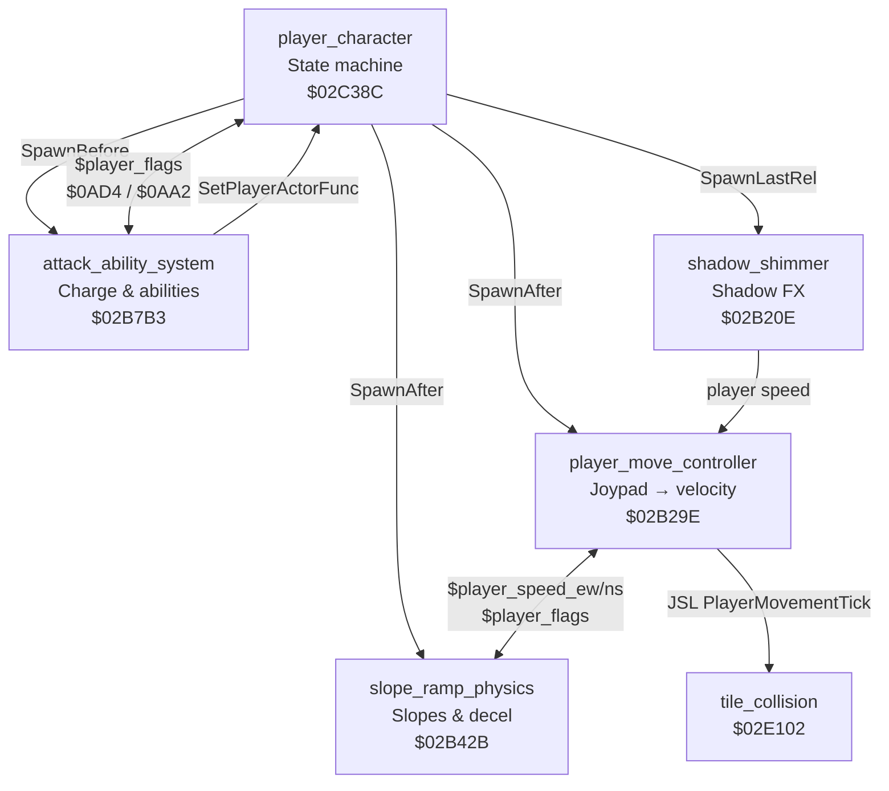
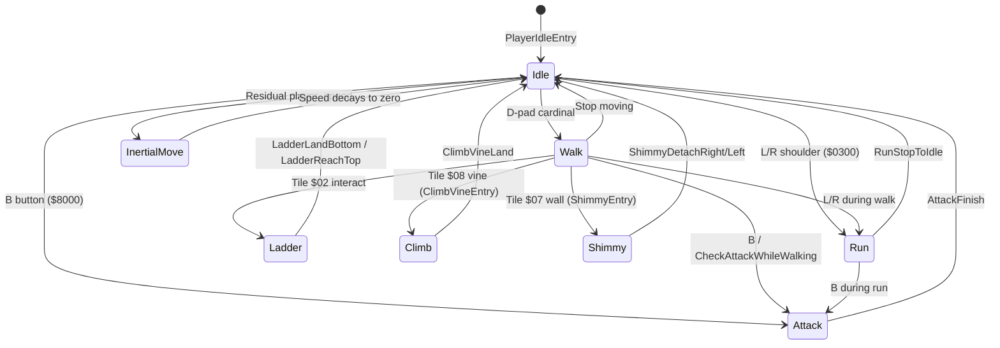

# Player Character System

*Part of the [Bank $02 Documentation Suite](README.md)*

> Modular five-actor architecture for the player character

---

**Document scope:** The five-actor player character architecture in ROM bank `$02`, spanning `$02B20E`–`$02CFD0`.

**Source:** [`player_character.asm`](../../../extracted/actors/player/player_character.asm) · [`shadow_shimmer.asm`](../../../extracted/actors/player/shadow_shimmer.asm) · [`player_move_controller.asm`](../../../extracted/actors/player/player_move_controller.asm)

Illusion of Gaia's playable character is not a single monolithic actor. Instead, **`player_character.asm`** defines the master state machine while four companion actors run in parallel each frame — handling movement physics, terrain slopes, special abilities, and Shadow-form palette effects. All five communicate through shared WRAM variables rather than direct cross-calls.

| # | File | Block | Range | Size |
|---|------|-------|-------|------|
| 1 | [`player_character.asm`](../../../extracted/actors/player/player_character.asm) | `player_character` | `$02C38C`–`$02CFD0` | 3,140 B |
| 2 | [`shadow_shimmer.asm`](../../../extracted/actors/player/shadow_shimmer.asm) | `shadow_shimmer` | `$02B20E`–`$02B29E` | 144 B |
| 3 | [`player_move_controller.asm`](../../../extracted/actors/player/player_move_controller.asm) | `player_move_controller` | `$02B29E`–`$02B42B` | 397 B |
| 4 | [`slope_ramp_physics.asm`](../../../extracted/actors/player/slope_ramp_physics.asm) | `slope_ramp_physics` | `$02B42B`–`$02B7B3` | 904 B |
| 5 | [`attack_ability_system.asm`](../../../extracted/actors/player/attack_ability_system.asm) | `attack_ability_system` | `$02B7B3`–`$02BDF6` + `$02BE72`–`$02C38C` | 2,909 B |
| 6 | [`attack_trail_followers.asm`](../../../extracted/actors/player/attack_trail_followers.asm) | `attack_trail_followers` | `$02BDF6`–`$02BE72` | 124 B |

**Related:** [`tile-collision.md`](tile-collision.md) · [`hardware-and-init.md`](hardware-and-init.md) · [`player-movement.md`](player-movement.md) (player movement physics `$02CFD0`–`$02E395`) · [`README.md`](README.md) · [`../../cop/README.md`](../../cop/README.md) · [`../../actor-organization-analysis.md`](../../actor-organization-analysis.md) · [`attack-ability-system.md`](attack-ability-system.md) · [`slope-ramp-physics.md`](slope-ramp-physics.md)

## Architecture Overview

The player uses a **five-actor modular design**. At initialization, `PlayerCharacterDef` spawns four companion actors via COP commands; each companion runs its own per-frame loop while reading and writing shared WRAM state.



### Player State Machine

`PlayerIdleEntry` is the hub state. Input priority from `PlayerIdleDispatchTable` is: attack button → D-pad cardinal → L/R run → idle stand. Residual `player_speed_ew/ns` routes to `MovingEastWest` / `MovingNorthSouth` for inertial deceleration. Ladder, vine climb, and wall shimmy are entered from tile-collision redirects during movement (tiles `$02`, `$08`, `$07`).



### Compilation Unit Root

```
player_character.asm
  ?INCLUDE 'attack_ability_system'
    ?INCLUDE 'attack_trail_followers'
    ?INCLUDE 'ApplyOrbitalOffsetFromRef'
    ?INCLUDE 'actor_pool'
    ?INCLUDE 'table_01D9A7'    — ability animation data A
    ?INCLUDE 'table_01D9BF'    — ability animation data B
    ?INCLUDE 'table_0EE000'    — guided projectile spritemap
    ?INCLUDE 'table_178000'    — Dark Friar FX spritemap
    ?INCLUDE 'table_179000'    — Aura projectile spritemap
  ?INCLUDE 'shadow_shimmer'
  ?INCLUDE 'game_over_sequence'
  ?INCLUDE 'hardware_math'
  ?INCLUDE 'player_move_controller'
  ?INCLUDE 'slope_ramp_physics'
  ?INCLUDE 'table_17D000'      — ranged weapon spritemap
```

### Shared WRAM Variables

| Address | Symbol | Role |
|---------|--------|------|
| `$09AA` | `$player_actor` | Actor slot index for the player character |
| `$09AE` | `$player_flags` | Shared state bitmask |
| `$09B2` | `$player_speed_ew` | East-west velocity (slope physics writes; move controller reads) |
| `$09B4` | `$player_speed_ns` | North-south velocity |
| `$09B6` | — | Slope step counter (indexed into curve tables) |
| `$09B8` | — | Deceleration step counter |
| `$09BA` / `$09BC` | — | Pointers to slope speed delta tables |
| `$09C2` | — | Pointer to flat-ground deceleration table |
| `$09C6` | — | Slope fractional accumulator |
| `$09C8` / `$09CA` | — | Max speed clamps for EW / NS |
| `$0AA2` | — | Ability availability bitmask |
| `$0AD4` | — | Current character form (0=Will, 1=Freedan, 2=Shadow) |
| `$0657` | — | Raw joypad state |
| `$0658` | — | Joypad mask (directional bits stripped during attacks) |
| `$0408` / `$040A` | — | External velocity accumulators (knockback, conveyors) |
| `$040C` | — | Auto-walk / run momentum timer |
| `$14` / `$16` | — | Sub-pixel position scratch (×4 scale) |

### Player Flags Reference (`$player_flags` at `$09AE`)

| Bit | Hex | Meaning |
|-----|-----|---------|
| 0 | `$0001` | Attack system active / attack lock |
| 1 | `$0002` | Attack in progress (combo state) |
| 3 | `$0008` | Player disabled / dead |
| 4 | `$0010` | Terrain shake active |
| 9 | `$0200` | Blocked movement flag |
| 11 | `$0800` | Ability FX active (Aura/charge) |
| 12 | `$1000` | On-slope flag (set by ramp physics) |
| 13 | `$2000` | Special action lock (ability/climb) |
| 15 | `$8000` | Damage state / hitstun |

**Composite masks** used as combined flag tests throughout the attack and movement code:

| Mask | Hex | Meaning |
|------|-----|---------|
| combo | `$0A00` | Ability FX + blocked movement (`$0800 \| $0200`) |
| combo | `$2A00` | Movement-blocking composite (`$2000 \| $0800 \| $0200`) |
| combo | `$2B00` | Movement + action blocking composite |
| combo | `$3000` | Both movement blocks (`$2000 \| $1000`) |
| combo | `$3A00` | Extended movement block (`$2000 \| $1000 \| $0800 \| $0200`) |

### Ability System (`$0AD4` + `$0AA2`)

| `$0AD4` | Form | Attack Dispatcher | Primary Abilities |
|---------|------|-------------------|-------------------|
| `0` | Will | `WillAttackDispatch` | Basic attack, Psycho Dash, Psycho Slider, running attack |
| `1` | Freedan | `FreedanAttackDispatch` | Basic attack, Dark Friar, Aura Barrier, vine drop-attack |
| `2` | Shadow | `FreedanAttackDispatch` + `shadow_shimmer` | Same as Freedan + Shadow palette shimmer |

| `$0AA2` Bit | Hex | Character | Ability |
|-------------|-----|-----------|---------|
| 0 | `$0001` | All | Basic attack |
| 1 | `$0002` | Will | Running attack (Psycho Dash prerequisite) |
| 2 | `$0004` | Will | Psycho Slider |
| 4 | `$0010` | Freedan | Dark Friar |
| 5 | `$0020` | Freedan | Aura Barrier |
| 6 | `$0040` | Freedan/Shadow | Earthquaker (vine drop-attack) |

**Charge timing:** Both Will and Freedan/Shadow share a **40-frame initial hold** (`#$28`). After the initial hold, Will has a **120-frame** extended charge window (`#$0078`) and Freedan/Shadow has **100 frames** (`#$0064`). L/R shoulder buttons during charge select alternate abilities (Slider vs Dash; Aura vs Dark Friar).

---

## shadow_shimmer.asm

Manages Shadow's palette shimmer effect. Only active when `$0AD4 == 2`.

| Address | Name | Description |
|---------|------|-------------|
| `$02B20E` | ShadowShimmerInit | Check `$0AD4==2` (Shadow), else die. Spawn palette marker. |
| `$02B21F` | ShadowShimmerIdle | Wait: monitor player speed. If moves → active. |
| `$02B241` | ShadowShimmerActive | Active: palette `#24` cycling while moving. |
| `$02B264` | ShadowShimmerGuard | Validate `$0AD4==2`, check `$0040` flag. If invalid, `PLA`; `COP [Die]`. |
| `$02B28D` | ShadowShimmerCycleA | Infinite palette `#23` cycle (idle glow). |
| `$02B294` | ShadowShimmerCycleB | Infinite palette `#24` cycle (active glow). |
| `$02B29B` | ShadowShimmerNop | No-op: `COP [SetEntryHere]`; `RTL`. |

### ShadowShimmerInit

SpawnLastRel companion spawned by `PlayerCharacterDef`. Verifies `$0AD4 == 2` (Shadow form) and immediately `COP [Die]`s if the player is Will or Freedan. On success, spawns a child palette actor via `SpawnAfterMarked` pointed at `ShadowShimmerCycleA` (palette bundle `#23`) and falls through into `ShadowShimmerIdle`. This actor exists solely to drive Shadow's distinctive shimmer FX and never runs for other character forms.


### ShadowShimmerIdle

Standing shimmer state, re-entered each frame with `COP [SetEntryHere]`. Overwrites the child actor's function pointer to `ShadowShimmerCycleA` and resets its frame counter so palette `#23` cycles softly while Shadow is still. Each tick calls `ShadowShimmerGuard`, then ORs `$player_speed_ew | $player_speed_ns` — any nonzero speed (or flag byte `#00 == $01`) transitions to `ShadowShimmerActive`. When the player stops moving, Shadow keeps the idle glow rather than the brighter movement palette.


### ShadowShimmerActive

Movement shimmer state entered when Shadow starts walking or running. Redirects the child palette actor to `ShadowShimmerCycleB` (palette bundle `#24`) for a brighter, faster cycling effect synchronized with motion. Each frame runs `ShadowShimmerGuard`, then checks whether both speed axes are zero; if so and flag byte `#00 == $00`, returns to `ShadowShimmerIdle`. The idle/active split is the core visual feedback distinguishing Shadow's stationary vs. moving appearance.


### ShadowShimmerGuard

Per-frame guard subroutine invoked from both idle and active shimmer states. If `$0AD4 != 2` (player transformed away from Shadow), pops the caller's return address and `COP [Die]`s — the shimmer actor self-destructs. If the player actor flag `$0040` is set (cutscene lock, menu, or similar palette freeze), pops return, points the child at `ShadowShimmerNop` (a no-op yield loop), and exits — cycling pauses without killing the actor. Otherwise returns normally so the caller continues its idle/active palette logic.


## player_move_controller.asm

Central per-frame movement pipeline. Scales positions to ×4 sub-pixel resolution. After velocity is computed, dispatches into `PlayerMovementTick` for collision resolution; movement physics are documented in [`player-movement.md`](player-movement.md).

| Address | Name | Description |
|---------|------|-------------|
| `$02B29E` | PlayerMoveController | Each frame: reads player actor slot, checks paralysis (`$0080`) and death. If `$player_flags` `$0A00` (blocked), zeroes velocity. Otherwise reads joypad, combines with speed accumulators, applies velocity. Calls `PlayerMovementTick` for collision. Writes back positions. |
| `$02B3C6` | JoypadToVelocity | Converts joypad state (`$0657`) to 2D velocity. 8 directions: pure cardinal = ±8, diagonals = (±6, ±6) or (6, ±10). |

### PlayerMoveController

Each frame: reads player actor slot, checks paralysis (`$0080`) and death. If `$player_flags` `$0A00` (blocked), zeroes velocity. Otherwise reads joypad, combines with speed accumulators, applies velocity. Calls `PlayerMovementTick` for collision. Writes back positions.

**Algorithm:**
- Scale `$14`/`$16` to ×4 sub-pixel resolution
- Skip frame if player paralyzed (`$0080`) or dead
- If `$player_flags & $0A00`: zero external velocity, return
- Sync scratch position with actor pixel coords
- If not `$3000` locked: `JSR JoypadToVelocity`
- Merge EW velocity from `player_speed_ew×4` or joypad + `$0408`
- Merge NS velocity similarly; clear slope flag `$1000` when slope speed used
- If collision flag `$0008`: `JSL PlayerMovementTick`
- Write positions back to player actor slot (`$0014`/`$0016`)


**Variables:**

| Location | Direction | Role |
|----------|-----------|------|
| `$14`/`$16` | R/W | Sub-pixel position scratch (×4) |
| `$player_flags` | R/W | Movement/attack/slope flags |
| `$player_speed_ew/ns` | R | Slope physics override |
| `$0408`/`$040A` | R/W | External velocity accumulators |
| `$0657` | R | Raw joypad |


**Cross-References:**

| Symbol | Relationship |
|--------|-------------|
| `JoypadToVelocity` | JSR each frame when unlocked |
| `PlayerMovementTick` | JSL for tile collision ($02CFD0); see [`player-movement.md`](player-movement.md) |
| `SlopePhysicsEntry` | Writes `$player_speed_*` |

### JoypadToVelocity

Converts joypad state (`$0657`) to 2D velocity. 8 directions: pure cardinal = ±8, diagonals = (±6, ±6) or (6, ±10).

**Algorithm:**
| Direction | X vel | Y vel |
|---|---|---|
| Right | +8 | 0 |
| Left | -8 | 0 |
| Up | 0 | -8 |
| Down | 0 | +8 |
| Right+Up | +6 | -6 |
| Right+Down | +6 | +6 |
| Left+Up | -6 | -6 |
| Left+Down | -6 | +6 |


**Variables:**

| Location | Direction | Role |
|----------|-----------|------|
| `$player_flags` | R/W | Shared player state bitmask |
| `$player_actor` | R | Player WRAM slot index |

---

## player_character.asm

Master actor definition and state machine for idle, walk, run, climb, ladder, shimmy, and attack.

| Address | Name | Description |
|---------|------|-------------|
| `$02C38C` | PlayerCharacterDef | Actor definition header (type `$00`, priority `$08`, flags `$85`). Init: sets `$0100` + `$0001`. Stores X to `$player_actor`. Sets `$7F101C,X = 1`. If `$0AF8` (death), spawns `DeathWakeupMessage`. Spawns 4 companion actors via `SpawnBefore`/`SpawnAfter`/`SpawnLastRel`. |
| `$02C3C8` | PlayerIdleEntry | Main idle state. Clears joypad mask/flags. Clears `$2800` from `$player_flags`. If EW/NS speed non-zero → walking (`MovingEastWest` / `MovingNorthSouth`), else → directional idle dispatch via facing + joypad. |
| `$02C447` | PlayerIdleDispatchTable | 28-entry table (7 per facing × 4 directions). Selected by combining facing (`$24`) with joypad/action button state. |
| `$02C47F` | IdleStandSouth | South-facing idle. Shadow variant check → sprite `#00` or `#10`. |
| `$02C48A` | IdleStandSouthShadow | Shadow: `#10`. |
| `$02C48F` | IdleStandNorth | North: `#01` / `#11`. |
| `$02C49A` | IdleStandNorthShadow | Shadow: `#11`. |
| `$02C49F` | IdleStandWest | West: `#02` / `#12`. |
| `$02C4AA` | IdleStandWestShadow | Shadow: `#12`. |
| `$02C4AF` | IdleStandEast | East: `#03` / `#13`. |
| `$02C4BA` | IdleStandEastShadow | Shadow: `#13`. Shared idle animation loop. |
| `$02C4DD` | WalkSouth | Walking south, sprite `#08`. Auto-walk timer, L/R attack check. |
| `$02C524` | WalkNorth | North, sprite `#09`. |
| `$02C56C` | WalkWest | West, sprite `#0A`. |
| `$02C5B5` | WalkEast | East, sprite `#0B`. |
| `$02C5FF` | CheckAttackWhileWalking | Check attack button (`$8000`) or movement stop. Check slope (`$1000`). |
| `$02C614` | WalkAbortToIdle | `PLA` — drops return address. |
| `$02C615` | WalkRestoreSaved | `COP [RestoreSavedPtr]`. |
| `$02C617` | SetAutoWalkTimer | Set `$040C = $000D` (13-frame auto-walk timer). |
| `$02C61E` | ClimbVineEntry | Vine climbing: clear `$0008`, set `$0200`. Block joypad `$4000`. Sprites `#18`→`#19`→`#1A`→`#1B` cycle with force-move Y+7. |
| `$02C692` | ClimbVineLand | Landing: sound `#2C`, sprite `#1C`. |
| `$02C6AE` | CheckClimbFrame | Animation frame check. |
| `$02C6BC` | CheckClimbAttack | Freedan climb check: if `$0AD4==1` and ability `$0040`, check attack button → drop attack. |
| `$02C6D5` | ClimbDropAttack | Freedan's drop-attack from vine: sprite `#06`, hitbox `#00`, force-move Y+7. |
| `$02C6FA` | ClimbDropLand | Drop landing: anim table 2, camera shake spawn. Wait 39 frames. |
| `$02C73F` | ImpactTerrainShake | Sets `$player_flags` `$0010`. Waits `$01DF` frames. Clears. Dies. |
| `$02C751` | CameraShakeActor | Sound `#15`. Decrements counter → dies. |
| `$02C75E` | CameraShakeFrame | Random camera offset ±1 to `$06BE`/`$06C2` each frame. |
| `$02C7B6` | LadderClimbSouth | South-facing ladder. |
| `$02C7E2` | LadderClimbNorth | North-facing. |
| `$02C80D` | LadderMoveDown | Move down: sprite `#2D`, force-move Y+29. |
| `$02C831` | LadderMoveUp | Move up: sprite `#2C`, force-move Y−30. |
| `$02C855` | LadderIdleSouth | Idle south: `#2B` / `#2F`. |
| `$02C860` | LadderIdleSouthShadow | Shadow: `#2F`. |
| `$02C865` | LadderIdleNorth | Idle north: `#2A` / `#2E`. |
| `$02C870` | LadderIdleNorthShadow | Shadow: `#2E`. |
| `$02C897` | LadderLandBottom | Landing at bottom. |
| `$02C8AA` | LadderReachTop | Reaching top. |
| `$02C8BD` | ShimmyRightEntry | Right shimmy. Sprite `#33`, force-move X `$51`. |
| `$02C8D4` | ShimmyRightCheckWall | Check east for solid. |
| `$02C8EC` | ShimmyRightLoop | Main right loop. |
| `$02C92D` | ShimmyRightUpCheck | Probe north. |
| `$02C934` | ShimmyRightDownCheck | Probe south. |
| `$02C93B` | ShimmyLeftEntry | Left shimmy. Sprite `#32`, force-move X `$52`. |
| `$02C952` | ShimmyLeftCheckWall | Check west. |
| `$02C969` | ShimmyLeftLoop | Main left loop. |
| `$02C9A9` | ShimmyLeftUpCheck | Probe north. |
| `$02C9B0` | ShimmyLeftDownCheck | Probe south. |
| `$02C9B7` | ShimmyDetachRight | Detach right: sprite `#31`/`#35`. |
| `$02C9C5` | ShimmyDetachRightShadow | Shadow: `#35`. |
| `$02C9CA` | ShimmyDetachLeft | Detach left: sprite `#30`/`#34`. |
| `$02C9D8` | ShimmyDetachLeftShadow | Shadow: `#34`. |
| `$02CA19` | ShimmyTopCorner | Corner reached. |
| `$02CA22` | AttackFromWalkSouth | Merge `$0400` joypad. |
| `$02CA28` | RunSouth | Running south: sprite `#3A`. |
| `$02CA30` | AttackFromWalkNorth | Merge `$0800`. |
| `$02CA36` | RunNorth | Sprite `#3B`. |
| `$02CA3E` | AttackFromWalkWest | Merge `$0200`. |
| `$02CA44` | RunWest | Sprite `#3C`. |
| `$02CA4C` | AttackFromWalkEast | Merge `$0100`. |
| `$02CA52` | RunEast | Sprite `#3D`. Sets `$2000` in `$player_flags`. |
| `$02CA82` | RunStopToIdle | `COP [RestoreSavedPtr]`. |
| `$02CA84` | MovingEastWest | EW walking with full state machine. Sprite `#0F` (right) / `#0E` (left). |
| `$02CB0C` | MovingNorthSouth | NS walking. Sprite `#0D` (north) / `#0C` (south). |
| `$02CB92` | CheckRunAttack | Conditions: not hitstun, Will only, has ability `$0002`, not slope. |
| `$02CBB5` | RunAttackSpeedCheck | Checks if player speed exceeds threshold for running attack — absolute EW ≥ 3 → `RunAttackEW`, else absolute NS ≥ 3 → `RunAttackNS`. |
| `$02CBD9` | SpeedThresholdEW | Takes absolute value of `player_speed_ew` and falls through to shared speed ≥ 4 threshold check. |
| `$02CBE4` | SpeedThresholdNS | NS check. |
| `$02CBFF` | RunAttackNS | NS running attack with anim table 1. |
| `$02CC52` | RunAttackEW | EW running attack. |
| `$02CCA5` | DisableStatusForAttack | Clears `$0100`, sets `$0200` in `$06EE`. |
| `$02CCB0` | RunAttackFlagSetup | Sets `$0200` in `$10`, `$8000` in `$0658`, `$0802` in `$player_flags`. |
| `$02CCC2` | RestoreStatusDisplay | Clears `$0200` from `$06EE`. |
| `$02CCC8` | RunAttackCleanup | Clears flags. |
| `$02CCDA` | AttackSouth | South attack. Freedan wall-slash variant. |
| `$02CD5B` | AttackNorth | North. |
| `$02CDDC` | AttackWest | West. |
| `$02CE5A` | AttackEast | East. |
| `$02CED8` | AttackRedirect | If direction pressed, allow movement. |
| `$02CEE6` | AttackFinish | Clears joypad mask, restores idle. |
| `$02CEEE` | AttackInit | Masks joypad, plays sound. |
| `$02CF0F` | RangedAttackSouth | Y force-move, sprite `#44`. |
| `$02CF19` | RangedAttackNorth | Flip, sprite `#45`. |
| `$02CF28` | RangedAttackWest | X force-move, mirror, sprite `#46`. |
| `$02CF37` | RangedAttackEast | Sprite `#47`. |
| `$02CF4A` | RangedSetForceX | `COP [StageForceMoveX]` (`$46`). |
| `$02CF4F` | RangedSetForceY | `COP [StageForceMoveY]` (`$46`). Sets `$0800`/`$0200`, hitbox `$0040`. |
| `$02CF68` | ProjectileSouth | Spritemap `table_17D000`, moves Y. |
| `$02CF82` | ProjectileNorth | Sprites `#01`→`#05`. |
| `$02CF9C` | ProjectileWest | X-axis. |
| `$02CFB6` | ProjectileEast | Sprites `#03`→`#07`. |

#### Actor Definition & Init

### PlayerCharacterDef

Actor definition header (type `$00`, priority `$08`, flags `$85`). Init: sets `$0100` + `$0001`. Stores X to `$player_actor`. Sets `$7F101C,X = 1`. If `$0AF8` (death), spawns `DeathWakeupMessage`. Spawns 4 companion actors via `SpawnBefore`/`SpawnAfter`/`SpawnLastRel`.


**Variables:**

| Location | Direction | Role |
|----------|-----------|------|
| `$player_flags` | R/W | Shared player state bitmask |
| `$player_actor` | R | Player WRAM slot index |


**Cross-References:**

| Symbol | Relationship |
|--------|-------------|
| `AttackSystemEntry` | `SpawnBefore` companion |
| `PlayerMoveController` | `SpawnAfter` companion |
| `SlopePhysicsEntry` | `SpawnAfter` companion |
| `ShadowShimmerInit` | `SpawnLastRel` companion |

#### Idle & Standing States

### PlayerIdleEntry

Main idle state. Clears joypad mask/flags. Clears `$2800` from `$player_flags`. If EW/NS speed non-zero → walking (`MovingEastWest` / `MovingNorthSouth`), else → directional idle dispatch via facing + joypad.

**Algorithm:**
- Clear joypad mask high bits and composite flags `$2800`
- If `$player_speed_ew` non-zero → `MovingEastWest`
- If `$player_speed_ns` non-zero → `MovingNorthSouth`
- Else compute dispatch index from facing + joypad via `PlayerIdleDispatchTable`


**Variables:**

| Location | Direction | Role |
|----------|-----------|------|
| `$player_flags` | R/W | Shared player state bitmask |
| `$player_actor` | R | Player WRAM slot index |


### PlayerIdleDispatchTable

28-entry table (7 per facing × 4 directions). Selected by combining facing (`$24`) with joypad/action button state.


**Variables:**

| Location | Direction | Role |
|----------|-----------|------|
| `$player_flags` | R/W | Shared player state bitmask |
| `$player_actor` | R | Player WRAM slot index |


#### Standing Idle Animations

Single-frame idle loops and Shadow palette variants — no separate routine sections; see summary table above.

| Group | Routines | Size range | Role |
|-------|----------|------------|------|
| Standing idle | `IdleStandSouth/North/West/East` + `*Shadow` | 5–16 B | Directional idle sprite (`#00`–`#03` / `#10`–`#13`) |
| Ladder idle | `LadderIdleSouth/North` + `*Shadow` | 3–16 B | Ladder idle sprites (`#2A`–`#2F`) |
| Shimmy probes | `ShimmyRightUpCheck`, `ShimmyRightDownCheck`, `ShimmyLeftUpCheck`, `ShimmyLeftDownCheck` | 7 B each | Single-probe wall checks during shimmy |
| Run entry | `RunSouth/North/West`, `AttackFromWalk*` | 6–14 B | Joypad merge + running sprite redirect |
| Walk helpers | `WalkAbortToIdle`, `WalkRestoreSaved`, `SetAutoWalkTimer`, `RunStopToIdle` | 1–7 B | Stack/pointer restore and auto-walk timer |
| Ranged stubs | `RangedAttack*`, `RangedSetForceX/Y`, `Projectile*` | 5–26 B | Force-move staging and projectile spawn (see summary table) |

#### Walk & Running States

### WalkSouth

Walking south, sprite `#08`. Auto-walk timer, L/R attack check.


**Variables:**

| Location | Direction | Role |
|----------|-----------|------|
| `$player_flags` | R/W | Shared player state bitmask |
| `$player_actor` | R | Player WRAM slot index |


### WalkNorth

Entered when `PlayerIdleDispatchTable` detects D-pad up (or a northward direction change during walk). On first entry from a different facing (`$24 == 1`), initializes `$player_speed_ns = -3`, clears slope/decel counters, clears the invincibility timer, and seeds a 13-frame auto-walk guarantee via `SetAutoWalkTimer`. Stages walk animation sprite set `#09` (north-facing) and loops `AnimOneFrame` each COP tick. Each frame checks whether up was released (`BranchIfNoButton #$0800` → `WalkRestoreSaved` / idle), calls `CheckAttackWhileWalking` for B-button or zero-speed aborts, and offers L/R shoulder (`#$0030`) transition to `RunNorth`. Actual displacement comes from the `PlayerMoveController` companion, which merges joypad velocity or `$player_speed_* × 4` with external knockback and delegates collision to `PlayerMovementTick`.


**Variables:**

| Location | Direction | Role |
|----------|-----------|------|
| `$player_flags` | R/W | Shared player state bitmask |
| `$player_actor` | R | Player WRAM slot index |


### WalkWest

West-facing walk state — same loop structure as `WalkNorth` but keyed on left D-pad (`#$0200`) and sprite `#0A`. First entry from facing west (`$24 == 2`) sets `$player_speed_ew = -3` and resets slope/decel state before staging the animation. Per-frame: auto-walk timer refresh, attack interrupt via `CheckAttackWhileWalking`, and L/R run promotion to `RunWest`. Releasing left returns through `WalkRestoreSaved` to `PlayerIdleEntry`; movement physics are handled externally by `PlayerMoveController`.


**Variables:**

| Location | Direction | Role |
|----------|-----------|------|
| `$player_flags` | R/W | Shared player state bitmask |
| `$player_actor` | R | Player WRAM slot index |


### WalkEast

East-facing walk state — mirror of `WalkWest` for right D-pad (`#$0100`) and sprite `#0B`. First entry from facing east (`$24 == 3`) seeds `$player_speed_ew = +3` plus the standard slope/decel reset and 13-frame auto-walk timer. Each COP frame advances the walk animation, monitors for direction release, attack button, or L/R shoulder run transition to `RunEast`. Position integration and tile collision remain in `PlayerMoveController` → `PlayerMovementTick`, not in this state handler.


**Variables:**

| Location | Direction | Role |
|----------|-----------|------|
| `$player_flags` | R/W | Shared player state bitmask |
| `$player_actor` | R | Player WRAM slot index |


### ClimbVineEntry

Vine climbing: clear `$0008`, set `$0200`. Block joypad `$4000`. Sprites `#18`→`#19`→`#1A`→`#1B` cycle with force-move Y+7.


**Variables:**

| Location | Direction | Role |
|----------|-----------|------|
| `$player_flags` | R/W | Shared player state bitmask |
| `$player_actor` | R | Player WRAM slot index |


### ClimbDropAttack

Freedan's Earthquaker vine drop-attack, entered when `CheckClimbAttack` sees `$0AD4 == 1`, ability bitmask bit `$0040` set, and B button during the climb loop. Pops the climb return address, sets body sprite `#06` with hitbox `#00`, and repeatedly applies `StageForceMoveY #07` until the player's Y coordinate aligns to a 16-pixel boundary with solid ground below (`BranchIfSolidType`). On landing, control transfers to `ClimbDropLand`, which spawns terrain and camera shake actors before a 39-frame recovery animation.


**Variables:**

| Location | Direction | Role |
|----------|-----------|------|
| `$player_flags` | R/W | Shared player state bitmask |
| `$player_actor` | R | Player WRAM slot index |


### ClimbDropLand

Drop landing: anim table 2, camera shake spawn. Wait 39 frames.


**Variables:**

| Location | Direction | Role |
|----------|-----------|------|
| `$player_flags` | R/W | Shared player state bitmask |
| `$player_actor` | R | Player WRAM slot index |


#### Landing Effects

### CameraShakeFrame

Per-frame camera jitter helper called by `CameraShakeActor` (spawned on Freedan vine drop landing). Uses `COP [RngByte]` to apply independent random ±1 offsets to `$06BE` (camera X) and `$06C2` (camera Y) each frame. When `$layerPriorityFlag` bit `$0200` is active, saves the original camera position to actor WRAM `$7F100C/E` on first call and restores from those slots on subsequent frames so layered scenes do not permanently drift. Runs until the shake actor's frame counter expires, then the actor dies.


**Variables:**

| Location | Direction | Role |
|----------|-----------|------|
| `$player_flags` | R/W | Shared player state bitmask |
| `$player_actor` | R | Player WRAM slot index |


#### Ladder Climbing

### LadderClimbSouth

South-facing ladder entry reached via tile-collision redirect on ladder tile `$02` during movement. Clears actor flags, sets climb mode (`$0100` on actor, `$0800` on `$player_flags`), and masks joypad to up/down only (`$CFF0` on `$0658`). Plays the south mount animation (`StagePlayerMoveXY` sprite `#26`), then immediately branches to `LadderMoveUp`, `LadderMoveDown`, or `LadderIdleNorth` depending on held direction. While climb flags are set, `PlayerMoveController` zeros external velocity and skips its normal pipeline — ladder states drive position directly via force-move COP commands.


### LadderClimbNorth

North-facing ladder entry with the same flag and joypad masking as `LadderClimbSouth`, but uses mount sprite `#28` and inverted direction priority (down checked before up). After the entry animation completes, branches to `LadderMoveDown`, `LadderMoveUp`, or falls through to `LadderIdleSouth` if no direction is held. Sets `$0A00` on `$player_flags` so the movement companion defers to ladder force-move logic.


### LadderMoveDown

Active ladder descent entered from ladder entry or resumed from `LadderIdleSouth` when down is pressed. Stages climbing sprite `#2D` and applies `StageForceMoveY #1D` (~29 pixels) per step. At each 16-pixel Y boundary, probes the tile below with `BranchIfSolidTypeSouth` — open space triggers `LadderLandBottom`; solid tile continues the descent loop gated by animation events (`$2A`). Releasing down returns to `LadderIdleSouth` without leaving the ladder state machine.


### LadderMoveUp

Active ladder ascent with sprite `#2C` and upward force-move `#1E` (~30 pixels per step). Probes north at 16-pixel Y boundaries via `BranchIfSolidTypeNorth` — reaching open space above calls `LadderReachTop`. Animation events (`$2A`) pace step timing; releasing up returns to `LadderIdleNorth`. Like descent, position is applied through COP force-move rather than the joypad velocity pipeline.


### ShimmyRightLoop

Main east-wall shimmy loop after `ShimmyRightEntry` confirms tile `$07` wall contact. Stages sprite `#33` and crawls rightward with repeated `StageForceMoveX #51` steps. At 16-pixel X boundaries, probes for corner transitions (`ShimmyTopCorner`), optional up/down direction changes (`ShimmyRightUpCheck` / `ShimmyRightDownCheck`), and continued east-wall solidity — losing the wall jumps to `ShimmyDetachRight`. Releasing right (`BranchIfNoButton #$0101`) also detaches. The `ShimmyRightAnimLoop` sub-loop handles per-frame `AnimOneFrame` and button polling between force-move steps.


**Variables:**

| Location | Direction | Role |
|----------|-----------|------|
| `$player_flags` | R/W | Shared player state bitmask |
| `$player_actor` | R | Player WRAM slot index |


### ShimmyLeftLoop

West-wall counterpart to `ShimmyRightLoop`. Uses sprite `#32` with `StageForceMoveX #52` for leftward crawling along tile `$07` walls. Boundary checks mirror the right loop but probe west via `BranchIfSolidTypeWest`; corner and up/down transitions use `ShimmyLeftUpCheck` / `ShimmyLeftDownCheck`. Detaches via `ShimmyDetachLeft` when the wall ends or left is released (`#$0201`).


**Variables:**

| Location | Direction | Role |
|----------|-----------|------|
| `$player_flags` | R/W | Shared player state bitmask |
| `$player_actor` | R | Player WRAM slot index |


#### Run & Attack-from-Walk

#### Directional Walk State Machine

### MovingEastWest

EW walking with full state machine. Sprite `#0F` (right) / `#0E` (left).


**Variables:**

| Location | Direction | Role |
|----------|-----------|------|
| `$player_flags` | R/W | Shared player state bitmask |
| `$player_actor` | R | Player WRAM slot index |


### MovingNorthSouth

NS walking. Sprite `#0D` (north) / `#0C` (south).


**Variables:**

| Location | Direction | Role |
|----------|-----------|------|
| `$player_flags` | R/W | Shared player state bitmask |
| `$player_actor` | R | Player WRAM slot index |


#### Running Attack Check

### CheckRunAttack

Will-only running attack eligibility gate, called from `MovingEastWest` / `MovingNorthSouth` during inertial movement. Requires all of: actor flag `$0080` clear (not frozen), `$0AD4 == 0` (Will form), ability bitmask bit `$0002` set (Psycho Dash learned), `$player_flags` bit `$1000` clear (not already in walk-attack), and B button (`#$8000`) held. If every condition passes, branches to `RunAttackSpeedCheck` to verify sufficient axis speed before launching the dash attack. Returns immediately on any failed check, allowing normal attack or run transitions to proceed.


**Variables:**

| Location | Direction | Role |
|----------|-----------|------|
| `$player_flags` | R/W | Shared player state bitmask |
| `$player_actor` | R | Player WRAM slot index |


### RunAttackSpeedCheck

Checks if the player is moving fast enough for a running attack. Takes absolute value of `player_speed_ew` — if ≥ 3, pops return address and jumps to `RunAttackEW`. Otherwise checks `player_speed_ns` — if ≥ 3, pops and jumps to `RunAttackNS`. If neither axis exceeds the threshold, returns without launching.


**Variables:**

| Location | Direction | Role |
|----------|-----------|------|
| `$player_flags` | R/W | Shared player state bitmask |
| `$player_actor` | R | Player WRAM slot index |


### RunAttackNS

Will's north-south Psycho Dash, entered when `RunAttackSpeedCheck` finds absolute `$player_speed_ns` ≥ 3. Loads ability animation table A entry 1 and sets body sprite `#04`. Positive NS speed: south dash using sprites `#0C` → `#0D` (Y force-move loop) → `#0E` finish, zeroing NS speed. Negative speed: north path via `SetForceNE` with sprites `#0F` → `#10` → `#11`. Both paths call `RunAttackFlagSetup` (sets actor `$0200`, consumes attack input, sets `$0802` on `$player_flags`), run the dash distance through `AnimLoop`, then `RunAttackCleanup` and `RestoreSavedPtr` back to idle.


**Variables:**

| Location | Direction | Role |
|----------|-----------|------|
| `$player_flags` | R/W | Shared player state bitmask |
| `$player_actor` | R | Player WRAM slot index |


### RunAttackEW

Horizontal Psycho Dash — same structure as `RunAttackNS` but routed on `$player_speed_ew` sign after absolute speed ≥ 3 threshold. West (negative): `SetForceSW`, sprites `#12` → `#13` X-loop → `#14`. East (positive): `#15` → `#16` → `#17`. Zeros EW speed on entry, applies `RunAttackFlagSetup` / `RunAttackCleanup` bookends, and restores saved pointer when the dash animation completes. This is Will's signature running attack and requires the Psycho Dash ability bit in `$0AA2`.


**Variables:**

| Location | Direction | Role |
|----------|-----------|------|
| `$player_flags` | R/W | Shared player state bitmask |
| `$player_actor` | R | Player WRAM slot index |


#### Attack State Handlers

### AttackSouth

South-facing melee attack entered from idle dispatch, walk abort, or inertial movement when B is pressed facing south. Calls `AttackInit` (joypad mask, SFX), injects south D-pad into `$0658`, then stages sprite `#36` — Freedan (form 1) near a south wall uses the thrust variant `#48` via `BranchIfSolidSouth` / diagonal offset probe. Scene `$00E8` (Dark Gaia) additionally spawns `ProjectileSouth`. The per-frame loop advances animation frames; Will (form 0) can redirect mid-swing with perpendicular D-pad (`AttackRedirect`) or chain into `RangedAttackSouth` by holding south again. B re-press at animation end restarts the combo; otherwise `AttackFinish` clears held directions and returns to idle.


**Variables:**

| Location | Direction | Role |
|----------|-----------|------|
| `$player_flags` | R/W | Shared player state bitmask |
| `$player_actor` | R | Player WRAM slot index |


### AttackNorth

North-facing melee — same attack system as `AttackSouth` but injects up D-pad (`#$0800`), uses sprites `#37` / Freedan wall-push `#49`, and spawns `ProjectileNorth` on scene `$00E8`. Will can redirect with perpendicular D-pad (`#$0700`) or chain `RangedAttackNorth`; Freedan/Shadow get redirect only. Combo restart and `AttackFinish` idle return behave identically to the south handler.


**Variables:**

| Location | Direction | Role |
|----------|-----------|------|
| `$player_flags` | R/W | Shared player state bitmask |
| `$player_actor` | R | Player WRAM slot index |


### AttackWest

West-facing melee attack using sprites `#38` (normal) or `#42` (wall-push, Will and Freedan only — Shadow skips the wall probe). Injects left D-pad (`#$0200`) after `AttackInit`. Will's mid-attack redirect mask is `#$0D00`; same-axis hold chains into `RangedAttackWest`. Scene `$00E8` spawns `ProjectileWest`. Axis-specific joypad merge and sprite IDs differ; animation loop, combo re-press, and finish logic match `AttackSouth`.


**Variables:**

| Location | Direction | Role |
|----------|-----------|------|
| `$player_flags` | R/W | Shared player state bitmask |
| `$player_actor` | R | Player WRAM slot index |


### AttackEast

East-facing melee attack — mirror of `AttackWest` with right D-pad (`#$0100`), sprites `#39` / wall-push `#43`, redirect mask `#$0E00`, and `RangedAttackEast` / `ProjectileEast` chain. Non-Shadow forms check east-wall adjacency for the push variant; Shadow always uses the standard sprite. Shared `AttackInit` entry, per-frame `AnimOneFrame` loop, and `AttackFinish` return match the other directional handlers.


**Variables:**

| Location | Direction | Role |
|----------|-----------|------|
| `$player_flags` | R/W | Shared player state bitmask |
| `$player_actor` | R | Player WRAM slot index |


### AttackInit

Shared initialization called via JSR at the start of every directional melee attack. Strips directional bits from `$0657` into `$0658` (keeping only D-pad in the held mask), ORs in the attack button (`#$8000`), and clears actor visibility flag `$0100`. Plays form-specific attack SFX on channel 2: Will (`$0AD4 == 0`) uses sound `#01` (lighter swing), Freedan and Shadow use `#02` (heavier). Each `Attack*` handler then injects its facing direction into `$0658` and stages direction-specific sprites before entering the animation loop.


## Cross-File Call Graph

```
player_character.asm (PlayerCharacterDef @ $02C38C)
  ├─ COP SpawnBefore  → attack_ability_system.AttackSystemEntry
  ├─ COP SpawnAfter   → player_move_controller.PlayerMoveController
  ├─ COP SpawnAfter   → slope_ramp_physics.SlopePhysicsEntry
  ├─ COP SpawnLastRel → shadow_shimmer.ShadowShimmerInit
  ├─ JMP MovingEastWest / MovingNorthSouth
  ├─ JSR LoadAbilityAnimTableA/B
  └─ JSL PlayerMovementTick ($02CFD0)

attack_ability_system.asm
  ├─ JSR SetPlayerActorFunc / SavePlayerPosition
  ├─ JSR TrailPositionInit / TrailPositionCascade
  ├─ JSR ComputeParentOffset / ApplyParentOffset
  └─ COP SpawnAfter/SpawnLastRel (FX actors, projectiles)

player_move_controller.asm
  ├─ JSR JoypadToVelocity
  └─ JSL PlayerMovementTick → tile_collision ($02E102)

slope_ramp_physics.asm
  ├─ JSR TileProbeMain / ReadCollisionNibble
  └─ JSR ClampSpeeds / DecelerateEW / DecelerateNS / ApplySlopeCurve*

shadow_shimmer.asm
  └─ reads player_speed_ew | player_speed_ns
```

---

## Shadow Form Sprite Variant Summary

Shadow form (`$0AD4 == 2`) uses alternate sprites via `COP [BranchIfFlagByte]`. Only standing idle, ladder idle, and wall shimmy detach have explicit Shadow variants.

| Context | Will / Freedan | Shadow |
|---------|----------------|--------|
| Stand idle (4 dirs) | `#00`–`#03` | `#10`–`#13` |
| Ladder idle south/north | `#2B` / `#2A` | `#2F` / `#2E` |
| Shimmy detach right/left | `#31` / `#30` | `#35` / `#34` |

---

## See Also

- [`player-movement.md`](player-movement.md) — `PlayerMovementTick` (`$02CFD0`), tile collision (`$02E102`)
- [`tile-collision.md`](tile-collision.md) — tile probing for slopes and shimmy
- [`../../cop/README.md`](../../cop/README.md) — COP command semantics
- [`../../actor-organization-analysis.md`](../../actor-organization-analysis.md) — global actor linked list
