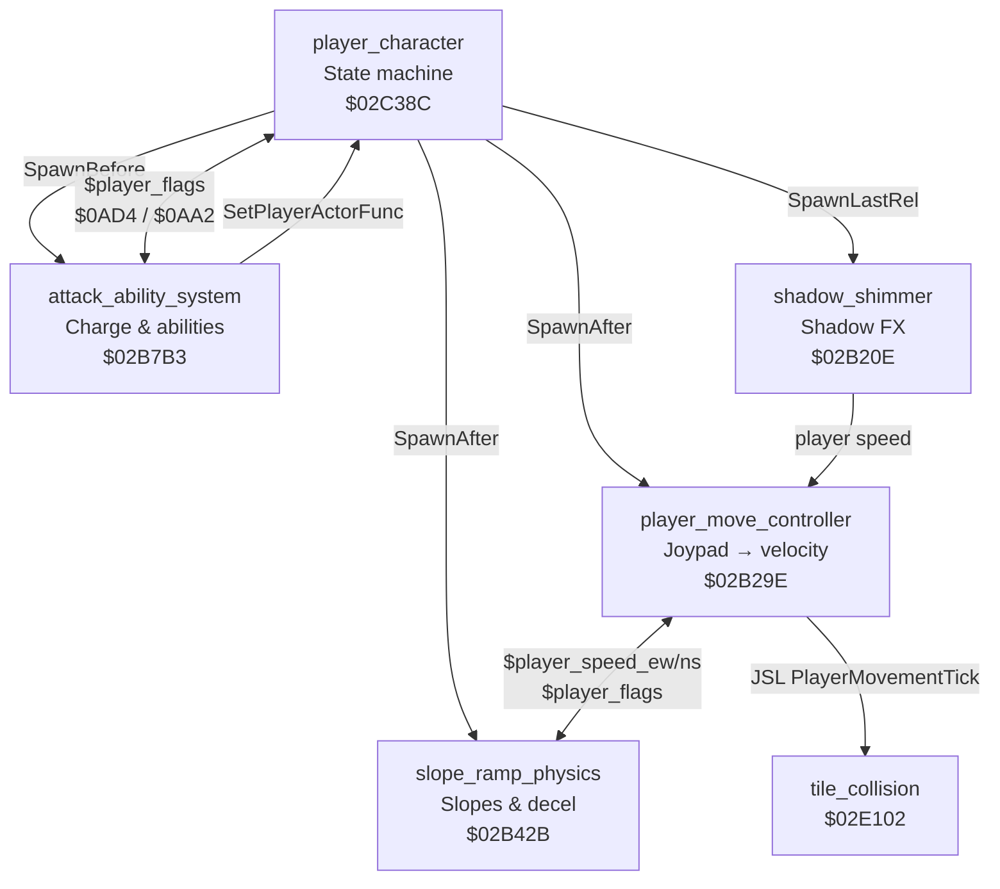

# Player Character System

> Modular five-actor architecture for the player character

---

**Document scope:** The five-actor player character architecture in ROM bank `$02`, spanning `$02B20E`–`$02CFD0`.

**Source:** [`player_character.asm`](../../../extracted/actors/player/player_character.asm) · [`shadow_shimmer.asm`](../../../extracted/actors/player/shadow_shimmer.asm) · [`player_move_controller.asm`](../../../extracted/actors/player/player_move_controller.asm)

Illusion of Gaia's playable character is not a single monolithic actor. Instead, **`player_character.asm`** defines the master state machine while four companion actors run in parallel each frame — handling movement physics, terrain slopes, special abilities, and Shadow-form palette effects. All five communicate through shared WRAM variables rather than direct cross-calls.

| # | File | Block | Range | Size |
|---|------|-------|-------|------|
| 1 | [`player_character.asm`](../../../extracted/actors/player/player_character.asm) | `player_character` | `$02C38C`–`$02CFD0` | 3,140 B |
| 2 | [`shadow_shimmer.asm`](../../../extracted/actors/player/shadow_shimmer.asm) | `shadow_shimmer` | `$02B20E`–`$02B29E` | 144 B |
| 3 | [`player_move_controller.asm`](../../../extracted/actors/player/player_move_controller.asm) | `player_move_controller` | `$02B29E`–`$02B42B` | 397 B |
| 4 | [`slope_ramp_physics.asm`](../../../extracted/actors/player/slope_ramp_physics.asm) | `slope_ramp_physics` | `$02B42B`–`$02B7B3` | 904 B |
| 5 | [`attack_ability_system.asm`](../../../extracted/actors/player/attack_ability_system.asm) | `attack_ability_system` | `$02B7B3`–`$02BDF6` + `$02BE72`–`$02C38C` | 2,909 B |
| 6 | [`attack_trail_followers.asm`](../../../extracted/actors/player/attack_trail_followers.asm) | `attack_trail_followers` | `$02BDF6`–`$02BE72` | 124 B |

**Related:** [`camera-and-map.md`](camera-and-map.md) · [`hardware-and-init.md`](hardware-and-init.md) · [`../bank2-code-analysis.md`](../bank2-code-analysis.md) (player movement physics `$02CFD0`–`$02E395`) · [`../bank2-actors-and-menus.md`](../bank2-actors-and-menus.md) · [`../../cop-commands-reference.md`](../../cop-commands-reference.md) · [`../../actor-organization-analysis.md`](../../actor-organization-analysis.md) · [`attack-ability-system.md`](attack-ability-system.md) · [`slope-ramp-physics.md`](slope-ramp-physics.md)

## Architecture Overview

The player uses a **five-actor modular design**. At initialization, `PlayerCharacterDef` spawns four companion actors via COP commands; each companion runs its own per-frame loop while reading and writing shared WRAM state.



### Compilation Unit Root

```
player_character.asm
  ?INCLUDE 'attack_ability_system'
    ?INCLUDE 'attack_trail_followers'
    ?INCLUDE 'ApplyOrbitalOffsetFromRef'
    ?INCLUDE 'cop_handlers_actors'
    ?INCLUDE 'table_01D9A7'    — ability animation data A
    ?INCLUDE 'table_01D9BF'    — ability animation data B
    ?INCLUDE 'table_0EE000'    — guided projectile spritemap
    ?INCLUDE 'table_178000'    — Dark Friar FX spritemap
    ?INCLUDE 'table_179000'    — Aura projectile spritemap
  ?INCLUDE 'shadow_shimmer'
  ?INCLUDE 'game_over_sequence'
  ?INCLUDE 'hardware_math'
  ?INCLUDE 'player_move_controller'
  ?INCLUDE 'slope_ramp_physics'
  ?INCLUDE 'table_17D000'      — ranged weapon spritemap
```

### Shared WRAM Variables

| Address | Symbol | Role |
|---------|--------|------|
| `$09AA` | `$player_actor` | Actor slot index for the player character |
| `$09AE` | `$player_flags` | Shared state bitmask |
| `$09B2` | `$player_speed_ew` | East-west velocity (slope physics writes; move controller reads) |
| `$09B4` | `$player_speed_ns` | North-south velocity |
| `$09B6` | — | Slope step counter (indexed into curve tables) |
| `$09B8` | — | Deceleration step counter |
| `$09BA` / `$09BC` | — | Pointers to slope speed delta tables |
| `$09C2` | — | Pointer to flat-ground deceleration table |
| `$09C6` | — | Slope fractional accumulator |
| `$09C8` / `$09CA` | — | Max speed clamps for EW / NS |
| `$0AA2` | — | Ability availability bitmask |
| `$0AD4` | — | Current character form (0=Will, 1=Freedan, 2=Shadow) |
| `$0657` | — | Raw joypad state |
| `$0658` | — | Joypad mask (directional bits stripped during attacks) |
| `$0408` / `$040A` | — | External velocity accumulators (knockback, conveyors) |
| `$040C` | — | Auto-walk / run momentum timer |
| `$14` / `$16` | — | Sub-pixel position scratch (×4 scale) |

### Player Flags Reference (`$player_flags` at `$09AE`)

| Bit | Hex | Meaning |
|-----|-----|---------|
| 0 | `$0001` | Attack system active / attack lock |
| 1 | `$0002` | Attack in progress (combo state) |
| 3 | `$0008` | Player disabled / dead |
| 4 | `$0010` | Terrain shake active |
| 8 | `$0800` | Ability FX active (Aura/charge) |
| 9 | `$0200` | Blocked movement flag |
| 12 | `$1000` | On-slope flag (set by ramp physics) |
| 14 | `$8000` | Damage state / hitstun |

### Ability System (`$0AD4` + `$0AA2`)

| `$0AD4` | Form | Attack Dispatcher | Primary Abilities |
|---------|------|-------------------|-------------------|
| `0` | Will | `WillAttackDispatch` | Basic attack, Psycho Dash, Psycho Slider, running attack |
| `1` | Freedan | `FreedanAttackDispatch` | Basic attack, Dark Friar, Aura Barrier, vine drop-attack |
| `2` | Shadow | `FreedanAttackDispatch` + `shadow_shimmer` | Same as Freedan + Shadow palette shimmer |

| `$0AA2` Bit | Hex | Character | Ability |
|-------------|-----|-----------|---------|
| 0 | `$0001` | All | Basic attack |
| 1 | `$0002` | Will | Running attack (Psycho Dash prerequisite) |
| 2 | `$0004` | Will | Psycho Slider |
| 4 | `$0010` | Freedan | Dark Friar |
| 5 | `$0020` | Freedan | Aura Barrier |
| 6 | `$0040` | Freedan/Shadow | Earthquaker (vine drop-attack) |

**Charge timing:** Will abilities charge **28 frames**; Freedan/Shadow charge **40 frames**. L/R shoulder buttons during charge select alternate abilities (Slider vs Dash; Aura vs Dark Friar).

---

## shadow_shimmer.asm

Manages Shadow's palette shimmer effect. Only active when `$0AD4 == 2`.

| Address | Name | Size | Description |
|---------|------|------|-------------|
| `$02B20E` | ShadowShimmerInit | 51 B | Check `$0AD4==2` (Shadow), else die. Spawn palette marker. |
| `$02B21F` | ShadowShimmerIdle | 34 B | Wait: monitor player speed. If moves → active. |
| `$02B241` | ShadowShimmerActive | 35 B | Active: palette `#24` cycling while moving. |
| `$02B264` | ShadowShimmerGuard | 41 B | Validate `$0AD4==2`, check `$0040` flag. If invalid, `PLA`; `COP [Die]`. |
| `$02B28D` | ShadowShimmerCycleA | 7 B | Infinite palette `#23` cycle (idle glow). |
| `$02B294` | ShadowShimmerCycleB | 7 B | Infinite palette `#24` cycle (active glow). |
| `$02B29B` | ShadowShimmerNop | 3 B | No-op: `COP [SetEntryContinue]`; `RTL`. |

### ShadowShimmerInit

Check `$0AD4==2` (Shadow), else die. Spawn palette marker.

**Source:**

```7:15:../../../extracted/actors/player/shadow_shimmer.asm
```

**Variables:**

| Location | Direction | Role |
|----------|-----------|------|
| `$0AD4` | R | Character form (2 = Shadow) |
| `$player_actor` | R | Player slot for validity checks |
| `$player_speed_ew/ns` | R | Movement state for idle/active toggle |


**Cross-References:**

| Symbol | Relationship |
|--------|-------------|
| `shadow_shimmer` block | Parent compilation unit |

### ShadowShimmerIdle

Wait: monitor player speed. If moves → active.

**Source:**

```16:30:../../../extracted/actors/player/shadow_shimmer.asm
```

**Variables:**

| Location | Direction | Role |
|----------|-----------|------|
| `$player_flags` | R/W | Shared player state bitmask |
| `$player_actor` | R | Player WRAM slot index |


**Cross-References:**

| Symbol | Relationship |
|--------|-------------|
| `shadow_shimmer` block | Parent compilation unit |

### ShadowShimmerActive

Active: palette `#24` cycling while moving.

**Source:**

```31:48:../../../extracted/actors/player/shadow_shimmer.asm
```

**Variables:**

| Location | Direction | Role |
|----------|-----------|------|
| `$player_flags` | R/W | Shared player state bitmask |
| `$player_actor` | R | Player WRAM slot index |


**Cross-References:**

| Symbol | Relationship |
|--------|-------------|
| `shadow_shimmer` block | Parent compilation unit |

### ShadowShimmerGuard

Validate `$0AD4==2`, check `$0040` flag. If invalid, `PLA`; `COP [Die]`.

**Source:**

```49:73:../../../extracted/actors/player/shadow_shimmer.asm
```

**Variables:**

| Location | Direction | Role |
|----------|-----------|------|
| `$player_flags` | R/W | Shared player state bitmask |
| `$player_actor` | R | Player WRAM slot index |


**Cross-References:**

| Symbol | Relationship |
|--------|-------------|
| `shadow_shimmer` block | Parent compilation unit |

### ShadowShimmerCycleA

Infinite palette `#23` cycle (idle glow). Each frame runs `COP [PaletteStart]` / `COP [PaletteStep]` and branches to itself — spawned as the shadow shimmer companion actor's initial entry when Shadow form is active.

**Source:**

```75:78:../../../extracted/actors/player/shadow_shimmer.asm
```

**Cross-References:**

| Symbol | Relationship |
|--------|-------------|
| `ShadowShimmerInit` | Spawns this entry via `SpawnMarkedAfter` |
| `ShadowShimmerIdle` | Redirects actor entry here when idle |

### ShadowShimmerCycleB

Infinite palette `#24` cycle (active glow). Same loop structure as CycleA but uses palette slot `#24` — selected when Shadow is moving.

**Source:**

```80:83:../../../extracted/actors/player/shadow_shimmer.asm
```

**Cross-References:**

| Symbol | Relationship |
|--------|-------------|
| `ShadowShimmerActive` | Redirects actor entry here when moving |

### ShadowShimmerNop

No-op termination entry. Spawned by `ShadowShimmerGuard` when the player actor's `$0010` bit `$0040` is set mid-cycle; sets `COP [SetEntryContinue]` and returns without further palette animation.

**Source:**

```85:87:../../../extracted/actors/player/shadow_shimmer.asm
```

**Cross-References:**

| Symbol | Relationship |
|--------|-------------|
| `ShadowShimmerGuard` | Spawns this entry on invalid mid-cycle state |

---

## player_move_controller.asm

Central per-frame movement pipeline. Scales positions to ×4 sub-pixel resolution.

| Address | Name | Size | Description |
|---------|------|------|-------------|
| `$02B29E` | PlayerMoveController | 396 B | Each frame: reads player actor slot, checks paralysis (`$0080`) and death. If `$player_flags` `$0A00` (blocked), zeroes velocity. Otherwise reads joypad, combines with speed accumulators, applies velocity. Calls `PlayerMovementTick` for collision. Writes back positions. |
| `$02B3C6` | JoypadToVelocity | 94 B | Converts joypad state (`$0657`) to 2D velocity. 8 directions: pure cardinal = ±8, diagonals = (±6, ±6) or (6, ±10). |

### PlayerMoveController

Each frame: reads player actor slot, checks paralysis (`$0080`) and death. If `$player_flags` `$0A00` (blocked), zeroes velocity. Otherwise reads joypad, combines with speed accumulators, applies velocity. Calls `PlayerMovementTick` for collision. Writes back positions.

**Algorithm:**
- Scale `$14`/`$16` to ×4 sub-pixel resolution
- Skip frame if player paralyzed (`$0080`) or dead
- If `$player_flags & $0A00`: zero external velocity, return
- Sync scratch position with actor pixel coords
- If not `$3000` locked: `JSR JoypadToVelocity`
- Merge EW velocity from `player_speed_ew×4` or joypad + `$0408`
- Merge NS velocity similarly; clear slope flag `$1000` when slope speed used
- If collision flag `$0008`: `JSL PlayerMovementTick`
- Write positions back to player actor slot (`$0014`/`$0016`)

**Source:**

```10:174:../../../extracted/actors/player/player_move_controller.asm
```

**Variables:**

| Location | Direction | Role |
|----------|-----------|------|
| `$14`/`$16` | R/W | Sub-pixel position scratch (×4) |
| `$player_flags` | R/W | Movement/attack/slope flags |
| `$player_speed_ew/ns` | R | Slope physics override |
| `$0408`/`$040A` | R/W | External velocity accumulators |
| `$0657` | R | Raw joypad |


**Cross-References:**

| Symbol | Relationship |
|--------|-------------|
| `JoypadToVelocity` | JSR each frame when unlocked |
| `PlayerMovementTick` | JSL for tile collision ($02CFD0) |
| `SlopePhysicsEntry` | Writes `$player_speed_*` |

### JoypadToVelocity

Converts joypad state (`$0657`) to 2D velocity. 8 directions: pure cardinal = ±8, diagonals = (±6, ±6) or (6, ±10).

**Algorithm:**
| Direction | X vel | Y vel |
|---|---|---|
| Right | +8 | 0 |
| Left | -8 | 0 |
| Up | 0 | -8 |
| Down | 0 | +8 |
| Right+Up | +6 | -6 |
| Right+Down | +6 | +6 |
| Left+Up | -6 | -6 |
| Left+Down | -6 | +6 |

**Source:**

```175:191:../../../extracted/actors/player/player_move_controller.asm
```

**Variables:**

| Location | Direction | Role |
|----------|-----------|------|
| `$player_flags` | R/W | Shared player state bitmask |
| `$player_actor` | R | Player WRAM slot index |


**Cross-References:**

| Symbol | Relationship |
|--------|-------------|
| `player_move_controller` block | Parent compilation unit |
---

## player_character.asm

Master actor definition and state machine for idle, walk, run, climb, ladder, shimmy, and attack.

| Address | Name | Size | Description |
|---------|------|------|-------------|
| `$02C38C` | PlayerCharacterDef | 60 B | Actor definition header (type `$00`, priority `$08`, flags `$85`). Init: sets `$0100` + `$0001`. Stores X to `$player_actor`. Sets `$7F101C,X = 1`. If `$0AF8` (death), spawns `DeathWakeupMessage`. Spawns 4 companion actors via `SpawnBefore`/`SpawnAfter`/`SpawnLastRel`. |
| `$02C3C8` | PlayerIdleEntry | 61 B | Main idle state. Clears joypad mask/flags. Clears `$2800` from `$player_flags`. If EW/NS speed non-zero → walking (`MovingEastWest` / `MovingNorthSouth`), else → directional idle dispatch via facing + joypad. |
| `$02C447` | PlayerIdleDispatchTable | 56 B | 28-entry table (7 per facing × 4 directions). Selected by combining facing (`$24`) with joypad/action button state. |
| `$02C47F` | IdleStandSouth | 16 B | South-facing idle. Shadow variant check → sprite `#00` or `#10`. |
| `$02C48A` | IdleStandSouthShadow | 5 B | Shadow: `#10`. |
| `$02C48F` | IdleStandNorth | 16 B | North: `#01` / `#11`. |
| `$02C49A` | IdleStandNorthShadow | 5 B | Shadow: `#11`. |
| `$02C49F` | IdleStandWest | 16 B | West: `#02` / `#12`. |
| `$02C4AA` | IdleStandWestShadow | 5 B | Shadow: `#12`. |
| `$02C4AF` | IdleStandEast | 16 B | East: `#03` / `#13`. |
| `$02C4BA` | IdleStandEastShadow | 15 B | Shadow: `#13`. Shared idle animation loop. |
| `$02C4DD` | WalkSouth | 71 B | Walking south, sprite `#08`. Auto-walk timer, L/R attack check. |
| `$02C524` | WalkNorth | 72 B | North, sprite `#09`. |
| `$02C56C` | WalkWest | 73 B | West, sprite `#0A`. |
| `$02C5B5` | WalkEast | 74 B | East, sprite `#0B`. |
| `$02C5FF` | CheckAttackWhileWalking | 21 B | Check attack button (`$8000`) or movement stop. Check slope (`$1000`). |
| `$02C614` | WalkAbortToIdle | 1 B | `PLA` — drops return address. |
| `$02C615` | WalkRestoreSaved | 2 B | `COP [RestoreSavedPtr]`. |
| `$02C617` | SetAutoWalkTimer | 7 B | Set `$040C = $000D` (13-frame auto-walk timer). |
| `$02C61E` | ClimbVineEntry | 116 B | Vine climbing: clear `$0008`, set `$0200`. Block joypad `$4000`. Sprites `#18`→`#19`→`#1A`→`#1B` cycle with force-move Y+7. |
| `$02C692` | ClimbVineLand | 28 B | Landing: sound `#2C`, sprite `#1C`. |
| `$02C6AE` | CheckClimbFrame | 14 B | Animation frame check. |
| `$02C6BC` | CheckClimbAttack | 25 B | Freedan climb check: if `$0AD4==1` and ability `$0040`, check attack button → drop attack. |
| `$02C6D5` | ClimbDropAttack | 37 B | Freedan's drop-attack from vine: sprite `#06`, hitbox `#00`, force-move Y+7. |
| `$02C6FA` | ClimbDropLand | 69 B | Drop landing: anim table 2, camera shake spawn. Wait 39 frames. |
| `$02C73F` | ImpactTerrainShake | 18 B | Sets `$player_flags` `$0010`. Waits `$01DF` frames. Clears. Dies. |
| `$02C751` | CameraShakeActor | 13 B | Sound `#15`. Decrements counter → dies. |
| `$02C75E` | CameraShakeFrame | 88 B | Random camera offset ±1 to `$06BE`/`$06C2` each frame. |
| `$02C7B6` | LadderClimbSouth | 44 B | South-facing ladder. |
| `$02C7E2` | LadderClimbNorth | 43 B | North-facing. |
| `$02C80D` | LadderMoveDown | 36 B | Move down: sprite `#2D`, force-move Y+29. |
| `$02C831` | LadderMoveUp | 36 B | Move up: sprite `#2C`, force-move Y−30. |
| `$02C855` | LadderIdleSouth | 16 B | Idle south: `#2B` / `#2F`. |
| `$02C860` | LadderIdleSouthShadow | 5 B | Shadow: `#2F`. |
| `$02C865` | LadderIdleNorth | 11 B | Idle north: `#2A` / `#2E`. |
| `$02C870` | LadderIdleNorthShadow | 3 B | Shadow: `#2E`. |
| `$02C897` | LadderLandBottom | 19 B | Landing at bottom. |
| `$02C8AA` | LadderReachTop | 19 B | Reaching top. |
| `$02C8BD` | ShimmyRightEntry | 23 B | Right shimmy. Sprite `#33`, force-move X `$51`. |
| `$02C8D4` | ShimmyRightCheckWall | 24 B | Check east for solid. |
| `$02C8EC` | ShimmyRightLoop | 47 B | Main right loop. |
| `$02C92D` | ShimmyRightUpCheck | 7 B | Probe north. |
| `$02C934` | ShimmyRightDownCheck | 7 B | Probe south. |
| `$02C93B` | ShimmyLeftEntry | 23 B | Left shimmy. Sprite `#32`, force-move X `$52`. |
| `$02C952` | ShimmyLeftCheckWall | 23 B | Check west. |
| `$02C969` | ShimmyLeftLoop | 46 B | Main left loop. |
| `$02C9A9` | ShimmyLeftUpCheck | 7 B | Probe north. |
| `$02C9B0` | ShimmyLeftDownCheck | 7 B | Probe south. |
| `$02C9B7` | ShimmyDetachRight | 19 B | Detach right: sprite `#31`/`#35`. |
| `$02C9C5` | ShimmyDetachRightShadow | 5 B | Shadow: `#35`. |
| `$02C9CA` | ShimmyDetachLeft | 14 B | Detach left: sprite `#30`/`#34`. |
| `$02C9D8` | ShimmyDetachLeftShadow | 3 B | Shadow: `#34`. |
| `$02CA19` | ShimmyTopCorner | 9 B | Corner reached. |
| `$02CA22` | AttackFromWalkSouth | 6 B | Merge `$0400` joypad. |
| `$02CA28` | RunSouth | 14 B | Running south: sprite `#3A`. |
| `$02CA30` | AttackFromWalkNorth | 6 B | Merge `$0800`. |
| `$02CA36` | RunNorth | 14 B | Sprite `#3B`. |
| `$02CA3E` | AttackFromWalkWest | 6 B | Merge `$0200`. |
| `$02CA44` | RunWest | 14 B | Sprite `#3C`. |
| `$02CA4C` | AttackFromWalkEast | 6 B | Merge `$0100`. |
| `$02CA52` | RunEast | 42 B | Sprite `#3D`. Sets `$2000` in `$player_flags`. |
| `$02CA82` | RunStopToIdle | 2 B | `COP [RestoreSavedPtr]`. |
| `$02CA84` | MovingEastWest | 136 B | EW walking with full state machine. Sprite `#0F` (right) / `#0E` (left). |
| `$02CB0C` | MovingNorthSouth | 136 B | NS walking. Sprite `#0D` (north) / `#0C` (south). |
| `$02CB92` | CheckRunAttack | 35 B | Conditions: not hitstun, Will only, has ability `$0002`, not slope. |
| `$02CBB5` | RunAttackSpeedCheck | 36 B | Checks if player speed exceeds threshold for running attack — absolute EW ≥ 3 → `RunAttackEW`, else absolute NS ≥ 3 → `RunAttackNS`. |
| `$02CBD9` | SpeedThresholdEW | 11 B | Takes absolute value of `player_speed_ew` and falls through to shared speed ≥ 4 threshold check. |
| `$02CBE4` | SpeedThresholdNS | 25 B | NS check. |
| `$02CBFF` | RunAttackNS | 83 B | NS running attack with anim table 1. |
| `$02CC52` | RunAttackEW | 83 B | EW running attack. |
| `$02CCA5` | DisableStatusForAttack | 11 B | Clears `$0100`, sets `$0200` in `$06EE`. |
| `$02CCB0` | RunAttackFlagSetup | 18 B | Sets `$0200` in `$10`, `$8000` in `$0658`, `$0802` in `$player_flags`. |
| `$02CCC2` | RestoreStatusDisplay | 6 B | Clears `$0200` from `$06EE`. |
| `$02CCC8` | RunAttackCleanup | 18 B | Clears flags. |
| `$02CCDA` | AttackSouth | 129 B | South attack. Freedan wall-slash variant. |
| `$02CD5B` | AttackNorth | 129 B | North. |
| `$02CDDC` | AttackWest | 126 B | West. |
| `$02CE5A` | AttackEast | 126 B | East. |
| `$02CED8` | AttackRedirect | 14 B | If direction pressed, allow movement. |
| `$02CEE6` | AttackFinish | 8 B | Clears joypad mask, restores idle. |
| `$02CEEE` | AttackInit | 33 B | Masks joypad, plays sound. |
| `$02CF0F` | RangedAttackSouth | 10 B | Y force-move, sprite `#44`. |
| `$02CF19` | RangedAttackNorth | 15 B | Flip, sprite `#45`. |
| `$02CF28` | RangedAttackWest | 15 B | X force-move, mirror, sprite `#46`. |
| `$02CF37` | RangedAttackEast | 13 B | Sprite `#47`. |
| `$02CF4A` | RangedSetForceX | 5 B | `COP [StageForceMoveX]` (`$46`). |
| `$02CF4F` | RangedSetForceY | 18 B | `COP [StageForceMoveY]` (`$46`). Sets `$0800`/`$0200`, hitbox `$0040`. |
| `$02CF68` | ProjectileSouth | 26 B | Spritemap `table_17D000`, moves Y. |
| `$02CF82` | ProjectileNorth | 26 B | Sprites `#01`→`#05`. |
| `$02CF9C` | ProjectileWest | 26 B | X-axis. |
| `$02CFB6` | ProjectileEast | 26 B | Sprites `#03`→`#07`. |

#### Subgroup 19A — Actor Definition & Init

### PlayerCharacterDef

Actor definition header (type `$00`, priority `$08`, flags `$85`). Init: sets `$0100` + `$0001`. Stores X to `$player_actor`. Sets `$7F101C,X = 1`. If `$0AF8` (death), spawns `DeathWakeupMessage`. Spawns 4 companion actors via `SpawnBefore`/`SpawnAfter`/`SpawnLastRel`.

**Source:**

```21:44:../../../extracted/actors/player/player_character.asm
```

**Variables:**

| Location | Direction | Role |
|----------|-----------|------|
| `$player_flags` | R/W | Shared player state bitmask |
| `$player_actor` | R | Player WRAM slot index |


**Cross-References:**

| Symbol | Relationship |
|--------|-------------|
| `AttackSystemEntry` | `SpawnBefore` companion |
| `PlayerMoveController` | `SpawnAfter` companion |
| `SlopePhysicsEntry` | `SpawnAfter` companion |
| `ShadowShimmerInit` | `SpawnLastRel` companion |

#### Subgroup 19B — Idle State Machine

### PlayerIdleEntry

Main idle state. Clears joypad mask/flags. Clears `$2800` from `$player_flags`. If EW/NS speed non-zero → walking (`MovingEastWest` / `MovingNorthSouth`), else → directional idle dispatch via facing + joypad.

**Algorithm:**
- Clear joypad mask high bits and composite flags `$2800`
- If `$player_speed_ew` non-zero → `MovingEastWest`
- If `$player_speed_ns` non-zero → `MovingNorthSouth`
- Else compute dispatch index from facing + joypad via `PlayerIdleDispatchTable`

**Source:**

```45:119:../../../extracted/actors/player/player_character.asm
```

**Variables:**

| Location | Direction | Role |
|----------|-----------|------|
| `$player_flags` | R/W | Shared player state bitmask |
| `$player_actor` | R | Player WRAM slot index |


**Cross-References:**

| Symbol | Relationship |
|--------|-------------|
| `player_character` block | Parent compilation unit |

### PlayerIdleDispatchTable

28-entry table (7 per facing × 4 directions). Selected by combining facing (`$24`) with joypad/action button state.

**Source:**

```120:150:../../../extracted/actors/player/player_character.asm
```

**Variables:**

| Location | Direction | Role |
|----------|-----------|------|
| `$player_flags` | R/W | Shared player state bitmask |
| `$player_actor` | R | Player WRAM slot index |


**Cross-References:**

| Symbol | Relationship |
|--------|-------------|
| `player_character` block | Parent compilation unit |

#### Subgroup 19C — Standing Idle Animations

#### Subgroup 19D — Walking Animations

### WalkSouth

Walking south, sprite `#08`. Auto-walk timer, L/R attack check.

**Source:**

```213:249:../../../extracted/actors/player/player_character.asm
```

**Variables:**

| Location | Direction | Role |
|----------|-----------|------|
| `$player_flags` | R/W | Shared player state bitmask |
| `$player_actor` | R | Player WRAM slot index |


**Cross-References:**

| Symbol | Relationship |
|--------|-------------|
| `player_character` block | Parent compilation unit |

### WalkNorth

North, sprite `#09`.

**Source:**

```250:287:../../../extracted/actors/player/player_character.asm
```

**Variables:**

| Location | Direction | Role |
|----------|-----------|------|
| `$player_flags` | R/W | Shared player state bitmask |
| `$player_actor` | R | Player WRAM slot index |


**Cross-References:**

| Symbol | Relationship |
|--------|-------------|
| `player_character` block | Parent compilation unit |

### WalkWest

West, sprite `#0A`.

**Source:**

```288:326:../../../extracted/actors/player/player_character.asm
```

**Variables:**

| Location | Direction | Role |
|----------|-----------|------|
| `$player_flags` | R/W | Shared player state bitmask |
| `$player_actor` | R | Player WRAM slot index |


**Cross-References:**

| Symbol | Relationship |
|--------|-------------|
| `player_character` block | Parent compilation unit |

### WalkEast

East, sprite `#0B`.

**Source:**

```327:366:../../../extracted/actors/player/player_character.asm
```

**Variables:**

| Location | Direction | Role |
|----------|-----------|------|
| `$player_flags` | R/W | Shared player state bitmask |
| `$player_actor` | R | Player WRAM slot index |


**Cross-References:**

| Symbol | Relationship |
|--------|-------------|
| `player_character` block | Parent compilation unit |

### CheckAttackWhileWalking

Check attack button (`$8000`) or movement stop. Check slope (`$1000`).

**Source:**

```367:376:../../../extracted/actors/player/player_character.asm
```

**Variables:**

| Location | Direction | Role |
|----------|-----------|------|
| `$player_flags` | R/W | Shared player state bitmask |
| `$player_actor` | R | Player WRAM slot index |


**Cross-References:**

| Symbol | Relationship |
|--------|-------------|
| `player_character` block | Parent compilation unit |

#### Subgroup 19E — Vine/Rope Climbing

### ClimbVineEntry

Vine climbing: clear `$0008`, set `$0200`. Block joypad `$4000`. Sprites `#18`→`#19`→`#1A`→`#1B` cycle with force-move Y+7.

**Source:**

```391:454:../../../extracted/actors/player/player_character.asm
```

**Variables:**

| Location | Direction | Role |
|----------|-----------|------|
| `$player_flags` | R/W | Shared player state bitmask |
| `$player_actor` | R | Player WRAM slot index |


**Cross-References:**

| Symbol | Relationship |
|--------|-------------|
| `player_character` block | Parent compilation unit |

### ClimbVineLand

Landing: sound `#2C`, sprite `#1C`.

**Source:**

```455:467:../../../extracted/actors/player/player_character.asm
```

**Variables:**

| Location | Direction | Role |
|----------|-----------|------|
| `$player_flags` | R/W | Shared player state bitmask |
| `$player_actor` | R | Player WRAM slot index |


**Cross-References:**

| Symbol | Relationship |
|--------|-------------|
| `player_character` block | Parent compilation unit |

### CheckClimbAttack

Freedan climb check: if `$0AD4==1` and ability `$0040`, check attack button → drop attack.

**Source:**

```482:498:../../../extracted/actors/player/player_character.asm
```

**Variables:**

| Location | Direction | Role |
|----------|-----------|------|
| `$player_flags` | R/W | Shared player state bitmask |
| `$player_actor` | R | Player WRAM slot index |


**Cross-References:**

| Symbol | Relationship |
|--------|-------------|
| `player_character` block | Parent compilation unit |

### ClimbDropAttack

Freedan's drop-attack from vine: sprite `#06`, hitbox `#00`, force-move Y+7.

**Source:**

```499:524:../../../extracted/actors/player/player_character.asm
```

**Variables:**

| Location | Direction | Role |
|----------|-----------|------|
| `$player_flags` | R/W | Shared player state bitmask |
| `$player_actor` | R | Player WRAM slot index |


**Cross-References:**

| Symbol | Relationship |
|--------|-------------|
| `player_character` block | Parent compilation unit |

### ClimbDropLand

Drop landing: anim table 2, camera shake spawn. Wait 39 frames.

**Source:**

```525:549:../../../extracted/actors/player/player_character.asm
```

**Variables:**

| Location | Direction | Role |
|----------|-----------|------|
| `$player_flags` | R/W | Shared player state bitmask |
| `$player_actor` | R | Player WRAM slot index |


**Cross-References:**

| Symbol | Relationship |
|--------|-------------|
| `player_character` block | Parent compilation unit |

#### Subgroup 19F — Landing Effects

### CameraShakeFrame

Random camera offset ±1 to `$06BE`/`$06C2` each frame.

**Source:**

```570:612:../../../extracted/actors/player/player_character.asm
```

**Variables:**

| Location | Direction | Role |
|----------|-----------|------|
| `$player_flags` | R/W | Shared player state bitmask |
| `$player_actor` | R | Player WRAM slot index |


**Cross-References:**

| Symbol | Relationship |
|--------|-------------|
| `player_character` block | Parent compilation unit |

#### Subgroup 19G — Ladder Climbing

### LadderClimbSouth

South-facing ladder.

**Source:**

```613:628:../../../extracted/actors/player/player_character.asm
```

**Variables:**

| Location | Direction | Role |
|----------|-----------|------|
| `$player_flags` | R/W | Shared player state bitmask |
| `$player_actor` | R | Player WRAM slot index |


**Cross-References:**

| Symbol | Relationship |
|--------|-------------|
| `player_character` block | Parent compilation unit |

### LadderClimbNorth

North-facing.

**Source:**

```629:644:../../../extracted/actors/player/player_character.asm
```

**Variables:**

| Location | Direction | Role |
|----------|-----------|------|
| `$player_flags` | R/W | Shared player state bitmask |
| `$player_actor` | R | Player WRAM slot index |


**Cross-References:**

| Symbol | Relationship |
|--------|-------------|
| `player_character` block | Parent compilation unit |

### LadderMoveDown

Move down: sprite `#2D`, force-move Y+29.

**Source:**

```645:666:../../../extracted/actors/player/player_character.asm
```

**Variables:**

| Location | Direction | Role |
|----------|-----------|------|
| `$player_flags` | R/W | Shared player state bitmask |
| `$player_actor` | R | Player WRAM slot index |


**Cross-References:**

| Symbol | Relationship |
|--------|-------------|
| `player_character` block | Parent compilation unit |

### LadderMoveUp

Move up: sprite `#2C`, force-move Y−30.

**Source:**

```667:688:../../../extracted/actors/player/player_character.asm
```

**Variables:**

| Location | Direction | Role |
|----------|-----------|------|
| `$player_flags` | R/W | Shared player state bitmask |
| `$player_actor` | R | Player WRAM slot index |


**Cross-References:**

| Symbol | Relationship |
|--------|-------------|
| `player_character` block | Parent compilation unit |

#### Subgroup 19H — Wall Shimmy

### ShimmyRightEntry

Right shimmy. Sprite `#33`, force-move X `$51`.

**Source:**

```749:758:../../../extracted/actors/player/player_character.asm
```

**Variables:**

| Location | Direction | Role |
|----------|-----------|------|
| `$player_flags` | R/W | Shared player state bitmask |
| `$player_actor` | R | Player WRAM slot index |


**Cross-References:**

| Symbol | Relationship |
|--------|-------------|
| `player_character` block | Parent compilation unit |

### ShimmyRightCheckWall

Check east for solid.

**Source:**

```759:769:../../../extracted/actors/player/player_character.asm
```

**Variables:**

| Location | Direction | Role |
|----------|-----------|------|
| `$player_flags` | R/W | Shared player state bitmask |
| `$player_actor` | R | Player WRAM slot index |


**Cross-References:**

| Symbol | Relationship |
|--------|-------------|
| `player_character` block | Parent compilation unit |

### ShimmyRightLoop

Main right loop.

**Source:**

```770:801:../../../extracted/actors/player/player_character.asm
```

**Variables:**

| Location | Direction | Role |
|----------|-----------|------|
| `$player_flags` | R/W | Shared player state bitmask |
| `$player_actor` | R | Player WRAM slot index |


**Cross-References:**

| Symbol | Relationship |
|--------|-------------|
| `player_character` block | Parent compilation unit |

### ShimmyLeftEntry

Left shimmy. Sprite `#32`, force-move X `$52`.

**Source:**

```811:820:../../../extracted/actors/player/player_character.asm
```

**Variables:**

| Location | Direction | Role |
|----------|-----------|------|
| `$player_flags` | R/W | Shared player state bitmask |
| `$player_actor` | R | Player WRAM slot index |


**Cross-References:**

| Symbol | Relationship |
|--------|-------------|
| `player_character` block | Parent compilation unit |

### ShimmyLeftCheckWall

Check west.

**Source:**

```821:831:../../../extracted/actors/player/player_character.asm
```

**Variables:**

| Location | Direction | Role |
|----------|-----------|------|
| `$player_flags` | R/W | Shared player state bitmask |
| `$player_actor` | R | Player WRAM slot index |


**Cross-References:**

| Symbol | Relationship |
|--------|-------------|
| `player_character` block | Parent compilation unit |

### ShimmyLeftLoop

Main left loop.

**Source:**

```832:863:../../../extracted/actors/player/player_character.asm
```

**Variables:**

| Location | Direction | Role |
|----------|-----------|------|
| `$player_flags` | R/W | Shared player state bitmask |
| `$player_actor` | R | Player WRAM slot index |


**Cross-References:**

| Symbol | Relationship |
|--------|-------------|
| `player_character` block | Parent compilation unit |

#### Subgroup 19I — Running / Attack-from-Walk

#### Subgroup 19J — Moving East/West & North/South

### MovingEastWest

EW walking with full state machine. Sprite `#0F` (right) / `#0E` (left).

**Source:**

```1003:1078:../../../extracted/actors/player/player_character.asm
```

**Variables:**

| Location | Direction | Role |
|----------|-----------|------|
| `$player_flags` | R/W | Shared player state bitmask |
| `$player_actor` | R | Player WRAM slot index |


**Cross-References:**

| Symbol | Relationship |
|--------|-------------|
| `player_character` block | Parent compilation unit |

### MovingNorthSouth

NS walking. Sprite `#0D` (north) / `#0C` (south).

**Source:**

```1079:1151:../../../extracted/actors/player/player_character.asm
```

**Variables:**

| Location | Direction | Role |
|----------|-----------|------|
| `$player_flags` | R/W | Shared player state bitmask |
| `$player_actor` | R | Player WRAM slot index |


**Cross-References:**

| Symbol | Relationship |
|--------|-------------|
| `player_character` block | Parent compilation unit |

#### Subgroup 19K — Running Attack Check

### CheckRunAttack

Conditions: not hitstun, Will only, has ability `$0002`, not slope.

**Source:**

```1152:1169:../../../extracted/actors/player/player_character.asm
```

**Variables:**

| Location | Direction | Role |
|----------|-----------|------|
| `$player_flags` | R/W | Shared player state bitmask |
| `$player_actor` | R | Player WRAM slot index |


**Cross-References:**

| Symbol | Relationship |
|--------|-------------|
| `player_character` block | Parent compilation unit |

### RunAttackSpeedCheck

Checks if the player is moving fast enough for a running attack. Takes absolute value of `player_speed_ew` — if ≥ 3, pops return address and jumps to `RunAttackEW`. Otherwise checks `player_speed_ns` — if ≥ 3, pops and jumps to `RunAttackNS`. If neither axis exceeds the threshold, returns without launching.

**Source:**

```1170:1194:../../../extracted/actors/player/player_character.asm
```

**Variables:**

| Location | Direction | Role |
|----------|-----------|------|
| `$player_flags` | R/W | Shared player state bitmask |
| `$player_actor` | R | Player WRAM slot index |


**Cross-References:**

| Symbol | Relationship |
|--------|-------------|
| `player_character` block | Parent compilation unit |

### SpeedThresholdEW

Takes the absolute value of `player_speed_ew`, then falls through to the shared speed threshold check in `SpeedThresholdNS`. Called from `RunAttackSpeedCheck` before comparing against `$0003` for EW running attacks.

**Source:**

```1207:1215:../../../extracted/actors/player/player_character.asm
```

**Variables:**

| Location | Direction | Role |
|----------|-----------|------|
| `$player_speed_ew` | R | East-west speed; absolute value taken |

**Cross-References:**

| Symbol | Relationship |
|--------|-------------|
| `RunAttackSpeedCheck` | Caller |
| `SpeedThresholdNS` | Shared threshold tail (fall-through) |

### SpeedThresholdNS

Shared running-attack speed gate. After absolute-value normalization (when entered directly), requires speed ≥ `$0004`; returns carry clear unless `$player_flags` bit `$1000` (on-slope) is set.

**Source:**

```1217:1238:../../../extracted/actors/player/player_character.asm
```

**Variables:**

| Location | Direction | Role |
|----------|-----------|------|
| `$player_flags` | R/W | Shared player state bitmask |
| `$player_actor` | R | Player WRAM slot index |


**Cross-References:**

| Symbol | Relationship |
|--------|-------------|
| `player_character` block | Parent compilation unit |

#### Subgroup 19L — Running Attacks

### RunAttackNS

NS running attack with anim table 1.

**Source:**

```1228:1262:../../../extracted/actors/player/player_character.asm
```

**Variables:**

| Location | Direction | Role |
|----------|-----------|------|
| `$player_flags` | R/W | Shared player state bitmask |
| `$player_actor` | R | Player WRAM slot index |


**Cross-References:**

| Symbol | Relationship |
|--------|-------------|
| `player_character` block | Parent compilation unit |

### RunAttackEW

EW running attack.

**Source:**

```1263:1297:../../../extracted/actors/player/player_character.asm
```

**Variables:**

| Location | Direction | Role |
|----------|-----------|------|
| `$player_flags` | R/W | Shared player state bitmask |
| `$player_actor` | R | Player WRAM slot index |


**Cross-References:**

| Symbol | Relationship |
|--------|-------------|
| `player_character` block | Parent compilation unit |

#### Subgroup 19M — Directional Attacks

### AttackSouth

South attack. Freedan wall-slash variant.

**Source:**

```1330:1392:../../../extracted/actors/player/player_character.asm
```

**Variables:**

| Location | Direction | Role |
|----------|-----------|------|
| `$player_flags` | R/W | Shared player state bitmask |
| `$player_actor` | R | Player WRAM slot index |


**Cross-References:**

| Symbol | Relationship |
|--------|-------------|
| `player_character` block | Parent compilation unit |

### AttackNorth

North.

**Source:**

```1393:1455:../../../extracted/actors/player/player_character.asm
```

**Variables:**

| Location | Direction | Role |
|----------|-----------|------|
| `$player_flags` | R/W | Shared player state bitmask |
| `$player_actor` | R | Player WRAM slot index |


**Cross-References:**

| Symbol | Relationship |
|--------|-------------|
| `player_character` block | Parent compilation unit |

### AttackWest

West.

**Source:**

```1456:1517:../../../extracted/actors/player/player_character.asm
```

**Variables:**

| Location | Direction | Role |
|----------|-----------|------|
| `$player_flags` | R/W | Shared player state bitmask |
| `$player_actor` | R | Player WRAM slot index |


**Cross-References:**

| Symbol | Relationship |
|--------|-------------|
| `player_character` block | Parent compilation unit |

### AttackEast

East.

**Source:**

```1518:1579:../../../extracted/actors/player/player_character.asm
```

**Variables:**

| Location | Direction | Role |
|----------|-----------|------|
| `$player_flags` | R/W | Shared player state bitmask |
| `$player_actor` | R | Player WRAM slot index |


**Cross-References:**

| Symbol | Relationship |
|--------|-------------|
| `player_character` block | Parent compilation unit |

### AttackInit

Masks joypad, plays sound.

**Source:**

```1594:1611:../../../extracted/actors/player/player_character.asm
```

**Variables:**

| Location | Direction | Role |
|----------|-----------|------|
| `$player_flags` | R/W | Shared player state bitmask |
| `$player_actor` | R | Player WRAM slot index |


**Cross-References:**

| Symbol | Relationship |
|--------|-------------|
| `player_character` block | Parent compilation unit |

#### Subgroup 19N — Ranged Weapon Launch

#### Subgroup 19O — Ranged Projectile Sprites
---

## Cross-File Call Graph

```
player_character.asm (PlayerCharacterDef @ $02C38C)
  ├─ COP SpawnBefore  → attack_ability_system.AttackSystemEntry
  ├─ COP SpawnAfter   → player_move_controller.PlayerMoveController
  ├─ COP SpawnAfter   → slope_ramp_physics.SlopePhysicsEntry
  ├─ COP SpawnLastRel → shadow_shimmer.ShadowShimmerInit
  ├─ JMP MovingEastWest / MovingNorthSouth
  ├─ JSR LoadAbilityAnimTableA/B
  └─ JSL PlayerMovementTick ($02CFD0)

attack_ability_system.asm
  ├─ JSR SetPlayerActorFunc / SavePlayerPosition
  ├─ JSR TrailPositionInit / TrailPositionCascade
  ├─ JSR ComputeParentOffset / ApplyParentOffset
  └─ COP SpawnAfter/SpawnLastRel (FX actors, projectiles)

player_move_controller.asm
  ├─ JSR JoypadToVelocity
  └─ JSL PlayerMovementTick → tile_collision ($02E102)

slope_ramp_physics.asm
  ├─ JSR TileProbeMain / ReadCollisionNibble
  └─ JSR ClampSpeeds / DecelerateEW / DecelerateNS / ApplySlopeCurve*

shadow_shimmer.asm
  └─ reads player_speed_ew | player_speed_ns
```

---

## Shadow Form Sprite Variant Summary

Shadow form (`$0AD4 == 2`) uses alternate sprites via `COP [BranchIfFlagByte]`. Only standing idle, ladder idle, and wall shimmy detach have explicit Shadow variants.

| Context | Will / Freedan | Shadow |
|---------|----------------|--------|
| Stand idle (4 dirs) | `#00`–`#03` | `#10`–`#13` |
| Ladder idle south/north | `#2B` / `#2A` | `#2F` / `#2E` |
| Shimmy detach right/left | `#31` / `#30` | `#35` / `#34` |

---

## See Also

- [`../bank2-code-analysis.md`](../bank2-code-analysis.md) — `PlayerMovementTick` (`$02CFD0`), tile collision (`$02E102`)
- [`camera-and-map.md`](camera-and-map.md) — tile probing for slopes and shimmy
- [`../../cop-commands-reference.md`](../../cop-commands-reference.md) — COP command semantics
- [`../../actor-organization-analysis.md`](../../actor-organization-analysis.md) — global actor linked list
