# Bank $02 — Player Movement Physics Engine

**Bank:** `$02` (FastROM; accessed via `$@` long calls from other banks)  
**Document scope:** Tile-collision-driven player movement physics — five ASM compilation units in the `engine` scene that dispatch horizontal, vertical, and diagonal movement each frame.  
**ROM span:** `$02CFD0`–`$02E0FA` (4,402 bytes), immediately before `tile_collision.asm` at `$02E102`.

**Source:** [`player_move_main.asm`](../../../extracted/system/engine/player_move_main.asm) · [`player_move_ns.asm`](../../../extracted/system/engine/player_move_ns.asm) · [`player_move_ew.asm`](../../../extracted/system/engine/player_move_ew.asm) · [`player_move_diag.asm`](../../../extracted/system/engine/player_move_diag.asm)

This engine runs after input sampling and before actor animation updates. Each field-frame pass reads sub-pixel deltas from WRAM, probes the collision overlay at `$7FC000`, branches on tile type, optionally auto-aligns or snaps to grid boundaries, then commits or zeroes deltas via `tile_collision.ApplyMovementDeltas`.

**Related:** [`camera-and-map.md`](camera-and-map.md) · [`hardware-and-init.md`](hardware-and-init.md) · [`scene-engine.md`](scene-engine.md) · [`../bank00/direction-collision.md`](../bank00/direction-collision.md) · [`../../cop-commands-reference.md`](../../cop-commands-reference.md)


## Block Layout Overview

```
$02CFD0 ┌─ PlayerMovementTick ─────────────────────────┐
        │  (gap: player_move_ns)                        │
$02D246 ├─ ComputeYSnapOffset … NudgeToUpperGrid       │  player_move_main
$02D038 ├─ DispatchSouthMove … ClearSpeedNS_2           │  player_move_ns
$02D376 ├─ DispatchEastMove … ComputeWestSnapOffset     │  player_move_ew
$02DB80 ├─ DispatchDiagDownLeft … DiagClearReturnFlags  │  player_move_diag
$02E102 └─ tile_collision (see camera-and-map.md) ──────┘
```

> `player_move_main` is split into two ROM segments with `player_move_ns` inserted between them. All five units cross-reference via `?INCLUDE` and `$&` same-bank short calls.


## Movement Variable Reference

| Address | Size | Name / Role |
|---------|------|-------------|
| `$20` | 2 | **H-delta** — horizontal increment (sub-pixel ×4). Negative = west / down-left; positive = east / down-right. Cleared after EW pass. |
| `$22` | 2 | **Player X** — sub-pixel X (×4). Written to actor `$0014` each tick. |
| `$24` | 2 | **V-delta** — vertical increment (sub-pixel ×4). Negative = south / down-left; positive = north / up-right. Saved/restored across EW pass. |
| `$26` | 2 | **Player Y** — sub-pixel Y (×4). Written to actor `$0016` each tick. |
| `$1A` | 2 | **Probe X** — tile probe coordinate in pixel space. |
| `$1E` | 2 | **Probe Y** — tile probe coordinate in pixel space. |
| `$02` | 2 | **Snap offset scratch** — alignment correction for fine-adjust routines. |
| `$04` | 2 | **Approach direction scratch** — sub-tile offset from tile center for auto-align. |
| `$AA` | 2 | **Movement direction flags** — bit `$0040` = EW active; `$0400` suppresses north; `$0800` suppresses south. |
| `$AB` | 2 | **Approach / wall flags** — `$02` south nudge; `$04`/`$08` wall sub-variants; `$80` diagonal wall active. |
| `$09C6` | 2 | **Slope accumulator** — fractional Y for tiles `$03` / `$0C`. |
| `$09AE` | 2 | `player_flags` — bit `$0010` slope; bit `$1000` ramp. |
| `$09AF` | 1 | Player state — bit `$08` stair entry. |
| `$09B2` | 2 | `player_speed_ew` — cleared by `ClearSpeedEW_*`. |
| `$09B4` | 2 | `player_speed_ns` — cleared by `ClearSpeedNS_*`. |
| `$7FC000`+ | — | Runtime collision overlay (see [`camera-and-map.md`](camera-and-map.md)). |

Coordinates use **×4 sub-pixel scale**: `$22`/`$26` are shifted right twice before storing to actor `$0014`/`$0016`.


## 1. player_move_main.asm

| Address | Name | Size | Description |
|---------|------|------|-------------|
| `$02CFD0` | PlayerMovementTick | 104 B | Main entry point for per-frame player movement collision. |
| `$02D246` | ComputeYSnapOffset | 17 B | Computes a negative Y snap offset from probe coordinate $1E and stores it in $02. |
| `$02D257` | DiagSnapCompute_Unused | 104 B | Dead code — no callers in the extracted ROM. |
| `$02D2BF` | AutoAlignEW | 124 B | Attempts horizontal auto-alignment when north-south movement is blocked. |
| `$02D33B` | NudgeToLowerGrid | 25 B | Snaps the coordinate at $00,X toward the lower tile boundary. |
| `$02D354` | NudgeToUpperGrid | 34 B | Snaps toward the upper tile boundary. |

#### Group A: Movement Dispatcher

### PlayerMovementTick

Main entry point for per-frame player movement collision. Saves processor state and sets direct page to `$0000`. Temporarily clears `$24` (V-delta) and `$AA` (direction flags), pushing the saved V-delta on the stack. Clears actor collision bit `$0004` at `$0010,X`.

The **horizontal pass** runs when `$20` (H-delta) is non-zero: negative values set `$AA` bit `$0040` and call `DispatchDiagDownLeft`; positive values set the same flag and call `DispatchWestMove`. After horizontal resolution, commits pixel X/Y to the actor structure (`$22`/`$26` >> 2 → `$0014`/`$0016`), then clears `$20`.

The **vertical pass** restores V-delta from the stack. Negative `$24` calls `DispatchSouthMove` unless `$AA` bit `$0800` is set; positive `$24` calls `DispatchEastMove` unless `$AA` bit `$0400` is set. Restores registers and returns via `RTL`.

**Algorithm:**

| Step | Action |
|------|--------|
| 1 | Save P/D/X; `TCD #$0000`; stash `$24` on stack; `STZ $AA` |
| 2 | Clear actor bit `$0004` at `$0010,X` |
| 3 | If `$20` ≠ 0: set `$AA.$0040`; dispatch diag-down-left or west |
| 4 | Commit `$22`/`$26` to actor; `STZ $20` |
| 5 | Restore `$24`; if ≠ 0 and direction not suppressed, dispatch south or east |
| 6 | Restore X/D/P; `RTL` |

**Source:**

```12:72:../../../extracted/system/engine/player_move_main.asm
PlayerMovementTick {
    PHP 
    PHD 
    PHX 
    ...
    RTL 
}
```

**Variables:**

| Location | Direction | Role |
|----------|-----------|------|
| `$20` | R/W | H-delta; cleared after horizontal pass |
| `$22` | R/W | Sub-pixel X; committed to actor |
| `$24` | R/W | V-delta; saved on stack during horizontal pass |
| `$26` | R/W | Sub-pixel Y; committed to actor |
| `$AA` | W | Direction flags; cleared at entry |
| `$0010,X` | R/W | Actor flags; collision bit cleared |
| `$0014,X` | W | Actor pixel X |
| `$0016,X` | W | Actor pixel Y |

**Cross-References:**

| Symbol | Relationship |
|--------|--------------|
| `DispatchDiagDownLeft` | Called when `$20 < 0` |
| `DispatchWestMove` | Called when `$20 > 0` |
| `DispatchSouthMove` | Called when `$24 < 0` (unless suppressed) |
| `DispatchEastMove` | Called when `$24 > 0` (unless suppressed) |
| `player_move_controller` (bank `$00`) | Upstream; computes `$20`/`$24` from input |

### ComputeYSnapOffset

Computes a negative Y snap offset from probe coordinate `$1E` and stores it in `$02`. Takes the Y sub-tile fraction (`$1E & $0F`), inverts it to a positive correction, and returns — used by south/north wall corner handlers before fine X adjustment.

**Source:**

```76:85:../../../extracted/system/engine/player_move_main.asm
```

**Variables:**

| Location | Direction | Role |
|----------|-----------|------|
| `$1E` | R | Probe Y coordinate (sub-tile fraction) |
| `$02` | W | Snap offset scratch |

**Cross-References:**

| Symbol | Relationship |
|--------|--------------|
| `SouthWallHandler` | Caller (corner path) |
| `NorthWallHandler` | Caller (corner path) |

#### Group D: Alignment Helpers

### DiagSnapCompute_Unused

Dead code — no callers in the extracted ROM. Mirrors the combined X/Y snap offset logic used by active diagonal snap routines. Probes current TL; on wall `$06` or aligned down-cell `$09`, computes a combined offset in `$02` with V-delta parity correction, then adds the Y sub-tile component from `$1E`. Likely a development artifact superseded by `ComputeDiagSnapOffset`.

**Algorithm:**

| Step | Action |
|------|--------|
| 1 | Save `$1A`/`$1E`; probe current TL |
| 2 | If type `$06` or (X-aligned and down-cell `$09`): compute Y parity offset into `$02` |
| 3 | Add Y sub-tile snap: `$02 += negated($1E & $0F)` |
| 4 | Restore probe coords; `RTS` |

**Source:**

```86:151:../../../extracted/system/engine/player_move_main.asm
DiagSnapCompute_Unused {
    REP #$20
    LDA $1A
    ...
    RTS 
}
```

**Variables:**

| Location | Direction | Role |
|----------|-----------|------|
| `$1A` | R/W | Probe X (saved/restored) |
| `$1E` | R/W | Probe Y (saved/restored) |
| `$24` | R | V-delta for parity check |
| `$02` | W | Combined snap offset |

**Cross-References:**

| Symbol | Relationship |
|--------|--------------|
| `ComputeDiagSnapOffset` | Active equivalent |
| `ProbeCurrentTL` | Called for tile probe |

### AutoAlignEW

Attempts horizontal auto-alignment when north-south movement is blocked. Skips if `$AA` bit `$0040` (EW movement active) or dynamic collision high nibble is set at `$7FC000,X`. Computes X approach offset in `$04` from pixel position (`($22 >> 2) - 8) & $0F`. If offset ≥ 6, probes future TR; if passable (type < `$0E`, not `$06`), temporarily subtracts `$20` from X, nudges toward lower grid, restores. If offset < 9, probes future TL similarly with upper-grid nudge. Returns **carry clear** on success (movement continues), **carry set** on failure (snap path).

**Algorithm:**

| Step | Action |
|------|--------|
| 1 | Guard: skip if EW flag or dynamic collision |
| 2 | Compute X sub-tile offset → `$04` |
| 3 | If `$04` ≥ 6: probe future TR; if open, nudge X lower |
| 4 | Else if `$04` < 9: probe future TL; if open, nudge X upper |
| 5 | Return CLC (aligned) or SEC (blocked) |

**Source:**

```153:215:../../../extracted/system/engine/player_move_main.asm
AutoAlignEW {
    REP #$20
    LDA $AA
    ...
    RTS 
}
```

**Variables:**

| Location | Direction | Role |
|----------|-----------|------|
| `$22` | R/W | Sub-pixel X (nudged via `$00,X`) |
| `$04` | W | X approach offset scratch |
| `$AA` | R | EW movement guard flag |
| `$7FC000,X` | R | Dynamic collision overlay |

**Cross-References:**

| Symbol | Relationship |
|--------|--------------|
| `DispatchSouthMove` | Caller (blocked path) |
| `NudgeToLowerGrid` / `NudgeToUpperGrid` | Called for alignment |
| `SnapYSouthCollision` | Fallback when SEC returned |

### NudgeToLowerGrid

Snaps the coordinate at `$00,X` toward the lower tile boundary. Adds +8 sub-pixels; if bit `$0040` toggled (crossed a `$40`-aligned boundary), masks to `$FFC0`.

**Algorithm:**

| Step | Action |
|------|--------|
| 1 | Add `$08` to `$00,X` |
| 2 | If boundary crossed: `AND #$FFC0` |
| 3 | `RTS` |

**Source:**

```217:233:../../../extracted/system/engine/player_move_main.asm
NudgeToLowerGrid {
    LDA $00, X
    ...
    RTS 
}
```

**Variables:**

| Location | Direction | Role |
|----------|-----------|------|
| `$00,X` | R/W | Target coord (`$22` or `$26` via LDX) |

**Cross-References:**

| Symbol | Relationship |
|--------|--------------|
| `AutoAlignEW` | Caller |
| `AutoAlignNS_East` / `AutoAlignNS_West` / `DiagAutoAlignNS` | Callers |

### NudgeToUpperGrid

Snaps toward the upper tile boundary. Subtracts 8 sub-pixels; on boundary cross, if sub-tile portion ≠ 0, rounds up to the next `$40` boundary (`AND #$FFC0` + `$40`).

**Algorithm:**

| Step | Action |
|------|--------|
| 1 | Subtract `$08` from `$00,X` |
| 2 | If boundary crossed and sub-tile ≠ 0: round up to next `$40` |
| 3 | `RTS` |

**Source:**

```235:255:../../../extracted/system/engine/player_move_main.asm
NudgeToUpperGrid {
    LDA $00, X
    ...
    RTS 
}
```

**Variables:**

| Location | Direction | Role |
|----------|-----------|------|
| `$00,X` | R/W | Target coord (`$22` or `$26` via LDX) |

**Cross-References:**

| Symbol | Relationship |
|--------|--------------|
| `AutoAlignEW` | Caller |
| `AutoAlignNS_East` / `AutoAlignNS_West` / `DiagAutoAlignNS` | Callers |


## 2. player_move_ns.asm

| Address | Name | Size | Description |
|---------|------|------|-------------|
| `$02D038` | DispatchSouthMove | 132 B | Southward movement dispatcher. |
| `$02D0BC` | SnapYSouthCollision | 24 B | Y-axis snap for southward collision. |
| `$02D0D4` | SouthInteractTile | 26 B | Handles tile type $02 (ladder/interact) when moving south. |
| `$02D0EE` | SouthSlopeRight | 52 B | Tile $03 (slope-right) handler for southward movement. |
| `$02D122` | SouthSlopeLeft | 102 B | Tile $0C (slope-left) south handler with $09C6 slope accumulator. |
| `$02D188` | SouthWallHandler | 70 B | Tile $06 south wall handler. |
| `$02D1CE` | SouthWallNudge | 30 B | Future TL $06 nudge variant. |
| `$02D1EC` | ClearSpeedNS_1 | 6 B | Branch-range stub: STZ player_speed_ns → RTS. |
| `$02D1F2` | NorthWallHandler | 70 B | Tile $09 north wall handler. |
| `$02D238` | NorthProbeRedirect | 8 B | Probe right-cell then branch to north-wall slide path at loc_02D208. |
| `$02D240` | ClearSpeedNS_2 | 6 B | Branch-range stub: STZ player_speed_ns → RTS. |

#### Group B: Southward Movement

### DispatchSouthMove

Southward movement dispatcher. Probes current TL for wall `$06`, slope-right `$03`, slope-left `$0C`. Probes current TR for north wall `$09` (redirects to `NorthWallHandler`). Probes future TL for solid types (`$0E+`, `$08`), interact `$02`, south-wall nudge `$06`. Sub-tile and down-cell cascades handle `$09` redirects via `NorthProbeRedirect`. Free path adds `$24` to `$26`. Blocked path sets collision flag, tries `AutoAlignEW`, then snaps Y south or applies partial movement.

**Algorithm:**

| Step | Action |
|------|--------|
| 1 | Probe current TL → dispatch wall/slope handlers |
| 2 | Probe current TR → `$09` → `NorthWallHandler` |
| 3 | Probe future TL → solid/interact/nudge dispatch |
| 4 | Sub-tile X check + down-cell cascade for `$09`/`$06` |
| 5 | Free: `$26 += $24`; Blocked: align → snap or apply |

**Source:**

```14:125:../../../extracted/system/engine/player_move_ns.asm
DispatchSouthMove {
    SEP #$20
    JSR $&tile_collision.ProbeCurrentTL
    ...
    BRA loc_02D0AF
}
```

**Variables:**

| Location | Direction | Role |
|----------|-----------|------|
| `$24` | R/W | V-delta |
| `$26` | R/W | Sub-pixel Y |
| `$09B4` | W | `player_speed_ns` (cleared on snap) |

**Cross-References:**

| Symbol | Relationship |
|--------|--------------|
| `SouthWallHandler` / `SouthSlopeRight` / `SouthSlopeLeft` | TL-type dispatch |
| `NorthWallHandler` | TR `$09` redirect |
| `AutoAlignEW` | Blocked-path alignment |
| `SnapYSouthCollision` | Snap fallback |

### SnapYSouthCollision

Y-axis snap for southward collision. Clears `player_speed_ns`, aligns `$26` to the next tile row boundary downward: `(($24 + $26) & $FFC0) + $40`, then zeroes `$24`.

**Algorithm:**

| Step | Action |
|------|--------|
| 1 | `STZ player_speed_ns` |
| 2 | `$26 = (($24 + $26) & $FFC0) + $40` |
| 3 | `STZ $24` |

**Source:**

```96:111:../../../extracted/system/engine/player_move_ns.asm
  SnapYSouthCollision:
    PHP 
    REP #$20
    STZ $player_speed_ns
    ...
    RTS 
```

**Variables:**

| Location | Direction | Role |
|----------|-----------|------|
| `$24` | W | Zeroed after snap |
| `$26` | W | Snapped to lower tile boundary |
| `$09B4` | W | `player_speed_ns` cleared |

**Cross-References:**

| Symbol | Relationship |
|--------|--------------|
| `DispatchSouthMove` | Primary caller |
| `EastWallSouthInteract` | Y snap on east slide path |
| Ramp / diag handlers | Secondary callers |

### SouthInteractTile

Handles tile type `$02` (ladder/interact) when moving south. Requires X sub-tile alignment. Redirects actor to `LadderClimbSouth` state, then falls through to blocked-wall handling.

**Algorithm:**

| Step | Action |
|------|--------|
| 1 | `CheckSubTileAlignX`; if misaligned → blocked |
| 2 | Set actor `$0000` → `LadderClimbSouth`; clear `$0008` |
| 3 | Branch to blocked path |

**Source:**

```113:124:../../../extracted/system/engine/player_move_ns.asm
  SouthInteractTile:
    JSR $&tile_collision.CheckSubTileAlignX
    ...
    BRA loc_02D0AF
```

**Variables:**

| Location | Direction | Role |
|----------|-----------|------|
| `$0000,Y` | W | Actor state pointer |
| `$0008,Y` | W | Actor sub-state cleared |

**Cross-References:**

| Symbol | Relationship |
|--------|--------------|
| `LadderClimbSouth` | Actor state redirect |
| `DispatchSouthMove` | Parent dispatcher |

### SouthSlopeRight

Tile `$03` (slope-right) handler for southward movement. Verifies TR cell is `$03`, checks Y sub-tile alignment and right-cell continuity. Computes Y correction from sub-tile position; if within slope threshold (`< $08`), applies movement freely. Otherwise sets `$09AF` bit `$10` and applies deltas.

**Algorithm:**

| Step | Action |
|------|--------|
| 1 | Probe TR; must be `$03` |
| 2 | Y alignment + right-cell `$03` check |
| 3 | Sub-tile distance < `$08` → free move |
| 4 | Else set slope flag → `ApplyMovementDeltas` |

**Source:**

```127:155:../../../extracted/system/engine/player_move_ns.asm
SouthSlopeRight {
    JSR $&tile_collision.ProbeCurrentTR
    ...
    JMP $&tile_collision.ApplyMovementDeltas
}
```

**Variables:**

| Location | Direction | Role |
|----------|-----------|------|
| `$24` / `$26` | R | Sub-tile Y calculation |
| `$09AF` | W | Slope flag bit `$10` |

**Cross-References:**

| Symbol | Relationship |
|--------|--------------|
| `EastSlopeRight` | EW counterpart |
| `ApplyMovementDeltas` | Finalizer |

### SouthSlopeLeft

Tile `$0C` (slope-left) south handler with **`$09C6` slope accumulator**. When blocked on slope, accumulates V-delta, extracts whole sub-pixel steps (÷16), stores remainder, and adjusts `$24` for partial movement before applying deltas.

**Algorithm:**

| Step | Action |
|------|--------|
| 1 | Verify TR `$0C`; alignment + right-cell check |
| 2 | Free path or set slope flag |
| 3 | If `$09C6` ≥ 0: clear accumulator |
| 4 | `$09C6 += $24`; extract steps → `$24`; remainder → `$09C6` |
| 5 | `ApplyMovementDeltas` |

**Source:**

```157:216:../../../extracted/system/engine/player_move_ns.asm
SouthSlopeLeft {
    JSR $&tile_collision.ProbeCurrentTR
    ...
    JMP $&tile_collision.ApplyMovementDeltas
}
```

**Variables:**

| Location | Direction | Role |
|----------|-----------|------|
| `$09C6` | R/W | Slope accumulator |
| `$24` | R/W | Adjusted V-delta |
| `$09AF` | W | Slope flag |

**Cross-References:**

| Symbol | Relationship |
|--------|--------------|
| `EastSlopeLeft` | EW accumulator variant |
| `SouthSlopeRight` | Non-accumulator counterpart |

### SouthWallHandler

Tile `$06` south wall handler. Double-wall check at BR; slide-down via future TL probe; corner resolution via Y snap + fine X adjust.

**Algorithm:**

| Step | Action |
|------|--------|
| 1 | BR `$06` → `ClearMovementDeltas` |
| 2 | Future TL + Y align → slide or corner |
| 3 | Slide: down/right cells open → X snap |
| 4 | Corner: `ComputeYSnapOffset` → `FineAdjustXWest` |

**Source:**

```218:257:../../../extracted/system/engine/player_move_ns.asm
SouthWallHandler {
    JSR $&tile_collision.ProbeCurrentBR
    ...
    JMP $&player_move_ew.FineAdjustXWest
}
```

**Variables:**

| Location | Direction | Role |
|----------|-----------|------|
| `$24` | W | Cleared on east snap |
| `$02` | W | Y snap offset |

**Cross-References:**

| Symbol | Relationship |
|--------|--------------|
| `SnapXDiagCollision` / `SnapXEastCollision` | Slide snaps |
| `ComputeYSnapOffset` / `FineAdjustXWest` | Corner path |

### SouthWallNudge

Future TL `$06` nudge variant. When `$AB.$02` set and X aligned, allows vertical-only movement. Otherwise probes down-cell and joins standard slide cascade.

**Algorithm:**

| Step | Action |
|------|--------|
| 1 | If `$AB.$02` + X aligned: V-only move |
| 2 | Else probe down-cell → join `loc_02D19E` |

**Source:**

```259:280:../../../extracted/system/engine/player_move_ns.asm
SouthWallNudge {
    LDA $AB
    ...
    RTS 
}
```

**Variables:**

| Location | Direction | Role |
|----------|-----------|------|
| `$AB` | R | Nudge flag bit `$02` |
| `$24` | W | Cleared for V-only |

**Cross-References:**

| Symbol | Relationship |
|--------|--------------|
| `DispatchDiagDownLeft` | Sets `$AB.$02` |
| `SouthWallHandler` | Shared slide path |

#### Group C: Northward Movement

### NorthWallHandler

Tile `$09` north wall handler. Double-wall at BL; slide-up via future TR; corner via Y snap + fine X east adjust.

**Algorithm:**

| Step | Action |
|------|--------|
| 1 | BL `$09` → `ClearMovementDeltas` |
| 2 | Future TR + Y align → slide or corner |
| 3 | Slide: up/right open → X snap west/east |
| 4 | Corner: `ComputeYSnapOffset` → `FineAdjustXEast` |

**Source:**

```282:319:../../../extracted/system/engine/player_move_ns.asm
NorthWallHandler {
    JSR $&tile_collision.ProbeCurrentBL
    ...
    JMP $&player_move_ew.FineAdjustXEast
}
```

**Variables:**

| Location | Direction | Role |
|----------|-----------|------|
| `$24` | W | Cleared on east snap |
| `$02` | W | Y snap offset |

**Cross-References:**

| Symbol | Relationship |
|--------|--------------|
| `DispatchSouthMove` | TR `$09` redirect |
| `FineAdjustXEast` | Corner resolution |

### NorthProbeRedirect

Probes the right adjacent map cell (`MapCellRight` + `ReadCollisionNibble`), then branches to the north-wall slide path at `loc_02D208`. Called from `DispatchSouthMove` when a down-cell or sub-tile cascade detects tile `$09`.

**Source:**

```322:325:../../../extracted/system/engine/player_move_ns.asm
```

**Cross-References:**

| Symbol | Relationship |
|--------|--------------|
| `DispatchSouthMove` | Caller (down-cell `$09` cascade) |
| `NorthWallHandler` | Shared slide path at `loc_02D208` |

## 3. player_move_ew.asm

| Address | Name | Size | Description |
|---------|------|------|-------------|
| `$02D376` | DispatchEastMove | 116 B | Eastward movement dispatcher. |
| `$02D3EA` | EastBlockedWall | 13 B | Sets collision flag, tries AutoAlignNS_East, branches to Y snap on failure. |
| `$02D3F7` | SnapXEastCollision | 20 B | Y snap for east collision (aligns Y to current tile row). |
| `$02D40B` | EastInteractTile | 26 B | Tile $02 east: X-aligned redirect to LadderClimbNorth, then blocked path. |
| `$02D425` | EastStairsTile | 41 B | Tile $08 stairs: verifies down-cell $08, sets stair flag, redirects to ClimbVineEntry, snaps Y. |
| `$02D44E` | EastSlopeRight | 49 B | Tile $03 east slope: BR continuity, Y threshold $08, slope flag on block. |
| `$02D47F` | EastSlopeLeft | 91 B | Tile $0C east slope with $09C6 accumulator (positive-direction variant). |
| `$02D4DA` | EastWallNorthInteract | 74 B | Tile $09 moving east: double-wall, slide-down path, ComputeEastSnapOffset → FineAdjustXWest. |
| `$02D524` | EastWallNorthProbe | 12 B | Down-cell probe redirect: solid → snap east; else → north slide path. |
| `$02D530` | ClearSpeedNS_3 | 6 B | Branch-range stub: STZ player_speed_ns → RTS. |
| `$02D536` | EastWallSouthInteract | 70 B | Tile $06 moving east: TL double-wall, slide-up path, ComputeEastSnapOffset → FineAdjustXEast. |
| `$02D57C` | EastSlideJumpShim | 2 B | Single BRA to south-wall slide entry — branch-range shim. |
| `$02D57E` | ClearSpeedNS_4 | 6 B | Branch-range stub: STZ player_speed_ns → RTS. |
| `$02D584` | AutoAlignNS_East | 117 B | NS auto-align when EW blocked (east). |
| `$02D5F9` | ComputeEastSnapOffset | 92 B | Computes east snap offset in $02 from BL probe ($09 or down-cell $06) with V-delta parity correction on $1E sub-tile. |
| `$02D655` | FineAdjustXEast | 69 B | Fine X adjust after east wall snap. |
| `$02D69A` | FineAdjustXWest | 66 B | Mirror of FineAdjustXEast with inverted distance metric for westward snap correction. |
| `$02D6DC` | DispatchWestMove | 132 B | Westward dispatcher. |
| `$02D760` | SnapXWestCollision | 28 B | X snap for west collision. |
| `$02D77C` | WestLadderTile | 29 B | Tile $07 west: Y-aligned, clears return flags, redirects to ShimmyRightEntry. |
| `$02D799` | WestWallNorthDiag | 72 B | Tile $09 diagonal going west. |
| `$02D7E1` | WestWallNorthFlag | 6 B | $09 sub-variant: sets $AB.$04, joins north-diagonal slide path at loc_02D7AB. |
| `$02D7E7` | ClearSpeedEW_5 | 6 B | Branch-range stub: STZ player_speed_ew → RTS. |
| `$02D7ED` | WestWallSouthDiag | 80 B | Tile $06 diagonal going west. |
| `$02D83D` | ClearSpeedEW_6 | 6 B | Branch-range stub: STZ player_speed_ew → RTS. |
| `$02D843` | WestRampDown | 252 B | Ramp left (down slope). |
| `$02D93F` | WestRampUp | 57 B | Ramp left (up slope). |
| `$02D978` | WestRedirectToNorth | 14 B | Ramp fallback: probes future TR for $09 → WestWallNorthDiag or free move. |
| `$02D986` | EastRampDown | 260 B | Ramp right (down slope). |
| `$02DA8A` | EastRampUp | 53 B | Ramp right (up slope). |
| `$02DABF` | EastRedirectToSouth | 14 B | Ramp fallback: future BR $06 → WestWallSouthDiag or free move. |
| `$02DACD` | AutoAlignNS_West | 85 B | NS auto-align (west variant). |
| `$02DB22` | ComputeWestSnapOffset | 94 B | West snap offset. |

#### Group E: Eastward Movement

### DispatchEastMove

Eastward movement dispatcher. Probes BL for north wall/slopes, BR for south wall, future BL for solids/interact/stairs. Sub-tile and down-cell cascades for south-wall slide. Free path adds `$24` to `$26`.

**Algorithm:**

| Step | Action |
|------|--------|
| 1 | Probe BL → wall/slope dispatch |
| 2 | Probe BR → `$06` → south wall interact |
| 3 | Probe future BL → type dispatch |
| 4 | Sub-tile + down-cell cascade |
| 5 | Free: `$26 += $24`; Blocked: align → snap |

**Source:**

```17:90:../../../extracted/system/engine/player_move_ew.asm
DispatchEastMove {
    SEP #$20
    JSR $&tile_collision.ProbeCurrentBL
    ...
    RTS 
}
```

**Variables:**

| Location | Direction | Role |
|----------|-----------|------|
| `$24` / `$26` | R/W | V-delta / sub-pixel Y |

**Cross-References:**

| Symbol | Relationship |
|--------|--------------|
| `EastWallNorthInteract` / `EastWallSouthInteract` | Wall handlers |
| `AutoAlignNS_East` | Blocked alignment |

### EastBlockedWall

Blocked-path handler for eastward movement. Sets the actor collision flag, attempts `AutoAlignNS_East`, and on failure branches to `SnapXEastCollision`. Shared by multiple east dispatch paths when movement cannot proceed.

**Source:**

```94:101:../../../extracted/system/engine/player_move_ew.asm
```

**Cross-References:**

| Symbol | Relationship |
|--------|--------------|
| `DispatchEastMove` | Primary caller |
| `AutoAlignNS_East` | Alignment attempt before snap |
| `SnapXEastCollision` | Fallback when alignment fails |

### SnapXEastCollision

Y snap for east collision (aligns Y to current tile row). Clears `player_speed_ns`, snaps `$26`, zeroes `$24`.

**Algorithm:**

| Step | Action |
|------|--------|
| 1 | `STZ player_speed_ns` |
| 2 | `$26 = ($24 + $26) & $FFC0`; `STZ $24` |

**Source:**

```101:114:../../../extracted/system/engine/player_move_ew.asm
SnapXEastCollision {
    PHP 
    REP #$20
    STZ $player_speed_ns
    ...
    RTS 
}
```

**Variables:**

| Location | Direction | Role |
|----------|-----------|------|
| `$24` / `$26` | W | V-delta cleared; Y snapped |
| `$09B4` | W | Speed cleared |

**Cross-References:**

| Symbol | Relationship |
|--------|--------------|
| `EastBlockedWall` | Primary caller |
| Multiple EW/diag handlers | Secondary callers |

### EastInteractTile

Tile `$02` east: X-aligned redirect to `LadderClimbNorth`, then blocked path.

**Source:**

```116:127:../../../extracted/system/engine/player_move_ew.asm
  EastInteractTile:
    JSR $&tile_collision.CheckSubTileAlignX
    ...
    BRA EastBlockedWall
```

**Cross-References:**

| Symbol | Relationship |
|--------|--------------|
| `LadderClimbNorth` | Actor redirect |

### EastStairsTile

Tile `$08` stairs: verifies down-cell `$08`, sets stair flag, redirects to `ClimbVineEntry`, snaps Y.

**Algorithm:**

| Step | Action |
|------|--------|
| 1 | X align or down-cell `$08` verify |
| 2 | `$09AF.$08`; actor → `ClimbVineEntry` |
| 3 | → `SnapXEastCollision` |

**Source:**

```129:149:../../../extracted/system/engine/player_move_ew.asm
  EastStairsTile:
    JSR $&tile_collision.CheckSubTileAlignX
    ...
    BRA SnapXEastCollision
}
```

**Cross-References:**

| Symbol | Relationship |
|--------|--------------|
| `ClimbVineEntry` | Actor redirect |

### EastSlopeRight

Tile `$03` east slope: BR continuity, Y threshold `$08`, slope flag on block.

**Source:**

```151:178:../../../extracted/system/engine/player_move_ew.asm
EastSlopeRight {
    JSR $&tile_collision.ProbeCurrentBR
    ...
    JMP $&tile_collision.ApplyMovementDeltas
}
```

**Cross-References:**

| Symbol | Relationship |
|--------|--------------|
| `SouthSlopeRight` | NS counterpart |

### EastSlopeLeft

Tile `$0C` east slope with **`$09C6` accumulator** (positive-direction variant).

**Algorithm:**

| Step | Action |
|------|--------|
| 1 | Verify BR `$0C`; alignment checks |
| 2 | Accumulate `$24` → `$09C6`; extract steps |
| 3 | `ApplyMovementDeltas` |

**Source:**

```180:234:../../../extracted/system/engine/player_move_ew.asm
EastSlopeLeft {
    JSR $&tile_collision.ProbeCurrentBR
    ...
    JMP $&tile_collision.ApplyMovementDeltas
}
```

**Variables:**

| Location | Direction | Role |
|----------|-----------|------|
| `$09C6` | R/W | Slope accumulator |

**Cross-References:**

| Symbol | Relationship |
|--------|--------------|
| `SouthSlopeLeft` | NS variant |

### EastWallNorthInteract

Tile `$09` moving east: double-wall, slide-down path, `ComputeEastSnapOffset` → `FineAdjustXWest`.

**Source:**

```236:277:../../../extracted/system/engine/player_move_ew.asm
EastWallNorthInteract {
    JSR $&tile_collision.ProbeCurrentTR
    ...
    JMP $&FineAdjustXWest
}
```

**Cross-References:**

| Symbol | Relationship |
|--------|--------------|
| `ComputeEastSnapOffset` / `FineAdjustXWest` | Resolution chain |

### EastWallSouthInteract

Tile `$06` moving east: TL double-wall, slide-up path, `ComputeEastSnapOffset` → `FineAdjustXEast`.

**Source:**

```292:329:../../../extracted/system/engine/player_move_ew.asm
EastWallSouthInteract {
    JSR $&tile_collision.ProbeCurrentTL
    ...
    JMP $&FineAdjustXEast
}
```

**Cross-References:**

| Symbol | Relationship |
|--------|--------------|
| `FineAdjustXEast` | Corner resolution |

### AutoAlignNS_East

NS auto-align when EW blocked (east). Y-axis mirror of `AutoAlignEW`; nudges `$22` via grid helpers.

**Algorithm:**

| Step | Action |
|------|--------|
| 1 | Guard flags; compute Y offset in `$04` |
| 2 | Offset ≥ 6: probe future BR → nudge lower |
| 3 | Offset < 9: probe future BL → nudge upper |
| 4 | CLC/SEC return |

**Source:**

```340:399:../../../extracted/system/engine/player_move_ew.asm
AutoAlignNS_East {
    REP #$20
    LDA $AA
    ...
    RTS 
}
```

**Cross-References:**

| Symbol | Relationship |
|--------|--------------|
| `AutoAlignEW` | Axis mirror |
| `NudgeToLowerGrid` / `NudgeToUpperGrid` | Nudge calls |

### ComputeEastSnapOffset

Computes east snap offset in `$02` from BL probe (`$09` or down-cell `$06`) with V-delta parity correction on `$1E` sub-tile.

**Source:**

```401:459:../../../extracted/system/engine/player_move_ew.asm
ComputeEastSnapOffset {
    REP #$20
    LDA $1A
    ...
    RTS 
}
```

**Variables:**

| Location | Direction | Role |
|----------|-----------|------|
| `$02` | W | Output offset |
| `$1E` | R | Probe Y sub-tile |

**Cross-References:**

| Symbol | Relationship |
|--------|--------------|
| `FineAdjustXEast` / `FineAdjustXWest` | Consumers |

### FineAdjustXEast

Fine X adjust after east wall snap. If pixel distance + `$02` ≥ `$11`, snaps `$22` to grid-aligned sub-pixel position.

**Source:**

```461:499:../../../extracted/system/engine/player_move_ew.asm
FineAdjustXEast {
    LDX $player_actor
    LDA $0014, X
    ...
    JMP $&tile_collision.ApplyMovementDeltas
}
```

**Cross-References:**

| Symbol | Relationship |
|--------|--------------|
| `EastWallSouthInteract` / `NorthWallHandler` | Callers |

### FineAdjustXWest

Mirror of `FineAdjustXEast` with inverted distance metric for westward snap correction.

**Source:**

```501:534:../../../extracted/system/engine/player_move_ew.asm
FineAdjustXWest {
    LDX $player_actor
    LDA $0014, X
    ...
    JMP $&tile_collision.ApplyMovementDeltas
}
```

**Cross-References:**

| Symbol | Relationship |
|--------|--------------|
| `SouthWallHandler` / `EastWallNorthInteract` | Callers |

#### Group F: Westward Movement

### DispatchWestMove

Westward dispatcher. **`ProbeLeftTiles`** first for ramp detection → `WestRampDown`/`EastRampDown`. Standard corner probes for walls, future TR, sub-tile cascades. `$07` ladder; BL `$05`/`$0A` ramp up. Free: `$22 += $20`. Blocked: `AutoAlignNS_West` → snap.

**Algorithm:**

| Step | Action |
|------|--------|
| 1 | `ProbeLeftTiles` → ramp down dispatch |
| 2 | Probe TR/BR → wall handlers |
| 3 | Probe future TR → type dispatch |
| 4 | Sub-tile + right-cell cascade |
| 5 | Free: `$22 += $20`; Blocked: align → snap |

**Source:**

```536:619:../../../extracted/system/engine/player_move_ew.asm
DispatchWestMove {
    SEP #$20
    JSR $&map_coords.ProbeLeftTiles
    ...
    BRA loc_02D766
}
```

**Variables:**

| Location | Direction | Role |
|----------|-----------|------|
| `$20` / `$22` | R/W | H-delta / sub-pixel X |

**Cross-References:**

| Symbol | Relationship |
|--------|--------------|
| `ProbeLeftTiles` | Ramp pre-detection |
| `WestRampDown` / `EastRampDown` | Ramp entry |
| `AutoAlignNS_West` | Blocked alignment |

### SnapXWestCollision

X snap for west collision. Clears `player_speed_ew`, aligns `$22` to previous tile boundary: `(($20 + $22 - $20) & $FFC0) + $20`, zeroes `$20`.

**Algorithm:**

| Step | Action |
|------|--------|
| 1 | `STZ player_speed_ew` |
| 2 | `$22 = (($20+$22-$20) & $FFC0) + $20`; `STZ $20` |

**Source:**

```621:638:../../../extracted/system/engine/player_move_ew.asm
SnapXWestCollision {
    PHP 
    REP #$20
    STZ $player_speed_ew
    ...
    RTS 
}
```

**Variables:**

| Location | Direction | Role |
|----------|-----------|------|
| `$20` / `$22` | W | H-delta cleared; X snapped |
| `$09B2` | W | EW speed cleared |

**Cross-References:**

| Symbol | Relationship |
|--------|--------------|
| `DispatchWestMove` | Primary caller |
| `NorthWallHandler` / wall slide paths | Secondary callers |

### WestLadderTile

Tile `$07` west: Y-aligned, clears return flags, redirects to `ShimmyRightEntry`.

**Source:**

```640:652:../../../extracted/system/engine/player_move_ew.asm
  WestLadderTile:
    JSR $&tile_collision.CheckSubTileAlignY
    ...
    BRA loc_02D753
```

**Cross-References:**

| Symbol | Relationship |
|--------|--------------|
| `ShimmyRightEntry` | Actor redirect |
| `DiagClearReturnFlags` | Stack flag clear |

### WestWallNorthDiag

Tile `$09` diagonal going west. Sets `$AB.$80`; probes future TR; right/up cell cascade for slide-around. Resolves via `ComputeWestSnapOffset` → `DiagPushRight`.

**Algorithm:**

| Step | Action |
|------|--------|
| 1 | `$AB.$80`; probe future TR + X align |
| 2 | Slide: right/up cells open → push right |
| 3 | Fail: south Y snap + west X snap |

**Source:**

```654:696:../../../extracted/system/engine/player_move_ew.asm
  WestWallNorthDiag:
    SEP #$20
}

code_02D79B {
    LDA #$80
    TSB $AB
    ...
    JMP $&player_move_diag.DiagPushRight
}
```

**Cross-References:**

| Symbol | Relationship |
|--------|--------------|
| `ComputeWestSnapOffset` / `DiagPushRight` | Resolution |
| `WestRedirectToNorth` | Entry redirect |

### WestWallSouthDiag

Tile `$06` diagonal going west. Sets `$AB.$80`; probes future BR; left/up cell cascade. Resolves via `ComputeWestSnapOffset` → `DiagPushLeft`.

**Source:**

```709:763:../../../extracted/system/engine/player_move_ew.asm
WestWallSouthDiag {
    SEP #$20
}

code_02D7EF {
    LDA #$80
    TSB $AB
    ...
    JMP $&player_move_diag.DiagPushLeft
}
```

**Cross-References:**

| Symbol | Relationship |
|--------|--------------|
| `DiagPushLeft` / `ComputeWestSnapOffset` | Resolution |
| `EastRedirectToSouth` | Entry redirect |

### WestRampDown

Ramp left (down slope). Multi-probe for tile `$0A`, sub-pixel Y offset from X sub-tile, sets **`$09AE.$1000`**, edge-case boundary snap with collision flag. Largest single west handler.

**Algorithm:**

| Step | Action |
|------|--------|
| 1 | Clear return flags; multi-probe for `$0A` |
| 2 | `CheckTileBoundaryXor` gate |
| 3 | Compute Y from X sub-tile position |
| 4 | Set ramp flag; probe future corners |
| 5 | Passable → apply; blocked → boundary snap |

**Source:**

```765:894:../../../extracted/system/engine/player_move_ew.asm
WestRampDown {
    JSR $&player_move_diag.DiagClearReturnFlags
    JSR $&tile_collision.ProbeCurrentTR
    ...
    JMP $&tile_collision.ApplyMovementDeltas
}
```

**Variables:**

| Location | Direction | Role |
|----------|-----------|------|
| `$1A` | R/W | Probe X (offset adjusted) |
| `$26` | W | Y adjusted for ramp |
| `$09AE` | W | Ramp flag `$1000` |

**Cross-References:**

| Symbol | Relationship |
|--------|--------------|
| `WestRedirectToNorth` | Fallback redirect |
| `ProbeLeftTiles` | Entry from dispatcher |

### WestRampUp

Ramp left (up slope). Probes for `$0A`; computes inverted `$24` from X sub-tile; joins ramp-down finalize at `code_02D8CE`.

**Source:**

```908:940:../../../extracted/system/engine/player_move_ew.asm
WestRampUp {
    JSR $&player_move_diag.DiagClearReturnFlags
    LDA $1A
    ...
    JMP $&code_02D8CE
}
```

**Cross-References:**

| Symbol | Relationship |
|--------|--------------|
| `WestRampDown` | Shared finalize path |

### EastRampDown

Ramp right (down slope). Mirror of `WestRampDown` using tile `$05` probes and inverted Y math.

**Algorithm:**

| Step | Action |
|------|--------|
| 1 | Multi-probe for `$05` at offset positions |
| 2 | Boundary XOR gate; inverted Y computation |
| 3 | Ramp flag; future corner probes |
| 4 | Apply or boundary snap |

**Source:**

```952:1085:../../../extracted/system/engine/player_move_ew.asm
EastRampDown {
    JSR $&player_move_diag.DiagClearReturnFlags
    JSR $&tile_collision.ProbeCurrentBR
    ...
    JMP $&tile_collision.ApplyMovementDeltas
}
```

**Cross-References:**

| Symbol | Relationship |
|--------|--------------|
| `WestRampDown` | Mirror counterpart |
| `EastRedirectToSouth` | Fallback |

### EastRampUp

Ramp right (up slope). Mirror of `WestRampUp` for tile `$05`; joins `code_02DA19` finalize.

**Source:**

```1099:1129:../../../extracted/system/engine/player_move_ew.asm
EastRampUp {
    JSR $&player_move_diag.DiagClearReturnFlags
    LDA $1A
    ...
    JMP $&code_02DA19
}
```

**Cross-References:**

| Symbol | Relationship |
|--------|--------------|
| `EastRampDown` | Shared finalize |

### AutoAlignNS_West

NS auto-align (west variant). Checks stack `$06,S` re-entrancy guard; Y sub-tile offset probes future BR/TR; nudges `$26`.

**Algorithm:**

| Step | Action |
|------|--------|
| 1 | Re-entrancy guard via stack byte |
| 2 | Y offset in `$04`; probe future BR/TR |
| 3 | Nudge `$26` lower/upper grid |
| 4 | CLC/SEC return |

**Source:**

```1141:1186:../../../extracted/system/engine/player_move_ew.asm
AutoAlignNS_West {
    PHP 
    REP #$20
    LDA $06, S
    ...
    RTS 
}
```

**Cross-References:**

| Symbol | Relationship |
|--------|--------------|
| `AutoAlignNS_East` / `DiagAutoAlignNS` | Variants |
| `DispatchWestMove` | Caller |

### ComputeWestSnapOffset

West snap offset. Probes current TR; on `$09` or aligned right-cell `$06`, computes `$02` from `$1A` sub-tile with H-delta parity correction.

**Source:**

```1188:1247:../../../extracted/system/engine/player_move_ew.asm
ComputeWestSnapOffset {
    REP #$20
    STZ $02
    LDA $1A
    ...
    RTS 
}
```

**Variables:**

| Location | Direction | Role |
|----------|-----------|------|
| `$02` | W | Output offset |
| `$1A` | R | Probe X sub-tile |
| `$20` | R | H-delta for parity |

**Cross-References:**

| Symbol | Relationship |
|--------|--------------|
| `DiagPushLeft` / `DiagPushRight` | Consumers |
| `WestWallNorthDiag` / `WestWallSouthDiag` | Callers |


## 4. player_move_diag.asm

| Address | Name | Size | Description |
|---------|------|------|-------------|
| `$02DB80` | DispatchDiagDownLeft | 144 B | Down-left dispatcher. |
| `$02DC10` | SnapXDiagCollision | 28 B | X snap for down-left diagonal. |
| `$02DC2C` | DiagLadderTile | 29 B | Tile $07 down-left: Y-aligned redirect to ShimmyLeftEntry. |
| `$02DC49` | DiagWallSouthFromDL | 84 B | Tile $06 from down-left. |
| `$02DC9D` | DiagWallNorthFromDL | 86 B | Tile $09 from down-left. |
| `$02DCF3` | DiagRampUpLeft | 271 B | Complex up-left slope ramp. |
| `$02DE02` | DiagRampEdgeUL | 65 B | Up-left ramp edge case. |
| `$02DE43` | DiagRedirectToSouth | 14 B | Ramp fallback: future TL $06 → DiagWallSouthFromDL or free move. |
| `$02DE51` | DiagRampDownRight | 267 B | Mirror of DiagRampUpLeft. |
| `$02DF5C` | DiagRampEdgeDR | 61 B | Down-right ramp edge case. |
| `$02DF99` | DiagRedirectToNorth | 14 B | Ramp fallback: future BL $09 → DiagWallNorthFromDL or free move. |
| `$02DFA7` | DiagAutoAlignNS | 79 B | NS nudge when EW blocked (diagonal). |
| `$02DFF6` | ComputeDiagSnapOffset | 106 B | EW snap for diagonal. |
| `$02E060` | DiagPushLeft | 75 B | Left-push realignment after diagonal collision. |
| `$02E0AB` | DiagPushRight | 79 B | Right-push realignment. |
| `$02E0FA` | DiagClearReturnFlags | 8 B | Clears stack frame flag $05,S used by ramp handlers before actor state redirect. |

#### Group G: Down-Left Diagonal

### DispatchDiagDownLeft

Down-left dispatcher. Sets `$AB.$02`. **`ProbeRightTiles`** first for ramp → `DiagRampDownRight`/`DiagRampUpLeft`. Corner probes for walls, future TL, sub-tile cascades. `$07` ladder; TR `$05`/`$0A` ramp edges. Free: `$22 += $20`. Blocked: `DiagAutoAlignNS` → snap.

**Algorithm:**

| Step | Action |
|------|--------|
| 1 | `$AB.$02`; `ProbeRightTiles` → ramp dispatch |
| 2 | Probe TL/BL → wall handlers |
| 3 | Probe future TL → type dispatch |
| 4 | Sub-tile + right-cell cascade |
| 5 | Free or align → snap |

**Source:**

```16:105:../../../extracted/system/engine/player_move_diag.asm
DispatchDiagDownLeft {
    SEP #$20
    LDA #$02
    TSB $AB
    ...
    BRA loc_02DC16
}
```

**Variables:**

| Location | Direction | Role |
|----------|-----------|------|
| `$20` / `$22` | R/W | H-delta / sub-pixel X |
| `$AB` | W | Nudge flag set |

**Cross-References:**

| Symbol | Relationship |
|--------|--------------|
| `ProbeRightTiles` | Ramp pre-detection |
| `PlayerMovementTick` | Entry when `$20 < 0` |

### SnapXDiagCollision

X snap for down-left diagonal. Clears `player_speed_ew`, aligns `$22` to `$60` boundary within tile row (west-diagonal snap formula).

**Algorithm:**

| Step | Action |
|------|--------|
| 1 | `STZ player_speed_ew` |
| 2 | `$22 = (($20+$22-$20) & $FFC0) + $60`; `STZ $20` |

**Source:**

```107:124:../../../extracted/system/engine/player_move_diag.asm
SnapXDiagCollision {
    PHP 
    REP #$20
    STZ $player_speed_ew
    ...
    RTS 
}
```

**Variables:**

| Location | Direction | Role |
|----------|-----------|------|
| `$20` / `$22` | W | H-delta cleared; X snapped |

**Cross-References:**

| Symbol | Relationship |
|--------|--------------|
| `DispatchDiagDownLeft` | Blocked-path caller |
| `SouthWallHandler` / `EastWallNorthInteract` | Slide snap |

### DiagLadderTile

Tile `$07` down-left: Y-aligned redirect to `ShimmyLeftEntry`.

**Source:**

```126:138:../../../extracted/system/engine/player_move_diag.asm
  DiagLadderTile:
    JSR $&tile_collision.CheckSubTileAlignY
    ...
    BRA loc_02DC03
```

**Cross-References:**

| Symbol | Relationship |
|--------|--------------|
| `ShimmyLeftEntry` | Actor redirect |

### DiagWallSouthFromDL

Tile `$06` from down-left. Sets `$AB.$80`; future TL probe; right/down cell cascade. Resolves via `ComputeDiagSnapOffset` → `DiagPushRight`.

**Source:**

```140:193:../../../extracted/system/engine/player_move_diag.asm
  DiagWallSouthFromDL:
    SEP #$20
}

code_02DC4B {
    LDA #$80
    TSB $AB
    ...
    JMP $&DiagPushRight
}
```

**Cross-References:**

| Symbol | Relationship |
|--------|--------------|
| `ComputeDiagSnapOffset` / `DiagPushRight` | Resolution |
| `DiagRedirectToSouth` | Entry redirect |

### DiagWallNorthFromDL

Tile `$09` from down-left. Sets `$AB.$80`; future BL probe; left/down cell cascade. Resolves via `ComputeDiagSnapOffset` → `DiagPushLeft`.

**Source:**

```195:249:../../../extracted/system/engine/player_move_diag.asm
DiagWallNorthFromDL {
    SEP #$20
}

code_02DC9F {
    LDA #$80
    TSB $AB
    ...
    JMP $&DiagPushLeft
}
```

**Cross-References:**

| Symbol | Relationship |
|--------|--------------|
| `DiagPushLeft` / `ComputeDiagSnapOffset` | Resolution |
| `DiagRedirectToNorth` | Entry redirect |

#### Group H: Up-Left / Remaining Diagonals

### DiagRampUpLeft

Complex up-left slope ramp. Multi-probe for tile `$05`; `CheckTileBoundaryXor` gate; sub-pixel Y correction with carry-adjusted `$26`; sets `$1000` ramp flag; boundary collision snap fallback.

**Algorithm:**

| Step | Action |
|------|--------|
| 1 | Multi-probe `$05` at offset positions |
| 2 | Boundary XOR; inverted Y from X sub-tile |
| 3 | Set ramp flag; probe future TL/BL |
| 4 | Apply or hard boundary snap |

**Source:**

```251:392:../../../extracted/system/engine/player_move_diag.asm
DiagRampUpLeft {
    JSR $&DiagClearReturnFlags
    JSR $&tile_collision.ProbeCurrentTL
    ...
    JMP $&tile_collision.ApplyMovementDeltas
}
```

**Variables:**

| Location | Direction | Role |
|----------|-----------|------|
| `$1A` | R/W | Probe X |
| `$26` | W | Y correction |
| `$09AE` | W | Ramp flag |

**Cross-References:**

| Symbol | Relationship |
|--------|--------------|
| `DiagRampDownRight` | Mirror ramp |
| `ProbeRightTiles` | Entry path |

### DiagRampEdgeUL

Up-left ramp edge case. Offset probe at `$1A-$09`; tile `$05` boundary check; computes `$24` from X sub-tile for partial ramp entry.

**Source:**

```406:442:../../../extracted/system/engine/player_move_diag.asm
DiagRampEdgeUL {
    JSR $&DiagClearReturnFlags
    LDA $1A
    ...
    JMP $&code_02DD8D
}
```

**Cross-References:**

| Symbol | Relationship |
|--------|--------------|
| `DiagRampUpLeft` | Shared finalize |
| `DispatchDiagDownLeft` | TR `$05` entry |

### DiagRampDownRight

Mirror of `DiagRampUpLeft`. Tile `$0A` probes; inverted Y math for down-right diagonal ramp.

**Source:**

```454:593:../../../extracted/system/engine/player_move_diag.asm
DiagRampDownRight {
    JSR $&DiagClearReturnFlags
    JSR $&tile_collision.ProbeCurrentBL
    ...
    JMP $&tile_collision.ApplyMovementDeltas
}
```

**Cross-References:**

| Symbol | Relationship |
|--------|--------------|
| `DiagRampUpLeft` | Mirror counterpart |

### DiagRampEdgeDR

Down-right ramp edge case. Mirror of `DiagRampEdgeUL` for tile `$0A`.

**Source:**

```607:641:../../../extracted/system/engine/player_move_diag.asm
DiagRampEdgeDR {
    JSR $&DiagClearReturnFlags
    LDA $1A
    ...
    JMP $&code_02DEEB
}
```

**Cross-References:**

| Symbol | Relationship |
|--------|--------------|
| `DiagRampDownRight` | Shared finalize |
| `DiagRampEdgeUL` | Mirror edge handler |

#### Group I: Diagonal Auto-Align & Fine Adjust

### DiagAutoAlignNS

NS nudge when EW blocked (diagonal). Stack re-entrancy guard; Y sub-tile probes future BL/TL; nudges `$26` via grid helpers.

**Algorithm:**

| Step | Action |
|------|--------|
| 1 | Guard stack `$06,S` + dynamic collision |
| 2 | Y offset; probe future BL/TL |
| 3 | Nudge `$26` lower/upper |
| 4 | CLC/SEC return |

**Source:**

```653:696:../../../extracted/system/engine/player_move_diag.asm
DiagAutoAlignNS {
    PHP 
    REP #$20
    LDA $06, S
    ...
    RTS 
}
```

**Cross-References:**

| Symbol | Relationship |
|--------|--------------|
| `AutoAlignNS_West` | Mirror variant |
| `DispatchDiagDownLeft` | Caller |

### ComputeDiagSnapOffset

EW snap for diagonal. Probes current TL; on `$09` or aligned right-cell `$06`, computes inverted X sub-tile offset with H-delta parity into `$02`.

**Source:**

```698:764:../../../extracted/system/engine/player_move_diag.asm
ComputeDiagSnapOffset {
    REP #$20
    STZ $02
    LDA $1A
    ...
    RTS 
}
```

**Variables:**

| Location | Direction | Role |
|----------|-----------|------|
| `$02` | W | Snap offset |
| `$1A` | R | Probe X sub-tile |
| `$20` | R | H-delta parity |

**Cross-References:**

| Symbol | Relationship |
|--------|--------------|
| `DiagPushLeft` / `DiagPushRight` | Consumers |
| `DiagWallSouthFromDL` / `DiagWallNorthFromDL` | Callers |

### DiagPushLeft

Left-push realignment after diagonal collision. Y sub-tile distance + `$02`; may set `$24` for residual vertical slide or clear `$20`/`$AA` flags when stack guard matches.

**Algorithm:**

| Step | Action |
|------|--------|
| 1 | Y distance + `$02`; if < `$11` → apply |
| 2 | Check stack `$03,S` vs H-delta magnitude |
| 3 | Match: clear stack + `$20`; else set `$24` slide |

**Source:**

```766:814:../../../extracted/system/engine/player_move_diag.asm
DiagPushLeft {
    LDA $26
    ...
    RTS 
}
```

**Variables:**

| Location | Direction | Role |
|----------|-----------|------|
| `$24` | W | Residual V-delta |
| `$20` / `$AA` | W | Cleared on flag truncate |
| `$03,S` | R/W | Stack guard byte |

**Cross-References:**

| Symbol | Relationship |
|--------|--------------|
| `DiagPushRight` | Mirror push |
| `WestWallSouthDiag` / `DiagWallNorthFromDL` | Callers |

### DiagPushRight

Right-push realignment. Mirror of `DiagPushLeft` with inverted Y distance metric and `$0440` flag truncation on `$AA`.

**Source:**

```816:866:../../../extracted/system/engine/player_move_diag.asm
DiagPushRight {
    LDA $26
    ...
    RTS 
}
```

**Cross-References:**

| Symbol | Relationship |
|--------|--------------|
| `DiagPushLeft` | Mirror counterpart |
| `WestWallNorthDiag` / `DiagWallSouthFromDL` | Callers |

### DiagClearReturnFlags

Clears stack frame byte `$05,S` to zero before ramp handlers redirect actor state. Called by diagonal ramp entry/edge paths and west wall diagonal handlers to reset a return-flag slot on the stack.

**Source:**

```869:874:../../../extracted/system/engine/player_move_diag.asm
```

**Cross-References:**

| Symbol | Relationship |
|--------|--------------|
| `DiagRampUpLeft` / `DiagRampDownRight` | Callers |
| `DiagRampEdgeUL` / `DiagRampEdgeDR` | Callers |
| `WestWallNorthDiag` / `WestWallSouthDiag` | Callers (via long call) |

## Collision Cascade Pattern

Nearly every movement handler follows the same multi-stage pipeline:

```
1. PROBE     — Read collision type at current and/or future tile corners
               (ProbeCurrent*, ProbeFuture*, or map_coords.Probe*Tiles for ramps)

2. DISPATCH  — Compare type in A against known values; JMP to specialized handler
               ($02 interact, $03/$0C slope, $06 south wall, $07 ladder,
                $08 stairs, $09 north wall, $0A/$05 ramp, $0E+ solid)

3. ADJACENT  — For wall/slope types: probe neighboring cells via MapCell*
               and ReadCollisionNibble to detect slide paths or diagonal redirects

4. RESOLVE   — Either:
               a) Apply deltas freely (ApplyMovementDeltas)
               b) Auto-align (AutoAlignEW / AutoAlignNS_* / DiagAutoAlignNS)
               c) Snap to grid boundary (SnapX* / SnapY* collision)
               d) Compute sub-pixel correction (slope accumulator, ramp Y math)
               e) Redirect to alternate actor state (ladder, stairs, shimmy)

5. FINALIZE  — SetActorCollisionFlag on block; zero speed vars; commit or discard deltas
```

**Auto-align** routines attempt a small positional nudge (±8 sub-pixels, aligned to `$40` tile boundaries via `NudgeToLowerGrid` / `NudgeToUpperGrid`) before hard-snapping. They return **carry clear** if nudge succeeded, **carry set** if blocked.

**Snap collision** routines align the blocked axis to the next tile boundary (`AND #$FFC0` + boundary offset), zero the corresponding delta, and clear `player_speed_*`.


## Key Patterns

### Repeated Code: `ClearSpeed*` Stubs

Six identical **2-instruction + RTS** stubs exist because 65816 conditional branches have limited range:

| Label | File | Clears |
|-------|------|--------|
| `ClearSpeedNS_1` | `player_move_ns` | `player_speed_ns` |
| `ClearSpeedNS_2` | `player_move_ns` | `player_speed_ns` |
| `ClearSpeedNS_3` | `player_move_ew` | `player_speed_ns` |
| `ClearSpeedNS_4` | `player_move_ew` | `player_speed_ns` |
| `ClearSpeedEW_5` | `player_move_ew` | `player_speed_ew` |
| `ClearSpeedEW_6` | `player_move_ew` | `player_speed_ew` |

Each stub: `REP #$20` → `STZ player_speed_*` → `RTS`.

### Slope Accumulator (`$09C6`)

Tiles **`$03`** (slope-right) and **`$0C`** (slope-left) use `$09C6` for fractional vertical displacement:

1. On blocked slope path, set `$09AF` bit `$10`.
2. If accumulator sign mismatches movement direction, clear it.
3. Add `$24` (V-delta) to accumulator.
4. Extract whole sub-pixel steps (shift right ×4); apply remainder back.
5. Adjust `$24` for partial step; fall through to `ApplyMovementDeltas`.

South/east handlers use inverted arithmetic compared to north/west variants.

### Unused Code

`DiagSnapCompute_Unused` (104 bytes at `$02D257`) has no callers in the extracted ROM.


## Cross-File Call Graph

```mermaid
flowchart TD
    PMT[PlayerMovementTick<br/>player_move_main]

    PMT -->|"$20 < 0"| DDL[DispatchDiagDownLeft<br/>player_move_diag]
    PMT -->|"$20 > 0"| DWM[DispatchWestMove<br/>player_move_ew]
    PMT -->|"$24 < 0"| DSM[DispatchSouthMove<br/>player_move_ns]
    PMT -->|"$24 > 0"| DEM[DispatchEastMove<br/>player_move_ew]

    subgraph ns["player_move_ns"]
        DSM --> SWH[SouthWallHandler]
        DSM --> NSH[NorthWallHandler]
        SWH --> SDC[SnapXDiagCollision]
        SWH --> SXC[SnapXEastCollision]
        SWH --> CYS[ComputeYSnapOffset]
        SWH --> FAW[FineAdjustXWest]
        NSH --> SXW[SnapXWestCollision]
        NSH --> SXC
        NSH --> FAE[FineAdjustXEast]
    end

    subgraph ew["player_move_ew"]
        DWM --> WRD[WestRampDown/Up]
        DWM --> ERD[EastRampDown/Up]
        DWM --> WWD[WestWallNorth/SouthDiag]
        DEM --> EWN[EastWallNorthInteract]
        DEM --> EWS[EastWallSouthInteract]
        DWM --> AAW[AutoAlignNS_West]
        DEM --> AAE[AutoAlignNS_East]
        AAW --> NTG[NudgeToLower/UpperGrid]
        AAE --> NTG
        WWD --> DPL[DiagPushLeft/Right]
        WWD --> CWS[ComputeWestSnapOffset]
    end

    subgraph diag["player_move_diag"]
        DDL --> DRU[DiagRampUpLeft/DownRight]
        DDL --> DWD[DiagWallSouth/NorthFromDL]
        DWD --> CDS[ComputeDiagSnapOffset]
        DWD --> DPL
    end

    subgraph main["player_move_main"]
        CYS
        NTG
        AAEW[AutoAlignEW]
    end

    subgraph tc["tile_collision"]
        AMD[ApplyMovementDeltas]
        PROBE[Probe*/MapCell*/ReadCollisionNibble]
    end

    DSM --> AAEW
    DSM --> AMD
    DEM --> AMD
    DWM --> AMD
    DDL --> AMD
    SWH --> PROBE
    DEM --> PROBE
    DWM --> PROBE
    DDL --> PROBE

    subgraph mc["map_coords"]
        PRT[ProbeRightTiles]
        PLT[ProbeLeftTiles]
    end

    DDL --> PRT
    DWM --> PLT
```



### Key Cross-File Dependencies

| Caller | Callee | Purpose |
|--------|---------|---------|
| `PlayerMovementTick` | Four dispatchers | Top-level axis dispatch |
| `DispatchSouthMove` | `AutoAlignEW`, `ComputeYSnapOffset` | NS → main alignment |
| `SouthWallHandler` | `SnapXDiagCollision`, `FineAdjustXWest` | NS → diag/ew snap chain |
| `NorthWallHandler` | `SnapXWestCollision`, `FineAdjustXEast` | NS → ew snap chain |
| `DispatchEastMove` | `AutoAlignNS_East`, nudge helpers | EW → main |
| `DispatchWestMove` | `AutoAlignNS_West`, `DiagPushLeft/Right` | EW → main/diag/ns |
| `DispatchDiagDownLeft` | `DiagAutoAlignNS`, snap routines | Diag → main/ns/ew |
| All dispatchers | `tile_collision.*` | Probe, navigate, finalize |
| `DispatchWestMove`, `DispatchDiagDownLeft` | `map_coords.ProbeLeft/RightTiles` | Ramp pre-detection |


## See Also

- [`camera-and-map.md`](camera-and-map.md) — `tile_collision` probe geometry, collision type table, `$7FC000` overlay
- [`../bank00/direction-collision.md`](../bank00/direction-collision.md) — COP-driven dynamic collision (`$F0` high nibble)
- [`../bank00/data-tables-memory.md`](../bank00/data-tables-memory.md) — `$09AA`–`$09B6` player state WRAM map
