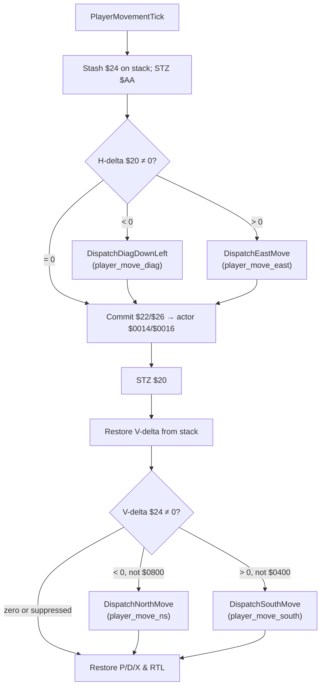

# Bank $02 — Player Movement Physics Engine

*Part of the [Bank $02 Documentation Suite](README.md)*

**Bank:** `$02` (FastROM; accessed via `$@` long calls from other banks)  
**Document scope:** Tile-collision-driven player movement physics — six ASM compilation units in the `player` scene that dispatch horizontal, vertical, diagonal, and ramp movement each frame.  
**ROM span:** `$02CFD0`–`$02E102` (4,402 bytes), immediately before `tile_collision.asm` at `$02E102`.

**Source:** [`player_move_main.asm`](../../../extracted/system/player/player_move_main.asm) · [`player_move_ns.asm`](../../../extracted/system/player/player_move_ns.asm) · [`player_move_south.asm`](../../../extracted/system/player/player_move_south.asm) · [`player_move_east.asm`](../../../extracted/system/player/player_move_east.asm) · [`player_move_ramps.asm`](../../../extracted/system/player/player_move_ramps.asm) · [`player_move_diag.asm`](../../../extracted/system/player/player_move_diag.asm)

This engine runs after input sampling and before actor animation updates. Each field-frame pass reads sub-pixel deltas from WRAM, probes the collision overlay at `$7FC000`, branches on tile type, optionally auto-aligns or snaps to grid boundaries, then commits or zeroes deltas via `tile_collision.ApplyMovementDeltas`.

**Related:** [`tile-collision.md`](tile-collision.md) · [`map-coordinates.md`](map-coordinates.md) · [`hardware-and-init.md`](hardware-and-init.md) · [`scene-script.md`](scene-script.md) · [`../bank00/direction-collision.md`](../bank00/direction-collision.md) · [`../../cop/README.md`](../../cop/README.md)

### Per-Frame Movement Tick

`PlayerMovementTick` runs a horizontal pass first (preserving V-delta on the stack), commits sub-pixel X/Y to the actor, then runs the vertical pass. Direction-suppression flags in `$AA` can skip the north or south dispatch after diagonal resolution.



## Block Layout Overview

```
$02CFD0 ┌─ PlayerMovementTick ─────────────────────────┐
        │  (gap: player_move_ns)                        │
$02D246 ├─ ComputeYSnapOffset … NudgeToUpperGrid       │  player_move_main
$02D038 ├─ DispatchNorthMove … ClearSpeedNS_2          │  player_move_ns
$02D376 ├─ DispatchSouthMove … FineAdjustXWest         │  player_move_south
$02D6DC ├─ DispatchEastMove … ClearSpeedEW_6           │  player_move_east
$02D843 ├─ EastRampDown … WestRedirectToSouth          │  player_move_ramps
$02DACD ├─ AutoAlignNS_East … ComputeEastSnapOffset     │  player_move_east (cont.)
$02DB80 ├─ DispatchDiagDownLeft … DiagClearReturnFlags  │  player_move_diag
$02E102 └─ tile_collision (see tile-collision.md) ──────┘
```

> `player_move_main` is split into two ROM segments with `player_move_ns` inserted between them. `player_move_east` is likewise split around `player_move_ramps`. All six units cross-reference via `?INCLUDE` and `$&` same-bank short calls.


## Movement Variable Reference

| Address | Size | Name / Role |
|---------|------|-------------|
| `$20` | 2 | **H-delta** — horizontal increment (sub-pixel ×4). Negative = west / down-left; positive = east / down-right. Cleared after EW pass. |
| `$22` | 2 | **Player X** — sub-pixel X (×4). Written to actor `$0014` each tick. |
| `$24` | 2 | **V-delta** — vertical increment (sub-pixel ×4). Negative = north / up; positive = south / down. Saved/restored across EW pass. |
| `$26` | 2 | **Player Y** — sub-pixel Y (×4). Written to actor `$0016` each tick. |
| `$1A` | 2 | **Probe X** — tile probe coordinate in pixel space. |
| `$1E` | 2 | **Probe Y** — tile probe coordinate in pixel space. |
| `$02` | 2 | **Snap offset scratch** — alignment correction for fine-adjust routines. |
| `$04` | 2 | **Approach direction scratch** — sub-tile offset from tile center for auto-align. |
| `$AA` | 2 | **Movement direction flags** — bit `$0040` = EW active; `$0400` suppresses north; `$0800` suppresses south. |
| `$AB` | 2 | **Approach / wall flags** — `$02` south nudge; `$04`/`$08` wall sub-variants; `$80` diagonal wall active. |
| `$09C6` | 2 | **Slope accumulator** — fractional Y for tiles `$03` / `$0C`. |
| `$09AE` | 2 | `player_flags` — bit `$0010` slope; bit `$1000` ramp. |
| `$09AF` | 1 | Player state — bit `$08` stair entry. |
| `$09B2` | 2 | `player_speed_ew` — cleared by `ClearSpeedEW_*`. |
| `$09B4` | 2 | `player_speed_ns` — cleared by `ClearSpeedNS_*`. |
| `$7FC000`+ | — | Runtime collision overlay (see [`tile-collision.md`](tile-collision.md)). |

Coordinates use **×4 sub-pixel scale**: `$22`/`$26` are shifted right twice before storing to actor `$0014`/`$0016`.


## Per-Frame Tick Order

`PlayerMovementTick` resolves movement in **two separated passes** so horizontal and vertical collision can interact without double-applying the same input. The **horizontal pass** runs first when `$20` (H-delta) is non-zero: negative H-delta calls `DispatchDiagDownLeft`; positive H-delta calls `DispatchEastMove`. During this pass V-delta (`$24`) is pushed to the stack and `$AA` (direction flags) is cleared, so vertical intent is preserved but not yet applied.

Between passes the engine **commits** sub-pixel position — `$22`/`$26` shifted right twice into actor `$0014`/`$0016` — and clears H-delta. The **vertical pass** then restores V-delta and calls `DispatchNorthMove` (negative `$24`) or `DispatchSouthMove` (positive `$24`) unless suppressed by `$AA`: bit `$0400` blocks the north path and bit `$0800` blocks the south path, set when the horizontal pass already resolved movement against a wall. This ordering exists so a player holding diagonal input can **slide along a wall**: X resolves first against the obstruction, the updated X position feeds the vertical probe, and the suppression flags prevent the same axis from being applied twice in one frame.


## 1. player_move_main.asm

| Address | Name | Description |
|---------|------|-------------|
| `$02CFD0` | PlayerMovementTick | Main entry point for per-frame player movement collision. |
| `$02D246` | ComputeYSnapOffset | Computes a negative Y snap offset from probe coordinate $1E and stores it in $02. |
| `$02D257` | DiagSnapCompute_Unused | Dead code — no callers in the extracted ROM. |
| `$02D2BF` | AutoAlignEW | Attempts horizontal auto-alignment when north-south movement is blocked. |
| `$02D33B` | NudgeToLowerGrid | Snaps the coordinate at $00,X toward the lower tile boundary. |
| `$02D354` | NudgeToUpperGrid | Snaps toward the upper tile boundary. |

#### Group A: Movement Dispatcher

### PlayerMovementTick

Main entry point for per-frame player movement collision. Saves processor state and sets direct page to `$0000`. Temporarily clears `$24` (V-delta) and `$AA` (direction flags), pushing the saved V-delta on the stack. Clears actor collision bit `$0004` at `$0010,X`.

The **horizontal pass** runs when `$20` (H-delta) is non-zero: negative values set `$AA` bit `$0040` and call `DispatchDiagDownLeft`; positive values set the same flag and call `DispatchEastMove`. After horizontal resolution, commits pixel X/Y to the actor structure (`$22`/`$26` >> 2 → `$0014`/`$0016`), then clears `$20`.

The **vertical pass** restores V-delta from the stack. Negative `$24` calls `DispatchNorthMove` unless `$AA` bit `$0800` is set; positive `$24` calls `DispatchSouthMove` unless `$AA` bit `$0400` is set. Restores registers and returns via `RTL`.

**Algorithm:**

| Step | Action |
|------|--------|
| 1 | Save P/D/X; `TCD #$0000`; stash `$24` on stack; `STZ $AA` |
| 2 | Clear actor bit `$0004` at `$0010,X` |
| 3 | If `$20` ≠ 0: set `$AA.$0040`; dispatch diag-down-left (neg) or east (pos) |
| 4 | Commit `$22`/`$26` to actor; `STZ $20` |
| 5 | Restore `$24`; if ≠ 0 and direction not suppressed, dispatch north (neg) or south (pos) |
| 6 | Restore X/D/P; `RTL` |

**Variables:**

| Location | Direction | Role |
|----------|-----------|------|
| `$20` | R/W | H-delta; cleared after horizontal pass |
| `$22` | R/W | Sub-pixel X; committed to actor |
| `$24` | R/W | V-delta; saved on stack during horizontal pass |
| `$26` | R/W | Sub-pixel Y; committed to actor |
| `$AA` | W | Direction flags; cleared at entry |
| `$0010,X` | R/W | Actor flags; collision bit cleared |
| `$0014,X` | W | Actor pixel X |
| `$0016,X` | W | Actor pixel Y |

**Cross-References:**

| Symbol | Relationship |
|--------|--------------|
| `DispatchDiagDownLeft` | Called when `$20 < 0` |
| `DispatchEastMove` | Called when `$20 > 0` |
| `DispatchNorthMove` | Called when `$24 < 0` (unless suppressed) |
| `DispatchSouthMove` | Called when `$24 > 0` (unless suppressed) |
| `player_move_controller` (bank `$00`) | Upstream; computes `$20`/`$24` from input |

### DiagSnapCompute_Unused

Dead code — no callers in the extracted ROM. Mirrors the combined X/Y snap offset logic used by active diagonal snap routines. Probes current TL; on wall `$06` or aligned down-cell `$09`, computes a combined offset in `$02` with V-delta parity correction, then adds the Y sub-tile component from `$1E`. Likely a development artifact superseded by `ComputeDiagSnapOffset`.

**Algorithm:**

| Step | Action |
|------|--------|
| 1 | Save `$1A`/`$1E`; probe current TL |
| 2 | If type `$06` or (X-aligned and down-cell `$09`): compute Y parity offset into `$02` |
| 3 | Add Y sub-tile snap: `$02 += negated($1E & $0F)` |
| 4 | Restore probe coords; `RTS` |

**Variables:**

| Location | Direction | Role |
|----------|-----------|------|
| `$1A` | R/W | Probe X (saved/restored) |
| `$1E` | R/W | Probe Y (saved/restored) |
| `$24` | R | V-delta for parity check |
| `$02` | W | Combined snap offset |

**Cross-References:**

| Symbol | Relationship |
|--------|--------------|
| `ComputeDiagSnapOffset` | Active equivalent |
| `ProbeCurrentTL` | Called for tile probe |

### AutoAlignEW

Attempts horizontal auto-alignment when north-south movement is blocked. Skips if `$AA` bit `$0040` (EW movement active) or dynamic collision high nibble is set at `$7FC000,X`. Computes X approach offset in `$04` from pixel position (`($22 >> 2) - 8) & $0F`. If offset ≥ 6, probes future TR; if passable (type < `$0E`, not `$06`), temporarily subtracts `$20` from X, nudges toward lower grid, restores. If offset < 9, probes future TL similarly with upper-grid nudge. Returns **carry clear** on success (movement continues), **carry set** on failure (snap path).

**Algorithm:**

| Step | Action |
|------|--------|
| 1 | Guard: skip if EW flag or dynamic collision |
| 2 | Compute X sub-tile offset → `$04` |
| 3 | If `$04` ≥ 6: probe future TR; if open, nudge X lower |
| 4 | Else if `$04` < 9: probe future TL; if open, nudge X upper |
| 5 | Return CLC (aligned) or SEC (blocked) |

**Variables:**

| Location | Direction | Role |
|----------|-----------|------|
| `$22` | R/W | Sub-pixel X (nudged via `$00,X`) |
| `$04` | W | X approach offset scratch |
| `$AA` | R | EW movement guard flag |
| `$7FC000,X` | R | Dynamic collision overlay |

**Cross-References:**

| Symbol | Relationship |
|--------|--------------|
| `DispatchNorthMove` | Caller (blocked path) |
| `NudgeToLowerGrid` / `NudgeToUpperGrid` | Called for alignment |
| `SnapYNorthCollision` | Fallback when SEC returned |

### NudgeToUpperGrid

Snaps toward the upper tile boundary. Subtracts 8 sub-pixels; on boundary cross, if sub-tile portion ≠ 0, rounds up to the next `$40` boundary (`AND #$FFC0` + `$40`).

**Algorithm:**

| Step | Action |
|------|--------|
| 1 | Subtract `$08` from `$00,X` |
| 2 | If boundary crossed and sub-tile ≠ 0: round up to next `$40` |
| 3 | `RTS` |

**Variables:**

| Location | Direction | Role |
|----------|-----------|------|
| `$00,X` | R/W | Target coord (`$22` or `$26` via LDX) |

**Cross-References:**

| Symbol | Relationship |
|--------|--------------|
| `AutoAlignEW` | Caller |
| `AutoAlignNS_East` / `AutoAlignNS_West` / `DiagAutoAlignNS` | Callers |


## 2. player_move_ns.asm

| Address | Name | Description |
|---------|------|-------------|
| `$02D038` | DispatchNorthMove | Northward movement dispatcher. |
| `$02D0BC` | SnapYNorthCollision | Y-axis snap for northward collision. |
| `$02D0D4` | NorthInteractTile | Handles tile type $02 (ladder/interact) when moving north. |
| `$02D0EE` | NorthSlopeRight | Tile $03 (slope-right) handler for northward movement. |
| `$02D122` | NorthSlopeLeft | Tile $0C (slope-left) north handler with $09C6 slope accumulator. |
| `$02D188` | SouthWallHandler | Tile $06 south wall handler. |
| `$02D1CE` | SouthWallNudge | Future TL $06 nudge variant. |
| `$02D1EC` | ClearSpeedNS_1 | Branch-range stub: STZ player_speed_ns → RTS. |
| `$02D1F2` | NorthWallHandler | Tile $09 north wall handler. |
| `$02D238` | NorthProbeRedirect | Probe right-cell then branch to north-wall slide path at loc_02D208. |
| `$02D240` | ClearSpeedNS_2 | Branch-range stub: STZ player_speed_ns → RTS. |

#### Group B: Northward Movement

### DispatchNorthMove

Northward movement dispatcher (V-delta < 0). Probes current TL for wall `$06`, slope-right `$03`, slope-left `$0C`. Probes current TR for north wall `$09` (redirects to `NorthWallHandler`). Probes future TL for solid types (`$0E+`, `$08`), interact `$02`, south-wall nudge `$06`. Sub-tile and down-cell cascades handle `$09` redirects via `NorthProbeRedirect`. Free path adds `$24` to `$26`. Blocked path sets collision flag, tries `AutoAlignEW`, then snaps Y or applies partial movement.

**Algorithm:**

| Step | Action |
|------|--------|
| 1 | Probe current TL → dispatch wall/slope handlers |
| 2 | Probe current TR → `$09` → `NorthWallHandler` |
| 3 | Probe future TL → solid/interact/nudge dispatch |
| 4 | Sub-tile X check + down-cell cascade for `$09`/`$06` |
| 5 | Free: `$26 += $24`; Blocked: align → snap or apply |

**Variables:**

| Location | Direction | Role |
|----------|-----------|------|
| `$24` | R/W | V-delta |
| `$26` | R/W | Sub-pixel Y |
| `$09B4` | W | `player_speed_ns` (cleared on snap) |

**Cross-References:**

| Symbol | Relationship |
|--------|--------------|
| `SouthWallHandler` / `NorthSlopeRight` / `NorthSlopeLeft` | TL-type dispatch |
| `NorthWallHandler` | TR `$09` redirect |
| `AutoAlignEW` | Blocked-path alignment |
| `SnapYNorthCollision` | Snap fallback |

### NorthSlopeRight

Tile `$03` (slope-right) handler for northward movement. Verifies TR cell is `$03`, checks Y sub-tile alignment and right-cell continuity. Computes Y correction from sub-tile position; if within slope threshold (`< $08`), applies movement freely. Otherwise sets `$09AF` bit `$10` and applies deltas.

**Algorithm:**

| Step | Action |
|------|--------|
| 1 | Probe TR; must be `$03` |
| 2 | Y alignment + right-cell `$03` check |
| 3 | Sub-tile distance < `$08` → free move |
| 4 | Else set slope flag → `ApplyMovementDeltas` |

**Variables:**

| Location | Direction | Role |
|----------|-----------|------|
| `$24` / `$26` | R | Sub-tile Y calculation |
| `$09AF` | W | Slope flag bit `$10` |

**Cross-References:**

| Symbol | Relationship |
|--------|--------------|
| `EastSlopeRight` | EW counterpart |
| `ApplyMovementDeltas` | Finalizer |

### NorthSlopeLeft

Tile `$0C` (slope-left) north handler with **`$09C6` slope accumulator**. When blocked on slope, accumulates V-delta, extracts whole sub-pixel steps (÷16), stores remainder, and adjusts `$24` for partial movement before applying deltas.

**Algorithm:**

| Step | Action |
|------|--------|
| 1 | Verify TR `$0C`; alignment + right-cell check |
| 2 | Free path or set slope flag |
| 3 | If `$09C6` ≥ 0: clear accumulator |
| 4 | `$09C6 += $24`; extract steps → `$24`; remainder → `$09C6` |
| 5 | `ApplyMovementDeltas` |

**Variables:**

| Location | Direction | Role |
|----------|-----------|------|
| `$09C6` | R/W | Slope accumulator |
| `$24` | R/W | Adjusted V-delta |
| `$09AF` | W | Slope flag |

**Cross-References:**

| Symbol | Relationship |
|--------|--------------|
| `EastSlopeLeft` | EW accumulator variant |
| `NorthSlopeRight` | Non-accumulator counterpart |

### SouthWallHandler

Handles northward movement encountering a south-facing wall tile (`$06`) at the player's top-left corner. When the player is not fully boxed in (bottom-right is not also `$06`), the routine looks for a gap below the wall lip: if cells down and to the right are walkable, the player **slides west** along the wall by computing a Y snap offset and calling `FineAdjustXWest`. If no gap exists, it first tries a diagonal X snap (`SnapXDiagCollision`) and re-probes; a still-blocked path zeroes vertical delta and hard-snaps Y southward instead.

**Algorithm:**

| Step | Action |
|------|--------|
| 1 | BR `$06` → `ClearMovementDeltas` |
| 2 | Future TL + Y align → slide or corner |
| 3 | Slide: down/right cells open → X snap |
| 4 | Corner: `ComputeYSnapOffset` → `FineAdjustXWest` |

**Variables:**

| Location | Direction | Role |
|----------|-----------|------|
| `$24` | W | Cleared on east snap |
| `$02` | W | Y snap offset |

**Cross-References:**

| Symbol | Relationship |
|--------|--------------|
| `SnapXDiagCollision` / `SnapXEastCollision` | Slide snaps |
| `ComputeYSnapOffset` / `FineAdjustXWest` | Corner path |

### SouthWallNudge

Future TL `$06` nudge variant. When `$AB.$02` set and X aligned, allows vertical-only movement. Otherwise probes down-cell and joins standard slide cascade.

### NorthWallHandler

Handles northward movement when a north-facing wall tile (`$09`) sits at the player's top-right corner. A matching `$09` at bottom-left means the player is sandwiched between north walls and movement is cancelled entirely. Otherwise the routine probes for open space above the wall (cells up and to the right); when a gap exists the player **slides east** along the north wall via `ComputeYSnapOffset` and `FineAdjustXEast`. Misaligned approaches fall back to `SnapXEastCollision`, and persistent blockage zeroes `$24` and snaps Y to the south tile boundary.

**Algorithm:**

| Step | Action |
|------|--------|
| 1 | BL `$09` → `ClearMovementDeltas` |
| 2 | Future TR + Y align → slide or corner |
| 3 | Slide: up/right open → X snap west/east |
| 4 | Corner: `ComputeYSnapOffset` → `FineAdjustXEast` |

**Variables:**

| Location | Direction | Role |
|----------|-----------|------|
| `$24` | W | Cleared on east snap |
| `$02` | W | Y snap offset |

**Cross-References:**

| Symbol | Relationship |
|--------|--------------|
| `DispatchNorthMove` | TR `$09` redirect |
| `FineAdjustXEast` | Corner resolution |

## 3. player_move_south.asm

| Address | Name | Description |
|---------|------|-------------|
| `$02D376` | DispatchSouthMove | Southward (+Y) movement dispatcher. |
| `$02D3EA` | SouthBlockedWall | Sets collision flag, tries `AutoAlignEW_South`, branches to Y snap on failure. |
| `$02D3F7` | SnapYSouthCollision | Y snap for south collision (aligns Y to current tile row). |
| `$02D40B` | SouthInteractTile | Tile `$02` south: X-aligned redirect to `LadderClimbNorth`, then blocked path. |
| `$02D425` | SouthStairsTile | Tile `$08` vine: verifies down-cell `$08`, sets stair flag, redirects to `ClimbVineEntry`, snaps Y. |
| `$02D44E` | SouthSlopeRight | Tile `$03` south slope: BR continuity, Y threshold `$08`, slope flag on block. |
| `$02D47F` | SouthSlopeLeft | Tile `$0C` south slope with `$09C6` accumulator (positive-direction variant). |
| `$02D4DA` | SouthWallNorthInteract | Tile `$09` moving south: double-wall, slide-down path, `ComputeSouthSnapOffset` → `FineAdjustXWest`. |
| `$02D524` | SouthWallNorthProbe | Down-cell probe redirect: solid → snap south; else → north slide path. |
| `$02D530` | ClearSpeedNS_3 | Branch-range stub: STZ `player_speed_ns` → RTS. |
| `$02D536` | SouthWallSouthInteract | Tile `$06` moving south: TL double-wall, slide-up path, `ComputeSouthSnapOffset` → `FineAdjustXEast`. |
| `$02D57C` | SouthSlideJumpShim | Single BRA to south-wall slide entry — branch-range shim. |
| `$02D57E` | ClearSpeedNS_4 | Branch-range stub: STZ `player_speed_ns` → RTS. |
| `$02D584` | AutoAlignEW_South | X auto-align when NS blocked (south variant). |
| `$02D5F9` | ComputeSouthSnapOffset | Computes south snap offset in `$02` from BL probe (`$09` or down-cell `$06`) with V-delta parity correction on `$1E` sub-tile. |
| `$02D655` | FineAdjustXEast | Fine X adjust after south wall snap (east edge). |
| `$02D69A` | FineAdjustXWest | Mirror of `FineAdjustXEast` with inverted distance metric for westward snap correction. |

#### Group B: Southward Movement

### DispatchSouthMove

Southward movement dispatcher for positive `$24` (downward on screen). Probes BL for north wall/slopes, BR for south wall, future BL for solids/interact/stairs. Sub-tile and down-cell cascades for north-wall slide. Free path adds `$24` to `$26`.

**Algorithm:**

| Step | Action |
|------|--------|
| 1 | Probe BL → wall/slope dispatch |
| 2 | Probe BR → `$06` → south wall interact |
| 3 | Probe future BL → type dispatch |
| 4 | Sub-tile + down-cell cascade |
| 5 | Free: `$26 += $24`; Blocked: align → snap |

**Variables:**

| Location | Direction | Role |
|----------|-----------|------|
| `$24` / `$26` | R/W | V-delta / sub-pixel Y |

**Cross-References:**

| Symbol | Relationship |
|--------|--------------|
| `SouthWallNorthInteract` / `SouthWallSouthInteract` | Wall handlers |
| `AutoAlignEW_South` | Blocked alignment |
| `PlayerMovementTick` | Entry when `$24 > 0` (unless suppressed) |

### SouthStairsTile

Triggered when southward movement reaches a vine/stairs tile (`$08`) at the destination bottom-left corner. If the player is not X-aligned on the tile, the handler verifies that the cell directly below is also `$08` (continuous vine column); otherwise the step is treated as a normal wall block. On success it sets `$09AF` bit `$08` (stair/vine flag), switches the player actor state to `ClimbVineEntry`, and snaps Y to the 64px grid before applying movement — handing control to the climb animation state machine.

### SouthSlopeRight

Handles southward entry onto a right-descending slope tile (`$03`) at the bottom-left corner. Both bottom corners must read `$03`, and the player must either be Y-aligned with a matching `$03` tile to the left or sit in the upper half of the tile (sub-tile Y offset `< $08`); otherwise the step is blocked as a wall collision. When the player is in the lower half without left-side continuity, `$09AF` bit `$10` (slope snap flag) is set so fractional slope physics can take over on the next frame.

**Cross-References:**

| Symbol | Relationship |
|--------|--------------|
| `NorthSlopeRight` | NS counterpart |

### SouthSlopeLeft

Handles southward movement on a left-descending slope tile (`$0C`), mirroring `SouthSlopeRight`'s corner and sub-tile checks but using the **`$09C6` fractional accumulator** for smooth descent. When the player enters the lower tile half, incoming V-delta (`$24`) is added to `$09C6`; whole sub-pixel steps (÷16) are extracted and applied as actual movement while the remainder stays in the accumulator across frames. This spreads steep downward motion across multiple frames instead of snapping the player to the slope surface in one step.

**Algorithm:**

| Step | Action |
|------|--------|
| 1 | Verify BR `$0C`; alignment checks |
| 2 | Accumulate `$24` → `$09C6`; extract steps |
| 3 | `ApplyMovementDeltas` |

**Variables:**

| Location | Direction | Role |
|----------|-----------|------|
| `$09C6` | R/W | Slope accumulator |

**Cross-References:**

| Symbol | Relationship |
|--------|--------------|
| `NorthSlopeLeft` | NS variant |

### SouthWallNorthInteract

Handles southward movement when the player stands on a north-facing wall tile (`$09`) at the bottom-left corner — the mirror of `NorthWallHandler` but for downward motion instead of upward. If top-right is also `$09` the player is fully walled and all deltas are cleared. When sub-tile Y is aligned with a continuing `$09` wall ahead, the routine probes for a gap below the wall lip; an open gap triggers **westward wall-slide** via `ComputeSouthSnapOffset` → `FineAdjustXWest`, while a closed gap tries diagonal X snap first and may fall back to hard Y snap south.

**Cross-References:**

| Symbol | Relationship |
|--------|--------------|
| `ComputeSouthSnapOffset` / `FineAdjustXWest` | Resolution chain |
| `SnapXDiagCollision` | Misaligned slide fallback |

### SouthWallSouthInteract

Handles southward movement when a south-facing wall tile (`$06`) is at the bottom-right corner. Enclosure between `$06` at both top-left and bottom-right stops all movement; otherwise the handler probes the future bottom-right cell for a continuing south wall with Y sub-tile alignment. When a gap exists above the wall lip (cells up and left are walkable), the player **slides east** along the south wall through `ComputeSouthSnapOffset` → `FineAdjustXEast`. Misaligned paths snap X eastward first (`SnapXEastCollision`); if still blocked, vertical delta is zeroed and Y snaps north to the tile ceiling.

**Cross-References:**

| Symbol | Relationship |
|--------|--------------|
| `FineAdjustXEast` | Corner resolution |
| `SnapXEastCollision` | Misaligned slide fallback |

### AutoAlignEW_South

X auto-align when south movement is blocked. Mirror of `AutoAlignEW` but probes `FutureBR`/`FutureBL` instead of `FutureTR`/`FutureTL`. Returns **carry clear** on successful nudge, **carry set** on failure.

**Algorithm:**

| Step | Action |
|------|--------|
| 1 | Guard: skip if EW flag or dynamic collision |
| 2 | Compute X sub-tile offset → `$04` |
| 3 | If `$04` ≥ 6: probe future BR; if open, nudge X lower |
| 4 | Else if `$04` < 9: probe future BL; if open, nudge X upper |
| 5 | Return CLC (aligned) or SEC (blocked) |

**Cross-References:**

| Symbol | Relationship |
|--------|--------------|
| `AutoAlignEW` | Axis/direction mirror |
| `SouthBlockedWall` | Caller |
| `NudgeToLowerGrid` / `NudgeToUpperGrid` | Nudge calls |

### ComputeSouthSnapOffset

Computes the sub-pixel **snap correction** stored in `$02` for southward wall-sliding. When the current bottom-left is a north wall (`$09`) or a south wall (`$06`) with X right-half alignment, the routine predicts whether this frame's V-delta will cross a 16px sub-tile Y boundary and adds `$10` to `$02` if so. The final offset combines that boundary-crossing term with the probe Y sub-tile position (`$1E & $0F`), giving `FineAdjustXEast`/`FineAdjustXWest` the distance needed to align the player flush against the wall edge.

**Variables:**

| Location | Direction | Role |
|----------|-----------|------|
| `$02` | W | Output offset |
| `$1E` | R | Probe Y sub-tile |
| `$24` | R | V-delta for parity |

**Cross-References:**

| Symbol | Relationship |
|--------|--------------|
| `FineAdjustXEast` / `FineAdjustXWest` | Consumers |
| `SouthWallNorthInteract` / `SouthWallSouthInteract` | Callers |

### FineAdjustXEast

Fine X adjust after south wall snap (east edge). If pixel distance + `$02` ≥ `$11`, snaps `$22` to grid-aligned sub-pixel position.

**Cross-References:**

| Symbol | Relationship |
|--------|--------------|
| `SouthWallSouthInteract` | Primary caller |

### FineAdjustXWest

Precision X correction after a north-wall slide during southward movement — the west-edge counterpart to `FineAdjustXEast`. Instead of measuring distance from the east edge of the tile, it inverts the sub-tile X offset (distance from the **west** edge) and adds the snap correction from `$02`. If the combined distance is under 17 sub-pixels, movement applies without grid snap; otherwise `$22` is rewritten to snap the player to the previous tile column's west boundary, preventing the sprite from visually clipping through the wall corner.

**Cross-References:**

| Symbol | Relationship |
|--------|--------------|
| `SouthWallNorthInteract` | Primary caller |


## 4. player_move_east.asm

| Address | Name | Description |
|---------|------|-------------|
| `$02D6DC` | DispatchEastMove | Eastward (+X) movement dispatcher. |
| `$02D760` | SnapXEastCollision | X-axis snap to 64px grid after east collision. |
| `$02D78C` | EastLadderTile | Tile `$07` east: Y-aligned redirect to `ShimmyRightEntry`. |
| `$02D799` | EastWallNorthDiag | Diagonal entry; falls through to `EastWallNorthHandler`. |
| `$02D79B` | EastWallNorthHandler | Tile `$09` moving east: slide path → `ComputeEastSnapOffset` + `DiagPushRight`. |
| `$02D7E1` | EastWallNorthFlag | Sets `$AB.$04`, joins north-wall adjacency chain. |
| `$02D7E7` | ClearSpeedEW_5 | Branch-range stub: STZ `player_speed_ew` → RTS. |
| `$02D7ED` | EastWallSouthDiag | Diagonal entry; falls through to `EastWallSouthHandler`. |
| `$02D7EF` | EastWallSouthHandler | Tile `$06` moving east: slide path → `ComputeEastSnapOffset` + `DiagPushLeft`. |
| `$02D81B` | EastWallSouthFlag | Sets `$AB.$08`, joins south-wall adjacency chain. |
| `$02D83D` | ClearSpeedEW_6 | Branch-range stub: STZ `player_speed_ew` → RTS. |
| `$02DACD` | AutoAlignNS_East | Y auto-align when EW blocked (east). |
| `$02DB22` | ComputeEastSnapOffset | Computes east snap offset in `$02` from TR probe with EW-delta parity correction. |

#### Group E: Eastward Movement

### DispatchEastMove

Eastward movement dispatcher for positive `$20`. **`ProbeLeftTiles`** first for ramp detection → `player_move_ramps.WestRampUp`/`EastRampDown`. Probes TR/BR/future TR for walls; BL for ramp-up edges (`$05`/`$0A`). Free path adds `$20` to `$22`; blocked path tries `AutoAlignNS_East` → `SnapXEastCollision`.

**Algorithm:**

| Step | Action |
|------|--------|
| 1 | `ProbeLeftTiles` → ramp down dispatch |
| 2 | Probe TR/BR → wall handlers |
| 3 | Probe future TR → type dispatch |
| 4 | Sub-tile + down-cell cascade |
| 5 | BL ramp-up or free: `$22 += $20`; Blocked: align → snap |

**Variables:**

| Location | Direction | Role |
|----------|-----------|------|
| `$20` / `$22` | R/W | H-delta / sub-pixel X |

**Cross-References:**

| Symbol | Relationship |
|--------|--------------|
| `ProbeLeftTiles` | Ramp pre-detection |
| `EastRampDown` / `WestRampUp` | Ramp entry (`player_move_ramps`) |
| `EastWallNorthHandler` / `EastWallSouthHandler` | Wall handlers |
| `AutoAlignNS_East` | Blocked alignment |

### EastWallNorthHandler

Tile `$09` moving east. Sets `$AB.$80`; probes future TR with X alignment; gap chain via `MapCellDown`/`MapCellLeft`. Resolves via `ComputeEastSnapOffset` → `DiagPushRight`.

**Cross-References:**

| Symbol | Relationship |
|--------|--------------|
| `ComputeEastSnapOffset` / `DiagPushRight` | Resolution chain |
| `EastRedirectToNorth` | Ramp fallback entry |

### EastWallSouthHandler

Tile `$06` moving east. Sets `$AB.$80`; probes future BR; gap chain via `MapCellUp`/`MapCellLeft`. Resolves via `ComputeEastSnapOffset` → `DiagPushLeft`.

**Cross-References:**

| Symbol | Relationship |
|--------|--------------|
| `ComputeEastSnapOffset` / `DiagPushLeft` | Resolution chain |
| `WestRedirectToSouth` | Ramp fallback entry |

### AutoAlignNS_East

Y auto-align when east movement is blocked. Stack re-entrancy guard via `$06,S`; Y sub-tile offset probes future BR/TR; nudges `$26` via grid helpers.

**Algorithm:**

| Step | Action |
|------|--------|
| 1 | Guard stack `$06,S` + dynamic collision |
| 2 | Y offset in `$04`; probe future BR/TR |
| 3 | Nudge `$26` lower/upper grid |
| 4 | CLC/SEC return |

**Cross-References:**

| Symbol | Relationship |
|--------|--------------|
| `AutoAlignEW` | Axis mirror |
| `NudgeToLowerGrid` / `NudgeToUpperGrid` | Nudge calls |

### ComputeEastSnapOffset

Computes the sub-pixel **snap correction** in `$02` for eastward wall-sliding, analogous to `ComputeSouthSnapOffset` but operating on the X axis. When the current top-right is a north wall (`$09`) or a south wall (`$06`) with Y right-half alignment, it checks whether this frame's H-delta (`$20`) will cross a 16px sub-tile X boundary and adds `$10` to `$02` on crossing. The probe X sub-tile (`$1A & $0F`) is then added to produce the total offset consumed by `DiagPushLeft`/`DiagPushRight` after east-movement wall collisions.

**Variables:**

| Location | Direction | Role |
|----------|-----------|------|
| `$02` | W | Output offset |
| `$1A` | R | Probe X sub-tile |
| `$20` | R | H-delta for parity |

**Cross-References:**

| Symbol | Relationship |
|--------|--------------|
| `DiagPushLeft` / `DiagPushRight` | Consumers |
| `EastWallNorthHandler` / `EastWallSouthHandler` | Callers |


## 5. player_move_ramps.asm

| Address | Name | Description |
|---------|------|-------------|
| `$02D843` | EastRampDown | Descend east-facing slope `$0A` while moving east. |
| `$02D93F` | EastRampUp | Ascend east-facing slope `$0A` while moving east. |
| `$02D978` | EastRedirectToNorth | Ramp fallback: future TR `$09` → `EastWallNorthDiag` or free move. |
| `$02D986` | WestRampUp | Descend west-facing slope `$05` while moving east. |
| `$02DA8A` | WestRampDown | Ascend west-facing slope `$05` while moving east. |
| `$02DABF` | WestRedirectToSouth | Ramp fallback: future BR `$06` → `EastWallSouthDiag` or free move. |

#### Group F: East-Facing Ramps (`$0A`)

### EastRampDown

Descend an east-facing slope (`$0A`) while moving east. Multi-probe sequence at TR and offset positions; **`CheckTileBoundaryXor`** gates fractional Y displacement from X sub-tile position. Sets **`$09AE.$1000`**. Post-slope wall check at future TR/BR with corner snap fallback.

**Algorithm:**

| Step | Action |
|------|--------|
| 1 | `DiagClearReturnFlags`; multi-probe for `$0A` |
| 2 | Boundary XOR gate; Y from X sub-tile (×4 + half-pixel bias) |
| 3 | Set ramp flag; probe future TR/BR |
| 4 | Passable → apply; blocked → single-axis or full corner snap |

**Variables:**

| Location | Direction | Role |
|----------|-----------|------|
| `$1A` | R/W | Probe X (offset adjusted) |
| `$26` | W | Y adjusted for ramp |
| `$09AE` | W | Ramp flag `$1000` |

**Cross-References:**

| Symbol | Relationship |
|--------|--------------|
| `EastRedirectToNorth` | Fallback when no slope found |
| `DispatchEastMove` | Entry via `ProbeLeftTiles` |
| `code_02D92F` / `code_02D937` | Partial wall snap helpers |

### EastRampUp

Ascend east-facing slope `$0A` while moving east. Probes raised `$1A+8` for `$0A`; boundary cross computes inverted `$24` from X sub-tile; joins `code_02D8CE` finalize shared with `EastRampDown`.

**Cross-References:**

| Symbol | Relationship |
|--------|--------------|
| `EastRampDown` | Shared finalize path |
| `DispatchEastMove` | BL `$0A` ramp-up entry |

### WestRampUp

Descend west-facing slope `$05` while moving east. Mirror of `EastRampDown` with negated Y math and `$05` probes. Multi-probe through BL/adjacent cells; half-pixel rounding subtracts `$0004`.

**Algorithm:**

| Step | Action |
|------|--------|
| 1 | Multi-probe for `$05` at offset positions |
| 2 | Boundary XOR; negated Y from X sub-tile |
| 3 | Ramp flag; future corner probes |
| 4 | Apply or corner snap via `code_02DA7A`/`code_02DA82` |

**Variables:**

| Location | Direction | Role |
|----------|-----------|------|
| `$26` | W | Y displacement (negated ramp math) |
| `$09AE` | W | Ramp flag |

**Cross-References:**

| Symbol | Relationship |
|--------|--------------|
| `WestRedirectToSouth` | Fallback |
| `DispatchEastMove` | Entry via `ProbeLeftTiles` (carry set) |

### WestRampDown

Ascend west-facing slope `$05` while moving east. Probes `$1A+8` for `$05`; boundary cross stores positive `$24` ramp fraction; joins `code_02DA19` finalize.

**Cross-References:**

| Symbol | Relationship |
|--------|--------------|
| `WestRampUp` | Shared finalize |
| `DispatchEastMove` | BL `$05` ramp-up entry |

## 6. player_move_diag.asm

| Address | Name | Description |
|---------|------|-------------|
| `$02DB80` | DispatchDiagDownLeft | Down-left dispatcher. |
| `$02DC10` | SnapXDiagCollision | X snap for down-left diagonal. |
| `$02DC2C` | DiagLadderTile | Tile $07 down-left: Y-aligned redirect to ShimmyLeftEntry. |
| `$02DC49` | DiagWallSouthFromDL | Tile $06 from down-left. |
| `$02DC9D` | DiagWallNorthFromDL | Tile $09 from down-left. |
| `$02DCF3` | DiagRampUpLeft | Complex up-left slope ramp. |
| `$02DE02` | DiagRampEdgeUL | Up-left ramp edge case. |
| `$02DE43` | DiagRedirectToSouth | Ramp fallback: future TL $06 → DiagWallSouthFromDL or free move. |
| `$02DE51` | DiagRampDownRight | Mirror of DiagRampUpLeft. |
| `$02DF5C` | DiagRampEdgeDR | Down-right ramp edge case. |
| `$02DF99` | DiagRedirectToNorth | Ramp fallback: future BL $09 → DiagWallNorthFromDL or free move. |
| `$02DFA7` | DiagAutoAlignNS | NS nudge when EW blocked (diagonal). |
| `$02DFF6` | ComputeDiagSnapOffset | EW snap for diagonal. |
| `$02E060` | DiagPushLeft | Left-push realignment after diagonal collision. |
| `$02E0AB` | DiagPushRight | Right-push realignment. |
| `$02E0FA` | DiagClearReturnFlags | Clears stack frame flag $05,S used by ramp handlers before actor state redirect. |

#### Group G: Down-Left Diagonal

### DispatchDiagDownLeft

Down-left dispatcher. Sets `$AB.$02`. **`ProbeRightTiles`** first for ramp → `DiagRampDownRight`/`DiagRampUpLeft`. Corner probes for walls, future TL, sub-tile cascades. `$07` ladder; TR `$05`/`$0A` ramp edges. Free: `$22 += $20`. Blocked: `DiagAutoAlignNS` → snap.

**Algorithm:**

| Step | Action |
|------|--------|
| 1 | `$AB.$02`; `ProbeRightTiles` → ramp dispatch |
| 2 | Probe TL/BL → wall handlers |
| 3 | Probe future TL → type dispatch |
| 4 | Sub-tile + right-cell cascade |
| 5 | Free or align → snap |

**Variables:**

| Location | Direction | Role |
|----------|-----------|------|
| `$20` / `$22` | R/W | H-delta / sub-pixel X |
| `$AB` | W | Nudge flag set |

**Cross-References:**

| Symbol | Relationship |
|--------|--------------|
| `ProbeRightTiles` | Ramp pre-detection |
| `PlayerMovementTick` | Entry when `$20 < 0` |

### DiagWallSouthFromDL

Tile `$06` from down-left. Sets `$AB.$80`; future TL probe; right/down cell cascade. Resolves via `ComputeDiagSnapOffset` → `DiagPushRight`.

**Cross-References:**

| Symbol | Relationship |
|--------|--------------|
| `ComputeDiagSnapOffset` / `DiagPushRight` | Resolution |
| `DiagRedirectToSouth` | Entry redirect |

### DiagWallNorthFromDL

Tile `$09` from down-left. Sets `$AB.$80`; future BL probe; left/down cell cascade. Resolves via `ComputeDiagSnapOffset` → `DiagPushLeft`.

**Cross-References:**

| Symbol | Relationship |
|--------|--------------|
| `DiagPushLeft` / `ComputeDiagSnapOffset` | Resolution |
| `DiagRedirectToNorth` | Entry redirect |

#### Group H: Up-Left / Remaining Diagonals

### DiagRampUpLeft

Complex up-left slope ramp. Multi-probe for tile `$05`; `CheckTileBoundaryXor` gate; sub-pixel Y correction with carry-adjusted `$26`; sets `$1000` ramp flag; boundary collision snap fallback.

**Algorithm:**

| Step | Action |
|------|--------|
| 1 | Multi-probe `$05` at offset positions |
| 2 | Boundary XOR; inverted Y from X sub-tile |
| 3 | Set ramp flag; probe future TL/BL |
| 4 | Apply or hard boundary snap |

**Variables:**

| Location | Direction | Role |
|----------|-----------|------|
| `$1A` | R/W | Probe X |
| `$26` | W | Y correction |
| `$09AE` | W | Ramp flag |

**Cross-References:**

| Symbol | Relationship |
|--------|--------------|
| `DiagRampDownRight` | Mirror ramp |
| `ProbeRightTiles` | Entry path |

### DiagRampEdgeUL

Up-left ramp edge case. Offset probe at `$1A-$09`; tile `$05` boundary check; computes `$24` from X sub-tile for partial ramp entry.

**Cross-References:**

| Symbol | Relationship |
|--------|--------------|
| `DiagRampUpLeft` | Shared finalize |
| `DispatchDiagDownLeft` | TR `$05` entry |

### DiagRampDownRight

Descends an **east-facing ramp tile** (`$0A`) during down-right diagonal movement — the `$0A` counterpart to `DiagRampUpLeft`'s west-facing `$05` handler. A multi-probe search checks the current bottom-left, cell above, future top-left, and cell below for `$0A`; when found, `CheckTileBoundaryXor` gates whether fractional Y displacement is computed from the X sub-tile position (proportional descent) or a full-tile `$26 += $20` step applies. Sets `$09AE` bit `$1000` (ramp flag) and runs a post-slope wall check at future corners, falling back to single-axis Y snap or dual-wall corner snap if blocked.

**Cross-References:**

| Symbol | Relationship |
|--------|--------------|
| `DiagRampUpLeft` | Mirror counterpart |

### DiagRampEdgeDR

Handles the **partial-entry edge case** for east-facing ramp tiles (`$0A`) during diagonal movement — entered when the current top-right reads `$0A` at the tile boundary rather than a full ramp cell. Probes at Y−9px to confirm the ramp surface; if `CheckTileBoundaryXor` shows no X sub-column crossing, it delegates to the full-tile ramp path (`code_02DEE4`). Otherwise it computes a proportional Y offset from X velocity, stores it as residual V-delta in `$24`, and joins the shared post-ramp wall-check finalize at `code_02DEEB`.

**Cross-References:**

| Symbol | Relationship |
|--------|--------------|
| `DiagRampDownRight` | Shared finalize |
| `DiagRampEdgeUL` | Mirror edge handler |

#### Group I: Diagonal Auto-Align & Fine Adjust

### DiagAutoAlignNS

NS nudge when EW blocked (diagonal). Stack re-entrancy guard; Y sub-tile probes future BL/TL; nudges `$26` via grid helpers.

**Algorithm:**

| Step | Action |
|------|--------|
| 1 | Guard stack `$06,S` + dynamic collision |
| 2 | Y offset; probe future BL/TL |
| 3 | Nudge `$26` lower/upper |
| 4 | CLC/SEC return |

**Cross-References:**

| Symbol | Relationship |
|--------|--------------|
| `AutoAlignNS_West` | Mirror variant |
| `DispatchDiagDownLeft` | Caller |

### ComputeDiagSnapOffset

EW snap for diagonal. Probes current TL; on `$09` or aligned right-cell `$06`, computes inverted X sub-tile offset with H-delta parity into `$02`.

**Variables:**

| Location | Direction | Role |
|----------|-----------|------|
| `$02` | W | Snap offset |
| `$1A` | R | Probe X sub-tile |
| `$20` | R | H-delta parity |

**Cross-References:**

| Symbol | Relationship |
|--------|--------------|
| `DiagPushLeft` / `DiagPushRight` | Consumers |
| `DiagWallSouthFromDL` / `DiagWallNorthFromDL` | Callers |

### DiagPushLeft

Left-push realignment after diagonal collision. Y sub-tile distance + `$02`; may set `$24` for residual vertical slide or clear `$20`/`$AA` flags when stack guard matches.

**Algorithm:**

| Step | Action |
|------|--------|
| 1 | Y distance + `$02`; if < `$11` → apply |
| 2 | Check stack `$03,S` vs H-delta magnitude |
| 3 | Match: clear stack + `$20`; else set `$24` slide |

**Variables:**

| Location | Direction | Role |
|----------|-----------|------|
| `$24` | W | Residual V-delta |
| `$20` / `$AA` | W | Cleared on flag truncate |
| `$03,S` | R/W | Stack guard byte |

**Cross-References:**

| Symbol | Relationship |
|--------|--------------|
| `DiagPushRight` | Mirror push |
| `WestWallSouthDiag` / `DiagWallNorthFromDL` | Callers |

### DiagPushRight

Applies **rightward push realignment** after a diagonal collision against a north wall — the positive-X counterpart to `DiagPushLeft`. It derives a push distance from the inverted Y sub-tile position plus the snap offset in `$02`; if the total exceeds 16 sub-pixels, the excess becomes a positive V-delta in `$24` (residual vertical slide along the wall). When the push would overshoot past the caller's return threshold (comparing `|$20|` against the stack guard at `$03,S`), it zeroes H-delta and clears `$AA` bits `$0440` (north-wall collision flags) instead of applying the slide.

**Cross-References:**

| Symbol | Relationship |
|--------|--------------|
| `DiagPushLeft` | Mirror counterpart |
| `WestWallNorthDiag` / `DiagWallSouthFromDL` | Callers |

## Collision Cascade Pattern

Nearly every movement handler follows the same multi-stage pipeline:

```
1. PROBE     — Read collision type at current and/or future tile corners
               (ProbeCurrent*, ProbeFuture*, or map_coords.Probe*Tiles for ramps)

2. DISPATCH  — Compare type in A against known values; JMP to specialized handler
               ($02 interact, $03/$0C slope, $06 south wall, $07 ladder,
                $08 stairs, $09 north wall, $0A/$05 ramp, $0E+ solid)

3. ADJACENT  — For wall/slope types: probe neighboring cells via MapCell*
               and ReadCollisionNibble to detect slide paths or diagonal redirects

4. RESOLVE   — Either:
               a) Apply deltas freely (ApplyMovementDeltas)
               b) Auto-align (AutoAlignEW / AutoAlignNS_* / DiagAutoAlignNS)
               c) Snap to grid boundary (SnapX* / SnapY* collision)
               d) Compute sub-pixel correction (slope accumulator, ramp Y math)
               e) Redirect to alternate actor state (ladder, stairs, shimmy)

5. FINALIZE  — SetActorCollisionFlag on block; zero speed vars; commit or discard deltas
```

**Auto-align** routines attempt a small positional nudge (±8 sub-pixels, aligned to `$40` tile boundaries via `NudgeToLowerGrid` / `NudgeToUpperGrid`) before hard-snapping. They return **carry clear** if nudge succeeded, **carry set** if blocked.

**Snap collision** routines align the blocked axis to the next tile boundary (`AND #$FFC0` + boundary offset), zero the corresponding delta, and clear `player_speed_*`.


## Key Patterns

### Repeated Code: `ClearSpeed*` Stubs

Six identical **2-instruction + RTS** stubs exist because 65816 conditional branches have limited range:

| Label | File | Clears |
|-------|------|--------|
| `ClearSpeedNS_1` | `player_move_ns` | `player_speed_ns` |
| `ClearSpeedNS_2` | `player_move_ns` | `player_speed_ns` |
| `ClearSpeedNS_3` | `player_move_south` | `player_speed_ns` |
| `ClearSpeedNS_4` | `player_move_south` | `player_speed_ns` |
| `ClearSpeedEW_5` | `player_move_east` | `player_speed_ew` |
| `ClearSpeedEW_6` | `player_move_east` | `player_speed_ew` |

Each stub: `REP #$20` → `STZ player_speed_*` → `RTS`.

### Slope Accumulator (`$09C6`)

Tiles **`$03`** (slope-right) and **`$0C`** (slope-left) use `$09C6` for fractional vertical displacement:

1. On blocked slope path, set `$09AF` bit `$10`.
2. If accumulator sign mismatches movement direction, clear it.
3. Add `$24` (V-delta) to accumulator.
4. Extract whole sub-pixel steps (shift right ×4); apply remainder back.
5. Adjust `$24` for partial step; fall through to `ApplyMovementDeltas`.

South/east handlers use inverted arithmetic compared to north/west variants.

### Unused Code

`DiagSnapCompute_Unused` (104 bytes at `$02D257`) has no callers in the extracted ROM.


## Cross-File Call Graph

```mermaid
flowchart TD
    PMT[PlayerMovementTick<br/>player_move_main]

    PMT -->|"$20 < 0"| DDL[DispatchDiagDownLeft<br/>player_move_diag]
    PMT -->|"$20 > 0"| DEM[DispatchEastMove<br/>player_move_east]
    PMT -->|"$24 < 0"| DNM[DispatchNorthMove<br/>player_move_ns]
    PMT -->|"$24 > 0"| DSM[DispatchSouthMove<br/>player_move_south]

    subgraph ns["player_move_ns"]
        DNM --> SWH[SouthWallHandler]
        DNM --> NSH[NorthWallHandler]
        SWH --> SDC[SnapXDiagCollision]
        SWH --> SXC[SnapXEastCollision]
        SWH --> CYS[ComputeYSnapOffset]
        SWH --> FAW[FineAdjustXWest]
        NSH --> SXW[SnapXWestCollision]
        NSH --> SXC
        NSH --> FAE[FineAdjustXEast]
    end

    subgraph ew["player_move_east + player_move_ramps"]
        DEM --> WRD[WestRampDown/Up]
        DEM --> ERD[EastRampDown/Up]
        DEM --> WWD[WestWallNorth/SouthDiag]
        DEM --> EWN[EastWallNorthInteract]
        DEM --> EWS[EastWallSouthInteract]
        DEM --> AAW[AutoAlignNS_West]
        DEM --> AAE[AutoAlignNS_East]
        AAW --> NTG[NudgeToLower/UpperGrid]
        AAE --> NTG
        WWD --> DPL[DiagPushLeft/Right]
        WWD --> CWS[ComputeWestSnapOffset]
    end

    subgraph diag["player_move_diag"]
        DDL --> DRU[DiagRampUpLeft/DownRight]
        DDL --> DWD[DiagWallSouth/NorthFromDL]
        DWD --> CDS[ComputeDiagSnapOffset]
        DWD --> DPL
    end

    subgraph main["player_move_main"]
        CYS
        NTG
        AAEW[AutoAlignEW]
    end

    subgraph tc["tile_collision"]
        AMD[ApplyMovementDeltas]
        PROBE[Probe*/MapCell*/ReadCollisionNibble]
    end

    DNM --> AAEW
    DNM --> AMD
    DSM --> AMD
    DEM --> AMD
    DDL --> AMD
    SWH --> PROBE
    DEM --> PROBE
    DDL --> PROBE

    subgraph mc["map_coords"]
        PRT[ProbeRightTiles]
        PLT[ProbeLeftTiles]
    end

    DDL --> PRT
    DEM --> PLT
```



### Key Cross-File Dependencies

| Caller | Callee | Purpose |
|--------|---------|---------|
| `PlayerMovementTick` | Four dispatchers | Top-level axis dispatch |
| `DispatchNorthMove` | `AutoAlignEW`, `ComputeYSnapOffset` | NS → main alignment |
| `SouthWallHandler` | `SnapXDiagCollision`, `FineAdjustXWest` | NS → diag/ew snap chain |
| `NorthWallHandler` | `SnapXWestCollision`, `FineAdjustXEast` | NS → ew snap chain |
| `DispatchEastMove` | `AutoAlignNS_East`/`West`, `DiagPushLeft/Right`, nudge helpers | EW → main/diag |
| `DispatchSouthMove` | `AutoAlignEW_South` | NS → main alignment |
| `DispatchDiagDownLeft` | `DiagAutoAlignNS`, snap routines | Diag → main/ns/ew |
| All dispatchers | `tile_collision.*` | Probe, navigate, finalize |
| `DispatchEastMove`, `DispatchDiagDownLeft` | `map_coords.ProbeLeft/RightTiles` | Ramp pre-detection |


## See Also

- [`tile-collision.md`](tile-collision.md) — probe geometry, collision type table, `$7FC000` overlay
- [`map-coordinates.md`](map-coordinates.md) — diagonal cascade probes (`ProbeRightTiles` / `ProbeLeftTiles`)
- [`../bank00/direction-collision.md`](../bank00/direction-collision.md) — COP-driven dynamic collision (`$F0` high nibble)
- [`../bank00/data-tables-memory.md`](../bank00/data-tables-memory.md) — `$09AA`–`$09B6` player state WRAM map
