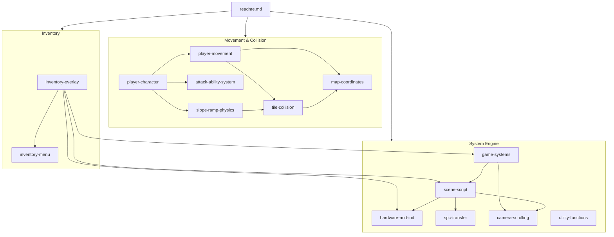

# Bank 02 — Complete Code Analysis Index

> Comprehensive reference for all code and data in IOG's ROM bank `$02`
> (`$028000`–`$02FFFF`), spanning the system engine, player character,
> movement physics, inventory system, and utility functions.

---

## 1. Bank Overview

Bank `$02` is the game's primary **gameplay code bank**, containing:

- The **system engine** — hardware abstraction, scene loading, graphics/music transfer, camera, and map interaction
- The **player character** — a modular five-actor architecture managing movement, attacks, abilities, and visual effects
- The **movement physics engine** — directional collision handling with slope/ramp support and tile probing
- The **inventory menu** — a full-screen overlay with 4 tabs and 16-slot item management
- **Utility functions** — dialogue display and VRAM buffer operations

| Metric | Value |
|--------|-------|
| **Bank range** | `$028000`–`$02FFFF` (32,768 bytes) |
| **Mapped code/data** | `$028000`–`$02F08C` (~28,812 bytes) |
| **Free space** | `$02F08C`–`$02FFFF` (~3,956 bytes) |
| **Named addresses** | 477 |
| **ASM files** | 29 |
| **blocks.json blocks** | 29 |
| **Compilation units** | 3 (system_core, player_character, inventory_menu) |

---

## 2. Memory Map

```
$028000 ┌───────────────────────────────────────────────────┐
        │ hardware_math          [MulDivide]                │  59 B
$02803B ├───────────────────────────────────────────────────┤
        │ vblank_joypad          [VBlankWaitAndJoypad]      │ 406 B
$0281D1 ├───────────────────────────────────────────────────┤
        │ hardware_math          [SignedMultiply + extras]   │ 159 B
$028270 ├───────────────────────────────────────────────────┤
        │ QuintetLzDecompress     [QuintetLzDecompress]       │ 306 B
$0283A2 ├───────────────────────────────────────────────────┤
        │ scene_script (part 1)  [SceneScriptMain + cmds]   │ 1,995 B
$028B6D ├ ─ ─ ─ ─ ─ ─ ─ ─ ─ ─ ─ ─ ─ ─ ─ ─ ─ ─ ─ ─ ─ ─ ─┤
        │ spc_transfer (part 1)  [SpcMusicLoadCmd]          │ 119 B
$028BE4 ├ ─ ─ ─ ─ ─ ─ ─ ─ ─ ─ ─ ─ ─ ─ ─ ─ ─ ─ ─ ─ ─ ─ ─┤
        │ scene_script (part 2)  [LoadSpriteTiles + helpers] │ 674 B
$02908E ├ ─ ─ ─ ─ ─ ─ ─ ─ ─ ─ ─ ─ ─ ─ ─ ─ ─ ─ ─ ─ ─ ─ ─┤
        │ spc_transfer (part 2)  [SpcBlockTransfer + binary] │ 3,412 B
$029DE2 ├───────────────────────────────────────────────────┤
        │ system_init            [InitSystemVariables]       │ 606 B
$02A040 ├───────────────────────────────────────────────────┤
        │ music_actors           [MusicPlaybackActor]        │ 219 B
$02A11B ├───────────────────────────────────────────────────┤
        │ DisplaySceneTitle      [DisplaySceneTitle]          │ 206 B
$02A1E9 ├───────────────────────────────────────────────────┤
        │ event_blocks           [ApplyAllEventBlocks]       │ 1,012 B
$02A5DD ├───────────────────────────────────────────────────┤
        │ warps_interaction      [CheckWarpAndChest]         │ 1,453 B
$02AB8A ├───────────────────────────────────────────────────┤
        │ camera_tilemap         [CameraFullRefresh]         │ 1,305 B
$02B0A3 ├───────────────────────────────────────────────────┤
        │ map_coords             [TileCoordsToMapIndex]      │ 363 B
$02B20E ├═══════════════════════════════════════════════════┤
        │ shadow_shimmer     [ShadowShimmerInit]      │ 144 B
$02B29E ├───────────────────────────────────────────────────┤
        │ player_move_controller [PlayerMoveController]      │ 397 B
$02B42B ├───────────────────────────────────────────────────┤
        │ slope_ramp_physics     [SlopePhysicsEntry]         │ 904 B
$02B7B3 ├───────────────────────────────────────────────────┤
        │ attack_ability_system  [AttackSystemEntry] (pt 1)  │ 1,603 B
$02BDF6 ├ ─ ─ ─ ─ ─ ─ ─ ─ ─ ─ ─ ─ ─ ─ ─ ─ ─ ─ ─ ─ ─ ─ ─┤
        │ attack_ability_system  [TrailFollowerSprA] (pt 2)  │ 170 B
$02BEA0 ├ ─ ─ ─ ─ ─ ─ ─ ─ ─ ─ ─ ─ ─ ─ ─ ─ ─ ─ ─ ─ ─ ─ ─┤
        │ attack_ability_system  [PsychoDashMain] (pt 3)     │ 1,260 B
$02C38C ├───────────────────────────────────────────────────┤
        │ player_character       [PlayerCharacterDef]        │ 3,140 B
$02CFD0 ├═══════════════════════════════════════════════════┤
        │ player_move_main (pt1) [PlayerMovementTick]        │ 104 B
$02D038 ├───────────────────────────────────────────────────┤
        │ player_move_ns         [DispatchSouthMove]         │ 526 B
$02D246 ├───────────────────────────────────────────────────┤
        │ player_move_main (pt2) [ComputeYSnapOffset]        │ 304 B
$02D376 ├───────────────────────────────────────────────────┤
        │ player_move_east       [DispatchEastMove]          │ 2,052 B
$02DB80 ├───────────────────────────────────────────────────┤
        │ player_move_diag       [DispatchDiagDownLeft]      │ 1,410 B
$02E102 ├───────────────────────────────────────────────────┤
        │ tile_collision         [TileProbeMain]             │ 660 B
$02E396 ├═══════════════════════════════════════════════════┤
        │ inventory_menu         [InventoryMenuDef]          │ 2,412 B
$02ED02 ├───────────────────────────────────────────────────┤
        │ inventory_overlay      [OpenInventoryScreen]       │ 838 B
$02F048 ├───────────────────────────────────────────────────┤
        │ ShowDialogueFrame      [ShowDialogueFrame]         │  34 B
$02F06A ├───────────────────────────────────────────────────┤
        │ vram_buffer_clear      [ClearVramBufferPartial]    │  34 B
$02F08C ├───────────────────────────────────────────────────┤
        │                  FREE SPACE                        │ 3,956 B
$02FFFF └───────────────────────────────────────────────────┘
```

### Address Ranges by Category

| Category | Range | Size | % of Bank |
|----------|-------|------|-----------|
| System Engine | `$028000`–`$02B20E` | 12,814 B | 39.1% |
| Player Actors | `$02B20E`–`$02CFD0` | 7,618 B | 23.3% |
| Movement Physics | `$02CFD0`–`$02E396` | 5,062 B | 15.4% |
| Inventory System | `$02E396`–`$02F048` | 3,250 B | 9.9% |
| Utility Functions | `$02F048`–`$02F08C` | 68 B | 0.2% |
| Free Space | `$02F08C`–`$02FFFF` | 3,956 B | 12.1% |

---

## 3. Compilation Units

Bank 02 code is organized into **3 independent compilation units** plus several
standalone function files. Each unit has a root file that `?INCLUDE`s its
dependencies:

### Unit 1: System Engine (`system_core.asm`)

The main game loop and all core system infrastructure. Root file is in bank `$00`
but includes bank `$02` files via `?INCLUDE`:

```
system_core.asm (?BANK 00, extracted/system/engine/)
  ├─ hardware_math.asm          (?BANK 02)
  ├─ vblank_joypad.asm          (?BANK 02)
  ├─ QuintetLzDecompress.asm    (?BANK 02)
  ├─ scene_script.asm           (?BANK 02)
  ├─ spc_transfer.asm           (?BANK 02)
  ├─ system_init.asm            (?BANK 02)
  ├─ music_actors.asm           (?BANK 02)
  ├─ DisplaySceneTitle.asm      (?BANK 02)
  ├─ event_blocks.asm           (?BANK 02)
  ├─ warps_interaction.asm      (?BANK 02)
  ├─ camera_tilemap.asm         (?BANK 02)
  ├─ map_coords.asm             (?BANK 02)
  └─ ... (bank 00/03 files)
```

### Unit 2: Player Character (`player_character.asm`)

The player's modular actor system:

```
player_character.asm (?BANK 02, extracted/actors/player/)
  ├─ shadow_shimmer.asm
  ├─ player_move_controller.asm
  │   └─ player_move_main.asm   (extracted/system/player/)
  │       ├─ player_move_ns.asm
  │       ├─ player_move_south.asm
  │       ├─ player_move_east.asm
  │       ├─ player_move_ramps.asm
  │       ├─ player_move_diag.asm
  │       └─ tile_collision.asm
  ├─ slope_ramp_physics.asm
  │   └─ tile_collision.asm     (ref only)
  ├─ attack_ability_system.asm
  ├─ game_over_sequence.asm
  └─ table_17D000.asm           (spritemap data)
```

### Unit 3: Inventory Menu (`inventory_menu.asm`)

A self-contained inventory actor:

```
inventory_menu.asm (?BANK 02)
  ├─ cop_handlers_script        (ref only)
  ├─ inventory_spritemap        (spritemap data)
  └─ system_strings             (text data)
```

### Standalone Functions

These are included from other compilation units outside bank 02:

| File | Block | Included From |
|------|-------|---------------|
| `DmaWordToVram.asm` | — | `inventory_overlay`, scene graphics paths |
| `inventory_overlay.asm` | `inventory_overlay` | Various system files |
| `ShowDialogueFrame.asm` | `ShowDialogueFrame` | `warps_interaction`, others |
| `vram_buffer_clear.asm` | `vram_buffer_clear` | `inventory_overlay` |

---

## 4. Document Suite

| Document | Coverage |
|----------|----------|
| [hardware-and-init.md](hardware-and-init.md) | Hardware math, VBlank sync, LZ decompression, system init |
| [scene-script.md](scene-script.md) | Scene bytecode interpreter, 11 commands, cache-and-diff, DmaWordToVram |
| [spc-transfer.md](spc-transfer.md) | SPC700 music upload protocol |
| [game-systems.md](game-systems.md) | Music actors, DisplaySceneTitle, event blocks, warps |
| [camera-scrolling.md](camera-scrolling.md) | Camera tilemap scroll, dirty-strip DMA |
| [map-coordinates.md](map-coordinates.md) | Tile coordinate helpers, map index conversion |
| [tile-collision.md](tile-collision.md) | Tile probe system, collision types |
| [player-character.md](player-character.md) | Five-actor player architecture, state machine |
| [player-movement.md](player-movement.md) | Six movement files, collision cascade |
| [attack-ability-system.md](attack-ability-system.md) | Will/Freedan attack abilities, trail followers |
| [slope-ramp-physics.md](slope-ramp-physics.md) | Terrain slope companion actor |
| [inventory-menu.md](inventory-menu.md) | COP-scripted inventory UI |
| [inventory-overlay.md](inventory-overlay.md) | State sandwich open/close lifecycle |
| [utility-functions.md](utility-functions.md) | ShowDialogueFrame, VRAM buffer clear |

> **Note:** Player actor files are split across three documents:
> player-character, attack-ability-system, and slope-ramp-physics.

### Document Relationship Map



---

## 5. Calling Conventions

### 5.1 JSL vs JSR

| Convention | Usage |
|-----------|-------|
| `JSL $@label` (3-byte long) | All inter-file calls across bank boundaries |
| `JSR $&label` (2-byte short) | Intra-bank calls within the same `?BANK 02` compilation unit |

Since all bank 02 code shares `?BANK 02`, any file can `JSR` to any other bank 02
function directly. Cross-bank calls (to banks `$00`, `$03`, etc.) always use `JSL`.

### 5.2 Register State Conventions

| Convention | Where Used |
|-----------|-----------|
| `PHP`/`PLP` wrapper | Most public entry points — callee-saves processor flags |
| `PHD`/`PLD` wrapper | `PlayerMovementTick`, `AnimateEventBlock` — use direct page for locals |
| `PHB`/`PLB` wrapper | Graphics functions that set DBR to `$7E` |
| A=16-bit (`REP #$20`) | Default for arithmetic; most functions assume 16-bit A on entry |
| A=8-bit (`SEP #$20`) | MMIO register writes, tile collision checks |
| `RTL` | Public (JSL-callable) entry points |
| `RTS` | Internal subroutines (JSR-callable) |
| COP opcodes | Actor coroutines: `COP [SpawnAfter]`, `COP [SetEntryContinue]`, etc. |

### 5.3 COP Actor Entrancy

All COP-based actor code runs with: `m=0, x=0, d=0, i=1`, `X=D=ActorID`, `DBR=$81`.

---

## 6. Key WRAM Variables

### System Variables

| Address | Name | Purpose |
|---------|------|---------|
| `$0644` | `scene_current` | Currently loaded scene ID |
| `$0642` | `scene_next` | Scene to transition to |
| `$0656` | — | Joypad current-frame bits |
| `$0658` | — | Joypad held-repeat bits |
| `$0660` | — | Joypad raw state |
| `$065A` | `joypad_mask_std` | Standard joypad mask |
| `$065C` | `joypad_mask_inv` | Inverted joypad mask (auto-repeat) |
| `$0664`–`$066A` | — | Graphics loading parameters |
| `$068A`–`$0690` | — | Camera position/limits |
| `$0693`–`$069D` | — | Map geometry (rows, cols per layer) |
| `$06BE`–`$06D2` | — | Camera target position and scroll delta |
| `$06EE`–`$06EF` | — | Scene display flags |
| `$06F2`–`$06F6` | — | Music track IDs |

### Player Variables

| Address | Name | Purpose |
|---------|------|---------|
| `$09A2` | `player_x_pos` | Player pixel X position |
| `$09A4` | `player_y_pos` | Player pixel Y position |
| `$09AA` | `player_actor` | Player actor slot index |
| `$09AE` | `player_flags` | Player state bitmask (see [player-character.md](player-character.md)) |
| `$09B2` | `player_speed_ew` | East-West speed |
| `$09B4` | `player_speed_ns` | North-South speed |
| `$09B6` | — | Slope step counter |
| `$09BA`/`$09BC` | — | Slope speed curve table pointers |
| `$09C2` | — | Deceleration curve table pointer |
| `$09C6` | — | Slope fractional accumulator |
| `$09C8`/`$09CA` | — | Max speed clamp values (EW/NS) |
| `$0AD4` | — | Character form (0=Will, 1=Freedan, 2=Shadow) |
| `$0AA2` | — | Ability availability bitmask |
| `$00EA` | — | Active special ability type for graphics reload |

### Movement Scratch Variables

| Address | Purpose |
|---------|---------|
| `$20` | Horizontal movement delta (speed × direction) |
| `$22` | Player X position (sub-pixel, ×4 scale) |
| `$24` | Vertical movement delta |
| `$26` | Player Y position (sub-pixel, ×4 scale) |
| `$1A` | Probe X coordinate (tile-space) |
| `$1E` | Probe Y coordinate (tile-space) |
| `$00`–`$04` | Scratch: tile index, alignment offset |
| `$AA`–`$AB` | Movement state flags |

---

## 7. Cross-File Dependency Overview

The primary inter-file call chains within bank 02:

```
system_core (bank 00)
  ├─ JSL → VBlankWaitAndJoypad, EnableNmiAndJoypad     ← vblank_joypad
  ├─ JSL → FlushVramWriteQueue                          ← event_blocks
  ├─ JSL → CameraSmoothScroll, FlushDirtyTilemapStrips  ← camera_tilemap
  ├─ JSL → SpriteVramDma                                ← camera_tilemap
  ├─ JSL → CheckWarpAndChest                             ← warps_interaction
  └─ JSL → InitSystemVariables, UploadCgramPalette       ← system_init

chunk_03BAE1 (bank 03 — scene loading)
  ├─ JSL → SceneScriptMain, SceneScriptNoMusic           ← scene_script
  ├─ JSL → SpcBlockTransfer, SpcIplHandshake             ← spc_transfer
  ├─ JSL → CameraFullRefresh                              ← camera_tilemap
  ├─ JSL → ApplyAllEventBlocks, PlaceBarrierTiles        ← event_blocks
  └─ JSL → InitWarpTable                                  ← warps_interaction

player_character (player actor spawn chain)
  ├─ COP [SpawnBefore] → AttackSystemEntry               ← attack_ability_system
  ├─ COP [SpawnAfter]  → PlayerMoveController            ← player_move_controller
  ├─ COP [SpawnAfter]  → SlopePhysicsEntry               ← slope_ramp_physics
  └─ COP [SpawnLastRel]→ ShadowShimmerInit            ← shadow_shimmer

PlayerMoveController
  └─ JSL → PlayerMovementTick                             ← player_move_main
           ├─ JSR → DispatchSouthMove / NorthWallHandler  ← player_move_ns
           ├─ JSR → DispatchEastMove / DispatchWestMove   ← player_move_east
           ├─ JSR → DispatchDiagDownLeft / DiagRamp*      ← player_move_diag
           └─ JSR → TileProbeMain, ReadCollisionNibble    ← tile_collision

map_coords (bridge: system engine ↔ movement physics)
  ├─ JSR → ProbeRightTiles / ProbeLeftTiles
  └─ JSR → tile_collision.* (12+ cross-file JSR calls)
```

---

## 8. Collision Type Reference

Used throughout the movement physics engine and collision probing:

| Type | Meaning | Handling |
|------|---------|----------|
| `$00` | Passable (empty) | Free movement |
| `$01` | Passable (variant) | Free movement |
| `$02` | Interactive tile | Redirect to alternate animation |
| `$03` | Slope (right/ascending east) | Computed sub-pixel Y correction |
| `$05` | Semi-solid / ramp entry | Ramp passability checks |
| `$06` | Wall (south-facing) | Block south, allow east slide |
| `$07` | Ladder / climbable | Auto-climb state change |
| `$08` | Stairs | Stair-step movement redirect |
| `$09` | Wall (north-facing) | Block north, allow slide |
| `$0A` | Ramp / passable slope | Full ramp movement with Y tracking |
| `$0C` | Slope (left/ascending west) | Sub-pixel correction with accumulator |
| `$0E`+ | Solid wall | Full block, zero speed |
| `$0F` | Out of bounds | Returned for OOB probes |

---

## 9. Notable Design Patterns

### 9.1 Five-Actor Player Architecture

The player character uses a **modular multi-actor design** (see [player-character.md](player-character.md)):
1. **player_character** — state machine (idle, walk, climb, attack)
2. **player_move_controller** — physics pipeline (joypad → velocity → collision)
3. **slope_ramp_physics** — terrain physics (slopes, deceleration curves)
4. **attack_ability_system** — special abilities (see [attack-ability-system.md](attack-ability-system.md))
5. **shadow_shimmer** — visual FX (Shadow palette shimmer)

Inter-actor communication uses shared WRAM variables rather than direct calls.

### 9.2 Collision Cascade

Nearly every movement handler follows this pattern (see [player-movement.md](player-movement.md)):
1. Probe tile at destination → get collision type
2. Switch on type (`$02`, `$03`, `$06`, `$08`, `$09`, `$0A`, `$0C`, `$0E`+)
3. For complex types: probe adjacent tiles, check sub-tile alignment
4. Apply movement or snap to boundary
5. Call `ApplyMovementDeltas` to finalize

### 9.3 Cache-and-Diff Graphics Loading

Scene graphics consistently uses (see [scene-script.md](scene-script.md)):
1. `CheckSourceCacheHit` — check if source pointer changed since last load
2. If changed: decompress (`QuintetLzDecompress`), then DMA
3. If unchanged: skip (cached)

### 9.4 Inventory State Sandwich

The inventory overlay (see [inventory-overlay.md](inventory-overlay.md)) saves ~5.5 KB of WRAM
using MVN block moves before entering the inventory scene, then restores
byte-for-byte afterward. This allows the inventory to freely use WRAM without
corrupting the overworld state.

### 9.5 Speed Curve Tables

Slope physics and deceleration use 16-entry signed delta tables indexed by a
wrapping frame counter (`AND #$000F`). Different curve pointers allow per-terrain
speed profiles (see [slope-ramp-physics.md](slope-ramp-physics.md)).

---

## 10. blocks.json Structure

Bank 02 blocks are organized under three top-level categories:

### System (`system.*`)

| Block Key | Scene | Range | Type | Parts |
|-----------|-------|-------|------|-------|
| `hardware_math` | `engine` | `$028000`–`$028270` | Code | 2 |
| `vblank_joypad` | `engine` | `$02803B`–`$0281D1` | Code | 1 |
| `QuintetLzDecompress` | `engine` | `$028270`–`$0283A2` | Code | 1 |
| `scene_script` | `engine` | `$0283A2`–`$02908E` | Code | 2 |
| `spc_transfer` | `engine` | `$028B6D`–`$029DE2` | Code/Binary | 5 |
| `system_init` | `engine` | `$029DE2`–`$02A040` | Code/data | 8 |
| `music_actors` | `engine` | `$02A040`–`$02A11B` | Code | 1 |
| `DisplaySceneTitle` | `engine` | `$02A11B`–`$02A1E9` | Code | 1 |
| `event_blocks` | `engine` | `$02A1E9`–`$02A5DD` | Code | 1 |
| `warps_interaction` | `engine` | `$02A5DD`–`$02AB8A` | Code | 1 |
| `camera_tilemap` | `engine` | `$02AB8A`–`$02B0A3` | Code | 1 |
| `map_coords` | `engine` | `$02B0A3`–`$02B20E` | Code | 1 |
| `player_move_main` | `engine` | `$02CFD0`–`$02D376` | Code | 2 |
| `player_move_ns` | `engine` | `$02D038`–`$02D246` | Code | 1 |
| `player_move_east` | `engine` | `$02D376`–`$02DB80` | Code | 1 |
| `player_move_diag` | `engine` | `$02DB80`–`$02E102` | Code | 1 |
| `inventory_menu` | `inventory` | `$02E396`–`$02ED02` | actor_def | 1 |

### Actors (`actors.*`)

| Block Key | Scene | Range | Type | Parts |
|-----------|-------|-------|------|-------|
| `shadow_shimmer` | `player` | `$02B20E`–`$02B29E` | Code | 5 |
| `player_move_controller` | `player` | `$02B29E`–`$02B42B` | Code | 1 |
| `slope_ramp_physics` | `player` | `$02B42B`–`$02B7B3` | Code | 1 |
| `attack_ability_system` | `player` | `$02B7B3`–`$02C38C` | Code | 3 |
| `player_character` | `player` | `$02C38C`–`$02CFD0` | actor_def | 1 |
| `tile_collision` | `player` | `$02E102`–`$02E396` | Code | 1 |

### Functions (`functions.*`)

| Block Key | Scene | Range | Type | Parts |
|-----------|-------|-------|------|-------|
| `inventory_overlay` | `inventory` | `$02ED02`–`$02F048` | Code | 1 |
| `ShowDialogueFrame` | `functions` | `$02F048`–`$02F06A` | Code | 1 |
| `vram_buffer_clear` | — | `$02F06A`–`$02F08C` | Code | 1 |

---

## 11. Source Files Reference

All 29 bank 02 ASM files in ROM address order:

| File | Directory | Block |
|------|-----------|-------|
| `hardware_math.asm` | `extracted/system/engine/` | `hardware_math` |
| `vblank_joypad.asm` | `extracted/system/engine/` | `vblank_joypad` |
| `QuintetLzDecompress.asm` | `extracted/system/engine/` | `QuintetLzDecompress` |
| `DmaWordToVram.asm` | `extracted/system/engine/` | — |
| `scene_script.asm` | `extracted/system/engine/` | `scene_script` |
| `spc_transfer.asm` | `extracted/system/engine/` | `spc_transfer` |
| `system_init.asm` | `extracted/system/engine/` | `system_init` |
| `music_actors.asm` | `extracted/system/engine/` | `music_actors` |
| `DisplaySceneTitle.asm` | `extracted/system/engine/` | `DisplaySceneTitle` |
| `event_blocks.asm` | `extracted/system/engine/` | `event_blocks` |
| `warps_interaction.asm` | `extracted/system/engine/` | `warps_interaction` |
| `camera_tilemap.asm` | `extracted/system/engine/` | `camera_tilemap` |
| `map_coords.asm` | `extracted/system/engine/` | `map_coords` |
| `shadow_shimmer.asm` | `extracted/actors/player/` | `shadow_shimmer` |
| `player_move_controller.asm` | `extracted/actors/player/` | `player_move_controller` |
| `slope_ramp_physics.asm` | `extracted/actors/player/` | `slope_ramp_physics` |
| `attack_ability_system.asm` | `extracted/actors/player/` | `attack_ability_system` |
| `player_character.asm` | `extracted/actors/player/` | `player_character` |
| `player_move_main.asm` | `extracted/system/player/` | `player_move_main` |
| `player_move_ns.asm` | `extracted/system/player/` | `player_move_ns` |
| `player_move_south.asm` | `extracted/system/player/` | — |
| `player_move_east.asm` | `extracted/system/player/` | `player_move_east` |
| `player_move_ramps.asm` | `extracted/system/player/` | — |
| `player_move_diag.asm` | `extracted/system/player/` | `player_move_diag` |
| `tile_collision.asm` | `extracted/system/player/` | `tile_collision` |
| `inventory_menu.asm` | `extracted/system/inventory/` | `inventory_menu` |
| `inventory_overlay.asm` | `extracted/system/inventory/` | `inventory_overlay` |
| `ShowDialogueFrame.asm` | `extracted/system/functions/` | `ShowDialogueFrame` |
| `vram_buffer_clear.asm` | `extracted/system/functions/` | `vram_buffer_clear` |

---

## 12. Related Resources

- **[COP Commands Reference](../../docs/cop-commands-reference.md)** — full list of COP opcodes used in actor code
- **[Actor Organization](../../docs/actor-organization-analysis.md)** — how actors are structured across the ROM
- **[Assembler Syntax](../../../gaia-knowledge/curated/gaialabs/assembler-syntax.md)** — `$&` / `$@` label rules
- **`us/blocks.json`** — block/part structure definitions
- **`us/names.json`** — 477 named addresses in bank 02
- **`us/overrides.json`** — per-address register state corrections
