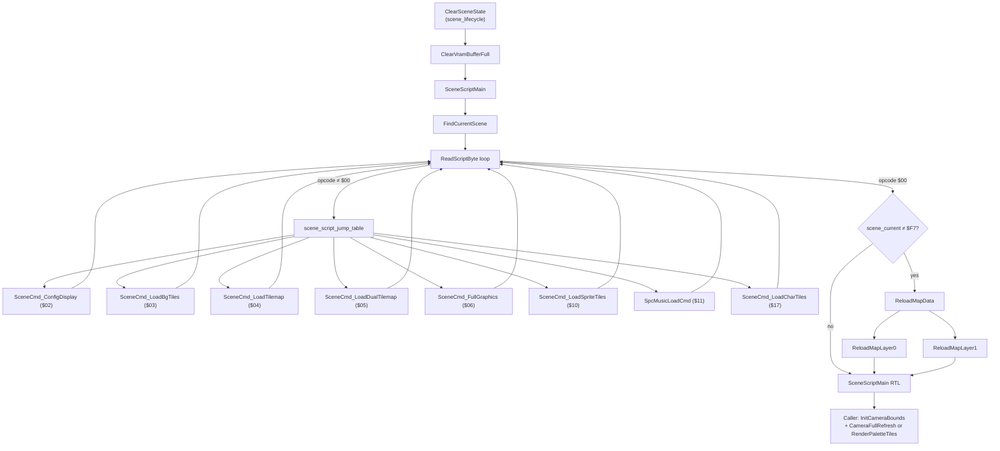
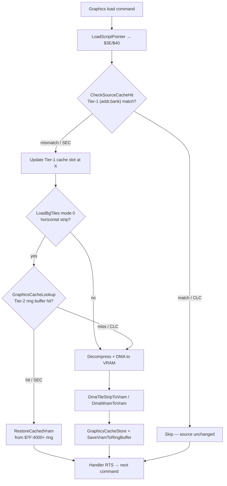

# Bank $02 — Scene Script Engine

*Part of the [Bank $02 Documentation Suite](readme.md)*

**Bank:** `$02` (FastROM; accessed via `$@` long calls from other banks)
**Document scope:** Scene script interpreter, graphics loading commands, VRAM DMA helpers, and source-pointer caching in the `engine` scene.
**ASM sources:** [`scene_script.asm`](../../../extracted/system/engine/scene_script.asm) (block: `scene_script`), [`spc_transfer.asm`](../../../extracted/system/engine/spc_transfer.asm) (block: `spc_transfer` — see [spc-transfer.md](spc-transfer.md))

Illusion of Gaia's **scene transition pipeline** centers on a bytecode interpreter that walks per-scene script streams, dispatching commands to load BG tiles, tilemaps, sprite/character graphics, and display configuration. Command `$11` (`SpcMusicLoadCmd`) delegates to the SPC700 upload path documented in [spc-transfer.md](spc-transfer.md). The interpreter is invoked during room loads from bank `$03` ([`chunk_03BAE1.asm`](../../../extracted/system/chunk_03BAE1.asm)); the built-in SPC engine is uploaded once at cold start from [`system_core.asm`](../../../extracted/system/engine/system_core.asm).

These routines sit above the hardware math, decompression, and VBlank layers documented in [hardware-and-init.md](hardware-and-init.md). Quintet-LZ decompression ([`decompress.asm`](../../../extracted/system/engine/decompress.asm)) is the shared backend for all compressed tile/tilemap payloads.

### Scene Load Pipeline

Room transitions call `ClearSceneState` in [`scene_lifecycle.asm`](../../../extracted/system/engine/scene_lifecycle.asm) (also referenced as `chunk_03BAE1`). After VRAM is flushed, `SceneScriptMain` walks the per-scene bytecode stream, dispatching graphics commands until the `$00` end marker. Post-script map refresh and tilemap DMA happen in the caller.



---

## Address Layout

```
$0283A2 ┌─ DmaWordToVram ─────────────────────────────┐
        │  SceneScriptMain / SceneScriptNoMusic       │
        │  scene_script_jump_table + command handlers │
        │  BG tile / tilemap / display loaders        │
        │  DMA, cache, script parsing helpers         │
$028B6D ├─ SpcMusicLoadCmd ────────────────────────────┤  spc_transfer (part 1)
$028BE4 ├─ SceneCmd_LoadSpriteTiles … ReloadMapLayer1│  scene_script (part 2)
$02908E ├─ SpcLoadBuiltinEngine                       │
        │  SpcBlockTransfer / SpcIplHandshake           │  spc_transfer (part 2)
$029210 ├─ spc_sound_engine (embedded SPC700 binary)   │
$029DE2 └─ (system_init continues) ──────────────────┘
```

The `scene_script` and `spc_transfer` blocks are **physically interleaved** in ROM: command `$11` (`SpcMusicLoadCmd`) lives in the middle of the scene-script address range because both files cross-include each other and the linker places their parts in call-order.

| Metric | `scene_script` | `spc_transfer` | Combined |
|--------|---------------|----------------|----------|
| **Parts** | 42 | 5 | **47** |
| **Code parts** | 41 | 4 | 45 |
| **Data parts** | 1 (`scene_script_jump_table`) | 1 (`spc_sound_engine`) | 2 |
| **Total size (bytes)** | 3,189 | 3,531 | **6,720** |
| **Address range** | `$0283A2`–`$02908E` (2 segments) | `$028B6D`–`$029DE2` (2 segments) | `$0283A2`–`$029DE2` |

**Largest routines:** `spc_sound_engine` (3,026 B binary), `SpcBlockTransfer` (256 B), `SceneCmd_ConfigDisplay` (252 B), `SceneCmd_LoadBgTiles` (245 B), `RenderPaletteTiles` (240 B).

---

## Scene Load Flow

Scene loading is orchestrated by `ClearSceneState` in [`scene_lifecycle.asm`](../../../extracted/system/engine/scene_lifecycle.asm) (bank `$03`). After flushing the VRAM write buffer, it long-calls `SceneScriptMain` with `scene_current` (`$0644`) already set to the destination scene ID. The script stream pointer in WRAM (`$3A`/`$3B`/`$3C`) points at a packed multi-scene blob: `FindCurrentScene` linear-scans from `Y = 0`, reading a 2-byte scene ID per entry and skipping past each scene's command operands until the ID matches `$0644`. Execution then begins at that scene's first command byte.

Each scene entry is a byte stream of command opcodes (`$02`–`$17`) with command-specific operands (see operand-size table below), terminated by `$00`. The interpreter loop reads one byte, indexes the 24-entry jump table, and dispatches the handler via the **fake-return jump**: `PEA loop−1` / `RTS` pushes a return address one byte before the loop label, so the handler's `RTS` resumes interpretation automatically. Handlers load display presets, decompress Quintet-LZ tile/tilemap payloads to VRAM, configure BG layers, and upload sprite/character tiles; command `$11` delegates music to [spc-transfer.md](spc-transfer.md).

When the end marker (`$00`) is reached, `SceneScriptMain` calls `ReloadMapData` (unless `scene_current = $F7`) to refresh both map layers from cached source pointers — essential when revisiting a room without re-running every graphics command. Control returns to `ClearSceneState`, which immediately calls `InitCameraBounds` and continues actor spawning, palette load, and tilemap rendering (`CameraFullRefresh` or `RenderPaletteTiles` for Mode 7 palette scenes). Throughout execution, loaders use a **two-tier cache** ([Cache-and-Diff Pattern](#cache-and-diff-pattern)): Tier 1 compares ROM `(addr, bank)` pairs and skips unchanged sources; Tier 2 snapshots VRAM tile strips to a ring buffer so identical decompressed data can be restored without re-decompression.

---

## Command Dispatch Table

The 24-entry jump table at `$028416` maps command indices `$00`–`$17` to handler addresses. Unimplemented indices fall through to `code_02845C` (immediate `RTS` — no-op).

| Cmd | Hex | Handler | Description |
|-----|-----|---------|-------------|
| `$00`–`01` | — | `code_02845C` | Unimplemented (NOP return) |
| `$02` | `$02` | `SceneCmd_ConfigDisplay` | Read `table_018000` entry; configure TM/TS/TMW/TSW/CGWSEL/CGADSUB/BGMODE/BG1SC/BG2SC and scene flags |
| `$03` | `$03` | `SceneCmd_LoadBgTiles` | Multi-mode BG tile loader (4 modes) |
| `$04` | `$04` | `SceneCmd_LoadTilemap` | Single-layer tilemap DMA |
| `$05` | `$05` | `SceneCmd_LoadDualTilemap` | Dual-layer tilemap with per-layer cache check |
| `$06` | `$06` | `SceneCmd_FullGraphics` | Full scene graphics — map geometry + tileset + tilemap |
| `$07`–`0D` | — | `code_02845C` | Unimplemented (NOP return) |
| `$0E` | `$0E` | `SceneCmd_Skip3` | Skip 3 script bytes (placeholder NOP) |
| `$0F` | — | `code_02845C` | Unimplemented (NOP return) |
| `$10` | `$10` | `SceneCmd_LoadSpriteTiles` | Sprite tile graphics → VRAM `$4000` |
| `$11` | `$11` | `SpcMusicLoadCmd` | SPC music load (in `spc_transfer.asm`) |
| `$12` | — | `code_02845C` | Unimplemented (NOP return) |
| `$13` | `$13` | `SceneCmd_ConditionalLoad` | Test event flag → skip or execute command `$15` |
| `$14` | `$14` | `SceneCmd_Nop` | Skip 1 script byte |
| `$15` | `$15` | `SkipScriptCommands` | Skip N commands of varying sizes |
| `$16` | — | `code_02845C` | Unimplemented (NOP return) |
| `$17` | `$17` | `SceneCmd_LoadCharTiles` | Character-specific tile data to BG1/BG2 VRAM |

**Implemented script commands:** 11 of 24 table entries (`$02`–`$06`, `$0E`, `$10`–`$11`, `$13`–`$15`, `$17`).

### Command Operand Sizes

Used by `FindCurrentScene` and `SkipScriptCommands` when advancing past unknown scenes:

| Cmd | Bytes after opcode | Notes |
|-----|-------------------|-------|
| `$02` | 1 | Display config index |
| `$03` | 7 | VRAM offset, range, mode, 3-byte source pointer |
| `$04` | 6 | start/end/VRAM offsets + 3-byte pointer |
| `$05` | 7 | BG1+BG2 params + 3-byte pointer |
| `$06` | 4+ | Layer flags + 3-byte pointer (+ inline geometry) |
| `$0E` | 3 | Skipped inline |
| `$10` | 5 | 2-byte size + 3-byte pointer |
| `$11` | 5 | Track ID + cache key + 3-byte pointer |
| `$13` | 2 | Flag index + `$15` count |
| `$14` | 1 | NOP skip |
| `$15` | 1+ | Count byte, then N commands |
| `$17` | 4+ | Mode byte + 3-byte pointer (+ inline size) |

---

## Cache-and-Diff Pattern

Graphics loaders avoid redundant VRAM uploads through a two-tier **compare-and-skip** system.

### Tier 1 — Per-Command Source Cache (`CheckSourceCacheHit`)

Most commands store the last-used `(addr, bank)` pair at a dedicated WRAM slot. Before any decompression or DMA:

1. `LoadScriptPointer` fills `($3E,$40)` from the script stream.
2. `CheckSourceCacheHit` compares `($3E,$40)` against `(X)` — the cache slot passed in `X`.
3. **Match (carry clear):** Source unchanged → handler returns immediately (no VRAM touch).
4. **Mismatch (carry set):** Updates the cache slot and proceeds to load.

### Tier 2 — VRAM Content Cache (tile strips)

For `SceneCmd_LoadBgTiles` mode 0 (horizontal strip), an additional content cache prevents re-decompressing identical tile data:

1. `GraphicsCacheLookup` scans 4 slots at `$0084`–`$008F` for a matching `(addr, bank)`.
2. **Hit:** `RestoreCachedVram` DMAs the saved VRAM snapshot from the ring buffer at `$7F:4000+` back to the target VRAM address.
3. **Miss:** Decompress → DMA to VRAM → `GraphicsCacheStore` records the source pointer → `SaveVramToRingBuffer` reads VRAM back into the ring buffer.

The ring-buffer slot index is tracked in `$0094` (round-robin, 4 slots). Slot-to-buffer mapping uses `ComputeRingBufferAddr` and `system_init.cache_slot_indices`.

### Dual-Layer Partial Reload

`SceneCmd_LoadDualTilemap` and `SceneCmd_FullGraphics` use bit flags in `$066A` to independently cache-check each layer. If layer 0 hits cache but layer 1 misses, only layer 1 reloads.

### Cache Tier Decision Tree



Tier 1 applies to all cached commands (`LoadBgTiles`, `LoadTilemap`, `LoadSpriteTiles`, etc.). Tier 2 is an additional VRAM content cache used only for `LoadBgTiles` mode 0 strips after Tier 1 confirms the source pointer changed.

---

## scene_script.asm

| Address | Name | Description |
|---------|------|-------------|
| `$0283A2` | DmaWordToVram | `DmaWordToVram` is the shared primitive for word-mode DMA transfers from a source address in any bank to VRAM. |
| `$0283BB` | SceneScriptMain | `SceneScriptMain` is the primary scene script interpreter invoked during room loads. |
| `$0283E7` | SceneScriptNoMusic | `SceneScriptNoMusic` is a variant interpreter identical to `SceneScriptMain` except that command `$11` (`SpcMusicLoadCmd`) is skipped inline. |
| `$028416` | scene_script_jump_table | The 24-entry dispatch table maps scene script command indices `$00`–`$17` to handler addresses. |
| `$028446` | SceneCmd_ConditionalLoad | Command `$13` implements conditional script execution based on event flags. |
| `$02845B` | SceneCmd_Nop | Command `$14` is a minimal no-operation handler. |
| `$02845D` | SceneCmd_LoadBgTiles | Command `$03` is the multi-mode BG tile loader — the most complex graphics command in the scene script. |
| `$028552` | SceneDmaTileShim | A 3-byte entry shim consisting of `PHP` followed by `BRA DmaTileStripToVram`. |
| `$028555` | CheckInterleavedFlag | Checks the interleaved graphics flag at `$06EE` bit `$0800`, set by `SceneCmd_ConfigDisplay` when the scene uses planar 2bpp+2bpp tile encoding instead of standard SNES 4bpp. |
| `$028560` | DmaTileStripToVram | DMAs a tile strip from the current source pointer (`$3E`/`$40`) to VRAM. |
| `$028592` | Load4bppPage | Loads a full 4bpp tile page (4096 bytes) to VRAM address `$2000`. |
| `$0285DB` | DeinterleavePlanarTiles | Converts interleaved 2bpp+2bpp planar tile data to SNES 4bpp format. |
| `$02868C` | BuildAttributeTable | Builds a 256-byte palette-to-attribute lookup table at `$7E:2800` from tilemap metadata at `$7E:2000`. |
| `$0286C3` | SceneCmd_LoadTilemap | Command `$04` loads a single-layer tilemap from ROM into WRAM buffer `$7F:0A00`. |
| `$028712` | SceneCmd_LoadDualTilemap | Command `$05` loads tilemap data for both BG layers from a single compressed blob. |
| `$0287BC` | SceneCmd_FullGraphics | Command `$06` is the comprehensive scene graphics loader — map geometry, tileset, and tilemap in one command. |
| `$028895` | StoreMapAndDecompress | Stores map dimensions from inline geometry bytes (`$00`/`$02` = width/height) into the map bounds array at `$0693,X` ... |
| `$0288B5` | HandleEmptyGeometry | Handles the case where the geometry size word read from the source stream is zero — meaning no compressed tileset follows inline. |
| `$028914` | WriteMapBounds | Writes map width and height from `$00`/`$02` into the bounds arrays at `$0692,X` and `$0696,X`, then DMAs the first map row from the current source pointer via `DmaRomToWram`. |
| `$028926` | DmaLowVramTileset | Uploads a tileset to low VRAM at address `$2000` using byte-write mode, required for Mode 0 BG tile uploads. |
| `$02897D` | RenderPaletteTiles | Converts palette-indexed map data at `$7E:A000` into SNES 4bpp tile format at `$7E:B000`, then DMAs 4096 bytes to VRAM address `$0000`. |
| `$028A6D` | SceneCmd_ConfigDisplay | Command `$02` configures the SNES PPU for a scene by reading a 1-byte index into `table_018000` — a preset table of display register values. |
| `$028B69` | SceneCmd_Skip3 | Command `$0E` is a placeholder NOP that advances the script index by 3 bytes. |
| `$028BE4` | SceneCmd_LoadSpriteTiles | Command `$10` loads sprite tile graphics to OBJ VRAM. |
| `$028C30` | SceneCmd_LoadCharTiles | Command `$17` loads character-specific tile data to BG VRAM. |
| `$028CE7` | ReadScriptByte | Reads the next byte from the script stream at `[$3A],Y` and advances `Y` by one. |
| `$028CF2` | FindCurrentScene | Linearly scans the script stream at `($3A)` starting from `Y = 0` to find the entry matching `scene_current` at `$0644`. |
| `$028D3D` | SkipScriptCommands | Advances `Y` past N commands in the script stream, where N is read from the first byte via `ReadScriptByte` and stored on the stack. |
| `$028D8F` | LoadScriptPointer | Reads a 3-byte pointer (2-byte address + 1-byte bank) from the script stream at `[$3A],Y` and stores it at `(X)` (address at offset 0, bank at offset 2). |
| `$028DC1` | CheckSourceCacheHit | Compares the current source pointer at `$3E`/`$40` against a cached `(addr, bank)` pair at `(X)`. |
| `$028DEA` | DmaRomToWram | Transfers data from ROM (or any source at `$3E`/`$40`) to a WRAM destination at `$42`/`$44`. |
| `$028E6F` | GraphicsCacheLookup | Scans 4 cached source pointer slots at `$0084`–`$008F` (each 3 bytes: addr + bank) for a match against the current `$3E`/`$40`. |
| `$028E94` | GraphicsCacheStore | Writes the current source pointer `$3E`/`$40` into the round-robin graphics cache at `$0084`–`$008F`. |
| `$028EB8` | SaveVramToRingBuffer | Reads VRAM content back into the ring buffer at `$7F:4000+` via `DmaVramToRam`, preserving uploaded tile data for future cache hits. |
| `$028F18` | DmaVramToRam | Performs a VRAM-to-RAM DMA read-back using HDMA channel 0. |
| `$028F43` | ComputeRingBufferAddr | Computes the WRAM ring-buffer address for the current cache slot index in `$0094`. |
| `$028F53` | RestoreCachedVram | Restores previously saved VRAM tile data from the ring buffer back to VRAM. |
| `$028FA7` | DmaWramToVram | DMAs data from WRAM bank `$7F` to VRAM. |
| `$028FCD` | RebuildTilemapAttrs | Rebuilds tilemap attribute bytes for a 4×N tile region. |
| `$029020` | ReloadMapData | Refreshes both map layers from their cached source pointers after scene script execution completes. |
| `$029034` | ReloadMapLayer0 | Reloads layer 0 map strip from the cached source pointer at `$06AA` into `$7F:2000`. |
| `$029060` | ReloadMapLayer1 | Reloads layer 1 map strip from the cached source pointer at `$06AC` into `$7F:0000`. |

#### Script Engine Core

### SceneScriptMain

`SceneScriptMain` is the primary scene script interpreter invoked during room loads. It saves processor flags, switches to 8-bit accumulator mode, and calls `FindCurrentScene` to position `Y` at the command stream for the current scene ID in `$0644`. The main loop reads bytes via `ReadScriptByte` until `$00` (end-of-scene marker). Non-zero bytes index into `scene_script_jump_table` (`command_id × 2` → word handler address). Handlers are invoked via the **fake return-address jump** pattern: `PEA handler-1` / `RTS`, which pushes a return address pointing one byte before the loop label so execution resumes after the handler returns. When `$00` is encountered, if `scene_current ≠ $F7`, `ReloadMapData` refreshes both map layers from cached source pointers (used when returning to a previously loaded room). Scene `$F7` is a special case that skips the reload.

**Algorithm:**

| Step | Action |
|------|--------|
| 1 | `PHP`; `SEP #$20` |
| 2 | `JSR FindCurrentScene` — set `Y` to current scene's command stream |
| 3 | Loop: `JSR ReadScriptByte` |
| 4 | If byte = `$00` → goto step 7 |
| 5 | `PEA loop-1`; index jump table; `DEC`/`PHA`/`RTS` to dispatch handler |
| 6 | Handler returns → goto step 3 |
| 7 | If `$0644 ≠ $F7`, `JSR ReloadMapData` |
| 8 | `PLP`; `RTL` |

**Source:**

```35:64:../../../extracted/system/engine/scene_script.asm
SceneScriptMain {
    PHP
    SEP #$20
    JSR $&FindCurrentScene

  code_0283C1:
    JSR $&ReadScriptByte
    CMP #$00
    BEQ loc_0283DB
    PEA $&code_0283C1-1
    REP #$20
    AND #$00FF
    ASL
    TAX
    LDA $@scene_script_jump_table, X
    DEC
    PHA
    SEP #$20
    RTS

  loc_0283DB:
    LDA $scene_current
    CMP #$F7
    BEQ loc_0283E5
    JSR $&ReloadMapData

  loc_0283E5:
    PLP
    RTL
}
```

**Variables:**

| Location | Direction | Role |
|----------|-----------|------|
| `$3A`/`$3B`/`$3C` | In | Script stream pointer (bank `$7F` WRAM) |
| `$0644` | In | `scene_current` — scene ID to match |
| `Y` | In/Out | Script stream index; advanced by handlers |
| `$06EF` | In | Bit `$01` gates layer 1 reload in `ReloadMapData` |

**Cross-References:**

| Symbol | Relationship |
|--------|--------------|
| `chunk_03BAE1.asm` | Primary caller during scene load |
| `FindCurrentScene` | Positions `Y` at matching scene entry |
| `scene_script_jump_table` | Command dispatch table |
| `ReloadMapData` | Post-scene map refresh |
| `SceneScriptNoMusic` | Variant that skips music command |

### SceneScriptNoMusic

`SceneScriptNoMusic` is a variant interpreter identical to `SceneScriptMain` except that command `$11` (`SpcMusicLoadCmd`) is skipped inline. When the jump table entry matches `SpcMusicLoadCmd`, the routine advances `Y` by 5 bytes (the full operand size of command `$11`) instead of dispatching to the music handler. This variant is used by the inventory overlay so opening the menu does not restart BGM. Unlike `SceneScriptMain`, it does not call `ReloadMapData` at scene end — it simply restores flags and returns.

**Algorithm:**

| Step | Action |
|------|--------|
| 1 | Same setup as `SceneScriptMain`: `FindCurrentScene` |
| 2 | Loop: read byte; if `$00` → exit |
| 3 | Index jump table; compare handler to `SpcMusicLoadCmd` |
| 4 | If music handler: `INY` × 5 (skip operands); `RTS` to loop |
| 5 | Else: fake-return dispatch as in `SceneScriptMain` |
| 6 | On `$00`: `PLP`; `RTL` (no map reload) |

**Source:**

```66:100:../../../extracted/system/engine/scene_script.asm
SceneScriptNoMusic {
    PHP
    SEP #$20
    JSR $&FindCurrentScene

  code_0283ED:
    JSR $&ReadScriptByte
    CMP #$00
    BEQ loc_028414
    PEA $&code_0283ED-1
    REP #$20
    AND #$00FF
    ASL
    TAX
    LDA $@scene_script_jump_table, X
    CMP #$&spc_transfer.SpcMusicLoadCmd
    BEQ loc_02840C
    DEC
    PHA
    SEP #$20
    RTS

  loc_02840C:
    INY
    INY
    INY
    INY
    INY
    SEP #$20
    RTS

  loc_028414:
    PLP
    RTL
}
```

**Variables:**

| Location | Direction | Role |
|----------|-----------|------|
| `$3A`/`Y` | In/Out | Script stream pointer and index |
| `$0644` | In | Current scene ID |

**Cross-References:**

| Symbol | Relationship |
|--------|--------------|
| `inventory_overlay.asm` | Caller — preserves BGM during menu |
| `SpcMusicLoadCmd` | Handler explicitly bypassed |
| `SceneScriptMain` | Full-featured counterpart |

### scene_script_jump_table

The 24-entry dispatch table maps scene script command indices `$00`–`$17` to handler addresses. Each entry is a 2-byte same-bank pointer (`&handler`). Unimplemented commands point to `code_02845C`, which is a single `RTS`. Command `$11` points across the compilation unit boundary to `spc_transfer.SpcMusicLoadCmd`, reflecting the physical interleaving of the two ASM files in ROM. The table is indexed by `command_byte × 2` in 16-bit mode during dispatch.

### SceneCmd_LoadBgTiles

Command `$03` is the multi-mode BG tile loader — the most complex graphics command in the scene script. It reads a VRAM destination offset (`×2` stored to `$0664`), a source range end (`×2` → `$0666`), a VRAM base offset (`×2` → `$0668`), a 3-byte source pointer, and a mode byte selecting one of four loading strategies. **Mode 0** (horizontal strip): Applies cache check at slot `$066C`/`$066F`/`$0670` depending on VRAM offset bit `$0010`. Uses Tier 2 VRAM content cache (`GraphicsCacheLookup`/`RestoreCachedVram`) for decompressed data. **Mode 1** (two-row block): Cache slots `$0672`–`$0676`. **Mode 2** (full page): Jumps directly to `Load4bppPage`. **Mode 3** (raw copy): Uncompressed path through `CheckInterleavedFlag`. When compressed (`size word ≠ 0`), data is decompressed to `$7E:7000` via `QuintetLzDecompress`, then DMA'd to VRAM and saved to the ring buffer.

**Algorithm:**

| Mode | Value | Behavior |
|------|-------|----------|
| 0 | `$00` | Strip load + source cache + VRAM ring cache |
| 1 | `$01` | Two-row block load |
| 2 | `$02` | Full 4bpp page via `Load4bppPage` |
| 3 | `$03` | Raw uncompressed copy |

| Step | Action |
|------|--------|
| 1 | Read VRAM offset, range, base, source pointer, mode |
| 2 | Adjust `$0668` base per mode; select cache slot in `X` |
| 3 | `CheckSourceCacheHit` — return if unchanged |
| 4 | Read size word from source; branch compressed/uncompressed |
| 5 | On miss: decompress → `SceneDmaTileShim` → `SaveVramToRingBuffer` |

**Variables:**

| Location | Direction | Role |
|----------|-----------|------|
| `$0664` | Out | Source range start (×2) |
| `$0666` | Out | Source range end (×2) |
| `$0668` | Out | VRAM destination base |
| `$0670`–`$0676` | Out | Per-mode cache slot indices |
| `$78` | Out | Compressed size word |
| `$06EE` | In | Bit `$0800` = interleaved planar tiles |

**Cross-References:**

| Symbol | Relationship |
|--------|--------------|
| `Load4bppPage` | Mode 2 target |
| `SceneDmaTileShim` | Post-decompress DMA entry |
| `GraphicsCacheLookup` | Tier 2 cache check |
| `DeinterleavePlanarTiles` | Interleaved path from mode 0 |

### DmaTileStripToVram

DMAs a tile strip from the current source pointer (`$3E`/`$40`) to VRAM. Computes the source address as `$3E + $0664`, transfer size as `$0666 - $0664`, and writes the VRAM destination from `$0668` to `$2116` (`VMADDL`). Uses channel 0 word-mode DMA to VRAM. This is the final upload step for uncompressed tile data in modes 0 and 1, and for decompressed data that does not require planar conversion.

**Algorithm:**

| Step | Action |
|------|--------|
| 1 | Write `$0668` → `$2116` (VRAM address) |
| 2 | Source = `$3E + $0664`; size = `$0666 - $0664` |
| 3 | Configure DMA channel 0: word mode, VRAM dest |
| 4 | Trigger `$420B`; restore flags; return |

**Variables:**

| Location | Direction | Role |
|----------|-----------|------|
| `$0664`/`$0666` | In | Source range |
| `$0668` | In | VRAM destination |
| `$3E`/`$40` | In | Data source pointer |

**Cross-References:**

| Symbol | Relationship |
|--------|--------------|
| `SceneDmaTileShim` | Entry via branch |
| `DmaWordToVram` | Equivalent register pattern |
| `SceneCmd_LoadBgTiles` | Parent command |

### Load4bppPage

Loads a full 4bpp tile page (4096 bytes) to VRAM address `$2000`. If the source size word is non-zero, decompresses to `$7E:7000` first; otherwise uses raw data at the source pointer. Uses **byte-mode** DMA (`$DMAP0 = $00`, `$BBAD0 = $19`) rather than word mode, which is required for Mode 7 tile uploads. Called from `SceneCmd_LoadBgTiles` mode 2 and from the full-graphics path via `DmaLowVramTileset`.

**Algorithm:**

| Step | Action |
|------|--------|
| 1 | Read size word; if non-zero → decompress to `$7E:7000` |
| 2 | Set VRAM address to `$2000` |
| 3 | Byte-mode DMA 4096 bytes from source to VRAM |
| 4 | Return |

**Variables:**

| Location | Direction | Role |
|----------|-----------|------|
| `$78` | In | Compressed size (0 = raw) |
| `$7A` | Out | Decompression destination |
| `$2116` | Out | VRAM addr `$2000` |

**Cross-References:**

| Symbol | Relationship |
|--------|--------------|
| `QuintetLzDecompress` | Decompression backend |
| `SceneCmd_LoadBgTiles` | Mode 2 caller |
| `DmaLowVramTileset` | Related low-VRAM path |

### DeinterleavePlanarTiles

Converts interleaved 2bpp+2bpp planar tile data to SNES 4bpp format. The entry label decompresses data to `$7E:7000`; the main loop in `code_0285F3` reads 16×2-byte rows from the decompressed buffer, interleaves bitplanes via rotate/or operations, and writes 8 bytes per tile row to `$7E:A000`. After processing 8192 source bytes (4096 output bytes), byte-mode DMA uploads the result to VRAM address `$0000` with `$VMAIN = $80` (increment high word). `BuildAttributeTable` is called first to prepare palette attribute mapping.

**Algorithm:**

| Step | Action |
|------|--------|
| 1 | Decompress to `$7E:7000` |
| 2 | `BuildAttributeTable` — map palette indices |
| 3 | For each 16-byte source row: interleave 8 bitplane pairs → 8 output bytes |
| 4 | Repeat until 8192 bytes processed |
| 5 | Byte-mode DMA `$7E:A000` → VRAM `$0000` |

**Variables:**

| Location | Direction | Role |
|----------|-----------|------|
| `$7E:7000` | In | Decompressed planar input |
| `$7E:A000` | Out | Interleaved 4bpp output |
| `$06EE` | In | Bit `$0800` triggers this path |

**Cross-References:**

| Symbol | Relationship |
|--------|--------------|
| `BuildAttributeTable` | Called before interleave loop |
| `CheckInterleavedFlag` | Branch entry |
| `SceneCmd_ConfigDisplay` | Sets interleave flag |

### BuildAttributeTable

Builds a 256-byte palette-to-attribute lookup table at `$7E:2800` from tilemap metadata at `$7E:2000`. First zeroes 256 bytes at `$2800`, then for each word in the tilemap buffer (`$2000`–`$27FF`), extracts the palette index (bits 10–12), scales by 4, and stores at the corresponding attribute table offset. This table is used by `DeinterleavePlanarTiles` and `RenderPaletteTiles` to map palette-indexed tile data to SNES attribute format during Mode 7 palette rendering.

**Algorithm:**

| Step | Action |
|------|--------|
| 1 | Zero 256 bytes at `$7E:2800` (128 words) |
| 2 | For Y = 0..2047 step 2: read `$2000,Y` |
| 3 | Extract palette bits; `×4` → store at `$2800 + index` |
| 4 | Return |

**Variables:**

| Location | Direction | Role |
|----------|-----------|------|
| `$7E:2000` | In | Tilemap metadata source |
| `$7E:2800` | Out | 256-byte attribute table |

**Cross-References:**

| Symbol | Relationship |
|--------|--------------|
| `DeinterleavePlanarTiles` | Caller |
| `RenderPaletteTiles` | Uses same attribute concept |
| `RebuildTilemapAttrs` | Related attribute manipulation |

#### Tilemap Loading

### SceneCmd_LoadTilemap

Command `$04` loads a single-layer tilemap from ROM into WRAM buffer `$7F:0A00`. Reads three offset bytes (each ×2 for word alignment) into `$0664` (start), `$0666` (end), and `$0668` (VRAM offset). Loads the 3-byte source pointer and DMAs the tilemap slice via `DmaRomToWram`. Special case: when VRAM offset equals `$0020`, after the DMA the routine copies one row from `$7F:0A20` to `$7F:0A00` — a single-row refresh used when only the top map row changed.

**Algorithm:**

| Step | Action |
|------|--------|
| 1 | Read start/end/VRAM offsets (×2 each) |
| 2 | If VRAM offset ≠ `$0020`: load pointer → DMA to `$7F:0A00` |
| 3 | If VRAM offset = `$0020`: DMA then copy row `$0A20` → `$0A00` |
| 4 | Return |

**Variables:**

| Location | Direction | Role |
|----------|-----------|------|
| `$0664`/`$0666`/`$0668` | Out | Source range and VRAM offset |
| `$7F:0A00` | Out | Tilemap WRAM buffer |
| `$42`/`$44` | Out | DMA destination addr/bank |

**Cross-References:**

| Symbol | Relationship |
|--------|--------------|
| `DmaRomToWram` | Transfer primitive |
| `LoadScriptPointer` | Reads 3-byte source |
| `ReloadMapLayer0` | Uses cached map data at reload |

### SceneCmd_LoadDualTilemap

Command `$05` loads tilemap data for both BG layers from a single compressed blob. Reads BG1 and BG2 offset parameters (each ÷4 from script bytes), a layer flag byte to `$066A`, and a 3-byte source pointer. Performs independent cache checks for layer 0 (slot `$0678`) and layer 1 (slot `$067B`), clearing bits in `$066A` for layers that hit cache. On cache miss, decompresses the combined blob to `$7E:7000`, then copies layer 0 to `$7E:2000` and layer 1 to `$7E:2800` via `DmaRomToWram`, calling `RebuildTilemapAttrs` for each loaded layer to apply priority bits from `$06A2`/`06A4`.

**Algorithm:**

| Step | Action |
|------|--------|
| 1 | Read BG1/BG2 offsets, layer flags, source pointer |
| 2 | Cache-check layer 0 (`$0678`); clear bit 0 on hit |
| 3 | Cache-check layer 1 (`$067B`); clear bit 1 on hit |
| 4 | If `$066A = 0`: return (both cached) |
| 5 | Decompress if needed; copy layers per remaining flags |
| 6 | `RebuildTilemapAttrs` per loaded layer |

**Variables:**

| Location | Direction | Role |
|----------|-----------|------|
| `$066A` | In/Out | Layer reload flags (bits 0/1) |
| `$0678`/`$067B` | Out | Per-layer source cache |
| `$7E:2000`/`$7E:2800` | Out | Layer 0/1 tilemap buffers |

**Cross-References:**

| Symbol | Relationship |
|--------|--------------|
| `CheckSourceCacheHit` | Per-layer cache |
| `RebuildTilemapAttrs` | Priority bit application |
| `SceneCmd_FullGraphics` | Shares layer flag pattern |

### SceneCmd_FullGraphics

Command `$06` is the comprehensive scene graphics loader — map geometry, tileset, and tilemap in one command. Reads a layer flag byte to `$066A` and a 3-byte source pointer. When layer flags are non-zero, performs per-layer cache checks at `$067E` (layer 0) and `$0681` (layer 1), with a Mode 7 palette bypass when `$06EF` bit `$08` is set. Reads inline geometry bytes (width/height) from the source stream. If no layers are flagged (`$066A AND #$7F = 0`), jumps to `DmaLowVramTileset` for tileset-only load. Otherwise calls `StoreMapAndDecompress` per layer to decompress tile data and store map bounds, with `HandleEmptyGeometry` for zero-size geometry blobs.

**Algorithm:**

| Step | Action |
|------|--------|
| 1 | Read layer flags + source pointer |
| 2 | Per-layer cache check; clear satisfied bits |
| 3 | Read inline width/height bytes |
| 4 | If no layers: `DmaLowVramTileset` |
| 5 | If size = 0: `HandleEmptyGeometry` |
| 6 | Else: `StoreMapAndDecompress` per flagged layer |

**Variables:**

| Location | Direction | Role |
|----------|-----------|------|
| `$066A` | In/Out | Layer flags + geometry mode |
| `$067E`/`$0681` | Out | Full-graphics cache slots |
| `$0692`–`$069D` | Out | Map bounds (width, height, products) |
| `$06EF` | In | Bit `$08` = Mode 7 palette path |

**Cross-References:**

| Symbol | Relationship |
|--------|--------------|
| `StoreMapAndDecompress` | Per-layer tileset+map |
| `HandleEmptyGeometry` | Zero-size geometry path |
| `DmaLowVramTileset` | Tileset-only fallback |
| `RenderPaletteTiles` | Post-load Mode 7 render |

### StoreMapAndDecompress

Stores map dimensions from inline geometry bytes (`$00`/`$02` = width/height) into the map bounds array at `$0693,X` / `$0697,X`, computes the tile count via `SignedMultiply`, and decompresses the tileset blob pointed to by `$069E,X` into `$7E:7000` (via `$7A`). The `X` register selects the layer index (0 or 2 for layer 0/1), indexing into parallel arrays for dual-layer scenes.

### HandleEmptyGeometry

Handles the case where the geometry size word read from the source stream is zero — meaning no compressed tileset follows inline. Computes tileset size from width×height via `SignedMultiply`, then DMAs raw tileset data and writes map bounds. For layer 0 (bit `$01` in `$066A`): DMA tileset to `$7E:A000`, call `WriteMapBounds` with `$0000` index, then copy map row to `$7E:C000`. For layer 1 only: uses index `$0002` for `WriteMapBounds` with destination `$7E:C000`.

**Algorithm:**

| Step | Action |
|------|--------|
| 1 | `SignedMultiply` width×height → `$0667` |
| 2 | If layer 0 flagged: DMA tileset → `$7E:A000`; `WriteMapBounds` index 0 |
| 3 | If layer 1 flagged: copy map to `$7E:C000`; store bounds |
| 4 | Return |

**Variables:**

| Location | Direction | Role |
|----------|-----------|------|
| `$066A` | In | Layer flags |
| `$0666`/`$0667` | Out | Tileset size |
| `$7E:A000`/`$7E:C000` | Out | Tileset/map buffers |

**Cross-References:**

| Symbol | Relationship |
|--------|--------------|
| `WriteMapBounds` | Bounds + first row DMA |
| `SceneCmd_FullGraphics` | Entry when size word = 0 |
| `DmaRomToWram` | Raw tileset copy |

### DmaLowVramTileset

Uploads a tileset to low VRAM at address `$2000` using byte-write mode, required for Mode 0 BG tile uploads. Reads the size word from the source stream; if non-zero, decompresses to `$7E:A000` before DMA. Temporarily sets `$2115` (`VMAIN`) to `$00` for byte increment, then restores `$80` after the transfer. Called from `SceneCmd_FullGraphics` when no layer flags are set (tileset-only reload).

**Algorithm:**

| Step | Action |
|------|--------|
| 1 | Read size word; decompress to `$7E:A000` if compressed |
| 2 | Set VRAM addr `$2000`; `$VMAIN = $00` |
| 3 | Byte-mode DMA 4096 bytes to VRAM |
| 4 | Restore `$VMAIN = $80` |

**Variables:**

| Location | Direction | Role |
|----------|-----------|------|
| `$78` | In | Compressed size |
| `$2115`/`$2116` | Out | VRAM control |
| `$7E:A000` | Out | Decompression buffer |

**Cross-References:**

| Symbol | Relationship |
|--------|--------------|
| `SceneCmd_FullGraphics` | Tileset-only path |
| `Load4bppPage` | Similar full-page upload |
| `QuintetLzDecompress` | Decompression |

#### Display & Character Graphics

### RenderPaletteTiles

Converts palette-indexed map data at `$7E:A000` into SNES 4bpp tile format at `$7E:B000`, then DMAs 4096 bytes to VRAM address `$0000`. Used for Mode 7 palette tile rendering when `$06EF` bit `$08` is set. The routine zeroes the output buffer, then iterates map rows and columns, looking up tile definitions from the attribute table at `$7E:2000` and assembling 4 bitplanes into the SNES tile layout. Map width is capped at 4 tiles per row (`$1C` clamped to `$04`). After processing all rows, byte-mode DMA uploads the result. Called from `chunk_03BAE1.asm` after scene load completes.

**Algorithm:**

| Step | Action |
|------|--------|
| 1 | Zero `$7E:B000`–`$7E:B000+$4000` |
| 2 | For each map row (0..width): for each column (0..4) |
| 3 | Read palette index from `$A000`; lookup `$2000,Y` tile data |
| 4 | Write 4 bitplanes to `$B000,X` (offset `$00`, `$80` per plane) |
| 5 | Byte-mode DMA `$7E:B000` → VRAM `$0000` |

**Variables:**

| Location | Direction | Role |
|----------|-----------|------|
| `$0693`/`$0697` | In | Map width/height |
| `$7E:A000` | In | Palette-indexed map |
| `$7E:2000` | In | Tile definition lookup |
| `$7E:B000` | Out | SNES 4bpp output |

**Cross-References:**

| Symbol | Relationship |
|--------|--------------|
| `chunk_03BAE1.asm` | Post-scene-load caller |
| `BuildAttributeTable` | Related attribute mapping |
| `SceneCmd_ConfigDisplay` | Sets Mode 7 flag `$06EF` bit `$08` |

### SceneCmd_ConfigDisplay

Command `$02` configures the SNES PPU for a scene by reading a 1-byte index into `table_018000` — a preset table of display register values. Writes to `$212C`–`$212F` (TM/TS/TMW/TSW), `$2130`–`$2131` (CGWSEL/CGADSUB), `$2105`–`$2108` (BG mode and screen sizes), and stores derived flags to `$06EE` (display flags) and `$06EF` (system flags). Extracts BG priority bits into `$06A2`/`$06A4` and `$06EC` (BG scroll base). Detects BG2 enable (bit in `$06EF`), Mode 7 palette path (bit `$08`), and interleaved tile flag (bit `$0800` in `$06EE`). Clears tile cache invalidation flags `$0679`/`$067C` when scroll bases change.

**Algorithm:**

| Step | Action |
|------|--------|
| 1 | Read preset index; compute offset into `table_018000` |
| 2 | Write TM/TS/TMW/TSW, CGWSEL/CGADSUB from table |
| 3 | Parse flag byte: priority bits, scroll bases, interleave |
| 4 | Write BGMODE, BG1SC, BG2SC from table bytes 5–7 |
| 5 | Store `$06EE`, `$06EF`; update `$09ED` bit `$40` for BG3 |

**Variables:**

| Location | Direction | Role |
|----------|-----------|------|
| `$06EE` | Out | Display flags (interleave = bit `$0800`) |
| `$06EF` | Out | System flags (BG2 = bit `$01`, M7 = bit `$08`) |
| `$06A2`/`$06A4` | Out | BG priority OR masks |
| `$212C`–`$2131` | Out | PPU layer registers |

**Cross-References:**

| Symbol | Relationship |
|--------|--------------|
| `table_018000.asm` | Display preset data |
| `CheckInterleavedFlag` | Reads `$06EE` bit `$0800` |
| `ReloadMapData` | Gated on `$06EF` bit `$01` |

### SceneCmd_LoadSpriteTiles

Command `$10` loads sprite tile graphics to OBJ VRAM. Reads a 2-byte size word directly from the script stream (not via `ReadScriptByte`), advances `Y` by 3 for the source pointer, loads the pointer via `LoadScriptPointer`, and cache-checks against slot `$0684`. On cache miss: if compressed (size ≠ 0), decompresses to `$7E:4000`; if uncompressed (size = 0), DMAs raw data from source to `$7E:4000` via `DmaRomToWram`. The decompression destination `$7A = $4000` indicates OBJ tile VRAM staging in WRAM before upload.

**Algorithm:**

| Step | Action |
|------|--------|
| 1 | Read 2-byte size from script; skip to source pointer |
| 2 | `LoadScriptPointer`; cache-check `$0684` |
| 3 | On miss: decompress or raw DMA to `$7E:4000` |
| 4 | Return |

**Variables:**

| Location | Direction | Role |
|----------|-----------|------|
| `$0666` | In | Size word from script |
| `$0684` | Out | Sprite tile source cache |
| `$7E:4000` | Out | Sprite tile staging buffer |

**Cross-References:**

| Symbol | Relationship |
|--------|--------------|
| `CheckSourceCacheHit` | Cache at `$0684` |
| `QuintetLzDecompress` | Compressed path |
| `DmaRomToWram` | Uncompressed path |

### SceneCmd_LoadCharTiles

Command `$17` loads character-specific tile data to BG VRAM. Reads a mode byte to `$066A` and a 3-byte source pointer. Reads inline width/height, computes tile data size via `SignedMultiply`, and optionally decompresses to `$7E:7000`. Supports three VRAM targets based on mode: negative mode (bit 7 set) uses computed address; bit 0 → BG1 at VRAM `$1000`; bit 1 → BG2 at VRAM `$1800`; both bits can load sequentially via the `code_028CB0` continuation. DMA uses word mode to upload `$0666` bytes from the source buffer.

**Algorithm:**

| Step | Action |
|------|--------|
| 1 | Read mode, source pointer, inline dimensions |
| 2 | `SignedMultiply` → size in `$0666` |
| 3 | Decompress if needed |
| 4 | If mode bit 7: compute VRAM addr from `$066A` |
| 5 | Else if bit 0: VRAM `$1000`; if bit 1: VRAM `$1800` |
| 6 | Word-mode DMA `$0666` bytes to VRAM |

**Variables:**

| Location | Direction | Role |
|----------|-----------|------|
| `$066A` | In | Mode: bit 7=computed, 0=BG1, 1=BG2 |
| `$0666` | Out | Tile data byte count |
| `$2116` | Out | VRAM destination |

**Cross-References:**

| Symbol | Relationship |
|--------|--------------|
| `SignedMultiply` | Size computation |
| `QuintetLzDecompress` | Compressed tile data |
| `SceneCmd_LoadBgTiles` | Related BG tile loading |

#### Parsing Helpers

### FindCurrentScene

Linearly scans the script stream at `($3A)` starting from `Y = 0` to find the entry matching `scene_current` at `$0644`. Each scene entry begins with a 2-byte scene ID. On mismatch, the scanner advances past all commands in that scene using hardcoded operand-size rules identical to those in `SkipScriptCommands`. When `$00` is encountered as a command byte during scanning (end-of-scene within a multi-scene block), the scanner wraps to the next scene header. Returns with `Y` positioned at the first command byte of the matching scene.

**Algorithm:**

| Step | Action |
|------|--------|
| 1 | `Y = 0` |
| 2 | Read 2-byte scene ID; compare to `$0644` |
| 3 | Match → return |
| 4 | Mismatch → read command bytes, skip operands per size table |
| 5 | On command `$00`: goto step 2 (next scene) |
| 6 | Else: continue skipping; goto step 4 |

**Variables:**

| Location | Direction | Role |
|----------|-----------|------|
| `$0644` | In | Target scene ID |
| `$3A`/`Y` | In/Out | Script stream |

**Cross-References:**

| Symbol | Relationship |
|--------|--------------|
| `SceneScriptMain` | Called at interpreter entry |
| `SkipScriptCommands` | Shares operand-size logic |
| `SceneCmd_ConditionalLoad` | `$13` handled in skip path |

### SkipScriptCommands

Advances `Y` past N commands in the script stream, where N is read from the first byte via `ReadScriptByte` and stored on the stack. Also serves as command `$15` handler (self-recursive via the jump table). Uses the same operand-size dispatch as `FindCurrentScene` but counts down until the target skip count is reached. Command `$14` (NOP) has special handling: it reads the next byte and compares against the remaining skip count on the stack, allowing `$15` to skip to a specific command index.

**Algorithm:**

| Step | Action |
|------|--------|
| 1 | Read count byte; push to stack |
| 2 | Loop: read command byte at `[$3A],Y` |
| 3 | Skip operands per command type |
| 4 | On `$14`: compare operand to count; exit if match |
| 5 | Decrement count; repeat until zero |
| 6 | Pop count; return |

**Variables:**

| Location | Direction | Role |
|----------|-----------|------|
| `$3A`/`Y` | In/Out | Script stream |
| Stack | In | Remaining skip count |

**Cross-References:**

| Symbol | Relationship |
|--------|--------------|
| `SceneCmd_ConditionalLoad` | Jumps here on flag clear |
| `scene_script_jump_table` | Entry `$15` |
| `FindCurrentScene` | Parallel skip logic |

### LoadScriptPointer

Reads a 3-byte pointer (2-byte address + 1-byte bank) from the script stream at `[$3A],Y` and stores it at `(X)` (address at offset 0, bank at offset 2). Also copies the pointer to the global `$3E`/`$40` workspace used by all subsequent load operations. Applies bank fixup for the `$70`–`$9F` mirror range: if bank byte < `$A0` after adding `$80`, strips the high bit of the address high byte. This normalizes pointers in the expanded ROM mirror map.

### CheckSourceCacheHit

Compares the current source pointer at `$3E`/`$40` against a cached `(addr, bank)` pair at `(X)`. Returns **carry clear** if they match (source unchanged — caller should skip reload). Returns **carry set** if they differ, and updates the cache slot with the new pointer values. This is Tier 1 of the cache-and-diff pattern, preventing redundant decompression and DMA when the same ROM data is referenced across scene transitions.

### DmaRomToWram

Transfers data from ROM (or any source at `$3E`/`$40`) to a WRAM destination at `$42`/`$44`. If the source bank is ≥ `$80` and the address is ≥ `$8000`, uses HDMA channel 0 to transfer to `$2181` (WRAM bus). Otherwise falls back to the `$0402` MVN block-copy routine for low-memory sources. Transfer size is `$0666 - $0664`; source offset is `$3E + $0664`; destination is `$42 + $0668`. Handles bank `$7F` WRAM destination with proper `$2183` data bank setup.

**Algorithm:**

| Step | Action |
|------|--------|
| 1 | If source bank < `$80` or addr < `$8000`: MVN via `$0402` |
| 2 | Else: configure DMA channel 0 to WRAM |
| 3 | Size = `$0666 - $0664`; source = `$3E + $0664` |
| 4 | Trigger `$420B` |

**Variables:**

| Location | Direction | Role |
|----------|-----------|------|
| `$0664`/`$0666`/`$0668` | In | Source range and dest offset |
| `$3E`/`$40` | In | Source pointer |
| `$42`/`$44` | In | Destination pointer |

**Cross-References:**

| Symbol | Relationship |
|--------|--------------|
| `SceneCmd_LoadTilemap` | Tilemap to `$7F:0A00` |
| `SceneCmd_LoadDualTilemap` | Layer copy |
| `WriteMapBounds` | First map row |

### GraphicsCacheLookup

Scans 4 cached source pointer slots at `$0084`–`$008F` (each 3 bytes: addr + bank) for a match against the current `$3E`/`$40`. Returns **carry set** on hit (matching slot found), **carry clear** on miss. This is Tier 2 of the cache system — after Tier 1 confirms the source pointer changed, this check determines whether the VRAM content was previously saved to the ring buffer.

### GraphicsCacheStore

Writes the current source pointer `$3E`/`$40` into the round-robin graphics cache at `$0084`–`$008F`. Uses `$0094` as the write index (0–3), incrementing with wrap. Computes the cache slot offset as `index × 3` bytes from `$0084`. Called after a cache miss when new tile data has been decompressed and uploaded, recording the source for future Tier 2 lookups.

### SaveVramToRingBuffer

Reads VRAM content back into the ring buffer at `$7F:4000+` via `DmaVramToRam`, preserving uploaded tile data for future cache hits. If the transfer size exceeds `$2000` bytes, splits into two DMA operations at the VRAM `$2000` boundary, advancing the ring-buffer slot index for the second half. Marks the next slot with `$FFFF`/`$FF` in the source cache to indicate a split span. Updates `$0094` for the second slot assignment.

**Algorithm:**

| Step | Action |
|------|--------|
| 1 | Set VRAM addr from `$0668`; compute size |
| 2 | If size > `$2000`: first DMA `$2000` bytes; advance slot |
| 3 | `DmaVramToRam` to ring buffer via `ComputeRingBufferAddr` |
| 4 | If remainder: second DMA from VRAM `$0668 + $1000` |

**Variables:**

| Location | Direction | Role |
|----------|-----------|------|
| `$0668`/`$0666` | In | VRAM addr and size |
| `$0094` | In/Out | Ring buffer slot index |
| `$7F:4000+` | Out | Ring buffer storage |

**Cross-References:**

| Symbol | Relationship |
|--------|--------------|
| `DmaVramToRam` | VRAM read-back primitive |
| `RestoreCachedVram` | Inverse operation |
| `ComputeRingBufferAddr` | Slot address math |

### DmaVramToRam

Performs a VRAM-to-RAM DMA read-back using HDMA channel 0. Transfer size in `A` (set to `$4305`). Destination address computed by `ComputeRingBufferAddr`. Source is VRAM via `$2139` (VRAM read port). Fixed destination bank `$7F` via `$4304`. Uses `$4300 = $81` (reverse direction: VRAM→CPU) and `$4301 = $39` for the VRAM source increment mode.

### RestoreCachedVram

Restores previously saved VRAM tile data from the ring buffer back to VRAM. Looks up the ring-buffer slot via `system_init.cache_slot_indices` indexed by the cache lookup result in `X`. If the span is ≤ `$2000` bytes, performs a single `DmaWramToVram`. For larger spans, splits at the `$2000` boundary across two ring-buffer slots.

**Algorithm:**

| Step | Action |
|------|--------|
| 1 | Look up slot index from `cache_slot_indices[X]` |
| 2 | Compute ring buffer address |
| 3 | If size ≤ `$2000`: single `DmaWramToVram` |
| 4 | Else: DMA first `$2000`; advance slot; DMA remainder |

**Variables:**

| Location | Direction | Role |
|----------|-----------|------|
| `X` | In | Cache lookup index |
| `$0664`/`$0666`/`$0668` | In | Range and VRAM dest |
| `$7F:4000+` | In | Ring buffer source |

**Cross-References:**

| Symbol | Relationship |
|--------|--------------|
| `GraphicsCacheLookup` | Provides index on hit |
| `DmaWramToVram` | Upload primitive |
| `SaveVramToRingBuffer` | Inverse operation |

### DmaWramToVram

DMAs data from WRAM bank `$7F` to VRAM. Sets VRAM address from `$0668` to `$2116`, configures channel 0 with source at `X` (WRAM offset), size in `Y`, word mode to VRAM. Used by `RestoreCachedVram` to replay saved tile strips.

### RebuildTilemapAttrs

Rebuilds tilemap attribute bytes for a 4×N tile region. For each group of 4 tile words, reads the priority bit (bit 1) from each, combines into a 4-bit attribute nibble, and writes to the attribute buffer at `[$42]`. Also ORs priority mask bits from `$06A2,X` / `$06A4,X` into each tile word. The `X` register selects the layer (0 or 2), indexing into parallel priority arrays and source pointer arrays at `$06AA,X` / `$06AE,X`.

**Algorithm:**

| Step | Action |
|------|--------|
| 1 | Load source pointer from `$06AE,X`; attr dest from `$06AA,X` |
| 2 | For each row (4 iterations): process 4 tile words |
| 3 | OR priority mask; extract bit 1 from each → nibble |
| 4 | Write attribute byte; advance pointers |

**Variables:**

| Location | Direction | Role |
|----------|-----------|------|
| `$06A2,X`/`$06A4,X` | In | Priority OR masks |
| `$06AA,X`/`$06AE,X` | In | Attr dest / tile source |
| `$42` | Out | Attribute write pointer |

**Cross-References:**

| Symbol | Relationship |
|--------|--------------|
| `SceneCmd_LoadDualTilemap` | Called per loaded layer |
| `SceneCmd_ConfigDisplay` | Sets priority masks |
| `BuildAttributeTable` | Related attribute logic |

### ReloadMapData

Refreshes both map layers from their cached source pointers after scene script execution completes. Calls `ReloadMapLayer0` with index 0, then conditionally calls `ReloadMapLayer1` with index 2 if `$06EF` bit `$01` indicates BG2 is active. Invoked by `SceneScriptMain` when the scene ends (byte `$00`) and `scene_current ≠ $F7`. Used when returning to a previously loaded room where the tilemap data must be refreshed from WRAM-cached pointers.

**Algorithm:**

| Step | Action |
|------|--------|
| 1 | `ReloadMapLayer0` (index 0) |
| 2 | If `$06EF` bit `$01`: `ReloadMapLayer1` (index 2) |
| 3 | Return |

**Source:**

```1799:1810:../../../extracted/system/engine/scene_script.asm
ReloadMapData {
    LDX #$0000
    JSR $&ReloadMapLayer0
    LDA $06EF
    BIT #$01
    BEQ loc_029033
    LDX #$0002
    JSR $&ReloadMapLayer1

  loc_029033:
    RTS
}
```

**Variables:**

| Location | Direction | Role |
|----------|-----------|------|
| `$06EF` | In | Bit `$01` = BG2 active |
| `$06AA`/`$06AC` | In | Cached map source pointers |

**Cross-References:**

| Symbol | Relationship |
|--------|--------------|
| `SceneScriptMain` | Post-scene caller |
| `ReloadMapLayer0` | Layer 0 refresh |
| `ReloadMapLayer1` | Layer 1 refresh |

### ReloadMapLayer0

Reloads layer 0 map strip from the cached source pointer at `$06AA` into `$7F:2000`. Computes the number of map rows from `$0693` (width) × `$0697` (height) via `SignedMultiply`. For each row, reads a pointer from `$7E:0000,X` and dereferences it to copy map data to `$7F:2000,X`.

### ReloadMapLayer1

Reloads layer 1 map strip from the cached source pointer at `$06AC` into `$7F:0000`. Similar to `ReloadMapLayer0` but uses `$0695`/`$0699` for dimensions and skips zero-valued tiles (overlay transparency). Starts indexing at `$0080` in the source pointer table.

## See Also

### Callers

| Function | Caller | Context |
|----------|--------|---------|
| `SceneScriptMain` | `chunk_03BAE1.asm` | Primary scene load after VRAM clear |
| `SceneScriptNoMusic` | `inventory_overlay.asm` | Inventory overlay (preserves BGM) |
| `RenderPaletteTiles` | `chunk_03BAE1.asm` | Mode 7 palette upload after scene load |
| `DmaWordToVram` | Internal scene_script callers | Shared VRAM DMA primitive |

### Dependencies

| Dependency | Role |
|------------|------|
| [`decompress.asm`](../../../extracted/system/engine/decompress.asm) | `QuintetLzDecompress` — compressed payloads |
| [`hardware_math.asm`](../../../extracted/system/engine/hardware_math.asm) | `SignedMultiply` — map dimension math |
| [`vblank_joypad.asm`](../../../extracted/system/engine/vblank_joypad.asm) | `WaitFrames`, `EnableNmiOnly`, `EnableNmiAndJoypad` |
| [`cop_handlers_script.asm`](../../../extracted/system/engine/cop_handlers_script.asm) | `TestFlagRaw` — conditional load `$13` |
| [`table_018000.asm`](../../../extracted/tables/table_018000.asm) | Display presets for command `$02` |
| [`system_init.asm`](../../../extracted/system/engine/system_init.asm) | `cache_slot_indices` — ring-buffer mapping |

### Related Documentation

- [spc-transfer.md](spc-transfer.md) — SPC700 music upload protocol (`SpcMusicLoadCmd`, IPL handshake, embedded sound engine)
- [hardware-and-init.md](hardware-and-init.md) — Hardware math, VBlank, decompression, system init
- [index.md](readme.md) — Full bank `$02` overview
- [bank00/system-core.md](../bank00/system-core.md) — Main game loop triggering scene loads

---
