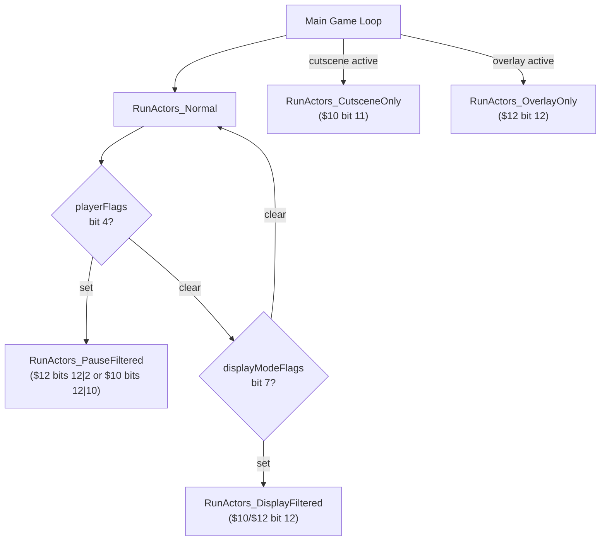

# Actor & Thinker Runtime

> The heart of the per-frame simulation: the actor update loop and its five
> execution contexts, the actor/thinker memory pools, scene actor/thinker
> spawning, and the thinker scheduler.

*Part of the [Bank $03 Documentation Suite](readme.md)*

## Parts in this category

| Part | Range | Source |
|------|-------|--------|
| actor_execution | `$03CAF5`–`$03D12D` | [actor_execution.asm](../../../extracted/system/engine/actor_execution.asm) |
| thinker_execution | `$03D12D`–`$03D1F5` + `$03D7E7`–`$03D86A` | [thinker_execution.asm](../../../extracted/system/engine/thinker_execution.asm) |

> `thinker_execution` is **non-contiguous**: the `RunThinkers_*` dispatch code is
> at `$03D12D`–`$03D1F5` and the `SpawnSceneThinkers`/`InitThinkerFromSceneData`
> code is at `$03D7E7`–`$03D86A` (they straddle `tile_collision_physics`).

## Overview

Actors and thinkers are the two script-driven object types the engine ticks each
frame. **Actors** are the full-featured game objects (player, enemies, NPCs,
projectiles) with movement, collision, and sprite representation. **Thinkers** are
lighter script objects for ambient/visual effects (palette cycling, background
animation, HDMA effects) that run alongside actors but have no collision. Both use
the same COP-script dispatch mechanism and the same frame-timer semantics; they
differ in pool size, per-slot layout, and which loop invokes them.

**Related:** [movement-and-collision.md](movement-and-collision.md) (PostTick movement/collision) · [sprite-rendering.md](sprite-rendering.md) (render list and OAM pipeline) · [scene-and-hardware.md](scene-and-hardware.md) (ClearSceneState pool initialization, actor spawning)

`actor_execution` owns the actor update loop (five state-selected contexts), the
shared pool initialization (`InitActorPool`, which sets up **both** the actor and
thinker pools), the thinker allocator (`ThinkerPoolAlloc`), scene actor spawning,
and defeated-enemy handling. `thinker_execution` owns thinker spawning and the four
per-frame thinker dispatch filters.

---

## actor_execution — `$03CAF5`–`$03D12D`

Source: [actor_execution.asm](../../../extracted/system/engine/actor_execution.asm)

### Execution contexts

Five actor-processing modes selected by game-state flags:

| Context | Selected when | Processes |
|---------|---------------|-----------|
| `RunActors_Normal` | default gameplay | all actors; branches to Pause/Display filters |
| `RunActors_DisplayFiltered` | `displayModeFlags` bit 7 | actors with bit 12 (`$1000`) in `$10`/`$12` |
| `RunActors_PauseFiltered` | `playerFlags` bit 4 | actors with `$12`&`$1004` or `$10`&`$1400`; iframe-only tail for others |
| `RunActors_CutsceneOnly` | cutscene playback | actors with `$10` bit 11 (`$0800`); clears bit 2 each frame |
| `RunActors_OverlayOnly` | overlay rendering | if `displayModeFlags` bit 7 (`$0080`) set, redirects to `RunActors_DisplayFiltered`; otherwise actors with `$12` bit 12 (`$1000`); always simple `ApplyMovement` |

### COP script dispatch

All contexts use the same indirect call: `PHK` / `PEA PostTick-1` / `SEP #$20` /
`LDA $02` (bank) / `PHA` / `REP #$20` / `LDA $00` (addr−1) / `PHA` / `RTL`. This
pushes a return address (`PostTick`) and the target; `RTL` pops the target and
jumps. The `−1` adjustments account for `RTL` adding 1.

### iframe counter (`$7F0028,X`)

Positive values count down (invincibility); negative count up toward zero
(recovery/stagger). At zero, bit 7 (`$0080`) of `$10` is cleared. The player actor
(`CPX $playerActor`) is exempt from the next-actor skip.

### Actor/thinker pool (`InitActorPool`)

Initializes both pools. **Actor pool:** base `$0E00`, 84 slots × `$30` bytes, free
list at `$4E`/`$50`; data regions `$1000`–`$1FBF` (primary), `$7F1000`
(callbacks), `$7F2000` (extended). **Thinker pool:** base `$7E3000`, 16 slots ×
`$10` bytes, free list at `$52`/`$54`; data at `$0F00`, `$7F0E00`, `$7F3000`.
Scene `$FF` uses a simplified clear. `ThinkerPoolAlloc` returns the next free
thinker slot in Y (carry clear) or carry set if exhausted.

### Scene spawning (`SpawnSceneActors`)

Reads the `scene_actors` table: allocate slot (`ActorPoolAllocator`), link into
the doubly-linked list (`$04`/`$06`), call `InitActorFromSceneData` to parse the
binary record.

### Actor record format (`InitActorFromSceneData`)

Variable-length: byte 0–1 = X/Y tile (×16 → px), byte 2 = type flags (bit 0 =
addressing mode), bytes 3–4 = code pointer, byte 5 = bank, byte 6 = stats index,
byte 7 = enemy number, byte 8 = death action. Player actors (bit 15 of `$10`) get
special init (form body table, spriteset, camera centering). Enemies with nonzero
`enemyNum` are checked against WRAM defeat flags (`CheckEnemyDefeatedFlag`);
already-defeated actors are freed via `AdvanceSceneDataAndFree` and their event
block tiles swapped.

### Key routines

| Address | Label | Role |
|---------|-------|------|
| `$03CAF5` | `RunActors_Normal` | standard gameplay tick — guard checks → dispatch → PostTick |
| `$03CBA3` | `RunActors_DisplayFiltered` | `displayModeFlags` bit 7 — only actors with `$1000` in `$10`/`$12` |
| `$03CC3D` | `RunActors_PauseFiltered` | `playerFlags` bit 4 — actors with `$1004`/`$1400`; iframe tail for others |
| `$03CCFF` | `RunActors_CutsceneOnly` | actors with `$10` bit 11 (`$0800`); clears bit 2 each frame |
| `$03CD6E` | `RunActors_OverlayOnly` | display-filter redirect if `$0080` set; else `$12` bit 12 actors; always simple `ApplyMovement` |
| `$03CDDC` | `InitActorPool` | initialize both actor (84 slots) and thinker (16 slots) pools |
| `$03CE8F` | `ThinkerPoolAlloc` | allocate next free thinker slot → Y (CLC) or exhausted (SEC) |
| `$03CEA1` | `SpawnSceneActors` | read `scene_actors` table, allocate/link/parse per actor |

### Actor slot layout (`$30` bytes per slot)

Each actor occupies a `$30`-byte primary slot in the `$1000`–`$1FBF` region, with
parallel data at `$7F1000` (callbacks) and `$7F2000` (extended). The slot base
also serves as the Direct Page during execution.

**Primary slot fields (DP-relative):**

| Offset | Size | Symbol | Purpose |
|--------|------|--------|---------|
| `$00`/`$02` | word+byte | — | COP script entry point (address `$00`, bank `$02`) |
| `$04` | word | — | previous actor link (doubly-linked list) |
| `$06` | word | — | next actor link |
| `$08` | word | — | frame delay timer (counts down; script dispatch blocked while > 0) |
| `$10` | word | — | primary flags (see flag-bit table below) |
| `$12` | word | — | secondary flags |
| `$14` | word | — | actor X position (pixels) |
| `$16` | word | — | actor Y position (pixels) |
| `$18`–`$1F` | — | — | scratch/work variables (context-dependent) |
| `$20`–`$23` | 4 bytes | — | interaction hitbox (used by `combat_collision`) |
| `$24` | word | — | general-purpose timer / animation state |
| `$28` | word | — | animation/direction field (indexed by `GetPlayerFacingDirection`) |

**Parallel callback region (`$7F1000`,X):**

| Offset | Symbol | Purpose |
|--------|--------|---------|
| `$7F1000` | `onHitCallback` | hit-reaction callback pointer |
| `$7F1002` | `onDodgeCallback` | dodge-button callback (overwritten into `$00` by `ProcessDodgeCallbacks`) |
| `$7F1004` | `onDeathCallback` | death-handler override (0 = use `StandardEnemyDefeatHandler`) |
| `$7F1008` | `onCollideCallback` | interaction collision callback |
| `$7F1010` | `scratch1010` | per-actor scratch |
| `$7F101E` | `chainDamage` | accumulated chain-hit damage counter |

**Parallel extended region (`$7F2000`,X) and other `$7F00xx` fields:**

| Offset | Symbol | Purpose |
|--------|--------|---------|
| `$7F0006` | `spritesetPtr` | spriteset data pointer |
| `$7F000A` | `chatPtr` | NPC chat/item give pointer |
| `$7F000C` | `metaspritePtr` | metasprite definition pointer (hitbox header at base) |
| `$7F0020` | `statsPtr` | stats table pointer |
| `$7F0022` | `enemyNum` | enemy number (0 = not an enemy) |
| `$7F0024` | `deathActionIdx` | death action index |
| `$7F0026` | `currentHp` | current HP |
| `$7F0028` | `iframeCounter` | iframe counter (+count down = invincible, −count up = stagger) |
| `$7F002A` | `extendedFlags` | extended flag word |
| `$7F002C` | `moveScratch1` | movement override X delta |
| `$7F002E` | `moveScratch2` | movement override Y delta |

### Primary flag bits (`$10`)

| Bit | Mask | Meaning |
|-----|------|---------|
| 0 | `$0001` | depth sort: always front (with bit 1 clear) |
| 1 | `$0002` | depth sort: always behind |
| 2 | `$0004` | solid-contact (set by tile collision, cleared each frame by PostTick) |
| 3 | `$0008` | grounded — use `ApplyMovementWithCollision` instead of simple `ApplyMovement` |
| 6 | `$0040` | orb / special state — suppresses combat collision |
| 7 | `$0080` | iframe active (set when `iframeCounter` is nonzero) |
| 9 | `$0200` | game-over flag (player only) |
| 10 | `$0400` | combat-eligible / standard defeat; pause-filter pass (with bit 12) |
| 11 | `$0800` | cutscene-active — processed by `RunActors_CutsceneOnly` |
| 12 | `$1000` | display-active / overlay-active; pause-filter pass (with bit 10) |
| 13 | `$2000` | COP script mode active — dispatch via indirect RTL call |
| 15 | `$8000` | player actor identifier |

### Secondary flag bits (`$12`)

| Bit | Mask | Meaning |
|-----|------|---------|
| 0 | `$0001` | stagger-type iframe (assigns `$FFEF` negative counter instead of `$0011`) |
| 2 | `$0004` | pause-filter pass (with bit 12) |
| 3 | `$0008` | COP movement request — enables collision movement during COP mode |
| 4 | `$0010` | damage immunity |
| 12 | `$1000` | display/overlay filter pass |

### Cross-references

- **In:** `system_core` main loop (external) — selects one execution context per
  game-state combination (`Normal` → branches to `PauseFiltered` or
  `DisplayFiltered`; `CutsceneOnly` and `OverlayOnly` are separate call sites).
  `RunActors_OverlayOnly` checks `displayModeFlags` bit 7 first and redirects to
  `RunActors_DisplayFiltered` when set.
- **Out:** `tile_collision_physics.ApplyMovement` / `ApplyMovementWithCollision`
  (PostTick), `thinker_execution.ThinkerPoolAlloc` (shared allocator),
  `event_blocks.ApplyAllEventBlocks` (tile swap for defeated enemies),
  COP handlers `SpawnThinker`/`SpawnThinkerParam` (call `ThinkerPoolAlloc`).

### Notes

**Scene `$FF` (title screen):** `InitActorPool` detects `sceneCurrent == $FF` and
takes a simplified clear path that skips the `$7F2000` actor extended region and
the `$7F3000` thinker extended region, preserving state needed by the title
sequence.

**Pool free lists:** both actor and thinker pools use word-sized singly-linked free
lists terminated by `$FFFF`. The actor free list at `$0E00` contains ascending slot
addresses with `$30`-byte stride (84 entries); the thinker free list at `$7E3000`
has `$10`-byte stride (16 entries). Head pointers: actors at `$4E`/`$50`, thinkers
at `$52`/`$54` (long pointer).

**Input lock handling:** `RunActors_Normal` checks `playerFlags` bit 3 (`$0008`)
before any actor dispatch. When set, it clears the B button (`$8000`) from
`joypadCurrent`, preventing attacks while input is locked (cutscene guidance,
NPC walks, etc.).

---

## thinker_execution — `$03D12D`–`$03D1F5` + `$03D7E7`–`$03D86A`

Source: [thinker_execution.asm](../../../extracted/system/engine/thinker_execution.asm)

### Thinker data model

16 slots × `$10` bytes at `$0F00` (allocated via `actor_execution.ThinkerPoolAlloc`):

| Field | Meaning |
|-------|---------|
| `$0000,X` | code entry point (word) |
| `$0002,X` | bank byte |
| `$0004,X` | previous link |
| `$0006,X` | next link |
| `$0008,X` | frame delay timer |
| `$7F0000,X` | animScratch (thinker scratch) |
| `$7F000E,X` | animScratch2 (thinker type filter flags) |

The thinker list is rooted at `$005A` (head) / `$005C` (tail).

### Spawning (`SpawnSceneThinkers`, `$03D7E7`)

Reads `scene_thinkers[$0646]`. If the pointer is zero or bit 7 (`$0080`) is set in
the first data byte, the scene has no thinkers. For each record (terminated by
`$FF`): allocate a slot, link into the list, call `InitThinkerFromSceneData`. That
parser reads type → `$7F0002,X` (animScratch+2), code pointer → `$42`, bank → `$44`, dereferences
the code pointer's first word into animScratch2 (filter flags), then stores
entry point (`code + 2`) and bank to `$0000`/`$0002`.

### Execution filters (`$03D12D`)

Four dispatch filters keyed on animScratch2 (`$7F000E,X`) bits, called at different
points in the game loop:

| Filter | Condition | Use |
|--------|-----------|-----|
| `RunThinkers_TypeA` | bit 2 (`$0004`) CLEAR | general (ambient, palette, bg anim), normal gameplay |
| `RunThinkers_TypeB` | bit 2 SET | deferred/secondary (ordered after A) |
| `RunThinkers_TypeC` | bit 11 (`$0800`) SET, bit 2 CLEAR | cutscene overlay, primary phase |
| `RunThinkers_TypeD` | bits 11 AND 2 SET | cutscene deferred |

All four share the actor-style COP dispatch (`PHK`/`PEA`/`PHA`/`RTL`): traverse
from `$5A`, check filter flags, decrement the frame timer, dispatch to the
thinker's entry. Each `_Next` follows the `$06` link or exits when the list ends.

### Key routines

| Address | Label | Role |
|---------|-------|------|
| `$03D12D` | `RunThinkers_TypeA` | general thinkers: bit 2 CLEAR |
| `$03D15D` | `RunThinkers_TypeB` | deferred thinkers: bit 2 SET |
| `$03D18D` | `RunThinkers_TypeC` | cutscene primary: bit 11 SET, bit 2 CLEAR |
| `$03D1C2` | `RunThinkers_TypeD` | cutscene deferred: bits 11 AND 2 SET |
| `$03D7E7` | `SpawnSceneThinkers` | read scene thinker list, allocate + link + parse |
| `$03D831` | `InitThinkerFromSceneData` | parse thinker record: type → animScratch+2, code → entry, filter flags from first word |

### Game-loop call order

The four thinker filters are called at specific points in the `system_core` main
loop, ensuring correct ordering:

| Call order | Filter | Context |
|------------|--------|---------|
| 1 | `RunThinkers_TypeA` | after actor execution, during normal gameplay |
| 2 | `RunThinkers_TypeB` | immediately after TypeA (deferred effects render after primary) |
| 3 | `RunThinkers_TypeC` | during cutscene playback (primary cutscene effects) |
| 4 | `RunThinkers_TypeD` | after TypeC (deferred cutscene effects) |

### Scene thinker record format

The `scene_thinkers` table at `[$0646]` provides a per-scene pointer to a
variable-length thinker definition list. `SpawnSceneThinkers` reads this list:

- If the pointer is zero or the first data byte has bit 7 (`$0080`) set, the scene
  has no active thinkers.
- Each record is terminated by an `$FF` byte (end of list).
- Per record: `InitThinkerFromSceneData` reads:
  1. Type byte → `$7F0002,X` (animScratch+2)
  2. Code pointer (word) → `$42`
  3. Bank byte → `$44`
  4. Dereferences the code pointer's first word → `$7F000E,X` (animScratch2 =
     filter flags); the thinker's actual entry point is `code + 2` (skipping the
     filter word).

### Cross-references

- **In:** `system_core` main loop (each filter at its dedicated loop point);
  `scene_lifecycle.ClearSceneState` calls `SpawnSceneThinkers` during scene setup.
- **Out:** `actor_execution.ThinkerPoolAlloc` (slot allocation);
  thinker scripts dispatched: `mode7_perspective`, `IrisCircleEffect`,
  `HdmaWindowEffect`, palette cyclers, background animators, etc.

### Notes

**Filter flag semantics:** The animScratch2 word (`$7F000E,X`) read from the first
word of the thinker's code serves as a permanent type tag. The four `RunThinkers_*`
routines test specific bits to decide whether to dispatch a given thinker. A
thinker with animScratch2 = `$0000` (both bits 2 and 11 clear) will only be
processed by TypeA. Setting bit 2 (`$0004`) shifts it to TypeB. Bit 11 (`$0800`)
enables cutscene filters (TypeC/D). This system allows a single linked list to
serve four execution phases without separate lists.

**Dispatch pattern:** Identical to actors — `PHK` / `PEA Next-1` / `SEP #$20` /
`LDA $02` (bank) / `PHA` / `REP #$20` / `LDA $00` (addr−1) / `PHA` / `RTL`.
The `_Next` label for each filter follows the `$06` link; if zero (end of list),
the filter returns via `RTL`.

---

## Category-wide notes

**Shared pool initialization:** Both pools are set up by
`actor_execution.InitActorPool` (`$03CDDC`). The actor pool's 84 slots (base
`$0E00`, stride `$30`, data at `$1000`) and the thinker pool's 16 slots (base
`$7E3000`, stride `$10`, data at `$0F00`) use the same free-list design:
word-sized entries containing ascending slot addresses, terminated by an `$FFFF`
sentinel.

**COP dispatch trick:** Both actors and thinkers use the identical `PHK`/`PEA`/
`PHA`/`RTL` indirect-call pattern. The key insight: `RTL` pops a 3-byte address
and adds 1 (the `−1` adjustment when pushing compensates for this). Two addresses
are pushed — first the PostTick return address, then the script target. `RTL` pops
the target and jumps to the script; when the script returns via `RTL`, execution
resumes at PostTick (or `_Next` for thinkers).

**Actor vs. thinker differences:**

| Property | Actors | Thinkers |
|----------|--------|----------|
| Pool slots | 84 × `$30` bytes | 16 × `$10` bytes |
| Free-list head | `$4E`/`$50` | `$52`/`$54` (long) |
| Data regions | `$1000`, `$7F1000`, `$7F2000` | `$0F00`, `$7F0E00`, `$7F3000` |
| Linked list root | `$56` (head) | `$5A` (head), `$5C` (tail) |
| Link offsets | `$04` (prev), `$06` (next) | `$0004` (prev), `$0006` (next) |
| Movement | PostTick applies collision/simple | none — thinkers have no movement |
| Sprite rendering | yes (metasprite decomposition) | no |
| Execution filters | 5 contexts (state flags) | 4 type filters (animScratch2 bits) |

---

## See Also

- [movement-and-collision.md](movement-and-collision.md) — `ApplyMovement` / `ApplyMovementWithCollision` called from PostTick
- [sprite-rendering.md](sprite-rendering.md) — `SortActorsByDepth` processes the actor linked list into a render list
- [scene-and-hardware.md](scene-and-hardware.md) — `ClearSceneState` calls `InitActorPool` and `SpawnSceneActors`
- [mode7-and-cutscenes.md](mode7-and-cutscenes.md) — cutscene actors and Mode 7 thinkers use actor/thinker runtime
- [Bank $03 index](readme.md) — bank-wide memory map, WRAM reference, design patterns
