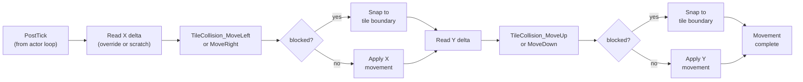

# Movement & Combat Collision

*Part of the [Bank $03 Documentation Suite](index.md)*

> Tile-based actor movement (with and without collision) and the actor-vs-actor
> combat/interaction collision + damage system.
>
> All addresses are hexadecimal (bank byte `$03`).

## Parts in this category

| Part | Range | Source |
|------|-------|--------|
| tile_collision_physics | `$03D1F5`–`$03D7E7` | [tile_collision_physics.asm](../../../extracted/system/engine/tile_collision_physics.asm) |
| combat_collision | `$03BB85`–`$03C5FF` | [combat_collision.asm](../../../extracted/system/engine/combat_collision.asm) |

## Overview

Two complementary collision domains. **`tile_collision_physics`** resolves an
actor's movement against the static tile map — the axis-separated pipeline invoked
from the actor post-tick to move actors while respecting walls and floors.
**`combat_collision`** resolves dynamic actor-vs-actor overlaps — the combat hit
tests (player↔enemy) and NPC/object interaction tests, plus damage math,
knockback, and death handling. Together they turn per-actor movement intentions
and attack states into world interactions each frame.

**Related:** [actor-thinker-runtime.md](actor-thinker-runtime.md) (actor execution calls PostTick movement) · [sprite-rendering.md](sprite-rendering.md) (damage digits → OAM compose buffer) · [field-input-and-items.md](field-input-and-items.md) (GetPlayerFacingDirection used by knockback)

---

## tile_collision_physics — `$03D1F5`–`$03D7E7`

Source: [tile_collision_physics.asm](../../../extracted/system/engine/tile_collision_physics.asm)

### Movement entry points

Called from the actor-execution post-tick:

- `ApplyMovement` — direct delta application, **no** collision (airborne/overlay
  actors).
- `ApplyMovementWithCollision` — full tile-collision pipeline (grounded actors).

Both read movement from an override chain pointer (`$2C`/`$2E` → linked movement
sources) or per-actor scratch (`moveScratch1`/`moveScratch2` at `$7F002C`/
`$7F002E`). Direction word `$12` controls negation: bit 14 (`$4000`) flips X,
bit 13 (`$2000`) flips Y.

### Collision pipeline (per axis)

1. Read delta (override or scratch).
2. Negate per direction flags.
3. `PEA` a post-collision handler as the return address.
4. `JMP` to `TileCollision_MoveLeft`/`TileCollision_MoveRight` or
   `TileCollision_MoveUp`/`TileCollision_MoveDown` by delta sign.
5. `TileCollision_MoveLeft`/`TileCollision_MoveRight`/`TileCollision_MoveUp`/
   `TileCollision_MoveDown` checks tiles along the leading hitbox edge.
6. Return carry set (blocked → snapped to tile boundary) or clear (passed).
7. Post-collision handler applies residual movement, clears scratch.

X is resolved first, then Y. `CollisionY_Setup` includes a **bounce** mechanism:
if solid-contact (`$10` bit 2) and bounce flag (`extendedFlags` bit 6 = `$0040`)
are both set, direction bits are reversed via `EOR $6000` on `$12`.

### Tile map format

Accessed via long pointer `[$80]` with offsets from `CalcTileMapOffset`. Each byte
encodes two collision nibbles:
- High nibble (`$F0`): nonzero = immediately solid (wall).
- Low nibble (`$0F`): tile type for the dispatch table (0 = passable/
  check-adjacent, 1–F = solid).

Packed encoding: low nibble of the offset = row within a metatile, high nibble =
column, with `mapRowStrideL0` (`$0693`) controlling metatile page stride.

### Hitbox data (metasprite header `[metaspritePtr]`)

| Offset | Meaning |
|--------|---------|
| `$0000` | signed X left offset (sign-extended `ORA #$FF00`) |
| `$0001` | signed Y top offset |
| `$0002` | X width in tiles (scan count for vertical edges) |
| `$0003` | Y height in tiles (scan count for horizontal edges) |

### Key routines

| Address | Label | Role |
|---------|-------|------|
| `$03D1F5` | `ApplyMovement` | simple delta application — no collision (airborne/overlay actors) |
| `$03D276` | `ApplyMovementWithCollision` | full tile-collision pipeline (grounded actors) |
| `$03D2B9` | `CollisionX_PostMove` | post-collision X: apply residual movement, clear scratch |
| `$03D337` | `CollisionY_Setup` | Y-axis setup: direction check, bounce logic, `PEA` return, branch to `TileCollision_MoveUp`/`TileCollision_MoveDown` |
| `$03D39C` | `TileCollision_MoveLeft` | scan tiles along left hitbox edge downward |
| `$03D41F` | `TileCollision_MoveRight` | scan tiles along right hitbox edge downward |
| `$03D4AD` | `TileTypeJumpTable_Horizontal` | 16-entry horizontal tile type dispatch |
| `$03D4CD` | `TileCollision_SolidH` | transfer tile offset → `BlockH` |
| `$03D4CE` | `TileCollision_BlockH` | snap X to tile boundary (left or right edge); set `$0004` flag |
| `$03D53B` | `TileCollision_PassH` | no collision: restore DP/DBR, carry clear |
| `$03D541` | `TileCollision_CheckAdjacentH` | sub-tile boundary test: if misaligned, check next tile right |
| `$03D556` | `TileCollision_MoveUp` | scan tiles along top hitbox edge rightward |
| `$03D5D7` | `TileCollision_MoveDown` | scan tiles along bottom hitbox edge rightward |
| `$03D65C` | `TileTypeJumpTable_Vertical` | 16-entry vertical tile type dispatch |
| `$03D67C` | `TileCollision_BlockV` | snap Y to tile boundary (top or bottom edge); set `$0004` flag |
| `$03D6E9` | `TileCollision_PassV` | no collision: carry clear |
| `$03D6EF` | `TileCollision_CheckAdjacentV` | sub-tile boundary test: if misaligned, check tile below |
| `$03D704` | `TileCollision_SolidV` | transfer tile offset → `BlockV` |
| `$03D708` | `CheckActorOnSpecialTile` | probe for special tile patterns (`$06` diagonal, `$00`/`$09` L-shape) |
| `$03D78A` | `CalcTileMapOffset` | convert (column, row) tile coords to collision map byte offset |
| `$03D7B4` | `AdvanceTileOffsetRight` | advance tile offset by one column |
| `$03D7CA` | `AdvanceTileOffsetDown` | advance tile offset by one row |

### Tile-type dispatch tables

Both horizontal and vertical jump tables have 16 entries (types `$0`–`$F`).

**Horizontal (`$03D4AD`):**

| Type | Handler | Behavior |
|------|---------|----------|
| `$0` | `TileCollision_CheckAdjacentH` | passable if tile-aligned; check adjacent tile if sub-pixel |
| `$1`–`$F` | `TileCollision_SolidH` | unconditional solid wall |

**Vertical (`$03D65C`):**

| Type | Handler | Behavior |
|------|---------|----------|
| `$0` | `TileCollision_CheckAdjacentV` | passable if tile-aligned; check tile below if sub-pixel |
| `$1`–`$F` | `TileCollision_SolidV` | unconditional solid wall |

> **Note:** Despite 15 type slots being available for slopes, ledges, water, etc.,
> the shipped game maps all non-zero types to "solid." Any slope or terrain-type
> effects are handled elsewhere (e.g., via special tile detection in
> `CheckActorOnSpecialTile` or via COP script logic, not through this dispatch).

### Special tile detection (`CheckActorOnSpecialTile`)

Called before the normal collision scan. Probes the tile at (actorX − 8,
actorY − 16) — center-left of the actor, one tile above the feet. Two patterns
are detected:

1. **Type `$06` diagonal:** If the probed tile is `$06` and its right-down diagonal
   neighbor is also `$06`, returns SEC (special). Used for staircase/diagonal
   walkways.
2. **Type `$00`/`$09` L-shape:** If the probed tile is `$00` (empty), checks the
   tile below. If that's `$09`, restores the offset and checks the tile to the
   right. If the right tile is also `$09`, returns SEC. Used for corner transitions.

When SEC is returned, the caller skips normal collision — the actor moves freely
through these special formations.

### Bounce mechanism (`CollisionY_Setup`)

Before dispatching to `TileCollision_MoveUp`/`TileCollision_MoveDown`,
`CollisionY_Setup` checks two conditions: `$10` bit 2 (solid-contact from the X
pass) AND `extendedFlags` bit 6 (`$0040` = bounce enabled). If both set, the Y
direction bits in `$12` are flipped via `EOR $6000` (toggling bits 13 and 14),
reversing vertical movement. This creates bouncing behavior for projectiles that
hit walls.

### Cross-references

- **In:** `actor_execution.RunActors_*PostTick` — `JSR ApplyMovement` (bit 3
  clear) or `JSR ApplyMovementWithCollision` (bit 3 set).
- **Out:** No outgoing calls — this is a leaf system. `CalcTileMapOffset` reads
  the collision map via long pointer `[$80]`; tile data is loaded by
  `scene_lifecycle` during scene setup.

### Notes

**Movement source chain:** Both entry points first check the movement override
chain (`$2C`/`$2E` → linked external movement sources). If the pointer is nonzero,
it reads deltas from the linked structure. If zero, falls back to per-actor scratch
(`moveScratch1`/`moveScratch2` at `$7F002C`/`$7F002E`). Direction word `$12`
controls negation: bit 14 (`$4000`) flips X, bit 13 (`$2000`) flips Y.

**Snap algorithm:** `BlockH`/`BlockV` use the same logic: align the trial position
to a 16-pixel grid (`AND $FFF0`). For movement toward increasing coordinates
(right/down), snap to the left/top edge of the blocking tile. For decreasing
(left/up), check sub-tile alignment — if not tile-aligned, round up
(`AND $FFF0 + $0010`) to the near edge. Both set `$0004` in `$10` (solid-contact)
and return carry set.

**Axis priority:** X is always resolved first, then Y. This means horizontal
collisions take priority — an actor sliding along a wall corner will resolve the
X snap before testing Y, which can affect the exact contact point.

---

## combat_collision — `$03BB85`–`$03C5FF`

Source: [combat_collision.asm](../../../extracted/system/engine/combat_collision.asm)

### Pipeline overview

Iterates the **actor render list** (`$0C00`, word entries) as the candidate
source — only on-screen actors are tested.

- `RunCombatCollision` — outer entry. If the player's orb flag (`$0040` in `$10`)
  is set, no combat; otherwise iterate the render list.
- `RunInteractionCollision` — separate entry for NPC/object interactions. Tests
  the player bounding box (±4px X, −4/−14px Y) against interaction hitboxes;
  checks `$2040` (COP mode + orb) to skip and `$0280` to route to friendly mode.

### Combat collision (two-phase)

- **Phase 1** (outer): for each enemy, check player-attacking eligibility
  (`$0080` hittable AND `$0040` not orb-protected AND `$12`&`$0010` not
  damage-immune); if eligible, `PlayerAttackHitTest`.
- **Phase 2** (inner, `CombatCollision_InnerLoop`): builds the current enemy's
  AABB from metasprite header `$0004`–`$0007`, then tests all actors against it
  for enemy-hits-player overlap using victim slot fields `$0020`–`$0023`. Two
  paths based on zero-page scratch flag `$20` (set nonzero in outer loop for
  friendly actors via `$10` bit 5 / `$0020`): normal (`$76E0` exclusion) or
  friendly (`$74E0` mask + `extendedFlags` `$0010` check).

### Hitbox format (metasprite header `$0004`–`$0007`)

Signed 8-bit offsets: `$0004` X offset (sign via `$0080`), `$0005` X width,
`$0006` Y offset, `$0007` Y height. `ASL ASL` on `$000E,X` extracts the H-mirror
flag, flipping hitbox X (BCS path negates offsets).

### Damage formulas

- Player attacks enemy (`PlayerAttackHitTest`): `damage = (chainDamage >> 1) + 1`;
  `chainDamage` is halved and written back (`LSR` then `STA $chainDamage,X`).
  With no external preload, consecutive hits stay at base damage.
  `enemyHP = max(0, enemyHP − damage)`.
- Enemy attacks player (`EnemyHitPlayerHandler`):
  `totalStr = playerStr + previousDamage($09E2) + climbStateData` — `previousDamage`
  is skipped when ZP `$08 == $1000`;
  `rawDamage = max(1, enemyAtk − totalStr)`;
  `netDamage = rawDamage + victim slot $0008`.

### Key routines

| Address | Label | Role |
|---------|-------|------|
| `$03BB85` | `ProcessDodgeCallbacks` | B-button check → overwrite actor entry point with `onDodgeCallback` |
| `$03BBB4` | `CheckPlayerDeath` | if `playerHp` == 0, set `$0200`, assign `GameOverSequence` |
| `$03BBE4` | `RunCombatCollision` | outer entry: clear HP display, check orb flag `$0040` |
| `$03BBF9` | `CombatCollision_EnemyLoop` | phase 1: per-enemy eligibility → `PlayerAttackHitTest` |
| `$03BC20` | `CombatCollision_NextTarget` | advance render list, build enemy AABB, enter inner loop |
| `$03BCBC` | `CombatCollision_InnerLoop` | phase 2: test all actors against enemy AABB for contact |
| `$03BD5A` | `CombatCollision_Exit` | restore DBR/flags, `RTL` |
| `$03BD5D` | `PlayerAttackHitTest` | build player attack AABB, iterate targets, apply damage |
| `$03BF22` | `PlayerAttackHitTest_End` | end of player attack iteration |
| `$03BF27` | `EnemyHitPlayerHandler` | process enemy→player contact (damage, knockback, death) |
| `$03BF84` | `EnemyHitPlayer_Epilogue` | iframe assignment + hit sound |
| `$03C116` | `InvinciblePlayerHit` | invincible player contact (no damage, still triggers reaction) |
| `$03C142` | `CalcKnockbackDirection` | hitbox-midpoint comparison → cardinal direction (0=S/1=N/2=W/3=E) |
| `$03C25B` | `InteractionCollision_Exit` | interaction iteration end |
| `$03C25E` | `RunInteractionCollision` | NPC/object interaction entry (player bbox vs. interaction hitboxes) |
| `$03C298` | `InteractionCollision_LoopBody` | per-actor interaction AABB test |
| `$03C362` | `InteractionCollision_FriendlyMode` | friendly actor subset test (`$0020` flag + simplified hitbox) |
| `$03C3E0` | `ApplyInteractionDamage` | combat: damage calc → `HitStaggerMain`; NPC: → `NPCChat` |
| `$03C4D5` | `InteractionDamage_NPCChat` | NPC interaction: `GiveItemToPlayer` or dialogue conversion |
| `$03C524` | `CalcKnockbackFromActorCenters` | raw center comparison (pos ± 4px) → direction |
| `$03C58F` | `FormatDamageDigits` | 16-bit → packed BCD (hundreds:tens:ones); carry set if ≥ 1000 |

### Combat flag-mask reference

These multi-bit masks are used to quickly exclude actors from collision tests:

| Mask | Used by | Bits set | Meaning |
|------|---------|----------|---------|
| `$76E0` | `CombatCollision_InnerLoop` (normal) | 14,13,12,10,9,7,6,5 | skip: dead, orb, COP, display, overlay, pause |
| `$74E0` | `CombatCollision_InnerLoop` (friendly) | 14,13,12,10,7,6,5 | like `$76E0` but allows `$0200` (game-over actors still interact) |
| `$36F0` | `PlayerAttackHitTest` | 13,12,10,9,7,6,5,4 | skip: friendly, dead, orb, COP, display |
| `$D460` | `ProcessDodgeCallbacks` | 15,14,12,10,6 | skip: player, dead, COP, overlay, orb |
| `$35C0` | `InteractionCollision_LoopBody` | 13,12,10,8,7,6 | skip: friendly, dead, orb, COP, display |
| `$2040` | `RunInteractionCollision` | 13,6 | skip: COP mode + orb |
| `$0280` | `RunInteractionCollision` | 9,7 | route flag: if set, use friendly-mode test |

### Chain-damage system

`chainDamage` (`$7F101E,X`) tracks diminishing returns within the same attack
sequence:

1. On each `PlayerAttackHitTest` hit: `damage = (chainDamage >> 1) + 1`.
2. `chainDamage` is halved and written back (`LSR` then `STA $chainDamage,X`).
3. With no external preload into `$7F101E`, consecutive hits in the same sequence
   stay at base damage (`chainDamage` starts at 0 → damage = 1 each hit).
4. Chain resets when the attack sequence ends (iframe or new attack).

External preloading of `chainDamage` (via COP or scripts) can seed higher
first-hit damage; each subsequent hit still halves the stored value before the
next calculation.

### Climb-state data source

`EnemyHitPlayerHandler` damage formula:
`totalStr = playerStr($0ADE) + previousDamage($09E2) + climbStateData($09E0)`.
`previousDamage` at `$09E2` is omitted from `totalStr` when ZP `$08 == $1000`.
`climbStateData` at `$09E0` adds a context-dependent defense bonus — when the
player is climbing or in an elevated position, this value is nonzero, providing
passive damage reduction.

### Friendly-mode behavior

When `RunInteractionCollision` detects `$0280` in the candidate's flags, it enters
`InteractionCollision_FriendlyMode` (`$03C362`). This path only tests actors with
`$10` bit 5 (`$0020`) set (friendly/NPC flag). Hitbox data comes from the
metasprite header (`$0004`–`$0007`) — no H-mirror adjustment. On overlap,
`ApplyInteractionDamage` routes to `InteractionDamage_NPCChat` which attempts
`GiveItemToPlayer` with `chatPtr`. If inventory is full, shows the overflow
message. Otherwise shows dialogue and converts the actor to `NullActorScriptStub`
(sets `$0700` in primary flags `$10` via `ORA #$0700` on `$0010,X` — bits 10+11 —
to prevent re-interaction within the same screen visit).

### Cross-references

- **In:** `system_core` main loop — `RunCombatCollision` after actor AI + sprite
  composition; `RunInteractionCollision` at a separate loop point;
  `ProcessDodgeCallbacks` called per-frame before combat.
- **Out:**
  - `oam_digit_compose.ComposeDigitSprites` — damage number sprite display
  - `SpawnAttackTrailEffect` — floating damage number actors
  - `hit_stagger_controller.HitStaggerMain` — knockback stagger actor
  - `StandardEnemyDefeatHandler` — default enemy death handler
  - `game_over_sequence.GameOverSequence` — player death sequence
  - `StopPlayerOnDeathAssign` — halt player movement on death
  - `inventory_mgmt.GiveItemToPlayer` — NPC chat item delivery
  - `dialogue_display` — NPC dialogue rendering
  - `NullActorScriptStub` — post-interaction actor neutralization
  - `GetPlayerFacingDirection` — knockback fallback direction (player attacker)

---

## Category-wide notes

**Metasprite hitbox layouts:** Both systems read hitbox data from the metasprite
header, but at different offsets for different purposes:

| Offset | Used by | Fields |
|--------|---------|--------|
| `$0000`–`$0003` | `tile_collision_physics` | tile collision box: `$00`=X offset, `$01`=Y offset, `$02`=X width (tiles), `$03`=Y height (tiles) |
| `$0004`–`$0007` | `combat_collision` (enemy AABB, interaction/friendly hitbox) | combat/interaction hitbox: `$04`=X offset, `$05`=X width, `$06`=Y offset, `$07`=Y height |
| `$0020`–`$0023` | `combat_collision` (inner loop victim AABB) | per-slot contact hitbox for enemy→player overlap tests in `CombatCollision_InnerLoop` |

The tile collision hitbox (`$0000`) measures in tiles (multiplied by the scan loop
count). The combat hitbox (`$0004`) measures in pixels with signed offsets
(sign-extended from 8 bits). Interaction collision (both normal and friendly mode)
reads hitbox data from the metasprite header (`$0004`–`$0007`), not from actor
slot fields `$0020`–`$0023`. The inner-loop victim fields `$0020`–`$0023` are used
only for enemy→player contact overlap in phase 2.

**Render-list iteration:** Both combat and interaction collision iterate the **actor
render list** at `$0C00` (word entries of actor slot addresses). Only actors that
were visible during the last sprite composition pass appear in this list, so
off-screen actors are never tested — this is an important performance optimization.
The combat outer loop (`CombatCollision_EnemyLoop`) and the interaction loop
(`InteractionCollision_LoopBody`) share the same list but use different flag masks
to filter candidates.

---

## See Also

- [actor-thinker-runtime.md](actor-thinker-runtime.md) — actor execution PostTick dispatches to `ApplyMovement` / `ApplyMovementWithCollision`
- [sprite-rendering.md](sprite-rendering.md) — `FormatDamageDigits` → `ComposeDigitSprites` → OAM compose buffer
- [field-input-and-items.md](field-input-and-items.md) — `GetPlayerFacingDirection` used by `CalcKnockbackDirection` fallback
- [scene-and-hardware.md](scene-and-hardware.md) — combat death triggers scene transitions
- [Bank $03 index](index.md) — bank-wide memory map, collision type reference, design patterns
