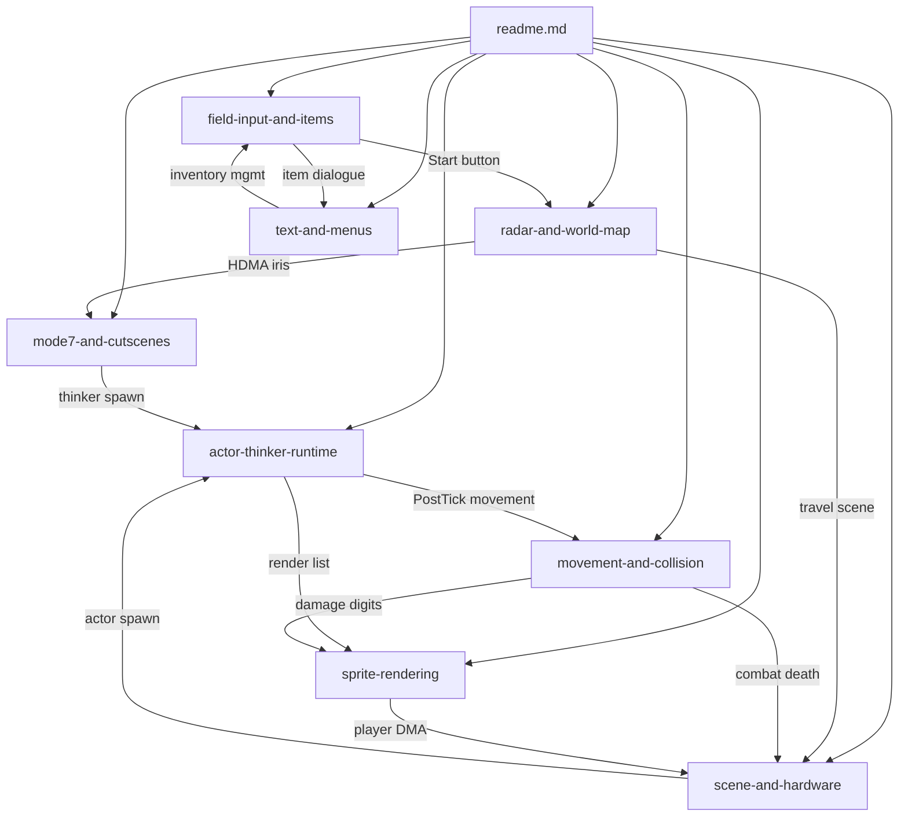

# Bank $03 — Engine Core Reference

> Source-of-truth documentation for the Illusion of Gaia engine code residing in
> ROM bank `$03`. Bank membership is determined by address ranges in
> [`db-us/blocks.json`](../../../db-us/blocks.json) (not the `?BANK` directive).

---

## 1. Bank Overview

Bank `$03` holds the **runtime engine core** of IOG: the per-frame game loop
subsystems (actors, thinkers, collision, sprites), the field-input/item/inventory
UI layer, the world-map and radar navigation screens, the Mode 7 perspective and
HDMA cutscene machinery, the text/menu renderers, and the scene-lifecycle +
hardware-I/O (DMA/HDMA/SPC) + save infrastructure.

| Metric | Value |
|--------|-------|
| **Documented span** | `$038000`–`$03F201` |
| **Total size** | ~28.5 KB (contiguous, no gaps) |
| **Source files** | 27 `.asm` units in `extracted/` |
| **Document suite** | 8 topic docs + this index |
| **Primary caller** | `system_core` main game loop (bank `$02`) |

> The remainder of the bank (`$03F201`–`$03FFFF`) is unmapped filler.

---

## 2. Memory Map

Blocks are listed in ascending address order. Non-contiguous units (`⇢`) have
their fragments interleaved with neighbors but are documented together.

```
$038000 ┌──────────────────────────────────────────────┐
        │ GlobalInputHandler          $038000–$0380BF  │  Field Input & Items
$0380BF ├──────────────────────────────────────────────┤
        │ radar_map_screen            $0380BF–$038410  │  Radar & World Map
$038410 ├──────────────────────────────────────────────┤
        │ item_use_system             $038410–$03A0AA  │  Field Input & Items
        │   (item dispatcher + 41 handlers + strings)  │
$03A0AA ├──────────────────────────────────────────────┤
        │ garden_crash_cutscene       $03A0AA–$03A1FA  │  Mode 7 & Cutscenes
$03A1FA ├──────────────────────────────────────────────┤
        │ future_vision_cutscene      $03A1FA–$03A2F1  │  Mode 7 & Cutscenes
$03A2F1 ├──────────────────────────────────────────────┤
        │ WorldMapController          $03A2F1–$03A6BA  │  Radar & World Map
$03A6BA ├──────────────────────────────────────────────┤
        │ IrisCircleEffect            $03A6BA–$03A83E  │  Mode 7 & Cutscenes
$03A83E ├──────────────────────────────────────────────┤
        │ HdmaWindowEffect            $03A83E–$03A940  │  Radar & World Map
$03A940 ├──────────────────────────────────────────────┤
        │ mode7_perspective           $03A940–$03AB88  │  Mode 7 & Cutscenes
$03AB88 ├──────────────────────────────────────────────┤
        │ mode7_perspective_unused    $03AB88–$03AD77  │  Mode 7 & Cutscenes (dead)
$03AD77 ├──────────────────────────────────────────────┤
        │ world_map_routes  (data)    $03AD77–$03B1D4  │  Radar & World Map
$03B1D4 ├──────────────────────────────────────────────┤
        │ world_map_names   (data)    $03B1D4–$03B401  │  Radar & World Map
$03B401 ├──────────────────────────────────────────────┤
        │ world_map_options (data+code)$03B401–$03BAE1 │  Radar & World Map
$03BAE1 ├──────────────────────────────────────────────┤
        │ oam_digit_compose           $03BAE1–$03BB85  │  Sprite Rendering
$03BB85 ├──────────────────────────────────────────────┤
        │ combat_collision            $03BB85–$03C5FF  │  Movement & Collision
$03C5FF ├──────────────────────────────────────────────┤
        │ sprite_composition ⇢        $03C5FF–$03CAF5  │  Sprite Rendering
$03CAF5 ├──────────────────────────────────────────────┤
        │ actor_execution             $03CAF5–$03D12D  │  Actor & Thinker Runtime
$03D12D ├──────────────────────────────────────────────┤
        │ thinker_execution ⇢         $03D12D–$03D1F5  │  Actor & Thinker Runtime
$03D1F5 ├──────────────────────────────────────────────┤
        │ tile_collision_physics      $03D1F5–$03D7E7  │  Movement & Collision
$03D7E7 ├──────────────────────────────────────────────┤
        │ thinker_execution ⇢         $03D7E7–$03D86A  │  Actor & Thinker Runtime
$03D86A ├──────────────────────────────────────────────┤
        │ sprite_composition ⇢        $03D86A–$03D881  │  Sprite Rendering
$03D881 ├──────────────────────────────────────────────┤
        │ hdma_dma_spc ⇢              $03D881–$03D916  │  Scene & Hardware
$03D916 ├──────────────────────────────────────────────┤
        │ save_system                 $03D916–$03D9E8  │  Scene & Hardware
$03D9E8 ├──────────────────────────────────────────────┤
        │ scene_lifecycle             $03D9E8–$03E0B0  │  Scene & Hardware
$03E0B0 ├──────────────────────────────────────────────┤
        │ hdma_dma_spc ⇢              $03E0B0–$03E255  │  Scene & Hardware
$03E255 ├──────────────────────────────────────────────┤
        │ DialogStringRenderer        $03E255–$03E849  │  Text & Menus
$03E849 ├──────────────────────────────────────────────┤
        │ MenuSelectionHandler        $03E849–$03EA62  │  Text & Menus
$03EA62 ├──────────────────────────────────────────────┤
        │ ConsoleStringRenderer       $03EA62–$03EF97  │  Text & Menus
$03EF97 ├──────────────────────────────────────────────┤
        │ inventory_mgmt              $03EF97–$03F0CA  │  Field Input & Items
$03F0CA ├──────────────────────────────────────────────┤
        │ GetPlayerFacingDirection    $03F0CA–$03F1D0  │  Field Input & Items
$03F1D0 ├──────────────────────────────────────────────┤
        │ hdma_dma_spc ⇢              $03F1D0–$03F201  │  Scene & Hardware
$03F201 └──────────────────────────────────────────────┘
```

---

## 3. Compilation Units

Most bank `$03` files are standalone compilation units with `?BANK 03`. Six files
lack the directive but are bank 3 by address — they reach the bank via `?INCLUDE`
chains or standalone placement.

```
system_core (bank $02, external)
  └── ?INCLUDE: GlobalInputHandler, radar_map_screen, item_use_system,
      actor_execution, thinker_execution, tile_collision_physics,
      combat_collision, sprite_composition, oam_digit_compose,
      scene_lifecycle, hdma_dma_spc, save_system,
      DialogStringRenderer, MenuSelectionHandler, ConsoleStringRenderer,
      inventory_mgmt, GetPlayerFacingDirection

WorldMapController (?BANK 03)
  └── ?INCLUDE: HdmaWindowEffect, world_map_routes,
      world_map_names, world_map_options

scene_actors (external table)
  └── references: garden_crash_cutscene, future_vision_cutscene

scene_thinkers (bank $0C, external table)
  └── references: IrisCircleEffect, mode7_perspective

mode7_perspective_unused — standalone dead code (no references)
```

---

## 4. Document Suite

| Doc | Coverage | Parts |
|-----|----------|-------|
| [field-input-and-items.md](field-input-and-items.md) | Field button dispatch, item-use system, inventory management, facing direction | 4 |
| [radar-and-world-map.md](radar-and-world-map.md) | Radar minimap overlay, world map scene $FE, route travel, HDMA window effect | 6 |
| [mode7-and-cutscenes.md](mode7-and-cutscenes.md) | Mode 7 rotation engine, iris circle HDMA, Sky Garden crash, Angkor Wat vision | 5 |
| [actor-thinker-runtime.md](actor-thinker-runtime.md) | Actor execution (5 contexts), thinker scheduling, pool management, spawning | 2 |
| [movement-and-collision.md](movement-and-collision.md) | Tile collision physics, combat/interaction collision, damage, knockback | 2 |
| [sprite-rendering.md](sprite-rendering.md) | Depth sort, metasprite decomposition, OAM packing, damage digit sprites | 2 |
| [text-and-menus.md](text-and-menus.md) | Dialogue renderer (wide-string), console renderer (ASCII), menu cursor | 3 |
| [scene-and-hardware.md](scene-and-hardware.md) | Scene transitions, DMA/HDMA/SPC utilities, SRAM save/load | 3 |

### Document Relationship Map



---

## 5. Calling Conventions

### COP Script Dispatch (actor_execution / thinker_execution)

All actor and thinker contexts use the same indirect-call trick:

```
PHK                    ; push current bank
PEA PostTick-1         ; push return address (post-tick handler)
SEP #$20
LDA $02                ; actor/thinker code bank
PHA
REP #$20
LDA $00                ; actor/thinker code address - 1
PHA
RTL                    ; RTL pops target+bank, jumps to script
```

`RTL` adds 1 to the popped address, which is why `-1` is used. When the script
yields (via `RTS` or `COP SetEntryContinue`), control returns to `PostTick`.

### Actor/Thinker Entry State

Scripts enter with: **m=0** (16-bit A), **x=0** (16-bit X/Y), **d=0**,
**i=1** (IRQs enabled). `X` = `D` = actor/thinker slot DP base. `DBR` = `$81`
(WRAM mirror for `$7E` access via long addressing).

### Item Handler Return Convention

`ItemUseDispatch` pushes `ItemUseEpilogue-1` via `PEA` before dispatching through
the jump table. Each handler ends in `RTS`, which pops this address and enters
the epilogue. The stacked `PHP` from `GlobalInputHandler` is consumed by the
epilogue's `PLP`/`RTL`.

---

## 6. Key WRAM Variables

### System State

| Address | Symbol | Used by |
|---------|--------|---------|
| `$0036` | `frameCounter` | HdmaWindowEffect (buffer parity), radar border animation |
| `$0046` | `sceneNext` | scene_lifecycle, GlobalInputHandler guard |
| `$0048` | `sceneCurrent` | item handlers (scene gates), save_system |
| `$0056` | `actorListHead` | actor_execution linked list traversal |
| `$005A` | `thinkerListHead` | thinker_execution linked list traversal |
| `$0066` | `hdmaEnableMask` | hdma_dma_spc channel allocation |
| `$0200` | bucket array | sprite_composition depth sort working space |
| `$0422` | OAM low table | sprite_composition output (128 entries x 4 bytes) |
| `$0644` | `sceneFlags` | scene_lifecycle display/transition config |
| `$0648` | `gfxCacheIdxA` | scene_lifecycle exit transition type |
| `$0649` | *(enter type)* | scene_lifecycle enter transition type |
| `$0C00` | render list | sprite_composition sorted actor list output |

### Player State

| Address | Symbol | Used by |
|---------|--------|---------|
| `$09AA` | `playerActor` | GetPlayerFacingDirection, combat_collision |
| `$09AE` | `playerFlags` | GlobalInputHandler guards, actor_execution context selection |
| `$0AB4` | `inventorySlots` | inventory_mgmt (16 item slots) |
| `$0AC4` | `inventoryEquippedIndex` | item_use_system dispatch |
| `$0AC8` | *(form sub-index)* | GetPlayerFacingDirection form-aware path |
| `$0ACA` | `playerMaxHp` | inventory_mgmt stat-up cap |
| `$0ACE` | `playerHp` | combat_collision, ConsoleStringRenderer HP bars |
| `$0AD4` | `characterForm` | item handlers (melody requires Will) |
| `$0ADE` | `playerStr` | combat_collision damage formula |

### World Map State (`$0D52`–`$0D6F`)

| Address | Purpose |
|---------|---------|
| `$0D52`/`$0D53` | Special-transition trigger (checked by scene_lifecycle) |
| `$0D54`/`$0D56` | Initial player X/Y on map |
| `$0D58` | Destination/route selection ID |
| `$0D5A` | Route active flag |
| `$0D5C` | Route subroutine return pointer |
| `$0D60`–`$0D6A` | Companion array (6 words) |
| `$0D6C` | Deferred scene auxiliary data |
| `$0D6E` | Deferred destination scene (from sceneNext) |
| `$0D6F` | Source scene (from sceneCurrent, set by scene_lifecycle) |

---

## 7. Cross-File Dependency Overview

### External Callers (into bank $03)

```
system_core (bank $02)
  ├── JSL GlobalInputHandler           per-frame UI input
  ├── JSL ClearActorRenderList          clear sprite bucket array
  ├── JSL RunActors_Normal              actor update pipeline
  ├── JSL RunThinkers_TypeA–D           thinker update pipeline
  ├── JSL SortActorsByDepth             depth sort
  ├── JSL ComposeAllSprites             OAM build
  ├── JSL RunCombatCollision            combat hit tests
  ├── JSL RunInteractionCollision       NPC/object interaction
  ├── JSL CheckSceneTransition          scene change pipeline
  └── JSL DialogStringRenderer          text rendering (via COP)
```

### External Dependencies (from bank $03 outward)

| External symbol | Bank | Called by |
|----------------|------|----------|
| `system_core.UpdateFrameDialogue` | `$02` | ItemUseEpilogue, GlobalInputHandler |
| `inventory_overlay.OpenInventoryScreen` | `$02` | GlobalInputHandler (Select) |
| `music_actors.IsMusicPlaying` | `$02` | GlobalInputHandler guard, melody handlers |
| `vblank_joypad.VBlankWaitAndJoypad` | `$02` | GlobalInputHandler, radar screen |
| `scene_script.SceneScriptMain` | `$02` | ClearSceneState |
| `camera_tilemap.CameraFullRefresh` | `$02` | ClearSceneState |
| `event_blocks.ApplyAllEventBlocks` | `$02` | ClearSceneState |
| `sine_table_16bit` / `cosine_table_16bit` | `$01` | mode7_perspective (sine/cosine tables) |
| `templates_01CA95` | `$01` | DialogStringRenderer ($C2 InsertTemplate) |
| `dictionary_01EBA8` / `dictionary_01F54D` | `$01` | DialogStringRenderer ($D6/$D7 dictionary) |
| `itemcomp_table_01EB0F` | `$01` | ConsoleStringRenderer ($10 InsertItemName) |
| `scene_actors` / `scene_thinkers` | `$0C` | actor_execution / thinker_execution spawning |

---

## 8. Notable Design Patterns

**Stack-trampoline actor dispatch:** The `PHK`/`PEA`/`PHA`/`RTL` pattern in
`actor_execution` and `thinker_execution` creates an indirect call that
automatically returns to PostTick when the actor/thinker script yields. This
avoids storing a callback pointer per slot.
See [actor-thinker-runtime.md](actor-thinker-runtime.md).

**PEA-based handler return:** `ItemUseDispatch` pushes `ItemUseEpilogue-1` before
dispatching, so every handler's `RTS` returns to the shared cleanup code. The
same trick chains `GlobalInputHandler`'s `PHP` through to the epilogue's `PLP`/`RTL`.
See [field-input-and-items.md](field-input-and-items.md).

**Axis-separated collision:** `tile_collision_physics` resolves X movement first,
then Y, each independently checking leading-edge tiles and snapping to boundaries.
This avoids diagonal corner-cutting artifacts.
See [movement-and-collision.md](movement-and-collision.md).

**Dual text engines:** `DialogStringRenderer` (wide-string, 16x16 glyphs, 25
commands) and `ConsoleStringRenderer` (ASCII, 8x8 tiles, 18 commands) share the
VRAM staging buffer at `$7F0200` but use completely independent bytecode formats,
command tables, and rendering paths.
See [text-and-menus.md](text-and-menus.md).

**ClearSceneState orchestration:** The scene lifecycle's "big setup" function
coordinates 10+ subsystems in a fixed order (script parse, camera, events,
barriers, actors, thinkers, palettes, graphics, tilemap) to prepare a new scene.
See [scene-and-hardware.md](scene-and-hardware.md).

**Scene-gating pattern (item handlers):** Key/placement item handlers check
`sceneCurrent` against a target value, verify the player's tile position, then
gate the item activation. Failure prints a "can't use here" message without
consuming the item.
See [field-input-and-items.md](field-input-and-items.md).

**Flute music actor state machine:** `FluteMusicActorController` manages a
multi-phase lifecycle for melody items: suppress input, spawn SPC actors, hold
player pose, poll completion, dispatch effect, restore BGM.
See [field-input-and-items.md](field-input-and-items.md).

---

## 9. blocks.json Structure

All 27 parts sourced from [`db-us/blocks.json`](../../../db-us/blocks.json).
Per-block summary notes available at [`notes/blockNotes/bank03.json`](../../../notes/blockNotes/bank03.json).

| Block key | Scene | Range | Type |
|-----------|-------|-------|------|
| `system.GlobalInputHandler` | engine | `$038000`–`$0380BF` | Code |
| `system.radar_map_screen` | engine | `$0380BF`–`$038410` | Code |
| `system.item_use_system` | inventory | `$038410`–`$03A0AA` | Code |
| `sky_garden.garden_crash_cutscene` | sky_garden | `$03A0AA`–`$03A1FA` | actor-def |
| `angkor_wat.future_vision_cutscene` | angkor_wat | `$03A1FA`–`$03A2F1` | actor-def |
| `system.WorldMapController` | system | `$03A2F1`–`$03A6BA` | actor-def |
| `prologue.IrisCircleEffect` | prologue | `$03A6BA`–`$03A83E` | thinker-def |
| `system.HdmaWindowEffect` | system | `$03A83E`–`$03A940` | Code |
| `thinkers.mode7_perspective` | thinkers | `$03A940`–`$03AB88` | thinker-def |
| `unused.mode7_perspective_unused` | unused | `$03AB88`–`$03AD77` | Code |
| `system.world_map_routes` | system | `$03AD77`–`$03B1D4` | &route-step |
| `system.world_map_names` | system | `$03B1D4`–`$03B401` | map-label |
| `system.world_map_options` | system | `$03B401`–`$03BAE1` | &Code |
| `system.oam_digit_compose` | engine | `$03BAE1`–`$03BB85` | Code |
| `system.combat_collision` | engine | `$03BB85`–`$03C5FF` | Code |
| `system.sprite_composition` | engine | `$03C5FF`–`$03CAF5` | Code |
| `system.actor_execution` | engine | `$03CAF5`–`$03D12D` | Code |
| `system.thinker_execution` | engine | `$03D12D`–`$03D1F5` | Code |
| `system.tile_collision_physics` | engine | `$03D1F5`–`$03D7E7` | Code |
| `system.thinker_execution` | engine | `$03D7E7`–`$03D86A` | Code |
| `system.sprite_composition` | engine | `$03D86A`–`$03D881` | Code |
| `system.hdma_dma_spc` | engine | `$03D881`–`$03D916` | Code |
| `system.save_system` | engine | `$03D916`–`$03D9E8` | Code |
| `system.scene_lifecycle` | engine | `$03D9E8`–`$03E0B0` | Code |
| `system.hdma_dma_spc` | engine | `$03E0B0`–`$03E255` | Code |
| `system.DialogStringRenderer` | engine | `$03E255`–`$03E849` | Code |
| `system.MenuSelectionHandler` | engine | `$03E849`–`$03EA62` | Code |
| `system.ConsoleStringRenderer` | engine | `$03EA62`–`$03EF97` | Code |
| `system.inventory_mgmt` | inventory | `$03EF97`–`$03F0CA` | Code |
| `system.GetPlayerFacingDirection` | engine | `$03F0CA`–`$03F1D0` | Code |
| `system.hdma_dma_spc` | engine | `$03F1D0`–`$03F201` | Code |

---

## 10. Source Files Reference

27 `.asm` files across 5 directories. Files without `?BANK 03` are noted — they
are still bank 3 by address range.

| Source file | Block | Doc |
|-------------|-------|-----|
| [`GlobalInputHandler.asm`](../../../extracted/system/engine/GlobalInputHandler.asm) | `system.GlobalInputHandler` | [field-input-and-items](field-input-and-items.md) |
| [`item_use_system.asm`](../../../extracted/system/inventory/item_use_system.asm) | `system.item_use_system` | [field-input-and-items](field-input-and-items.md) |
| [`inventory_mgmt.asm`](../../../extracted/system/inventory/inventory_mgmt.asm) | `system.inventory_mgmt` | [field-input-and-items](field-input-and-items.md) |
| [`GetPlayerFacingDirection.asm`](../../../extracted/system/engine/GetPlayerFacingDirection.asm) | `system.GetPlayerFacingDirection` | [field-input-and-items](field-input-and-items.md) |
| [`radar_map_screen.asm`](../../../extracted/system/engine/radar_map_screen.asm) | `system.radar_map_screen` | [radar-and-world-map](radar-and-world-map.md) |
| [`WorldMapController.asm`](../../../extracted/system/world_map/WorldMapController.asm) | `system.WorldMapController` | [radar-and-world-map](radar-and-world-map.md) |
| [`HdmaWindowEffect.asm`](../../../extracted/system/world_map/HdmaWindowEffect.asm) | `system.HdmaWindowEffect` | [radar-and-world-map](radar-and-world-map.md) |
| [`world_map_routes.asm`](../../../extracted/system/world_map/world_map_routes.asm) | `system.world_map_routes` | [radar-and-world-map](radar-and-world-map.md) |
| [`world_map_names.asm`](../../../extracted/system/world_map/world_map_names.asm) | `system.world_map_names` | [radar-and-world-map](radar-and-world-map.md) |
| [`world_map_options.asm`](../../../extracted/system/world_map/world_map_options.asm) | `system.world_map_options` | [radar-and-world-map](radar-and-world-map.md) |
| [`mode7_perspective.asm`](../../../extracted/thinkers/mode7_perspective.asm) | `thinkers.mode7_perspective` | [mode7-and-cutscenes](mode7-and-cutscenes.md) |
| [`mode7_perspective_unused.asm`](../../../extracted/unused/mode7_perspective_unused.asm) | `unused.mode7_perspective_unused` | [mode7-and-cutscenes](mode7-and-cutscenes.md) |
| [`IrisCircleEffect.asm`](../../../extracted/prologue/prologue_prophecy/IrisCircleEffect.asm) | `prologue.IrisCircleEffect` | [mode7-and-cutscenes](mode7-and-cutscenes.md) |
| [`garden_crash_cutscene.asm`](../../../extracted/sky_garden/garden_crash/garden_crash_cutscene.asm) | `sky_garden.garden_crash_cutscene` | [mode7-and-cutscenes](mode7-and-cutscenes.md) |
| [`future_vision_cutscene.asm`](../../../extracted/angkor_wat/future_vision/future_vision_cutscene.asm) | `angkor_wat.future_vision_cutscene` | [mode7-and-cutscenes](mode7-and-cutscenes.md) |
| [`actor_execution.asm`](../../../extracted/system/engine/actor_execution.asm) | `system.actor_execution` | [actor-thinker-runtime](actor-thinker-runtime.md) |
| [`thinker_execution.asm`](../../../extracted/system/engine/thinker_execution.asm) | `system.thinker_execution` | [actor-thinker-runtime](actor-thinker-runtime.md) |
| [`tile_collision_physics.asm`](../../../extracted/system/engine/tile_collision_physics.asm) | `system.tile_collision_physics` | [movement-and-collision](movement-and-collision.md) |
| [`combat_collision.asm`](../../../extracted/system/engine/combat_collision.asm) | `system.combat_collision` | [movement-and-collision](movement-and-collision.md) |
| [`sprite_composition.asm`](../../../extracted/system/engine/sprite_composition.asm) | `system.sprite_composition` | [sprite-rendering](sprite-rendering.md) |
| [`oam_digit_compose.asm`](../../../extracted/system/engine/oam_digit_compose.asm) | `system.oam_digit_compose` | [sprite-rendering](sprite-rendering.md) |
| [`DialogStringRenderer.asm`](../../../extracted/system/engine/DialogStringRenderer.asm) | `system.DialogStringRenderer` | [text-and-menus](text-and-menus.md) |
| [`MenuSelectionHandler.asm`](../../../extracted/system/engine/MenuSelectionHandler.asm) | `system.MenuSelectionHandler` | [text-and-menus](text-and-menus.md) |
| [`ConsoleStringRenderer.asm`](../../../extracted/system/engine/ConsoleStringRenderer.asm) | `system.ConsoleStringRenderer` | [text-and-menus](text-and-menus.md) |
| [`scene_lifecycle.asm`](../../../extracted/system/engine/scene_lifecycle.asm) | `system.scene_lifecycle` | [scene-and-hardware](scene-and-hardware.md) |
| [`hdma_dma_spc.asm`](../../../extracted/system/engine/hdma_dma_spc.asm) | `system.hdma_dma_spc` | [scene-and-hardware](scene-and-hardware.md) |
| [`save_system.asm`](../../../extracted/system/engine/save_system.asm) | `system.save_system` | [scene-and-hardware](scene-and-hardware.md) |

**Files without `?BANK 03`** (bank 3 by address only): `garden_crash_cutscene`,
`future_vision_cutscene`, `IrisCircleEffect`, `HdmaWindowEffect`,
`world_map_routes`, `mode7_perspective_unused`.

---

## 11. Related Resources

- [COP System Overview](../../cop/index.md) — COP opcode definitions used throughout bank $03
- [Actor Organization Analysis](../../actor-organization-analysis.md) — bank-wide actor classification
- [Assembler Syntax](../../../../gaia-knowledge/curated/gaialabs/assembler-syntax.md) — `$&`/`$@` reference conventions
- [Reference Model](../../../../gaia-knowledge/curated/gaialabs/reference-model.md) — `blocks.json` / `overrides.json` / `names.json` database triad
- [Bank $02 Documentation](../bank02/readme.md) — `system_core`, player character, movement physics (primary caller of bank $03)
