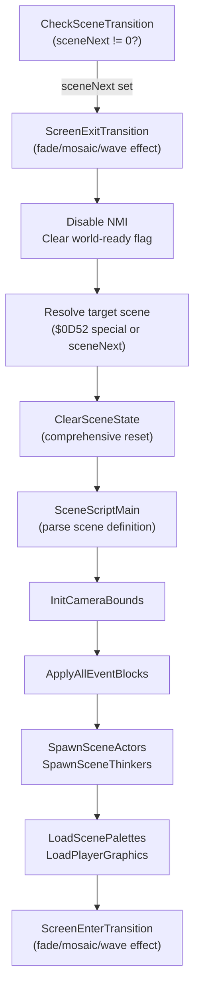

# Scene Lifecycle, Hardware & Save

*Part of the [Bank $03 Documentation Suite](README.md)*

## Parts in this category

| Part | Range | Source |
|------|-------|--------|
| scene_lifecycle | `$03D9E8`–`$03E0B0` | [scene_lifecycle.asm](../../../extracted/system/engine/scene_lifecycle.asm) |
| hdma_dma_spc | `$03D881`–`$03D916` + `$03E0B0`–`$03E255` + `$03F1D0`–`$03F201` | [hdma_dma_spc.asm](../../../extracted/system/engine/hdma_dma_spc.asm) |
| save_system | `$03D916`–`$03D9E8` | [save_system.asm](../../../extracted/system/engine/save_system.asm) |

> `hdma_dma_spc` is **non-contiguous**, spanning three disjoint ranges (player
> tile DMA; palette/graphics + HDMA + SPC; ad-hoc VRAM DMA).

## Overview

This category is the engine's "system plumbing." `scene_lifecycle` owns the scene
transition pipeline — the highest-level orchestration that tears down the old
scene, loads all resources for the new one, and runs the exit/enter visual
transitions. `hdma_dma_spc` is the shared hardware-utility toolbox those systems
(and the NMI handler and actors) call to move tiles/palettes/graphics into VRAM,
configure HDMA channels, and stream music to the SPC700. `save_system` persists
the game's event flags to SRAM with integrity checking. `scene_lifecycle` is
physically interleaved with these utility blocks in ROM (they straddle its range),
reflecting how tightly it depends on them.



**Related:** [actor-thinker-runtime.md](actor-thinker-runtime.md) (ClearSceneState initializes actor/thinker pools) · [sprite-rendering.md](sprite-rendering.md) (DmaPlayerTilesToVram for player graphics) · [text-and-menus.md](text-and-menus.md) (LoadHudTilemap uses ConsoleStringRenderer)

---

## scene_lifecycle — `$03D9E8`–`$03E0B0`

Source: [scene_lifecycle.asm](../../../extracted/system/engine/scene_lifecycle.asm)

### Transition pipeline

`CheckSceneTransition` → `ExecuteSceneTransition` orchestrates the full change:

1. Run `ScreenExitTransition` (if the world is active).
2. Disable NMI, clear the world-ready flag.
3. Resolve the target scene from `$0D52` (special) or `sceneNext` (normal).
4. `ClearSceneState`: comprehensive variable reset → scene script → camera init →
   event blocks → actor spawning → collision setup → palette/graphics load →
   initial tilemap render.
5. Run `ScreenEnterTransition`.
6. Optional: wait for player input (press-start screens via `$00B4`).

### Visual transitions

`ScreenExitTransition` and `ScreenEnterTransition` support 4–5 effect types,
but they dispatch on **separate registers**: exit reads `gfxCacheIdxA` (`$0648`);
enter reads `$0649`.

| Type | Effect |
|------|--------|
| 0 | graduated brightness fade (speed `gfxCacheIdxB` / `$064B`) |
| 1 | instant blank/display |
| 2 | mosaic dissolve with brightness fade |
| 3 | sine-wave HDMA scroll distortion with brightness fade |
| 4 (exit only) | alternative wave (`ScreenExitTransition_WaveAlt`) |

Wave transitions use `ApplyScrollWaveEffect` + `ComputeSineScrollTable` (hardware
multiply) to build per-scanline horizontal scroll offsets on HDMA channels 6 & 7.

### `ClearSceneState` ("big setup")

Calls into multiple subsystems to prepare a new scene: `SceneScriptMain` (tileset/
tilemap/music/display config), `InitCameraBounds`, `ApplyAllEventBlocks`,
`PlaceBarrierTiles`, actor/thinker spawning (`actor_execution`),
`LoadScenePalettes`/`LoadPlayerGraphics`, and `CameraFullRefresh` or
`RenderPaletteTiles` for the initial render.

### Key routines

| Address | Label | Role |
|---------|-------|------|
| `$03D9E8` | `CheckSceneTransition` | per-frame check: `$0D52`/`$0D53` or `sceneNext` nonzero |
| `$03D9F6` | `ExecuteSceneTransition` | 3-phase orchestrator: exit → resolve → load → enter |
| `$03DABB` | `ScreenExitTransition` | 5 effect types (fade/instant/mosaic/wave/waveAlt) |
| `$03DBA4` | `ScreenExitTransition_WaveAlt` | type 4: variant wave loop pattern |
| `$03DBF6` | `ApplyScrollWaveEffect` | build HDMA sine tables + queue channels 6 & 7 |
| `$03DC39` | `ComputeSineScrollTable` | 256-scanline hardware-multiply sine offset fill |
| `$03DC92` | `ScreenEnterTransition` | 4 effect types (fade-in/instant/mosaic-in/wave-in) |
| `$03DD56` | `ClearSceneState` | comprehensive teardown and rebuild ("big setup") |
| `$03DECD` | `LoadHudTilemap` | DMA HUD tilemap data to VRAM |
| `$03DF0A` | `HudTilemapData` | raw tilemap data for the HUD overlay |
| `$03DFA0` | `LoadScenePalettes` | load scene + character palettes |
| `$03DFF8` | `LoadPlayerGraphics` | DMA player sprite tiles to VRAM |
| `$03E050` | `InitCameraBounds` | set camera limits from map geometry or `$0652` packed bounds |

### Cross-references

- **In:** `system_core` main loop (calls `CheckSceneTransition` each frame).
- **Out:**
  - `hdma_dma_spc` — `ResetHdmaState`, `DmaPlayerTilesToVram` during `ClearSceneState`
  - `actor_execution` — `InitActorPool`, `SpawnSceneActors`, `RunActors_Normal` ×2
  - `thinker_execution` — `SpawnSceneThinkers`, `RunThinkers_TypeA`/`TypeB`
  - `sprite_composition` — `ClearActorRenderList`, `SortActorsByDepth`, `ComposeAllSprites`
  - `scene_script.SceneScriptMain` — parse scene definition (external)
  - `event_blocks.ApplyAllEventBlocks` — persistent tile changes (external)
  - `warps_interaction.PlaceBarrierTiles` / `InitWarpTable` — collision barriers
  - `camera_tilemap.CameraFullRefresh` / `RenderPaletteTiles` — initial render
  - `DisplaySceneTitle` — area name overlay
  - `system_core.UpdateFrameDialogue` / `UpdateHUD` — frame sync
  - `vblank_joypad.*` — VBlank/NMI management
  - `vram_buffer_clear.*` — VRAM buffer flush

### Full `ClearSceneState` call order

```
1.  STZ HDMAEN                              — disable HDMA
2.  Zero all critical WRAM variables         — joypad, HP, camera, scroll, speeds, etc.
3.  Set invincibilityTimer = $FFFF           — disabled
4.  Clear backdrop colors, COLDATA=$E0       — force black
5.  Reset BG3SC, BG3 scroll, BG12NBA        — tilemap/char bases
6.  Clear MOSAIC, all window registers       — W12SEL/W34SEL/WOBJSEL/WBGLOG/WH0-3
7.  ClearVramBufferFull                      — flush write buffer
8.  SceneScriptMain                          — parse scene script
9.  InitCameraBounds                         — camera limits
10. ApplyAllEventBlocks                      — persistent tile changes
11. PlaceBarrierTiles                        — barrier collision tiles
12. Clear joypad state                       — joypadMaskStd/joypadCurrent/joypadRaw
13. InitActorPool                            — reset actor + thinker pools
14. SpawnSceneActors                         — instantiate scene actors
15. DisplaySceneTitle                        — area name overlay
16. SpawnSceneThinkers                       — instantiate scene thinkers
17. LoadScenePalettes                        — scene/character palettes
18. LoadPlayerGraphics                       — DMA player tiles
19. ClearActorRenderList                     — reset OAM list
20. InitWarpTable                            — warp collision rectangles
21. RunActors_Normal ×2                      — settle initial positions
22. ResetHdmaState                           — clear HDMA channels
23. RunThinkers_TypeA + TypeB                — initial thinker tick
24. ResetHdmaState                           — re-clear HDMA
25. COP SetFlagByte $FF                      — mark all actors for compose
26. SortActorsByDepth + ComposeAllSprites    — initial sprite frame
27. DmaPlayerTilesToVram                     — initial player tile upload
28. Render tilemap (CameraFullRefresh or RenderPaletteTiles)
29. Clear musicRoomGroup, effect deltas
```

### Special-scene `$0D52` path

When `$0D52`/`$0D53` is nonzero, `ExecuteSceneTransition` treats it as a special
transition: archives `$0D52` → `$0D54`, `$0652` → `$0D6C`, records
`sceneNext` → `$0D6E` (destination) and `sceneCurrent` → `$0D6F` (source), and
sets the scene to `$FE` (world map). This is the mechanism by which the
world-map controller receives its state block.

### Press-start handling

After `ScreenEnterTransition`, if `$00B4` is nonzero, the pipeline enters a wait
loop calling `UpdateFrameDialogue` until any joypad button is pressed. This
implements "press Start to continue" screens (used at the prologue, game-over
continue, etc.). On input, `$00B4` is cleared, VRAM is flushed, and display mode
bit 0 is set.

---

## hdma_dma_spc — `$03D881`–`$03D916` + `$03E0B0`–`$03E255` + `$03F1D0`–`$03F201`

Source: [hdma_dma_spc.asm](../../../extracted/system/engine/hdma_dma_spc.asm)

A mixed hardware-utility block across three ranges.

### Player tile DMA (`$03D881`–`$03D916`)

`DmaPlayerTilesToVram` transfers up to 8 queued 16×16 player tiles from RAM to
VRAM during V-Blank. The pointer table at `$06FE` provides sources; tiles DMA in
four passes (upper/lower halves × primary/overflow VRAM regions `$4000`–`$4300`).
Called by `ClearSceneState` (scene load) and the NMI handler (per-frame animation).

### Palette/graphics loading (`$03E0B0`–`$03E255`)

`LoadPaletteBundle` parses structured palette/spriteset bundles from
`palette_bundles`, populating actor WRAM (`spritesetPtr`, `chatPtr`,
`metaspritePtr`). `DecompressGfxToVram` wraps the `$0402` decompression helper to
decompress graphics into VRAM from actor WRAM parameters.

### HDMA channel management (`$03E0B0`–`$03E255`, cont.)

`ResetHdmaState` initializes HDMA allocation state (`$66` enable mask, `$68`
channel bit, `$6A` register offset). `SetupHdmaChannel_Indirect` /
`SetupHdmaChannel_Direct` configure a channel from register lookup table
`hdma_channel_config`; indirect mode adds the `$40` flag + bank byte for pointer-based
tables. Both advance the allocation state.

### SPC audio transfer (`$03E0B0`–`$03E255`, cont.)

Three-stage pipeline: `SpcCheckMusicReady` handshakes via APUIO0 (`$2140`),
`SpcTransferMusicData` sends the data with a confirmation protocol,
`LoadMusicFromTransitionState` resolves a music ID from `musicTransitionState`
(`$06FA`) to a `music_array` pointer and starts `SpcBlockTransfer`.

### Ad-hoc VRAM DMA (`$03F1D0`–`$03F201`)

`DmaAdhocVramBlock` executes one-shot VRAM transfers queued at
`$7F0C03`–`$7F0C09`. If the pending destination at `$7F0C07` is nonzero, transfers
the byte count from the source to VRAM via DMA channel 0. Used for deferred VRAM
writes outside the normal V-Blank pipeline.

### Key routines

| Address | Label | Role |
|---------|-------|------|
| `$03D881` | `DmaPlayerTilesToVram` | player tile DMA: up to 8 queued 16×16 tiles |
| `$03D8D8` | `DmaPlayerTiles_UpperHalf` | upper 8×16 half of queued player tiles |
| `$03D8F2` | `DmaPlayerTiles_LowerHalf` | lower 8×16 half of queued player tiles |
| `$03E0B0` | `LoadPaletteBundle` | parse palette/spriteset bundles → actor WRAM |
| `$03E125` | `DecompressGfxToVram` | decompress graphics via `$0402` helper to VRAM |
| `$03E146` | `ResetHdmaState` | init HDMA allocation (`$66` enable, `$68` channel, `$6A` offset) |
| `$03E157` | `SetupHdmaChannel_Indirect` | configure HDMA channel (indirect mode, +`$40` flag) |
| `$03E173` | `SetupHdmaChannel_Direct` | configure HDMA channel (direct mode) |
| `$03E1AA` | `SpcCheckMusicReady` | handshake via `APUIO0` (`$2140`) for transfer readiness |
| `$03E1D6` | `SpcTransferMusicData` | send data with confirmation protocol |
| `$03E21E` | `LoadMusicFromTransitionState` | resolve `musicTransitionState` → `music_array` → transfer |
| `$03F1D0` | `DmaAdhocVramBlock` | one-shot VRAM transfer from `$7F0C03` queue |

### Cross-references

- **In:** `scene_lifecycle` (`ClearSceneState`, transitions), NMI handler
  (`DmaPlayerTilesToVram`), actor systems (`LoadPaletteBundle`), HDMA-effect
  thinkers (`SetupHdmaChannel_*` — `IrisCircleEffect`, `HdmaWindowEffect`).
- **Out:** `hdma_channel_config` (HDMA register lookup table), `palette_bundles`
  (external data), `music_array_01CBA6` (music pointers), `spc_transfer` (SPC
  block data).

### HDMA register lookup table

`hdma_channel_config` is a table of SNES HDMA destination register offsets. Each entry
is a register number (e.g., `$0D` for BG1HOFS, `$0F` for BG2HOFS). The
`SetupHdmaChannel_*` routines use `$6A` as an index into this table to select
which PPU register each HDMA channel targets. `ResetHdmaState` resets `$66` (HDMA
enable mask, accumulates channel enables), `$68` (current channel bit, shifts left
per allocation), and `$6A` (register offset, advances through the table).

### SPC handshake protocol

`SpcCheckMusicReady` polls `APUIO0` (`$2140`) for a specific ready value, looping
until the SPC700 signals it can accept data. `SpcTransferMusicData` sends the
music data with a byte-level confirmation protocol (each byte echoed by the SPC
before the next is sent). `LoadMusicFromTransitionState` resolves the music ID
from `musicTransitionState` (`$06FA`) by indexing into `music_array_01CBA6` to
get the data pointer, then starts the transfer via `SpcBlockTransfer`.

### Ad-hoc VRAM queue structure

The queue occupies 7 bytes at `$7F0C03`–`$7F0C09`:

| Address | Size | Purpose |
|---------|------|---------|
| `$7F0C03` | 2 | source address (low word) |
| `$7F0C05` | 1 | source bank byte |
| `$7F0C07` | 2 | VRAM destination (nonzero = pending) |
| `$7F0C09` | 2 | byte count |

`DmaAdhocVramBlock` checks `$7F0C07`: if nonzero, it configures DMA channel 0 and
transfers the specified byte count from the source to VRAM, then clears the
destination to signal completion. The queue is single-entry; only one ad-hoc
transfer can be pending at a time.

---

## save_system — `$03D916`–`$03D9E8`

Source: [save_system.asm](../../../extracted/system/engine/save_system.asm)

### Purpose

SRAM save/load with dual-checksum validation. Four 512-byte slots at
`$306200 + (slot × 512)`.

### Save/load

`SaveGameState_Scene` stores the current scene ID at `$0B06`, then copies 508 bytes
(`$01FC`) of event flags (`$0A00`–`$0BFC`) to SRAM, then writes both checksums at
`$3063FC`/`$3063FE`. `LoadGameState_Scene` reverses this after verifying integrity.
Both mask the slot to 0–3 and compute the offset via `XBA` + `ASL`
(slot × 256 × 2 = slot × 512).

### Integrity verification

`ComputeSaveChecksum` produces two checksums over each slot's 508 bytes (254 words):
- additive (`$0018`): running sum of all data words
- XOR (`$001C`): running XOR of all data words

Both seeded with magic `$3652` so blank (all-zero) SRAM cannot accidentally pass.
The pair catches stuck bits (XOR) and value-preserving transpositions (sum).

### Slot management

`ClearSaveSlot` fills a 512-byte slot with zeros (checksum mismatch → appears
empty). Load returns **carry clear** on success, **carry set** on failure;
`ClearSaveSlot` returns carry set to match the empty-slot convention.

### Key routines

| Address | Label | Role |
|---------|-------|------|
| `$03D916` | `SaveGameState_Scene` | save `sceneCurrent` + 508 bytes event flags → SRAM slot |
| `$03D954` | `LoadGameState_Scene` | verify checksums + restore 508 bytes → `eventFlags` |
| `$03D994` | `ClearSaveSlot` | zero-fill 512-byte slot (makes it appear empty) |
| `$03D9B8` | `ComputeSaveChecksum` | dual additive + XOR over 254 words, magic seed `$3652` |

### Cross-references

- **In:** save/load menu COP handlers, auto-save triggers, game-over continue.
- **Reads:** `sceneCurrent` (`$0644`), `eventFlags` (`$0A00`–`$0BFC`).
- **Writes:** SRAM `$306200` + slot offset (save), `eventFlags` (load).

### SRAM layout (4 slots)

| Slot | Data range | Size | Additive checksum | XOR checksum |
|------|-----------|------|-------------------|--------------|
| 0 | `$306200`–`$3063FB` | 508 B | `$3063FC` | `$3063FE` |
| 1 | `$306400`–`$3065FB` | 508 B | `$3065FC` | `$3065FE` |
| 2 | `$306600`–`$3067FB` | 508 B | `$3067FC` | `$3067FE` |
| 3 | `$306800`–`$3069FB` | 508 B | `$3069FC` | `$3069FE` |

Each slot is 512 bytes total (508 data + 4 checksums). The slot offset is computed
as `(A & 3) × 512` via `XBA` + `ASL` (A in bits 8–9 → shift to byte offset).

**Scene ID embedding:** Before saving, `SaveGameState_Scene` stores `sceneCurrent`
at `$0B06` within the event flags area. This is how the game knows which scene to
restore on load — `$0B06` is part of the 508-byte block that gets serialized.

**`$3652` magic seed:** Both checksums are initialized to `$3652` rather than zero.
This guarantees that a fully-zeroed SRAM chip (fresh battery, hardware failure)
produces checksums that mismatch the stored values, correctly detecting the slot
as empty rather than accidentally passing validation.

---

## Category-wide notes

**`scene_lifecycle` ↔ `hdma_dma_spc` coupling:** `ClearSceneState` makes 4 direct
calls into `hdma_dma_spc`:
1. `ResetHdmaState` — twice (before and after thinker initialization)
2. `DmaPlayerTilesToVram` — initial player tile upload after sprite composition
3. `LoadScenePalettes` and `LoadPlayerGraphics` (within `scene_lifecycle`'s own
   range but adjacent to `hdma_dma_spc`) also depend on the DMA/decompression
   utilities.

Additionally, `ScreenExitTransition` type 3/4 wave effects call `ResetHdmaState`
and `ApplyScrollWaveEffect`, which uses `QueueHdmaChannel` COP internally.

**Three `hdma_dma_spc` fragments:** The three disjoint ranges are functionally
unrelated — player tile DMA (`$D881`–`$D916`), palette/HDMA/SPC utilities
(`$E0B0`–`$E255`), and ad-hoc VRAM DMA (`$F1D0`–`$F201`). They are grouped as
one block because the assembler's code analysis discovered them as a single
linked unit through shared cross-references. In practice, they serve three
independent purposes and are called from different contexts (NMI handler, scene
setup, deferred VRAM writes).

---

## See Also

- [actor-thinker-runtime.md](actor-thinker-runtime.md) — `InitActorPool`, `SpawnSceneActors`, `SpawnSceneThinkers` called from `ClearSceneState`
- [sprite-rendering.md](sprite-rendering.md) — `DmaPlayerTilesToVram` handles player tile DMA during scene load and per-frame
- [text-and-menus.md](text-and-menus.md) — `LoadHudTilemap` stages HUD tiles during scene setup
- [radar-and-world-map.md](radar-and-world-map.md) — world map scene $FE uses special transition path via $0D52
- [mode7-and-cutscenes.md](mode7-and-cutscenes.md) — Mode 7 setup registers configured during ClearSceneState
- [Bank $03 index](README.md) — bank-wide memory map, WRAM reference, design patterns
