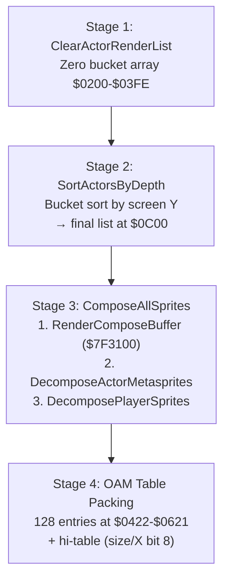

# Sprite Composition & OAM

*Part of the [Bank $03 Documentation Suite](index.md)*

## Parts in this category

| Part | Range | Source |
|------|-------|--------|
| sprite_composition | `$03C5FF`–`$03CAF5` + `$03D86A`–`$03D881` | [sprite_composition.asm](../../../extracted/system/engine/sprite_composition.asm) |
| oam_digit_compose | `$03BAE1`–`$03BB85` | [oam_digit_compose.asm](../../../extracted/system/engine/oam_digit_compose.asm) |

> `sprite_composition` is **non-contiguous**: `SortActorsByDepth` +
> `ComposeAllSprites` are at `$03C5FF`–`$03CAF5`, and the small
> `ClearActorRenderList` routine is at `$03D86A`–`$03D881`.

## Overview

Every frame the engine turns actor metasprite definitions into the 128-entry
hardware OAM table. `sprite_composition` runs the four-stage pipeline: clear the
depth-sort buckets, bucket-sort actors by screen depth, then decompose each
actor's metasprite and pack the results (plus any pre-composed sprites) into OAM.
`oam_digit_compose` is a producer that feeds the pre-composed sprite buffer:
combat converts packed-BCD damage numbers into digit sprites there, and
`ComposeAllSprites` later merges them into OAM alongside the actors.

**Related:** [movement-and-collision.md](movement-and-collision.md) (FormatDamageDigits feeds compose buffer) · [actor-thinker-runtime.md](actor-thinker-runtime.md) (actor linked list is the render source) · [scene-and-hardware.md](scene-and-hardware.md) (DmaPlayerTilesToVram for player sprite cache)

---

## sprite_composition — `$03C5FF`–`$03CAF5` + `$03D86A`–`$03D881`

Source: [sprite_composition.asm](../../../extracted/system/engine/sprite_composition.asm)

### Stage 1 — render-list clear (`ClearActorRenderList`, `$03D86A`)

Zeros the 512-byte depth-sort bucket array at `$0200`–`$03FE` and writes a `$FFFF`
end sentinel at `$0400`, preparing for the next `SortActorsByDepth` pass. Called
from the main loop before actor processing.

### Stage 2 — depth sort (`SortActorsByDepth`)

Bucket sort using `$0200`–`$03FE` as a bucket array indexed by sort key. Each
actor's screen-space Y is converted to an inverted key (higher Y = lower key =
drawn first = behind). The stack pointer is repurposed to iterate the buffer
(`PLX`/`PLA`).

Sort key by actor flags (`$10`):

| Flag bits | Key |
|-----------|-----|
| bit 13 (`$2000`) hidden | skipped |
| bits 0+1 (`$0003`) both clear | Y-based key (screen Y inverted via `EOR`, `ASL`) |
| bit 0 only (`$0001`) | fixed `$01FE` — always front |
| bit 1 (`$0002`) | fixed `$0000` — always behind |

`BuildFinalList` reads the buckets front-to-back (`PLY`, SP = `$01FF`), producing
the sorted list at `$0C00`.

### Stage 3 — composition (`ComposeAllSprites`)

Entry from the main loop after actor execution. Pre-fills all 128 OAM entries with
off-screen `$E080`, then processes in order:
1. `RenderComposeBuffer` — reads pre-composed entries at `$7F3100` up to the
   cursor at `$00D8`.
2. `STZ $00D8` — clears the compose-buffer write cursor for the next frame.
3. Sorted actor list at `$0C00` — metasprite decomposition via
   `DecomposeActorMetasprites` (generic) or `DecomposePlayerSprites` (player,
   bit 15 of `$10`).

### OAM table layout

SNES OAM: 128 entries × 4 bytes at `$0422`–`$0621`, plus a 32-byte high table at
(`$06`). Low entry: byte 0 = X[7:0], byte 1 = Y, bytes 2–3 = tile/attribute. The
high table packs 2 bits/sprite (X bit 8, size) in groups of 4 via a rolling shift
register (`$00`) with a 4-sprite counter (`$0E`).

### Metasprite format (7 bytes per sub-sprite)

| Byte | Meaning |
|------|---------|
| 0 | size/priority flags (bit 0 → OAM hi-table size bit) |
| 1–2 | X offset pair (swapped via `XBA` when H-mirrored) |
| 3–4 | Y offset pair (swapped via `XBA` when H-mirrored) |
| 5–6 | tile index + palette/priority attributes |

### Key routines

| Address | Label | Role |
|---------|-------|------|
| `$03D86A` | `ClearActorRenderList` | stage 1: zero `$0200`–`$03FE`, write `$FFFF` sentinel at `$0400` |
| `$03C5FF` | `SortActorsByDepth` | stage 2: iterate actors, screen-cull, compute sort keys |
| `$03C691` | `SortActors_OffScreen` | set `$4000` flag on off-screen actor, continue to next |
| `$03C69B` | `SortActors_BuildFinalList` | bucket → linked-list → linear `$0C00` render list |
| `$03C714` | `ComposeAllSprites` | stage 3: pre-fill OAM `$E080`, compose buffer + actors |
| `$03C78B` | `RenderComposeBuffer` | process `$7F3100` pre-composed sprites → OAM |
| `$03C841` | `OamHiTableMasks` | lookup masks for hi-table 2-bit packing |
| `$03C849` | `DecomposeActorMetasprites` | generic actor: 7-byte metasprite → OAM |
| `$03C928` | `DecomposePlayerSprites` | player: form-based body table + VRAM remap + cache |
| `$03CA05` | `PlayerSprite_OffScreen` | skip player tiles if off-screen |
| `$03CA19` | `CheckPlayerSpriteCache` | compare `$09CC`/`$09CE` to avoid redundant VRAM DMA |
| `$03CA55` | `UpdateActorAnimation` | advance spriteset → animation → frame hierarchy |

### Cross-references

- **In:** `system_core` main loop (`ClearActorRenderList` at start;
  `ComposeAllSprites` after actor AI ticks).
  `ClearSceneState` calls `ClearActorRenderList` + `SortActorsByDepth` +
  `ComposeAllSprites` during scene setup.
- **Out:** reads the compose buffer (`$7F3100`) produced by `oam_digit_compose`
  and VFX producers; writes hardware OAM at `$0422`–`$0621` + hi-table at `$06`.

### OAM high-table bit-packing

The SNES OAM high table packs 2 bits per sprite (X bit 8 + size select) into
32 bytes, 4 sprites per byte. During composition:
- `$0E` counts down from 4 within each hi-table byte group
- `$00` is a rolling shift register accumulating 2-bit fields
- Every 4 sprites, the accumulated byte is stored via `$06` (current write
  pointer) and `$08` (staging pointer at `$06FE`)
- `OamHiTableMasks` (`$03C841`) provides the lookup masks

When composition ends before filling all 128 sprites, the final partial byte is
shifted left by `(remaining × 2)` bits and stored.

### Player-sprite special decomposition

`DecomposePlayerSprites` (`$03C928`) differs from the generic path:
1. Looks up the current `characterForm` (`$0AD4`) in `body_table` to get the
   form-specific sprite sheet mapping
2. Remaps tile indices: player tiles are dynamically DMA'd to VRAM by
   `DmaPlayerTilesToVram`, so tile indices in the metasprite need to be offset to
   match the player VRAM region (`$4000`–`$4300`)
3. Validates the sprite cache (`$09CC`/`$09CE`) — if the metasprite pointer
   and bank haven't changed since last frame, the player tile DMA is skipped

If the player actor is off-screen, `PlayerSprite_OffScreen` (`$03CA05`) sets the
off-screen flag and skips tile processing entirely.

### Off-screen culling in `SortActorsByDepth`

Before computing a sort key, each actor undergoes a 2-axis screen-bounds check:
- **X axis:** `(posX − originX − bg1ScrollH)` against `$0100` (256px). Both
  edges (left = pos − width, right = pos + width) are tested.
- **Y axis:** `(posY − originY − bg2ScrollH)` against `$00E0` (224px). Same
  edge testing.

Actors failing both edges on either axis receive `$4000` in flags `$10` via
`SortActors_OffScreen` and are excluded from the render list. The `$4000` flag is
cleared at the start of each sort pass (`TRB $10`).

---

## oam_digit_compose — `$03BAE1`–`$03BB85`

Source: [oam_digit_compose.asm](../../../extracted/system/engine/oam_digit_compose.asm)

### Purpose

Converts packed-BCD damage numbers into individual digit sprites in the compose
buffer at `$7F3100`. Called by combat hit effects (`SpawnAttackTrailEffect`) to
render floating damage numbers above actors.

### Packed BCD format (DP `$0000`)

- `$0001` (high byte) low nibble = hundreds (0–9)
- `$0000` (low byte) bits 7–4 = tens (0–9)
- `$0000` (low byte) bits 3–0 = ones (0–9)

Rendered hundreds→tens→ones. Zero digits are skipped (no sprite) but still advance
the cursor by 4px (half gap); nonzero digits advance 8px (full glyph).

### Compose buffer entry (6 bytes at `$7F3100`)

| Bytes | Meaning |
|-------|---------|
| 0–1 | X position (16-bit) |
| 2–3 | Y position (16-bit) |
| 4–5 | tile index (`$70` + digit) \| palette/priority from DP `$0002` |

Write cursor at `$00D8` advances by 6 per entry.

### Entry conditions

| Field | Meaning |
|-------|---------|
| DP `$0000` | packed BCD value (from `FormatDamageDigits`) |
| DP `$0014` | actor X (start X = actorX − 12) |
| DP `$0016` | actor Y |
| DP `$000E` | sprite palette/priority |
| `$00D8` | OAM compose buffer write cursor |

A re-entry point appends additional digit groups (saves cursor X to `$001A`,
shifts left 6px, falls through to the render loop).

### Key routines

| Address | Label | Role |
|---------|-------|------|
| `$03BAE1` | `ComposeDigits_Continuation` | re-entry: save cursor X, shift left 6px, fall through |
| `$03BAF1` | `ComposeDigitSprites` | main entry: `$F000` guard, cursor = actorX−12, digit loop |
| `$03BB5E` | `EmitDigitOamEntry` | write one 6-byte OAM entry: X, Y, tile (`$70`+digit) |

### Cross-references

- **In:** combat hit effects (`SpawnAttackTrailEffect`) in `combat_collision`.
  `ComposeDigits_Continuation` is the re-entry for multi-hit stacked damage.
- **Out:** writes the `$7F3100` compose buffer consumed by
  `sprite_composition.RenderComposeBuffer` (stage 3 of the OAM pipeline).
- **Upstream:** `FormatDamageDigits` (`$03C58F`) converts raw damage values to
  packed BCD format before calling `ComposeDigitSprites`.

### Digit glyph set

The digit font starts at VRAM tile `$70`. Each digit (0–9) maps to tiles
`$70`–`$79`. These are 8×8 tiles from the combat UI tileset, rendered as single
OAM sprites with the palette/priority passed in DP `$0002`.

### `$F000` guard

`ComposeDigitSprites` tests `BIT #$F000` on the packed BCD value. If any of the
upper 4 bits are set, the value is considered invalid (overflow or corrupt BCD)
and the routine exits immediately without writing any sprites. This prevents
garbage digits from appearing when combat damage exceeds the 3-digit (999) cap.

---

## Category-wide notes

### `$7F3100` compose buffer producers

The compose buffer at `$7F3100` is a linear array of 6-byte pre-composed sprite
entries. The write cursor at `$00D8` tracks the next free position. Known producers:

| Producer | Source | Description |
|----------|--------|-------------|
| `oam_digit_compose` | combat system | floating damage digit sprites |
| `SpawnHitSparkSprites` | combat VFX | hit spark/flash sprites |
| `SpawnAttackTrailEffect` | combat VFX | weapon trail particles |
| COP visual effect handlers | various | screen-flash, explosion, etc. |

`ComposeAllSprites` calls `RenderComposeBuffer` first, reading all entries from
`$7F3100` up to the current `$00D8` cursor position and converting them to OAM
entries. It then clears `$00D8` (`STZ $00D8`) before the actor metasprite loop
begins.

### `$0C00` sorted list and `$0200`–`$0400` bucket array lifetimes

| Buffer | Lifetime | Purpose |
|--------|----------|---------|
| `$0200`–`$03FE` | `ClearActorRenderList` → end of `SortActors_BuildFinalList` | bucket sort scratch: zeroed each frame, filled during sort, consumed during linearization |
| `$0C00`+ | `SortActorsByDepth` → end of `ComposeAllSprites` | final render-order actor list: written during sort key assignment, then consumed during sprite decomposition |

The bucket array at `$0200` overlaps with the `deathFlag` region — this is safe
because the bucket clear (`ClearActorRenderList`) happens before actor processing,
and the bucket data is fully consumed before any other system touches `$0200`.
The sorted list at `$0C00` persists until the next frame's clear.

---

## See Also

- [movement-and-collision.md](movement-and-collision.md) — `FormatDamageDigits` produces packed BCD consumed by `ComposeDigitSprites`
- [actor-thinker-runtime.md](actor-thinker-runtime.md) — actor linked list ($56 head) is the source for depth sorting
- [scene-and-hardware.md](scene-and-hardware.md) — `DmaPlayerTilesToVram` transfers player tiles; `ClearSceneState` resets sprite state
- [Bank $03 index](index.md) — bank-wide memory map, OAM layout reference
