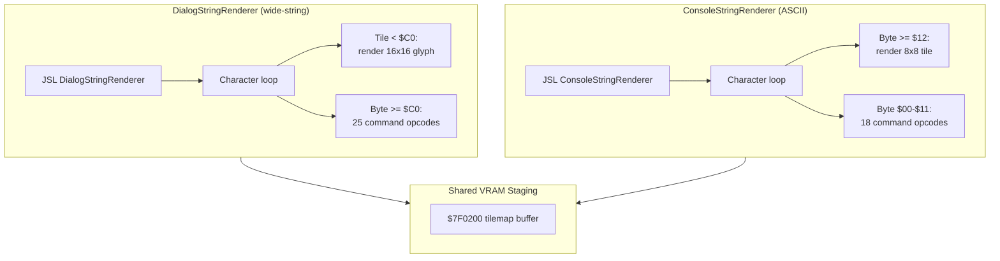

# Text Rendering & Menus

*Part of the [Bank $03 Documentation Suite](readme.md)*

## Parts in this category

| Part | Range | Source |
|------|-------|--------|
| DialogStringRenderer | `$03E255`–`$03E849` | [DialogStringRenderer.asm](../../../extracted/system/engine/DialogStringRenderer.asm) |
| MenuSelectionHandler | `$03E849`–`$03EA62` | [MenuSelectionHandler.asm](../../../extracted/system/engine/MenuSelectionHandler.asm) |
| ConsoleStringRenderer | `$03EA62`–`$03EF97` | [ConsoleStringRenderer.asm](../../../extracted/system/engine/ConsoleStringRenderer.asm) |

## Overview

IOG has **two** distinct text engines with different character sets and command
tables. `DialogStringRenderer` handles story dialogue: a wide-string bytecode with
16×16 characters, dialogue-box management, templates, and input waits.
`ConsoleStringRenderer` handles HUD/UI: a simpler 8-bit charset for inventory,
status, HP bars, equipment icons, and bordered boxes. `MenuSelectionHandler` sits
between them, providing a reusable cursor for in-dialogue choice menus (it
`?INCLUDE`s `DialogStringRenderer`). All three are entered via `JSL` from COP
handlers and other engine systems.

**Related:** [field-input-and-items.md](field-input-and-items.md) (item handlers trigger dialogue rendering) · [radar-and-world-map.md](radar-and-world-map.md) (radar shares VRAM staging buffer $7F0200) · [scene-and-hardware.md](scene-and-hardware.md) (DMA transfers for VRAM flush)

---

## DialogStringRenderer — `$03E255`–`$03E849`

Source: [DialogStringRenderer.asm](../../../extracted/system/engine/DialogStringRenderer.asm)

### Purpose

The dialogue text engine. Bytes `< $C0` are tile indices rendered directly; bytes
`$C0`–`$FF` are command opcodes dispatched through a 25-entry command table. Each
character tile is written to two VRAM buffer rows (`$7F0200,X` top,
`$7F0240,X` bottom, +`$10`), producing 16×16-pixel characters from 8×8 tile pairs.

### Renderer state (work RAM)

| Address | Meaning |
|---------|---------|
| `$0998` | VRAM buffer write cursor (X into `$7F0200`) |
| `$0986` | palette bits (OR'd into each tile word) |
| `$097A`/`$097C` | box column/row position |
| `$097E`/`$0980` | saved column/row origin |
| `$099A` | VRAM buffer base offset (box content start) |
| `$099C` | current line within the box |
| `$0996` | per-character SFX ID |
| `$007E` | frame delay between characters (text speed) |
| `$0B04` | saved frame delay (restored on box open/close) |

The command dispatch uses an `RTS` trick: `PEA` the loop return (`DialogString_CharLoop−1`),
push command-table entry − 1, `RTS` to it; commands `RTS` back to the char loop.

### Command table (`DialogStringCommandTable` at `$03E2C3`, 25 commands `$00`–`$18`)

| Op | Command | Summary |
|----|---------|---------|
| `$C0` | EndAndWait | wait for input, clear box, restore delay |
| `$C1` | SetPosition | set column/row (2B) |
| `$C2` | InsertTemplate | recursive template render (`templates_01CA95`) |
| `$C3` | SetPalette | palette bits (1B) |
| `$C4` | InfiniteLoop | halt |
| `$C5` | IndirectString | pointer from indirect table (4B) |
| `$C6` | PrintNumber | format multi-digit number (4B) |
| `$C7` | OpenDialogueBox | open sized box (2B: w,h) |
| `$C8` | ClearDialogueBox | clear + reset palette + wait |
| `$C9` | WaitFrames | pause N frames (1B) |
| `$CA` | Return | exit renderer (`PLP`/`RTL`) |
| `$CB` | NewLine | advance line; scroll if at bottom |
| `$CC` | AdvanceCursor | forward N tiles (1B) |
| `$CD` | InsertRemoteString | string from another bank (3B: addr low, addr high, bank) |
| `$CE` | ClearBox | clear box interior + reset cursor to saved origin |
| `$CF` | WaitForButton | wait for A/B, suppress held flags (`$C080` TSB into joypadHeld) |
| `$D0` | WaitForAnyInput | wait for any joypad input (no filtering) |
| `$D1` | JumpToAddress | set Y = new string address (2B operand, same bank) |
| `$D2` | SetSfx | set per-character sound effect ID (1B → `$0996`) |
| `$D3` | OpenDefaultBox | open standard 13×4 box at column 3, row 17 |
| `$D4` | SetPaletteColor | write 15-bit color to CGRAM (1B index + 2B color) |
| `$D5` | SetFrameDelay | set text speed (1B operand + 2 bias → `$007E`) |
| `$D6` | DictionaryA | insert word from `dictionary_01EBA8` (1B index) |
| `$D7` | DictionaryB | insert word from `dictionary_01F54D` (1B index) |
| `$D8` | PrintRawTiles | output raw tile bytes until zero terminator |

### Key routines

| Address | Label | Role |
|---------|-------|------|
| `$03E255` | `DialogStringRenderer` | entry (`JSL`): save state, DP=0, enter char loop |
| `$03E25F` | `DialogString_CharLoop` | main bytecode loop: read byte, dispatch char or command |
| `$03E2C3` | `DialogStringCommandTable` | 25-entry word table (`$C0`–`$D8` → handler addresses) |
| `$03E2F5` | `DialogCmd_EndAndWait` | wait input, clear box, restore delay; TRB `$0F00` from joypadHeld |
| `$03E307` | `DialogCmd_Return` | PLP/RTL — exit renderer |
| `$03E30F` | `DialogCmd_SetPosition` | set column/row from 2B operand |
| `$03E335` | `DialogCmd_InsertTemplate` | recursive render from `templates_01CA95` |
| `$03E35B` | `DialogCmd_SetPalette` | set palette bits (`$0986`) from 1B |
| `$03E36B` | `DialogCmd_InfiniteLoop` | halt: `BRA` to self |
| `$03E36F` | `DialogCmd_IndirectString` | pointer from indirect table (4B) |
| `$03E393` | `DialogCmd_PrintNumber` | format multi-digit number (4B: addr, digit count) |
| `$03E42F` | `HexDigitTileTable` | tile lookup for hex digit rendering |
| `$03E43F` | `DialogCmd_OpenDialogueBox` | open sized box (2B: width, height) |
| `$03E453` | `OpenDialogueBox_Body` | box construction: border + body rows |
| `$03E4CE` | `DialogueBorderTiles` | 8 tile words: 4 corners + 4 edges |
| `$03E4DE` | `DrawDialogueBorderRow` | render top/bottom border row |
| `$03E505` | `DrawDialogueBodyRows` | fill interior rows with blank + side borders |
| `$03E579` | `DialogCmd_ClearDialogueBox` | clear interior + reset palette + wait |
| `$03E5EB` | `DialogCmd_WaitFrames` | pause N frames (1B count) |
| `$03E5F8` | `DialogCmd_NewLine` | advance line; scroll via `ScrollDialogueUp` if at bottom |
| `$03E61E` | `DialogCmd_AdvanceCursor` | forward N tiles (1B count) |
| `$03E636` | `DialogCmd_InsertRemoteString` | string from another bank (3B: addr + bank) |
| `$03E656` | `DialogCmd_ClearBox` | clear box interior, reset cursor |
| `$03E6A4` | `DialogCmd_WaitForButton` | wait for A/B (mask `$C080`), TSB `$C080` into joypadHeld |
| `$03E6D2` | `DialogCmd_WaitForAnyInput` | wait for any joypad input |
| `$03E6E7` | `DialogCmd_JumpToAddress` | set Y = new address (2B) |
| `$03E6EC` | `DialogCmd_SetSfx` | per-char SFX (1B → `$0996`) |
| `$03E6F7` | `DialogCmd_OpenDefaultBox` | open 13×4 box at (3,17) |
| `$03E721` | `DialogCmd_SetPaletteColor` | CGRAM write (1B index + 2B color) |
| `$03E736` | `DialogCmd_SetFrameDelay` | text speed (1B + 2 → `$007E`) |
| `$03E743` | `DialogCmd_DictionaryA` | dictionary A lookup (1B index) |
| `$03E769` | `DialogCmd_DictionaryB` | dictionary B lookup (1B index) |
| `$03E78F` | `DialogCmd_PrintRawTiles` | raw tiles until `$00` terminator |
| `$03E7B2` | `WaitOneFrame` | single-frame wait (called by menu + dialogue) |
| `$03E7B5` | `WaitNFrames_Entry` | frame delay entry for typing speed |
| `$03E7BA` | `WaitNFrames_PerChar` | per-character delay loop |
| `$03E7CB` | `WaitNFrames_Loop` | inner frame loop |
| `$03E7D6` | `ScrollDialogueUp` | scroll box content up by one line |
| `$03E80C` | `DrawDialogueCursor` | draw blinking ▼ cursor during input waits |

### Cross-references

- **In:** COP script handlers (`JSL`), `UpdateFrameDialogue`, inventory/status
  systems, cutscene scripts.
- **Out:** `templates_01CA95` (template strings), `dictionary_01EBA8` /
  `dictionary_01F54D` (compressed word tables), `system_core.UpdateFrameDialogue`
  (frame sync during waits).

### Box mechanics

**Opening:** `DialogCmd_OpenDialogueBox` computes the VRAM buffer position from
column/row: `base = (row × 32 + column) × 2` (row via `XBA + LSR + LSR`). Saves
the origin to `$097E`/`$0980`. `DialogueBorderTiles` provides 8 tile words (4
corners + 4 edges). `DrawDialogueBorderRow` renders horizontal borders (top/
bottom), `DrawDialogueBodyRows` fills interior rows with blank tile `$2040` and
side borders. An optional prompt row is added when `worldReadyFlag` is set and
`$00EE` is zero.

**Scrolling:** When `DialogCmd_NewLine` advances past the last visible line,
`ScrollDialogueUp` (`$03E7D6`) copies each line's VRAM data up by one row (40
bytes per row), then clears the bottom line with blanks. The line counter
`$099C` is decremented to reflect the shift.

**VRAM staging buffer sharing:** Both the dialogue renderer and the radar
overlay write to `$7F0200`. They never overlap because the radar is only active
during the hold-Start overlay (which pauses dialogue), and dialogue is cleared
before radar activation. The HUD tilemap (`LoadHudTilemap`) occupies a separate
region of the VRAM staging buffer.

---

## MenuSelectionHandler — `$03E849`–`$03EA62`

Source: [MenuSelectionHandler.asm](../../../extracted/system/engine/MenuSelectionHandler.asm)

### Purpose

General-purpose menu cursor for dialogue choices. Stack parameter encodes grid
geometry: high nibble = total item count, low nibble = columns/row; SP+1 = initial
selection; SP+5 = starting row offset. Sets DP = 0, resets the blink counter
(`$0994`), then loops: draw cursor, wait a frame, poll input.

### Input

| Button | Action |
|--------|--------|
| Up (`$0800`) | decrement (row-aware wrap) |
| Down (`$0400`) | increment (row-aware wrap) |
| L/R (`$0300`) | page ± column count |
| A/Start (`$8080`) | confirm — sound `#11`, result + 1, carry set |
| B (`$4000`) | cancel — `ReadMenuSelection`, result 0 |

### Subroutines

- `DrawMenuCursor` (`$03E983`) — 16-frame blink between highlight tiles
  (`$212C`/`$213C`) and dim tile (`$21AC`); saves/restores the tile under the
  cursor via `$0990`/`$0992`.
- `ReadMenuSelection` (`$03EA2A`) — restores original tiles, converts cursor
  position to OAM sprite data at `$090E`/`$0910`.

### Key routines

| Address | Label | Role |
|---------|-------|------|
| `$03E849` | `MenuSelectionHandler` | entry (`JSL`): unpack grid, init blink, enter poll loop |
| `$03E854` | `MenuSelection_PollLoop` | draw cursor, wait 1 frame, poll joypad |
| `$03E8FC` | `MenuSelection_Down` | down: increment selection, row-aware wrap |
| `$03E93C` | `MenuSelection_LeftRight` | L/R: page ± column count |
| `$03E983` | `DrawMenuCursor` | 16-frame blink between `$212C`/`$213C` (bright) and `$21AC` (dim) |
| `$03EA2A` | `ReadMenuSelection` | restore original tiles, convert position to OAM data |

### Grid descriptor (stack parameter)

The packed byte on the stack encodes the menu geometry:
- **High nibble** (`$F0`): total item count
- **Low nibble** (`$0F`): columns per row (used for L/R paging)

Additional stack parameters: `SP+1` = initial selection index, `SP+5` = starting
row offset in the VRAM buffer.

### Row-aware wraparound

**Up:** Decrements selection; if negative, wraps to `(total − 1)`. If total is
zero, wraps to `(columns − 1)` instead (single-row fallback).

**Down** (`MenuSelection_Down`): Increments selection; if ≥ total, wraps to 0.
Same single-row fallback when total is zero.

**L/R** (`MenuSelection_LeftRight`): Adds or subtracts the column count for
page-level navigation. Clamped to valid range.

### Cursor tile cycling

`DrawMenuCursor` uses `$0994` as a frame counter, toggling between two tile
states every 16 frames:
- Bright: tiles `$212C`/`$213C` (highlighted cursor pair)
- Dim: tile `$21AC` (faded cursor)

The tiles under the cursor are saved to `$0990`/`$0992` before overwriting, and
restored by `ReadMenuSelection` when the menu closes.

### Return convention

| Result | A | Carry |
|--------|---|-------|
| Confirm (A/Start) | 1-based selection index | set |
| Cancel (B) | 0 | set |

SFX `$11` plays on confirm, `$10` on navigation. Auto-repeat is suppressed
(`$CFF0` TSB `joypadHeld`) once any input is detected.

---

## ConsoleStringRenderer — `$03EA62`–`$03EF97`

Source: [ConsoleStringRenderer.asm](../../../extracted/system/engine/ConsoleStringRenderer.asm)

### Purpose

The HUD/UI text engine: inventory, status, HP bars, equipment icons, bordered
boxes. Bytes `>= $12` are literal tile indices; bytes `$00`–`$11` are opcodes in an
18-entry table. Entry: `JSL` with Y = string pointer, X = VRAM buffer write
position (byte offset into `$7F0200`). Each character writes a 16-bit tilemap word
(low = tile, high = palette/priority from `sceneStateHelper` `$099F`). Dispatch is
`JSR ($addr,X)` through `ConsoleStringCommandTable`; commands may recurse.

### Command table (`$00`–`$11`)

| Cmd | Handler | Operand | Description |
|-----|---------|---------|-------------|
| `$00` | End | — | pop, `RTL` |
| `$01` | SetVramAddr | 2B | set VRAM cursor |
| `$02` | InsertRemoteString | 2B+1B bank | recursive render from another bank |
| `$03` | SetPalette | 1B | palette bits 2–4 |
| `$04` | IndirectString | 2B+1B+2B | indexed table lookup + render |
| `$05` | PrintBcdNumber | 1B+2B | packed BCD, right-to-left |
| `$06` | DrawBox | 1B w+1B h+2B pos | bordered rectangle |
| `$07` | ClearColumn | 2B | clear a column region |
| `$08` | FillTile | 1B+2B | 1B count + 2B tile source address; load tile, repeat N times |
| `$09` | PrintEquipIcons | var (term `$80+`) | 2×2 equipment metatiles |
| `$0A` | DrawPlayerHpBar | — | player HP segments |
| `$0B` | DrawEnemyHpBar | — | enemy HP bar |
| `$0C` | PrintRawBytes | var (term `$FF`) | raw tile bytes |
| `$0D` | AdvanceRow4 | — | cursor +`$0080` (4 rows) |
| `$0E` | Print3DigitNumber | 2B | 3-digit decimal |
| `$0F` | ClearRect | 1B w + … | clear rectangle |
| `$10` | InsertItemName | 1B index | item name from `itemcomp_table` |
| `$11` | AdvanceRow2 | — | cursor +`$0040` (2 rows) |

### HP bar system

`DrawPlayerHpBar`/`DrawEnemyHpBar` share `DrawHpBar`: full segments (`$00`,
`playerHp/2`, tile `$2006`), a half segment (`$08`, if HP odd, tile `$2007`), empty
segments (`$02`, `(maxHP−HP)/2`, tile `$20FF`).

### Key routines

| Address | Label | Role |
|---------|-------|------|
| `$03EA62` | `ConsoleStringRenderer` | entry (`JSL`): Y=string ptr, X=VRAM offset |
| `$03EA8C` | `ConsoleStringCommandTable` | 18-entry word table ($00–$11 → handlers) |
| `$03EAB0` | `AsciiCmd_AdvanceRow2` | cursor += `$0040` (2 rows) |
| `$03EABD` | `AsciiCmd_InsertItemName` | item name from `itemcomp_table` (1B index) |
| `$03EAE2` | `AsciiCmd_ClearRect` | clear rectangle (1B width + coords) |
| `$03EB1B` | `AsciiCmd_DrawPlayerHpBar` | player HP → `DrawHpBar` |
| `$03EB71` | `DrawHpBar` | shared HP bar rendering: full/half/empty segments |
| `$03EBE6` | `HpBar_AdvanceRow` | advance cursor by one tilemap row within bar |
| `$03EBFC` | `AsciiCmd_DrawEnemyHpBar` | enemy HP → `DrawHpBar` |
| `$03EC52` | `AsciiCmd_End` | pop state, RTL — exit renderer |
| `$03EC57` | `AsciiCmd_AdvanceRow4` | cursor += `$0080` (4 rows) |
| `$03EC64` | `AsciiCmd_Print3DigitNumber` | 3-digit decimal number (2B address) |
| `$03ED00` | `AsciiCmd_SetVramAddr` | set VRAM cursor (2B absolute offset) |
| `$03ED0B` | `AsciiCmd_InsertRemoteString` | recursive render from another bank (2B addr + 1B bank) |
| `$03ED2B` | `AsciiCmd_SetPalette` | set palette bits 2–4 from `$099F` (1B) |
| `$03ED3C` | `AsciiCmd_IndirectString` | indexed table lookup + render (2B + 1B + 2B) |
| `$03ED6F` | `AsciiCmd_PrintBcdNumber` | packed BCD right-to-left (1B digits + 2B addr) |
| `$03EDE3` | `AsciiCmd_DrawBox` | bordered rectangle (1B w + 1B h + 2B pos) |
| `$03EEA5` | `AsciiCmd_ClearColumn` | clear a column region (2B) |
| `$03EEF5` | `AsciiCmd_FillTile` | load tile from 2B address, repeat 1B count times |
| `$03EF1F` | `AsciiCmd_PrintRawBytes` | raw tile bytes until `$FF` terminator |
| `$03EF3E` | `AsciiCmd_PrintEquipIcons` | 2×2 equipment metatiles (variable, `$80+` terminator) |

### Cross-references

- **In:** inventory, status, HUD, shop, and equipment screens (`JSL`).
- **Out:** `itemcomp_table_01EB0F` (item names for `InsertItemName`),
  `itemget_table_01FD24` (item data for equipment icons).

### `DrawBox` tile construction

`AsciiCmd_DrawBox` renders a bordered rectangle using 4 tile types, all OR'd with
the `$099E` palette attribute:

| Tile | Meaning | Flip variants |
|------|---------|---------------|
| `$10` | corners | V/H flip bits select TL, TR, BL, BR |
| `$11` | horizontal edges | top and bottom borders |
| `$12` | vertical edges | left and right borders |
| `$40` | interior fill | blank content area |

After drawing, the cursor is positioned at the first interior content cell
(`+$0082` from box start = 1 row down, 1 column right).

### Equipment-icon metatile format

`AsciiCmd_PrintEquipIcons` renders variable-length equipment icon lists as 2×2
tile groups. Each icon occupies 4 tiles:

| Position | Tile value |
|----------|------------|
| upper-left | N |
| upper-right | N + 1 |
| lower-left | N + `$10` |
| lower-right | N + `$11` |

Items 0–7 use tile base `$01E0`; items 8+ use `$02E0`. The renderer reads item
bytes from the string until encountering `$80` or higher (terminator). Each icon
writes to the current VRAM position and the previous row (for the lower tiles),
advancing the cursor by 2 columns per icon.

### VRAM staging buffer relationship

All three renderers in this category (dialogue, console, menu) write to the
`$7F0200` VRAM staging buffer. They use different regions:
- **Dialogue:** writes 16×16 character pairs to `$7F0200,X` and `$7F0240,X` (two
  rows per character), controlled by cursor `$0998`
- **Console:** writes 8×8 tiles to `$7F0200,X` as single 16-bit tilemap words,
  X passed at entry
- **Menu:** writes cursor tiles to dialogue-box positions (within the dialogue
  region)

The `displayModeFlags` bit 0 TSB triggers VRAM DMA on the next VBlank, flushing
the staging buffer to hardware VRAM.

---

## Category-wide notes

### Dialogue (wide) vs. console (ASCII) usage

The two renderers serve different UI contexts and are never mixed within a single
text stream:

| Renderer | Charset | Tile size | Used for |
|----------|---------|-----------|----------|
| `DialogStringRenderer` | wide-string (`$00`–`$BF`) | 16×16 (2×2 tiles) | story dialogue, NPC speech, narration, cutscene text |
| `ConsoleStringRenderer` | ASCII (`$12`+) | 8×8 (1 tile) | inventory, status, HP bars, equipment, shop, HUD labels |

Dialogue strings are stored with custom encoding where each byte maps to a 16×16
character glyph (paired top/bottom tiles). Console strings use a more compact
8-bit charset where each byte is a direct SNES tilemap index.

### Buffer layout and flush path

Both renderers write to the shared VRAM staging buffer at `$7F0200`. The flush
path is:
1. Renderer sets `displayModeFlags` bit 0 (`TSB #$0001`)
2. NMI handler checks bit 0 each VBlank
3. If set, DMA transfers the staging buffer contents to VRAM
4. Bit 0 is cleared after transfer

The dialogue renderer additionally calls `WaitNFrames_PerChar` after each visible
character, which internally calls `UpdateFrameDialogue` to ensure the typing
delay includes VBlank synchronization. The console renderer does not perform
per-character waits — it writes the entire string in a single pass.

### `MenuSelectionHandler` as bridge

`MenuSelectionHandler` `?INCLUDE`s `DialogStringRenderer`, sharing its `WaitOneFrame`
routine for frame timing. It operates within a dialogue box created by the
dialogue renderer, reading and writing cursor tiles in the box's VRAM region.
The menu returns control to the dialogue script that spawned it, passing the
selection result via the A register.

---

## See Also

- [field-input-and-items.md](field-input-and-items.md) — item handlers embed inline dialogue strings via COP commands
- [radar-and-world-map.md](radar-and-world-map.md) — radar uses BG3 console scripts; shares VRAM buffer region
- [scene-and-hardware.md](scene-and-hardware.md) — `LoadHudTilemap` and DMA pipeline for VRAM flush
- [Bank $03 index](readme.md) — bank-wide memory map, WRAM reference
