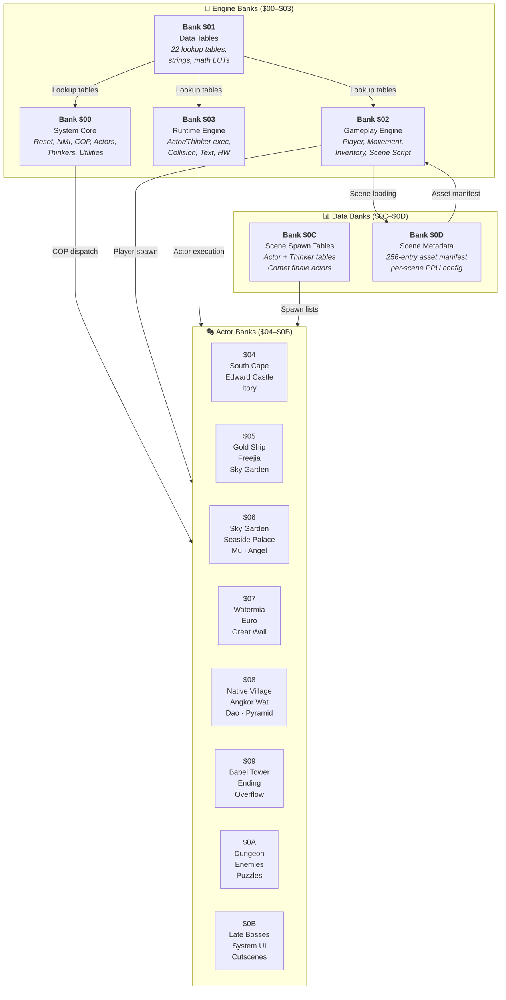
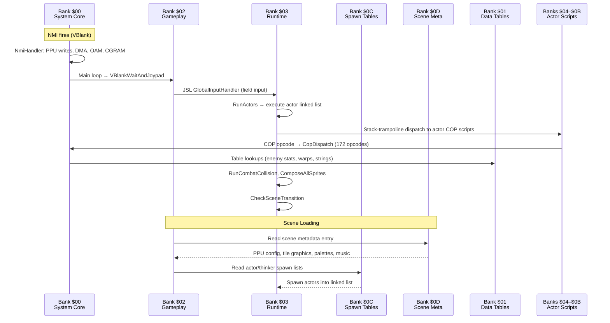

# Illusion of Gaia — Code Bank Documentation

<p align="center">
  <strong>Complete disassembly documentation for the US ROM of Illusion of Gaia (SNES)</strong><br>
  <em>14 ROM banks · 58 documents · ~380,000 bytes of analyzed code & data</em>
</p>

---

## Quick Navigation

| Bank | Name | Size | Doc Type | Jump |
|------|------|------|----------|------|
| **[$00](#bank-00--system-core)** | System Core | 29,952 B | [Multi-doc suite](bank00/) (21 docs) | [→ Details](#bank-00--system-core) |
| **[$01](#bank-01--data-tables)** | Data Tables | 32,108 B | [Single doc](../bank01-data-tables.md) | [→ Details](#bank-01--data-tables) |
| **[$02](#bank-02--gameplay-engine)** | Gameplay Engine | 32,768 B | [Multi-doc suite](bank02/) (14 docs) | [→ Details](#bank-02--gameplay-engine) |
| **[$03](#bank-03--runtime-engine)** | Runtime Engine | 28,500 B | [Multi-doc suite](bank03/) (9 docs) | [→ Details](#bank-03--runtime-engine) |
| **[$04](#bank-04--npc-actors-south-cape--edward-castle--itory)** | NPC Actors: South Cape | 32,768 B | [Single doc](bank04-npc-actors.md) | [→ Details](#bank-04--npc-actors-south-cape--edward-castle--itory) |
| **[$05](#bank-05--mid-game-actors)** | Mid-Game Actors | 32,768 B | [Single doc](bank05-midgame-actors.md) | [→ Details](#bank-05--mid-game-actors) |
| **[$06](#bank-06--late-mid-game-actors)** | Late Mid-Game Actors | 32,768 B | [Single doc](bank06-late-midgame-actors.md) | [→ Details](#bank-06--late-mid-game-actors) |
| **[$07](#bank-07--watermia--euro--great-wall)** | Watermia, Euro, Great Wall | 32,768 B | [Single doc](bank07-watermia-euro-actors.md) | [→ Details](#bank-07--watermia--euro--great-wall) |
| **[$08](#bank-08--native-village--dao--pyramid)** | Native, Dao, Pyramid | 32,768 B | [Single doc](bank08-native-dao-pyramid-actors.md) | [→ Details](#bank-08--native-village--dao--pyramid) |
| **[$09](#bank-09--babel-tower--ending--overflow)** | Babel, Ending, Overflow | 32,768 B | [Single doc](bank09-babel-ending-overflow-actors.md) | [→ Details](#bank-09--babel-tower--ending--overflow) |
| **[$0A](#bank-0a--dungeon-enemy-actors)** | Dungeon Enemy Actors | 32,768 B | [Single doc](bank0A-dungeon-enemy-actors.md) | [→ Details](#bank-0a--dungeon-enemy-actors) |
| **[$0B](#bank-0b--late-bosses--system--cutscene)** | Late Bosses, System | 32,768 B | [Single doc](bank0B-late-bosses-system-cutscene-actors.md) | [→ Details](#bank-0b--late-bosses--system--cutscene) |
| **[$0C](#bank-0c--scene-spawn-tables--comet)** | Scene Spawn Tables | 32,768 B | [Single doc](bank0C-scene-spawn-tables-comet.md) | [→ Details](#bank-0c--scene-spawn-tables--comet) |
| **[$0D](#bank-0d--scene-metadata)** | Scene Metadata | 32,768 B | [Single doc](bank0D-scene-meta.md) | [→ Details](#bank-0d--scene-metadata) |

---

## Architecture Overview

Illusion of Gaia uses the **WDC 65C816** processor in the SNES. The ROM is organized into 32 KB banks using HiROM mapping. Banks `$00`–`$03` contain the engine (system core, gameplay, runtime, and data tables), while banks `$04`–`$0B` hold actor scripts organized roughly by game progression. Banks `$0C`–`$0D` contain scene infrastructure data (spawn tables, metadata).



### Bank Category Legend

| Category | Banks | Purpose |
|----------|-------|---------|
| 🔧 **Engine** | `$00`, `$02`, `$03` | Core systems: interrupt handlers, COP bytecode, game loop, actors, collision, rendering, menus, scene management |
| 📖 **Data** | `$01`, `$0C`, `$0D` | Lookup tables, spawn registries, scene asset manifests — no executable code (bank $01) or minimal code |
| 🎭 **NPC Actors** | `$04`–`$09` | NPC scripts organized by story progression (South Cape → Babel/Ending) |
| ⚔️ **Enemy Actors** | `$0A`, `$0B` | Dungeon enemies, bosses, puzzle actors, and system UI actors |

---

## Game Progression by Bank

The actor banks follow the story progression of the game:

```mermaid
graph LR
    subgraph Chapter1["Chapter 1: Beginning"]
        B04_1["<b>$04</b> South Cape"]
        B04_2["<b>$04</b> Edward Castle"]
        B04_3["<b>$04</b> Itory Village"]
    end

    subgraph Chapter2["Chapter 2: Journey"]
        B05_1["<b>$05</b> Gold Ship"]
        B05_2["<b>$05</b> Freejia"]
        B05_3["<b>$05</b> Diamond Mine"]
        B05_4["<b>$05</b> Sky Garden"]
    end

    subgraph Chapter3["Chapter 3: Descent"]
        B06_1["<b>$06</b> Sky Garden II"]
        B06_2["<b>$06</b> Seaside Palace"]
        B06_3["<b>$06</b> Mu"]
        B06_4["<b>$06</b> Angel Village"]
    end

    subgraph Chapter4["Chapter 4: Exploration"]
        B07_1["<b>$07</b> Watermia"]
        B07_2["<b>$07</b> Great Wall"]
        B07_3["<b>$07</b> Euro"]
        B07_4["<b>$07</b> Mt. Kress"]
    end

    subgraph Chapter5["Chapter 5: Late Game"]
        B08_1["<b>$08</b> Native Village"]
        B08_2["<b>$08</b> Angkor Wat"]
        B08_3["<b>$08</b> Dao"]
        B08_4["<b>$08</b> Pyramid"]
    end

    subgraph Chapter6["Chapter 6: Finale"]
        B09_1["<b>$09</b> Babel Tower"]
        B09_2["<b>$09</b> Ending/Credits"]
    end

    Chapter1 --> Chapter2 --> Chapter3 --> Chapter4 --> Chapter5 --> Chapter6
```



---

## Cross-Reference Documents

These reference documents span multiple banks and provide system-wide context:

| Document | Scope | Description |
|----------|-------|-------------|
| [**COP System Overview**](../cop/index.md) | All banks | Complete reference for all COP bytecode opcodes used by actors and thinkers |
| [**Actor Organization Analysis**](../actor-organization-analysis.md) | All banks | Classification of all 855 ASM files and 721 actor definitions across the ROM |
| [**Structs Reference**](../structs-reference.md) | All banks | Documentation of all struct types in `us/structs.json` — `actor-def`, `thinker-def`, `scene-meta`, etc. |
| [**WRAM Memory Map**](../wram-memory-map.md) | All banks | Complete WRAM address map (`$7E:0000`–`$7F:FFFF`) with all known variables |
| [**Bank $01 Data Tables**](../bank01-data-tables.md) | Bank $01 | All 22 engine lookup tables: warps, enemy stats, strings, trig LUTs, movement deltas |

---

## Engine Data Flow

This diagram shows how data flows between the engine banks during a typical frame:



---

## Bank Details

### Bank $00 — System Core

📂 **[Full Documentation Suite →](bank00/)**

**ROM Range:** `$008000`–`$00F4FF` (29,952 bytes) · **Mirrored at** `$80:8000` for FastROM  
**Role:** Primary system bank — CPU reset vector, NMI handler, COP dispatch engine, main game loop, core utility library, thinkers, scene infrastructure actors, combat mechanics, and camera systems.

<details>
<summary><strong>📋 Document Index (21 files)</strong></summary>

| # | Document | Topic | Key Functions |
|---|----------|-------|---------------|
| 1 | [system-core.md](bank00/system-core.md) | Reset, Init, Main Loop | `ResetVector`, `SystemInit`, `UpdateFrame_Full` |
| 2 | [nmi-handler.md](bank00/nmi-handler.md) | VBlank, Scroll, DMA | `NmiHandler`, `UploadScrollRegisters` |
| 3 | [cop-dispatch.md](bank00/cop-dispatch.md) | COP Bytecode Engine | `CopDispatch`, 172 opcodes |
| 4 | [utility-math-movement.md](bank00/utility-math-movement.md) | Hardware Math | `MultiplyThenDivide`, `InitSmoothMovement` |
| 5 | [utility-tiles-animation.md](bank00/utility-tiles-animation.md) | Tile/Map, Animation | `ResolveTileData`, `ProcessAnimFlag` |
| 6 | [direction-collision.md](bank00/direction-collision.md) | Direction, Collision | `ComputeDirectionToPlayer`, `TileCollisionQuery` |
| 7 | [event-flags.md](bank00/event-flags.md) | Event Flag System | `SetEventFlag`, `TestEventFlag` |
| 8 | [actor-management.md](bank00/actor-management.md) | Actor Pool & Linking | `ActorPoolAllocator`, `CopyActorState` |
| 9 | [thinkers-palette.md](bank00/thinkers-palette.md) | Palette Cycling | `ambient_palette_cycler` (20 thinkers) |
| 10 | [thinkers-hdma.md](bank00/thinkers-hdma.md) | HDMA Wave Effects | `sine_hdma_slow_wave` (18 thinkers) |
| 11 | [thinkers-system.md](bank00/thinkers-system.md) | System Thinkers | `global_ambient_dispatcher` |
| 12 | [actors-infrastructure.md](bank00/actors-infrastructure.md) | Scene Infrastructure | `camera_scroll_controller` (100+ scenes) |
| 13 | [actors-player-rewards.md](bank00/actors-player-rewards.md) | Player Transitions | `player_transition_handlers`, red jewels |
| 14 | [actors-combat-interaction.md](bank00/actors-combat-interaction.md) | Combat & Knockback | `hit_stagger_controller`, push handlers |
| 15 | [functions-combat-defeat.md](bank00/functions-combat-defeat.md) | Enemy Defeat Pipeline | `StandardEnemyDefeatHandler` (~20 callers) |
| 16 | [functions-game-over.md](bank00/functions-game-over.md) | Death Sequence | `GameOverSequence` |
| 17 | [functions-player-npc.md](bank00/functions-player-npc.md) | Player & NPC AI | `NpcRandomWanderAI`, `EscortFollowPathTracker` |
| 18 | [functions-camera-motion.md](bank00/functions-camera-motion.md) | Camera Drift, Orbital | `ApplyOrbitalOffsetFromRef` (15+ refs) |
| 19 | [stair-climb-system.md](bank00/stair-climb-system.md) | Stair Triggers & Climb | `StairTriggerWest`, 13 parts |
| 20 | [camera-scroll-system.md](bank00/camera-scroll-system.md) | Smooth Follow, Pan | `ScrollCameraTrack` (40+ scenes), 42 parts |
| 21 | [data-tables-memory.md](bank00/data-tables-memory.md) | Tables & Memory Map | Reference tables, DP variables, stack |

</details>

**Statistics:** ~380 routines · 721 named addresses · 49 thinkers · 26 actors · 172 COP opcodes

---

### Bank $01 — Data Tables

📄 **[Full Documentation →](../bank01-data-tables.md)**

**ROM Range:** `$018000`–`$01FF6C` (32,108 bytes)  
**Role:** Pure data — no executable code. Contains all major engine lookup tables consumed by banks `$00`, `$02`, and `$03`.

<details>
<summary><strong>📋 Table Index (22 tables)</strong></summary>

| # | Table | Address | Size | Purpose |
|---|-------|---------|------|---------|
| 1 | `display_preset_table` | `$18000` | 564 B | Scene PPU display mode presets (47 entries) |
| 2 | `scene_warps` | `$18234` | 10,026 B | All scene warp/transition definitions |
| 3 | `forced_walk_sequence_table` | `$1A95E` | 384 B | Cutscene forced-walk animation sequences |
| 4 | `enemy_clear_reward_table` | `$1AADE` | 256 B | Per-scene enemy clear stat rewards |
| 5 | `direction_velocity_table` | `$1ABDE` | 18 B | Direction→sprite/velocity mapping |
| 6 | `enemy_stats_table` | `$1ABF0` | 440 B | Enemy HP/ATK/DEF/type (110 entries) |
| 7 | `scene_barrier_chest_table` | `$1ADA8` | 734 B | Per-scene barrier/chest placement |
| 8 | `movement_delta_table` | `$1B086` | 4,862 B | Pre-computed movement velocity curves |
| 9 | `trig_and_level_tables` | `$1C384` | 1,809 B | Sine/cosine LUTs, level-up thresholds |
| 10 | `dialog_template_table` | `$1CA95` | 273 B | Reusable dialog box templates |
| 11 | `music_pointer_array` | `$1CBA6` | 90 B | Scene→BGM SPC music pointers |
| 12 | `parallax_scroll_table` | `$1CC00` | 1,998 B | Per-scene parallax/HDMA scroll configs |
| 13 | `event_block_table` | `$1D3CE` | 1,264 B | Event-triggered tile mutations |
| 14 | `hdma_and_ramp_tables` | `$1D8BE` | 179 B | HDMA channel config + ramp curves |
| 15 | `body_table` | `$1D971` | 54 B | Player form spriteset/tileset pointers |
| 16 | `will_ability_anim_table` | `$1D9A7` | 24 B | Will's attack ability animations |
| 17 | `freedan_ability_anim_table` | `$1D9BF` | 25 B | Freedan's attack ability animations |
| 18 | `system_strings` | `$1D9D8` | 4,407 B | All UI/menu/item/ability text |
| 19 | `item_component_table` | `$1EB0F` | 153 B | Item name prefix components |
| 20 | `dictionary_a` | `$1EBA8` | 2,469 B | Dialog word compression table A |
| 21 | `dictionary_b` | `$1F54D` | 2,007 B | Dialog word compression table B |
| 22 | `item_get_dialog_table` | `$1FD24` | 584 B | Item acquisition dialog messages |

</details>

---

### Bank $02 — Gameplay Engine

📂 **[Full Documentation Suite →](bank02/)**

**ROM Range:** `$028000`–`$02FFFF` (32,768 bytes) · **Free space:** 3,956 bytes  
**Role:** Primary gameplay code bank — system engine, player character (5-actor architecture), movement physics with slope/ramp support, inventory system, and utility functions.

<details>
<summary><strong>📋 Document Index (14 files)</strong></summary>

| # | Document | Topic | Key Functions |
|---|----------|-------|---------------|
| 1 | [hardware-and-init.md](bank02/hardware-and-init.md) | Hardware Math, VBlank, LZ, Init | `MulDivide`, `VBlankWaitAndJoypad`, `QuintetLzDecompress` |
| 2 | [scene-script.md](bank02/scene-script.md) | Scene Bytecode Interpreter | `SceneScriptMain`, 11 commands, cache-and-diff |
| 3 | [spc-transfer.md](bank02/spc-transfer.md) | SPC700 Music Upload | `SpcMusicLoadCmd`, `SpcBlockTransfer` |
| 4 | [game-systems.md](bank02/game-systems.md) | Music, Title, Events, Warps | `MusicPlaybackActor`, `ApplyAllEventBlocks` |
| 5 | [camera-scrolling.md](bank02/camera-scrolling.md) | Camera Tilemap Scroll | `CameraFullRefresh`, dirty-strip DMA |
| 6 | [map-coordinates.md](bank02/map-coordinates.md) | Tile Coordinate Helpers | `TileCoordsToMapIndex` |
| 7 | [player-character.md](bank02/player-character.md) | Five-Actor Player Architecture | `PlayerCharacterDef`, state machine |
| 8 | [player-movement.md](bank02/player-movement.md) | Movement Physics (6 files) | `PlayerMovementTick`, collision cascade |
| 9 | [attack-ability-system.md](bank02/attack-ability-system.md) | Attack Abilities | `AttackSystemEntry`, Psycho Dash, Dark Friar |
| 10 | [slope-ramp-physics.md](bank02/slope-ramp-physics.md) | Terrain Slope Physics | `SlopePhysicsEntry`, speed curve tables |
| 11 | [tile-collision.md](bank02/tile-collision.md) | Tile Probe System | `TileProbeMain`, collision types |
| 12 | [inventory-menu.md](bank02/inventory-menu.md) | COP-Scripted Inventory UI | 4 tabs, 16-slot item management |
| 13 | [inventory-overlay.md](bank02/inventory-overlay.md) | State Sandwich Lifecycle | `OpenInventoryScreen`, WRAM save/restore |
| 14 | [utility-functions.md](bank02/utility-functions.md) | Dialogue Frame, VRAM Buffer | `ShowDialogueFrame`, `ClearVramBufferPartial` |

</details>

**Key Design Patterns:**
- **Five-Actor Player Architecture:** `player_character` → `player_move_controller` → `slope_ramp_physics` → `attack_ability_system` → `shadow_shimmer`
- **Collision Cascade:** Probe tile → switch on type → check adjacent → apply/snap
- **Inventory State Sandwich:** Save ~5.5 KB WRAM before menu, restore byte-for-byte after

---

### Bank $03 — Runtime Engine

📂 **[Full Documentation Suite →](bank03/)**

**ROM Range:** `$038000`–`$03F201` (~28,500 bytes)  
**Role:** Per-frame game loop subsystems: actor/thinker execution, collision physics, sprite rendering, text engines, scene lifecycle, field input, inventory, world map, Mode 7, and hardware I/O.

<details>
<summary><strong>📋 Document Index (9 files)</strong></summary>

| # | Document | Topic | Key Functions |
|---|----------|-------|---------------|
| 1 | [field-input-and-items.md](bank03/field-input-and-items.md) | Field Button Gate, Items | `GlobalInputHandler`, item_use_system (41 handlers) |
| 2 | [radar-and-world-map.md](bank03/radar-and-world-map.md) | Radar, World Map | `WorldMapController`, route travel, HDMA window |
| 3 | [mode7-and-cutscenes.md](bank03/mode7-and-cutscenes.md) | Mode 7, Iris Effect | `mode7_perspective`, Sky Garden crash, iris circle |
| 4 | [actor-thinker-runtime.md](bank03/actor-thinker-runtime.md) | Actor/Thinker Execution | `RunActors_Normal`, stack-trampoline dispatch |
| 5 | [movement-and-collision.md](bank03/movement-and-collision.md) | Tile Collision, Combat | `tile_collision_physics`, `combat_collision` |
| 6 | [sprite-rendering.md](bank03/sprite-rendering.md) | Depth Sort, OAM | `SortActorsByDepth`, `ComposeAllSprites` |
| 7 | [text-and-menus.md](bank03/text-and-menus.md) | Dual Text Engines | `DialogStringRenderer` (25 commands), `ConsoleStringRenderer` (18 commands) |
| 8 | [scene-and-hardware.md](bank03/scene-and-hardware.md) | Scene Transitions, DMA | `scene_lifecycle`, `save_system`, HDMA/SPC |
| 9 | [field-input-and-items.md](bank03/field-input-and-items.md) | Inventory Management | `inventory_mgmt`, `GetPlayerFacingDirection` |

</details>

**Key Design Patterns:**
- **Stack-trampoline dispatch:** `PHK`/`PEA`/`PHA`/`RTL` creates indirect actor calls
- **Dual text engines:** Wide-string (16×16 glyphs, 25 commands) + ASCII (8×8 tiles, 18 commands)
- **Axis-separated collision:** X movement resolved first, then Y independently

---

### Bank $04 — NPC Actors: South Cape, Edward Castle & Itory

📄 **[Full Documentation →](bank04-npc-actors.md)**

**ROM Range:** `$048000`–`$04FFFF` (32,768 bytes) · **Mapped:** 96.3%  
**Role:** NPC actor definitions for the first three overworld areas — the introductory chapters of the game. Purely NPC scripting with no enemies, data tables, or engine code.

| Area | Scenes | Content |
|------|--------|---------|
| **South Cape** | Town Square, school, houses, seaside cave | Will's hometown NPCs, school friends |
| **Edward Castle** | Throne room, dungeon, aqueduct | King Edward, prison escape NPCs |
| **Itory Village** | Village, elder's house, cave | Moon Tribe elder, transformation NPCs |

**88 mapped pieces** — 86 × `actor-def`, 2 × `Code`

---

### Bank $05 — Mid-Game Actors

📄 **[Full Documentation →](bank05-midgame-actors.md)**

**ROM Range:** `$058000`–`$05FFFF` (32,768 bytes) · **Mapped:** 99.1%  
**Role:** NPC actors for the second and third story chapters — ocean voyage through mines and Sky Garden.

| Area | Scenes | Content |
|------|--------|---------|
| **Gold Ship** | Deck, cabins, below deck | Voyage NPCs, Seth shipboard events |
| **Freejia** | Town, labor trade | Slave town NPCs, Diamond Coast |
| **Diamond Mine** | Mine levels, conveyor | Sam, mine worker NPCs |
| **Nazca Plains** | Ground drawings, landing | Neil's expedition NPCs |
| **Sky Garden** | Entry, puzzles | Initial Sky Garden actors |

**~121 mapped pieces** — 7 parent groups, ~25 distinct scenes

---

### Bank $06 — Late Mid-Game Actors

📄 **[Full Documentation →](bank06-late-midgame-actors.md)**

**ROM Range:** `$068000`–`$06FFFF` (32,768 bytes) · **Mapped:** 72.5%  
**Role:** NPC and cutscene actors for the transition from chapters 3–4.

| Area | Scenes | Content |
|------|--------|---------|
| **Sky Garden** | Descent, crash landing | Post-crash actors |
| **Seaside Palace** | Entrance, coffin rooms | Ghost palace, Phantom Ribber |
| **Mu** | Shrine, passages | Vampire boss sequence |
| **Angel Village** | Village, tunnels | Angel Tribe community |

**84 mapped pieces** — 75 × `actor-def`, 7 × `Code`, 2 × `DialogString`

---

### Bank $07 — Watermia, Euro, Great Wall

📄 **[Full Documentation →](bank07-watermia-euro-actors.md)**

**ROM Range:** `$078000`–`$07FFFF` (32,768 bytes) · **Mapped:** 82.2%  
**Role:** NPC actors for the fourth major chapter — Watermia through Euro.

| Area | Scenes | Content |
|------|--------|---------|
| **Watermia** | Town, houses, festival area | Russian Glass minigame NPCs |
| **Great Wall** | NPC/puzzle sections | Wall puzzle actors (enemies in other banks) |
| **Euro** | Town, Rolek Company | Euro town NPCs, Rolek plotline |
| **Mt. Kress** | Mountain entrance | Expedition NPCs |

**88 mapped pieces** — ~75 × `actor-def`, ~6 × `Code`, ~1 × `DialogString`

---

### Bank $08 — Native Village, Dao, Pyramid

📄 **[Full Documentation →](bank08-native-dao-pyramid-actors.md)**

**ROM Range:** `$088000`–`$08FFFF` (32,768 bytes) · **Mapped:** 97.7%  
**Role:** Late-game NPC actors, puzzle scripts, global system actors, and boss encounters. One of the most narratively dense banks.

| Area | Scenes | Content |
|------|--------|---------|
| **Native Village** | Village, huts | Native community NPCs |
| **Angkor Wat** | Temple complex | Angkor temple puzzle scripts |
| **Dao** | Desert town | Dao town NPCs |
| **Pyramid** | Dungeon floors | Pyramid puzzle mechanics |
| **System** | Global | Jeweler Gem, Dark Space portal |
| **Mansion** | Endgame | Gem mansion reveal |

**119 mapped pieces** — 31 distinct scenes

---

### Bank $09 — Babel Tower, Ending, Overflow

📄 **[Full Documentation →](bank09-babel-ending-overflow-actors.md)**

**ROM Range:** `$098000`–`$09FFFF` (32,768 bytes) · **Mapped:** 92.7%  
**Role:** Late-game and endgame content — Babel Tower ascent, ending credits, plus overflow actors from earlier dungeons that didn't fit in their primary banks.

| Area | Scenes | Content |
|------|--------|---------|
| **Babel Tower** | Tower floors, boss arena | Tower ascent, story climax |
| **Ending/Credits** | Credits sequence | Final cutscenes, credits roll |
| **Overflow** | Edward Castle, Incan Ruins, Itory, Dao, Pyramid | Actors that overflowed from banks $04–$08 |

**93 mapped pieces** — 27 distinct scene groups

---

### Bank $0A — Dungeon Enemy Actors

📄 **[Full Documentation →](bank0A-dungeon-enemy-actors.md)**

**ROM Range:** `$0A8000`–`$0AFFFF` (32,768 bytes) · **Mapped:** 98.1%  
**Role:** Enemy and puzzle actor definitions spanning five major dungeon regions. Nearly every block is an `actor-def` for a dungeon enemy, boss, puzzle element, or environmental hazard.

| Region | Notable Enemies/Bosses |
|--------|----------------------|
| **Edward Underground** | Aqueduct enemies |
| **Incan Ruins** | Whirligig, Slugger, Mudpit |
| **Diamond Mine** | Conveyor puzzles, mine enemies |
| **Sky Garden** | Dryad, Venus enemies |
| **Mu** | Floor spikes, force balls, Vampire boss |

**114 mapped pieces** — 61 × `actor-def`, 43 × `Code` · **All blocks movable**

---

### Bank $0B — Late Bosses, System & Cutscene

📄 **[Full Documentation →](bank0B-late-bosses-system-cutscene-actors.md)**

**ROM Range:** `$0B8000`–`$0BFFFF` (32,768 bytes) · **Mapped:** 95.7%  
**Role:** Mixed-content bank — late-game dungeon enemies, major bosses, system UI actors, and cutscene sequences.

| Category | Content |
|----------|---------|
| **Late Bosses** | Sand Fanger, Mummy Queen complexes |
| **System UI** | Boot logos, title screen, diary menu |
| **Cutscenes** | Prologue, ending sequences |
| **Late Enemies** | Great Wall, Mt. Kress, Pyramid enemies |
| **Debug** | Debug man actor |

**104 mapped pieces** — 51 parent blocks, 15 scene tags · **9 pinned (immovable) blocks**

---

### Bank $0C — Scene Spawn Tables & Comet

📄 **[Full Documentation →](bank0C-scene-spawn-tables-comet.md)**

**ROM Range:** `$0C8000`–`$0CFFFF` (32,768 bytes) · **Mapped:** 92.3%  
**Role:** Primarily a data bank containing the game's two **master spawn tables** — the Scene Actor Table and Scene Thinker Table. These are the central registries that define which actors and thinkers are instantiated for every scene in the game.

| Block | Size | Purpose |
|-------|------|---------|
| **Scene Actor Table** | ~14 KB | Actor spawn lists for all 256 scenes |
| **Scene Thinker Table** | ~12 KB | Thinker spawn lists for all 256 scenes |
| **Comet Finale** | ~4 KB | Final boss actors + thinkers |

**7 blocks, 9 pieces**

---

### Bank $0D — Scene Metadata

📄 **[Full Documentation →](bank0D-scene-meta.md)**

**ROM Range:** `$0D8000`–`$0DAFFF` (12,287 bytes active, 32 KB total)  
**Role:** The game's **master scene resource table** — every scene in the game has an entry declaring its graphical asset manifest: display mode, tile graphics, tilemaps, palettes, sprite sheets, and music.

The scene script interpreter in bank `$02` reads these entries during scene transitions to configure the PPU, decompress tiles, transfer palettes, and start music playback.

**Single block** (`scene_meta`) with `Lookup(0,1)&&Label(label,meta_label)` postprocessing for 256 scene entries.

---

## ROM Layout Summary

```
$00:8000  ┌─────────────────────────────────────────────────────┐
          │ Bank $00 — System Core (29,952 B)                   │
$00:F4FF  │   Reset, NMI, COP, Actors, Thinkers, Utilities     │
          ├─────────────────────────────────────────────────────┤
$01:8000  │ Bank $01 — Data Tables (32,108 B)                   │
$01:FF6C  │   22 lookup tables, strings, math LUTs, warps       │
          ├─────────────────────────────────────────────────────┤
$02:8000  │ Bank $02 — Gameplay Engine (32,768 B)               │
$02:FFFF  │   Player character, movement, inventory, scene      │
          ├─────────────────────────────────────────────────────┤
$03:8000  │ Bank $03 — Runtime Engine (~28,500 B)               │
$03:F201  │   Actor exec, collision, sprites, text, scenes      │
          ├═════════════════════════════════════════════════════┤
$04:8000  │ Bank $04 — NPCs: South Cape / Edward / Itory        │
$04:FFFF  │   88 actor-def scripts (intro chapter)              │
          ├─────────────────────────────────────────────────────┤
$05:8000  │ Bank $05 — Mid-Game: Gold Ship → Sky Garden          │
$05:FFFF  │   ~121 pieces (chapters 2–3)                        │
          ├─────────────────────────────────────────────────────┤
$06:8000  │ Bank $06 — Late Mid: Sky Garden → Angel Village      │
$06:FFFF  │   84 pieces (chapters 3–4)                          │
          ├─────────────────────────────────────────────────────┤
$07:8000  │ Bank $07 — Watermia / Euro / Great Wall              │
$07:FFFF  │   88 pieces (chapter 4)                             │
          ├─────────────────────────────────────────────────────┤
$08:8000  │ Bank $08 — Native / Angkor / Dao / Pyramid           │
$08:FFFF  │   119 pieces (chapter 5)                            │
          ├─────────────────────────────────────────────────────┤
$09:8000  │ Bank $09 — Babel Tower / Ending / Overflow           │
$09:FFFF  │   93 pieces (chapter 6 + overflow)                  │
          ├═════════════════════════════════════════════════════┤
$0A:8000  │ Bank $0A — Dungeon Enemy Actors                      │
$0A:FFFF  │   114 pieces (5 dungeon regions)                    │
          ├─────────────────────────────────────────────────────┤
$0B:8000  │ Bank $0B — Late Bosses / System UI / Cutscenes       │
$0B:FFFF  │   104 pieces (bosses, boot, debug)                  │
          ├═════════════════════════════════════════════════════┤
$0C:8000  │ Bank $0C — Scene Actor + Thinker Spawn Tables        │
$0C:FFFF  │   Master spawn registries + Comet finale            │
          ├─────────────────────────────────────────────────────┤
$0D:8000  │ Bank $0D — Scene Metadata Table                      │
$0D:FFFF  │   256-entry scene asset manifest                    │
          └─────────────────────────────────────────────────────┘
```

---

## Technical Conventions

### Assembler Syntax

| Syntax | Size | Meaning |
|--------|------|---------|
| `$&label` | 2 bytes | Short reference — same bank as referrer |
| `$@label` | 3 bytes | Long reference — cross-bank OK |
| `#$&label` / `#$@label` | 2 / 3 bytes | Immediate pointer constants |
| `JSR $&label` | 2 bytes | Intra-bank subroutine call |
| `JSL $@label` | 3 bytes | Inter-bank long call |

> Full syntax reference: [`gaia-knowledge/curated/gaialabs/assembler-syntax.md`](../../../gaia-knowledge/curated/gaialabs/assembler-syntax.md)

### COP Actor Entrancy

All COP-based actor code runs with: **m=0** (16-bit A), **x=0** (16-bit X/Y), **d=0**, **i=1** (IRQs enabled), `X=D=ActorID`, `DBR=$81`.

### Database Triad

The ROM structure is defined by three complementary JSON files in `db-us/`:

| File | Purpose |
|------|---------|
| [`blocks.json`](../../db-us/blocks.json) | Block/part structure — known code/data regions |
| [`overrides.json`](../../db-us/overrides.json) | Per-address register state and type corrections |
| [`names.json`](../../db-us/names.json) | Human-readable address labels |

### Workflow

```
extract → edit .asm / patches → rebuild → test in Mesen2
```

---

---

<p align="center">
  <em>Generated from deep analysis of the complete Illusion of Gaia US ROM</em><br>
  <em>Cross-referenced with <code>db-us/blocks.json</code>, <code>db-us/names.json</code>, <code>db-us/overrides.json</code>, and extracted ASM files</em><br>
  <em>Last updated: 2026-09-18</em>
</p>
