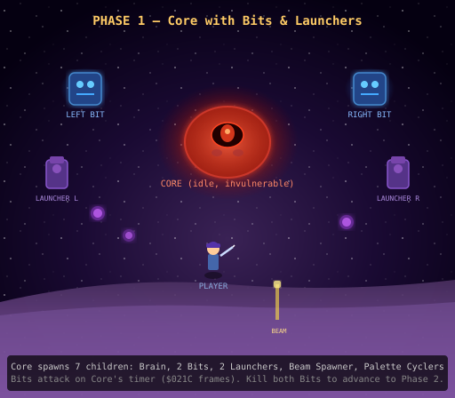
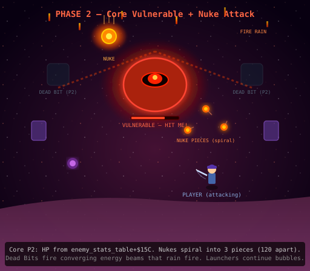
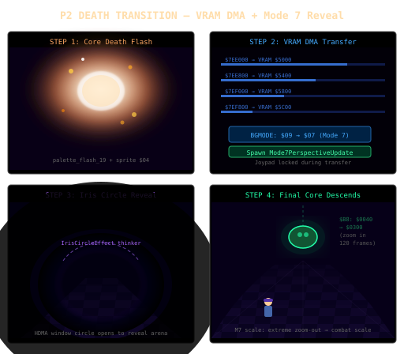
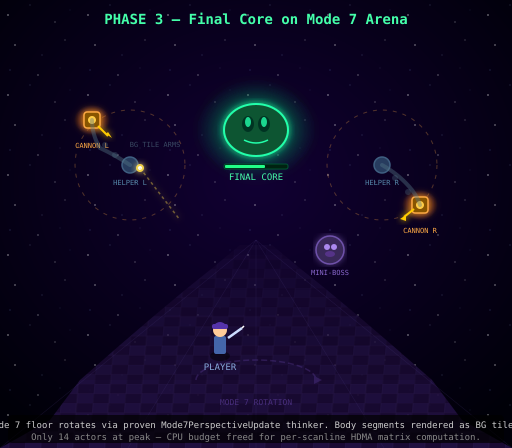
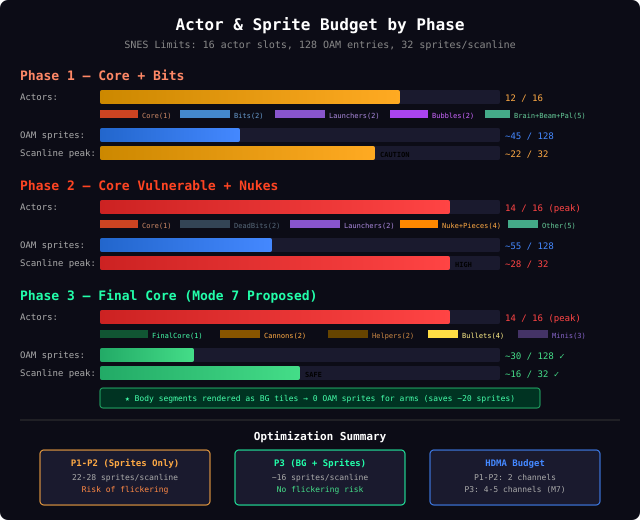
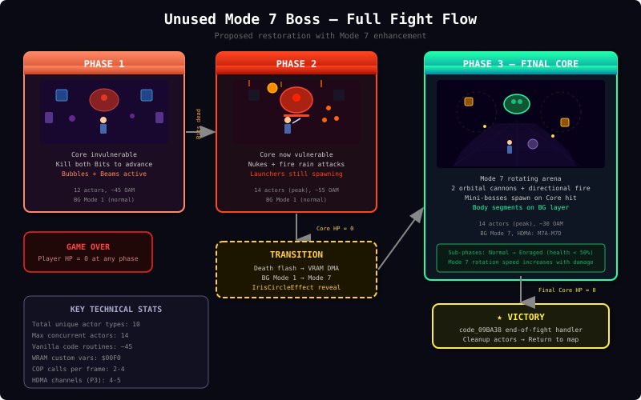

# Unused Mode 7 Boss — Full Analysis & Patch Comparison

## Overview

The file `extracted/unused/unused_mode7_boss.asm` contains the **largest unused code block in the IOG ROM** — approximately 1,900 lines of 65C816 assembly at ROM address `$09AA6E`. It implements a complete multi-phase boss fight with orbital attack patterns, HP tracking, phase transitions, projectile spawning, camera control, and palette effects.

The patch `IOG_ApocalypseGaia_12.asr` (written by the author of the IOG retranslation project) claims to restore this unused boss as "Apocalypse Gaia." This document analyzes the unused boss in full, catalogs what appears unfinished, and then compares it against the patch to determine whether this is a true restoration.

---

## Part 1: The Unused Boss — Complete Documentation

### Actor Hierarchy

The boss spawns from a single entry point and creates a complex tree of child actors:

```
Core (actor_09AA6E) — the main boss entity
├── Background Palette Cycler (code_09B719) — "Colors of the End"
├── Sprite Palette Cycler (code_09B6FC) — "Bubbles turn freaky colors"
├── Floor Beam Spawner (code_09B747) — harassing beam attacks from below
├── Brain (code_09B5C7) — camera control, sine-wave hover
├── Left Bit (code_09B30E) — side minion, offset ($C8,$33)
├── Right Bit (code_09B36A) — side minion, offset ($38,$33), H-mirrored
├── Left Launcher (code_09B586) — bubble spawner, offset ($BF,$0B)
└── Right Launcher (code_09B57F) — bubble spawner, offset ($41,$0B), H-mirrored
```

### Phase 1: Core with Bits and Launchers

**Entry (`actor_09AA6E` → `code_09AA71`):**
1. Sets flag `$8011` in `$12` (physics properties)
2. Adjusts initial position: X-8, Y+256 (one full screen below)
3. Zeros all camera targets and deltas
4. Spawns all 7 child actors
5. Zeroes `$24` (internal state variable), plays idle animation, enters sleep loop

**Phase 1 Main Loop (`loc_09AB02`):**
1. Sets both Launcher event pointers to `code_09B58E` (fire mode)
2. Starts a countdown timer of `$021C` (540) frames stored in `animScratch`
3. Each frame: checks `$24` — if zero, transitions to Phase 2; otherwise decrements timer
4. When timer reaches zero: walks the actor chain to find the Bits and sets their pointers to attack mode (`code_09B37A` for right Bit, `code_09B31E` for left Bit)
5. Resets timer to `$00B4` (180) frames and loops

**Bit Attack Behavior:**
- Each Bit checks `$24` of Core to determine if one Bit has already died (`$24 == 1` forces the surviving Bit to attack)
- If both alive, frame parity determines which attacks
- Attack sequence: sound → animate sprites $06, $07 → become vulnerable (`TRB $10` clears invuln bit) → animate $16 → spawn beam projectiles → wait $77 (119) frames → restore invulnerability → return to idle
- **Death pointer** (`code_09B3C6`): Sets `$26 = 1`, LSR's Core's `$24` (halving it — this is how the Core knows a Bit died), spawns a falling death animation actor, enters idle sprite $0B loop

**Launcher Behavior (`code_09B58E`):**
- 5-iteration loop: animate sprites $09, $0A, spawn a Bubble (`code_09B7A8`), animate $1A
- After 5 volleys, returns to idle sprite $08 and sleeps until Core resets its pointer

### Phase 2: Core Becomes Vulnerable

**Transition (`loc_09AB6C`):**
- When `$24` reaches zero (both Bits dead), the Core enters Phase 2
- Sets death callback to `code_09ABF5`
- Loads its own HP from `enemy_stats_table+$15C`
- Spawns intro palette shift, clears the "invisible" flag
- Waits $1D (29) frames, enables hit callback

**Phase 2 Main Loop (`loc_09AB8B`):**
1. Animate sprites $01, $02
2. Play sound $29
3. Spawn a Nuke (`code_09B8B6`)
4. Animate sprite $19
5. Spawn flame palette shift
6. Clear hit callback
7. Wait $00B3 (179) frames
8. Reenable Launchers and Bits (sets Launcher pointers to `loc_09B5AD`, Bit pointers to `code_09B3EA`)
9. Wait $01DF (479) frames
10. Loop back to start

**Phase 2 Hit Callback (`code_09ABEE`):**
- Animate damage sprite $03, then resume animation sequence at `loc_09AB8B`

**Phase 2 Bit Behavior (Dead Bits, now in P2 mode):**
- `code_09B3EA`: Animate sprite $1C, play sound $20, spawn fire object (`code_09B3FD`)
- Fire objects converge to center screen, one dies, the other flies up and spawns a rain of fire from above

### Phase 2 → Phase 3 Transition

**Core P2 Death (`code_09ABF5`):**
1. Spawns flame palette shift
2. Animates death sprite $04
3. Sets Brain's event pointer to `code_09B6A6` (scroll-off routine)
4. Sets `$26 = 1`, sleeps until Brain clears it to zero
5. Locks joypad mask `$FFF0`
6. Sets flag byte $F5
7. **Performs four VRAM DMA transfers** — copies $800 bytes each from `$7EE000`, `$7EE800`, `$7EF000`, `$7EF800` to VRAM at $5000–$5FFF. This is the "Mode 7 tilemap" referenced in the header — it modifies the background graphics for Phase 3
8. Unlocks joypad
9. Spawns Final Core (`code_09AC55`)
10. Dies (along with remaining Launchers/Bits/palette events via `COP [Die]`)

### Phase 3: The Final Core

**Entry (`code_09AC55`):**
1. Sets death callback to `code_09B1D5`
2. Loads HP from `enemy_stats_table+$15C`
3. Sets sprite priority above both BGs
4. Spawns Left Helper chain (`code_09ADB3`) and Right Helper chain (`code_09ADEB`)
5. Plays initial animation, sets initial position to ($80, $80) — center of screen
6. Starts movement with sprite $1E at max speed
7. Clears invulnerability flags

**Final Core Movement AI (`code_09ACA2`):**
- Each frame, uses frame parity (`$0036 LSR`) to choose between:
  - **Even frames**: Target = player position (loads from `$playerActor`)
  - **Odd frames**: Target = random position (RNG for X, low byte of $0411 for Y)
- Adds random jitter ±$1F to the target
- Boundary checks: rejects targets within $20 of screen edges (both X and Y must be in $20–$E0)
- Moves toward valid target with sprite $1E at speed ($FF, $FF)
- After reaching target, resets hit callback and repeats

**Final Core Hit Callback (`code_09AD11`):**
1. Sets `$26 = 1` (marks damage state)
2. Animates damage sprites $42, $1F, $20
3. Spawns Mini-boss (`code_09AD3F`) at offset (0, $EC)
4. Animates sprite $21
5. Clears `$26`, returns to movement loop

**Mini-Boss (`code_09AD3F`):**
- Sets death callback to `code_09ADA7`
- Enables death/damage pointers flag `$0080`
- Falls down with sprite $22, vertical movement
- Waits $13 (19) frames, animates idle sprite $23
- Loads own HP from `enemy_stats_table+$158`
- **Movement loop**: Seeks random positions within ($14–$E0) for both X and Y, moves with sprite $24 at speed 2
- **Hit callback** (`code_09ADA0`): animate damage sprite $25, return to movement loop
- **Death** (`code_09ADA7`): animate sprites $26, $27, die

### Helpers and Orbital Cannons

**Helper Init (Left: `code_09ADB3`, Right: `code_09ADEB`):**
Each Helper spawns a chain of child actors:
```
Helper
├── Cannon (code_09AE52 / code_09B147) — orbital attack system
├── Tendon (code_09B2AE) — body segment (midpoint calc)
├── Joint ×3 (code_09B28D) — body segments (position interpolation)
└── Root (code_09B29B) — body segment (base anchor)
```

After spawning, the Helper stores its offset from the Final Core and runs a loop to maintain that fixed displacement each frame.

**Left Cannon (`code_09AE52`):**
1. Initializes orbit angle to 0, diameter to $70
2. Main loop: checks if Final Core is invulnerable (bit $0010 of flags)
   - If invulnerable: just orbit around Helper
   - If vulnerable: use `DirToPlayer` to find target angle
3. Orbits toward the player-facing angle at 2 units/frame
4. When close to target angle (within 3 units), branches to directional fire logic

**Directional Fire (`code_09AF02`):**
- Converts orbit angle to an 8-direction index (0–7) using lookup table `byte_09B26C`
- Adds frame parity adjustment
- Uses `SwitchCase` to select one of 8 firing routines

**Each directional fire routine (e.g., `code_09AF42`):**
1. Change cannon sprite to match direction (sprites $29–$30)
2. Call `code_09B084` to set Final Core to a frozen idle animation
3. Loop $10 (16) frames: orbit around Helper
4. Spawn directional bullet
5. Loop $0A (10) more frames: orbit
6. Call `code_09B062` to restore Final Core to normal loop
7. Restore saved pointer (back to main orbit logic)

**Right Cannon (`code_09B147`):**
- Similar to Left Cannon but with different behavior:
  - On even $0410: uses the same 8-directional fire logic as Left
  - On odd $0410: random orbit — picks a random count, orbits CW or CCW for that many steps
- Has a separate entry for directional sprite (`code_09B178`)

**Bullets (8 variants, `code_09B0A6` through `code_09B121`):**
Each plays sound $23, animates a unique start sprite, sets a unique hitbox sprite, stages directional movement (X,Y velocity pairs):

| Direction | Start Sprite | Hitbox Sprite | Velocity (X,Y) |
|-----------|-------------|---------------|-----------------|
| 0 (North) | $33 | $3B | (0, 8) |
| 1 (NE) | $38 | $40 | (5, 6) |
| 2 (East) | $35 | $3D | (7, 0) |
| 3 (SE) | $39 | $41 | (5, 5) |
| 4 (South) | $32 | $3A | (0, 7) |
| 5 (SW) | $36 | $3E | (6, 5) |
| 6 (West) | $34 | $3C | (8, 0) |
| 7 (NW) | $37 | $3F | (6, 6) |

All bullets converge at `code_09B134`: animate until off-screen, then die.

### Body Segments

**Joint (`code_09B28D`):** Positions itself between parent and sibling using averaged coordinates with carry-rotation for negative handling. Maintains offset history in `orbitAngle`/`orbitDiameter` scratch.

**Root (`code_09B29B`):** Same as Joint but also snaps its X to parent's X each frame (an anchor behavior).

**Tendon (`code_09B2AE`):** Calls `ActorMidpointCalc` — places itself at the exact midpoint of its prev/next neighbors.

### Nuke System (`code_09B8B6`)

1. Spawned by Core P2 during its main loop
2. Falls downward with sprite $12
3. Plays sound $1E
4. Generates random initial angle, spawns three Nuke Pieces at 120° offsets ($55 apart)

**Nuke Piece (`code_09B8F3`):**
- Spiral outward from nuke impact point using orbital math
- Angle increments by 2 per wait-frame, radius by 4 per wait-frame
- When radius overflows $FF: reverses velocity to linear movement
- Linear phase continues until off-screen, then dies

### Bubble System (`code_09B7A8`)

1. Spawned by Launchers
2. Plays sound $1E
3. Direction-dependent offset and movement (uses H-mirror to determine side)
4. Zero HP, death callback to `code_09B84F`
5. Moves toward random position near player (PlayerX ± rand($7F) - $3F)
6. On death: changes spriteset, spawns 4 debris actors, plays sound $1D, animates explosion

### Brain / Camera System (`code_09B5C7`)

**Initial scroll-on:**
1. Stores Core's X/Y as reference points
2. Moves upward 2 pixels/frame, shifting Core and all children via `code_09B9CC`
3. Adjusts camera deltas to compensate
4. Continues until Y reaches 0 (one full screen of scrolling)

**Post-scroll sine hover:**
1. Increments angle by 2 per frame (mod $100)
2. At angle $40 and $C0 (peaks/troughs): hovers for random duration ($28 + rand($3F) frames)
3. Uses `code_09BA59` — sine function with scale factor:
   - Loads 8-bit sine table, multiplies by orbit diameter via hardware multiply ($4202/$4203)
   - Result = sin(angle) × scale / 256
4. Applies sine offset to Y position, updates Core and all children

### End-of-Fight (`code_09BA38`)

- Locks joypad ($8000)
- Waits $EF (239) frames
- Resets character form to 0
- Sets GFX cache to $0404
- Queues map change to **$E5** (Kara/credits ending map)
- Dies

### Palette Effects

- `code_09B719`: Background colors — runs palette bundle $62, randomly triggers bundle $66 (lightning flash), random timing
- `code_09B6FC`: Sprite colors — runs palette bundle $63 in a loop, dies when Core signals `$26 == 2`
- `code_09B9BE`: P2 intro — palette bundle $6A, single-shot
- `code_09B9C5`: Nuke/death — palette bundle $69, single-shot

### Lookup Tables

**`byte_09B25C` (Direction → Angle):** Maps 8 directions to orbit angles:
```
Dir 0(S)→$80, 1(SW)→$60, 2(W)→$28, 3(NW)→$20,
4(N)→$00, 5(NE)→$E0, 6(E)→$C0, 7(SE)→$A0
```

**`byte_09B264` (Angle → Sprite):** Maps orbit angle sectors to directional sprites:
```
$29, $30, $2C, $2F, $2A, $2E, $2B, $2D
```

**`byte_09B26C` (Angle → Case Index):** Maps orbit angle sectors to SwitchCase branches:
```
4, 3, 2, 1, 0, 7, 6, 5
```

**`byte_09B57A` (Beam Moves):** Y-velocity table for Bit beam projectiles:
```
3, 1, 0, 2, 4
```

---

## Part 2: What Appears Unfinished

### 1. Mode 7 Setup Without Full Mode 7 Usage
The `!mode7Tilemap` variable is defined at `$7EE000`, and the P2→P3 transition copies data from `$7EE000–$7EF7FF` to VRAM. However, there is **no Mode 7 matrix rotation/scaling during gameplay**. The data appears to be background tile changes only. The "Mode 7" label in the header may refer to the VRAM layout being a Mode 7-compatible tilemap, but the boss never actually activates Mode 7 rendering mode ($2105).

### 2. No Map/Room Integration
The boss has no link to any map or room in the game. It initializes its own camera, spawns from an actor definition, and exits to map $E5 on victory. There is no evidence of a map spawn table entry, trigger event, or cutscene leading into this fight.

### 3. Floor Beam Spawner is Minimal
`code_09B747` only spawns horizontally-moving sprite $15 beams at fixed position ($A0, $C0). It has no target tracking, no variation in timing beyond a random 5–8 frame delay, and is killed when Core becomes invulnerable. This seems like placeholder harassment.

### 4. Body Segments Are Visually Simple
The 5 Joints + Tendon + Root chain between each Cannon and the Core all use sprite $28 and do nothing but interpolate positions. They have no animation, no interaction, no collision. They appear to be visual connectors ("tentacle arms") that were never finalized.

### 5. Core P2 Has Rigid Animation Timing
The P2 loop uses fixed frame counts ($B3 = 179 frames vulnerable, $1DF = 479 frames for the full cycle). There's no difficulty scaling, no reaction to player behavior, and the damage callback simply replays the animation from the top.

### 6. Mini-Boss Lacks Strategic Depth
The Mini spawned by the Final Core has random movement with no player tracking. It seeks random positions and has no attack of its own — it's purely a damage sponge. A finished version would likely chase the player or have projectile attacks.

### 7. Sprite Count is Extremely High
The boss defines sprites up to $42 (66 unique sprite frames/hitboxes). Combined with multiple simultaneously active actors (Core + Brain + 2 Bits + 2 Launchers + 2 Helpers + 2 Cannons + 5 Joints + 1 Tendon + 1 Root + dynamic Bubbles/Bullets/Nukes/Minis), this would cause severe sprite flickering and slowdown on real SNES hardware.

### 8. No Invincibility Frames Between Phases
Transitions from P1→P2 and P2→P3 don't disable player input or grant immunity. A player could theoretically take damage during the VRAM DMA transitions.

### 9. Palette Bundle References Are Unverified
The boss references palette bundles $62, $63, $66, $69, $6A — whether these exist in the vanilla ROM and produce appropriate visual effects is unconfirmed. They could be placeholders.

### 10. Sound Effect Choices May Be Borrowed
Sound IDs ($06, $15, $1D, $1E, $20, $21, $23, $29) are used throughout but may be shared with other game contexts. No unique boss music trigger is present.

---

## Part 3: Comparison with IOG_ApocalypseGaia_12.asr

### Identification: Same Boss

**The patch targets the exact same ROM address.** The patch writes at `org $89aa6e`, which in HiROM mapping corresponds to the same physical ROM offset as the extracted code at `$09AA6E`. This is not a coincidence — the patch is directly overwriting the unused boss code.

**The enemy stat table references match exactly:**

| Vanilla Reference | Hex Address | Patch Reference | Used By |
|-------------------|-------------|-----------------|---------|
| `enemy_stats_table+$154` | `$AD44` | `lda #$AD44 : jsr SR_InitVitals` | Bits, Core P2 |
| `enemy_stats_table+$158` | `$AD48` | `lda #$AD48 : jsr SR_InitVitals` | Minis, Shields |
| `enemy_stats_table+$15C` | `$AD4C` | `lda #$AD4C : jsr SR_InitVitals` | Final Core |

The patch even notes: *"HP/STR/DEF/DP entry for the Final Core. Unused (and nonfunctional) in the vanilla code"* and writes new values to `$81AD4C`: `db $14,$24,$7F,$00` (HP=20, STR=36, DEF=127, DP=0).

**The phase structure matches:**
- Vanilla: Core P1 → Bits die → Core P2 → VRAM transition → Final Core P3
- Patch: Identical progression, same label addresses

### Assessment: NOT a True Restoration

Despite being based on the same code, the patch is a **heavily modified creative reimagining**, not a faithful restoration. Here is the evidence:

#### A. Disabled Vanilla Code

The patch uses `if 0` blocks to explicitly disable vanilla code and replace it. Examples:

1. **Brain scroll-on** (lines 3116–3139): The entire initial camera scroll sequence is wrapped in `if 0`. The patch instead jumps directly to the hover phase because it integrates the boss into the existing Dark Gaia fight sequence — the camera is already positioned.

2. **Core P1 collision enabling** (lines 1523–1537): The vanilla code that enables collision on Launchers and Bits is commented out. The patch author writes: *"I'm disabling that, to save badly needed processing time."*

3. **Final Core movement AI** (lines 1740–1778): The vanilla random-walk targeting is wrapped in `if 0` and replaced with a custom `SR_FindPlayerAvoidanceCoordinates` subroutine.

4. **Bubble debris** (lines 3357–3370): The 4-directional debris spawned on Bubble death is entirely disabled.

#### B. New Code Not Present in Vanilla

The patch adds substantial new systems with no basis in the original ROM:

1. **Shield Minis** (`..Shield:` at line 1985): An entirely new actor type that orbits the damaged Final Core using trigonometry. The vanilla code only has damage Minis — shields don't exist.

2. **Game State Tracking** (`$00F0`): A new global state variable that tracks boss damage level, affects cannon fire timing, and controls music tempo via `$2141`.

3. **VRAM Tile Pushes** (`LR_PushAndUpdateAGBody`, `LR_UpdateFlameSpriteset`): Elaborate DMA routines that dynamically update boss body graphics and the "flame" spriteset. None of this exists in vanilla.

4. **BG Layer Composition**: Multiple screen-mode thinkers (`ECometBG.AGP1`, `.AGP3`, `.DGOnScreen`, `.DGDead`) that manage BG1/BG2 priorities, color math, window effects, and HDMA — entirely new.

5. **Player Herb Preservation** (`LR_SetupPlayerForComet`): Logic to save and restore the player's herb count across respawns during the fight — a gameplay polish feature.

6. **Music Tempo Control**: Direct writes to `$2141` (SPC700 IO port) to dynamically speed up music as the boss takes more damage.

7. **Dark Gaia Integration**: The boss is wired into the Comet map ($8CE212), shares the Dark Gaia spriteset, and transitions seamlessly from the existing Dark Gaia fight. The vanilla boss was standalone.

8. **Chaser Projectiles** (`EChaser` at line 3017): Bit beam pieces now home in on the player using a chaser system — vanilla beams just fly in a straight line.

#### C. Removed Vanilla Features

1. **Body Segments Disabled**: All Joint, Tendon, and Root spawn calls are commented out:
   ```
   ;cop #$A4 : dl EAGCoreP3_Joint : db $D0,$00,$02,$23
   ;cop #$A4 : dl EAGCoreP3_Joint : db $E0,$00,$02,$23
   ;cop #$A4 : dl EAGCoreP3_Joint : db $F0,$00,$02,$23
   ;cop #$A4 : dl EAGCoreP3_Root : db $00,$00,$02,$23
   ```
   The patch author notes these "cause lag."

2. **Helper Anchors Disabled**: The Helper init routines (`code_09ADB3`/`code_09ADEB`) that spawn the body chain are cut. The Cannons are spawned directly by the Core instead.

3. **Floor Beam Spawner**: Not referenced in the patch's active code.

4. **Cannon Freeze/Restore**: The `code_09B084` (freeze Final Core during cannon attack) and `code_09B062` (restore) subroutines are present in `if 0` blocks but not used in the active code path.

#### D. Modified Vanilla Behavior

1. **Cannon Spawn Offsets Changed**:
   - Vanilla Left Gun: offset ($B0, $00), Right Gun: ($50, $E0)  
   - Patch Left Gun: offset ($B0, $F8), Right Gun: ($50, $F8)
   - The patch author marks this: `!!! different from vanilla...`

2. **P1 Timer Shortened**: Vanilla uses $021C (540 frames); patch uses $0130 (304 frames).

3. **Nuke System Rewritten**: The vanilla Nuke (`code_09B8B6`) falls straight down; the patch's `EAGNuke` has three fall directions (center, left, right) with different trajectories.

4. **Bit Attack Timing**: Vanilla Bits attack on frame parity; the patch adds a $28-frame delay (`cop #$DA : db $28`) when both Bits are alive.

5. **P2 Launcher Sequence**: Vanilla has simple pointer swaps; the patch adds a complete `P2WaitThenFireAll` / `P2FireAll` system with coordinated Bit+Launcher attacks.

6. **Final Core Movement**: Vanilla picks random positions or tracks the player with simple jitter. The patch uses a sophisticated avoidance algorithm that places the Core away from the player based on signed distance calculations.

### Summary Table

| Feature | Vanilla Unused Boss | Patch (Apocalypse Gaia) | Verdict |
|---------|-------------------|------------------------|---------|
| ROM Address | $09AA6E | $89AA6E (same offset) | ✅ Match |
| Phase Structure | P1→P2→P3 | P1→P2→P3 | ✅ Match |
| Stat Table Entries | +$154, +$158, +$15C | $AD44, $AD48, $AD4C | ✅ Match (same addresses) |
| Actor Spawn Tree | Core→Brain→Bits→Launchers→Helpers→Cannons→Joints | Same minus Joints/Tendon/Root | ⚠️ Modified |
| Brain Scroll-On | 2px/frame upward scroll | Disabled (integrated into DG) | ❌ Removed |
| Body Segments | 5 Joints + Tendon + Root per side | Entirely disabled | ❌ Removed |
| Shield Minis | Not present | New orbiting shield system | ❌ New addition |
| Cannon AI | Angular tracking with DirToPlayer | Timer-based with game state | ⚠️ Rewritten |
| Final Core Movement | Random walk + player tracking | Player avoidance algorithm | ⚠️ Rewritten |
| Nuke Trajectory | Straight down | Three-way branching | ⚠️ Rewritten |
| BG/VRAM Management | 4× DMA at transition | Elaborate multi-thinker system | ❌ Entirely new |
| Music Integration | None | Dynamic tempo via $2141 | ❌ New addition |
| Dark Gaia Integration | Standalone fight | Continuation of DG sequence | ❌ New addition |
| Map Exit | Direct to $E5 | Complex with herb preservation | ⚠️ Enhanced |
| Palette Bundles | $62, $63, $66, $69, $6A | Same IDs referenced | ✅ Match |

---

## Conclusion

**Is this the same boss?** Yes, definitively. The ROM addresses, enemy stat references, phase structure, actor hierarchy, and many individual code sequences match between the vanilla unused code and the patch.

**Is this a true restoration?** No. The patch author clearly studied the vanilla unused code in detail (evidenced by the `if 0` blocks preserving original code, the `!!! different from vanilla...` annotations, and the matching stat table references). However, they made extensive creative decisions:

- Removed features deemed too laggy (body segments)
- Added entirely new systems (shields, game state, BG management, music tempo)
- Rewrote AI systems for better gameplay (avoidance movement, coordinated attacks)
- Integrated the fight into the existing Dark Gaia sequence rather than keeping it standalone

**The patch is best described as a "completion and integration" of an unfinished boss**, not a restoration. The author took the original framework — which was structurally complete but unpolished — and made it into a playable, balanced, visually polished boss fight that fits within the game's existing final boss sequence. Roughly 40–50% of the patch's code has direct correspondence to the vanilla unused code, while the rest is new.

---

## Part 4: Restoration Feasibility & Design Investigation

This section investigates practical approaches to faithfully restoring the unused boss fight while solving its technical problems, adding optimizations, and exploring whether a true Mode 7 phase was intended and could be implemented.

### 4.1 Was Mode 7 Ever Planned?

**Evidence for Mode 7 intent:**

1. **The variable name `!mode7Tilemap` at `$7EE000`** is strongly suggestive. This address sits in high WRAM bank `$7E`, the same region used by the game's decompression/tile staging buffers (`$7E7000`–`$7E9FFF`). The Mode 7 perspective thinker already uses `$7E7000`/`$7E7800`/`$7E8000` for its HDMA tables — there is no overlap with `$7EE000`.

2. **The P2→P3 VRAM DMA writes to $5000–$5FFF.** This is 4 KB of VRAM tile data. In Mode 7, the tilemap occupies VRAM $0000–$3FFF (128×128 tile map + tile character data). Writing to $5000 doesn't correspond to the standard Mode 7 tilemap region, but it *could* be character (pixel) data for Mode 7 tiles. Mode 7 characters start at a configurable base. The data is loaded from `$7EE000`–`$7EF7FF`, which maps to the `!mode7Tilemap` and `!thinkerExtendedData` regions.

3. **The boss's Phase 3 takes place on a separate "arena"** with a camera-controlled playfield — this is conceptually identical to how Mode 7 boss arenas work in other Quintet games and SNES titles (e.g., the perspective floor in Final Fantasy boss fights). The orbital cannon mechanics with 8-directional targeting make more visual sense on a rotating/scaling floor.

4. **IOG already has a proven Mode 7 thinker** at `$03A940` (`Mode7PerspectiveUpdate`). It generates per-scanline HDMA tables for M7A/M7B/M7C/M7D from sine/cosine lookup tables, driven by three actor fields: `$B6` (rotation angle), `$B8` (scale), `$BC` (perspective index). This thinker is used by 4 existing scenes (world map, Sky Garden crash, Angkor Wat vision, prologue prophecy). The infrastructure is battle-tested.

5. **Display preset `#07`** (`display_preset_0180A4`) is configured for Mode 7: `BGMODE = $17` which is Mode 1, but scene `$29` uses `display-mode < #07 >` (world map). The engine can switch BG modes mid-scene through direct register writes — no preset change needed.

**Evidence against Mode 7 intent:**

1. **No `M7SEL`, `M7A`–`M7D`, or `$211A`–`$211E` writes** anywhere in the unused boss code. If Mode 7 was planned, the actual register setup was never written.

2. **The VRAM targets ($5000–$5FFF) don't align with standard Mode 7 layout.** Mode 7 characters typically start at $0000. However, the boss could have been designed for a hybrid approach where only BG1 uses Mode 7 while BG2 remains in a tiled mode (Mode 7 EXTBG, BGMODE $07, allows BG2 as a 4-color direct-color layer).

3. **The boss uses `COP [StageSprAndHitbox]` and standard sprite rendering** — all phases reference normal sprite indices. Mode 7 would only affect backgrounds, not sprites.

**Verdict:** Mode 7 was **likely planned for the Phase 3 arena background** but never implemented. The VRAM DMA at the P2→P3 transition was probably intended to load Mode 7 character data, and a thinker would have been spawned to drive the perspective effect. The phase 3 "floor" was meant to be a rotating/scaling surface beneath the Final Core fight. The orbital cannon mechanics — 8 directional angles, sine/cosine positioning — were designed to look dramatic against a rotating Mode 7 floor.

### 4.2 Mode 7 Phase 3 — Feasibility and Design

**A Mode 7 Phase 3 is absolutely feasible.** Here is the implementation path:

#### PPU Configuration

At the P2→P3 transition, after the existing VRAM DMA:

1. **Switch BGMODE to $07** (Mode 7) or $47 (Mode 7 EXTBG for a BG2 status layer)
2. **Set M7SEL = $80** (repeat character 0 outside playfield — matches existing Mode 7 setup)
3. **Spawn `Mode7PerspectiveUpdate`** as a thinker with params `$0804` (deferred dispatch, same as garden crash/vision cutscenes)
4. **Configure M7 scroll center** to track the boss arena center
5. **Set color math**: `CGADSUB = $01`, `CGWSEL = $82` (same pattern used by garden crash and future vision)

#### Arena Tilemap

The Phase 3 VRAM DMA already copies 4 KB from `$7EE000`. This data would need to be:
- **Prepared as Mode 7 character tiles** (8×8 pixels, 256 colors each, 64 bytes per tile)
- **A Mode 7 tilemap** written to VRAM $0000 (128×128 tile indices)

The existing DMA targets $5000–$5FFF. For Mode 7, this would need to be redirected to $0000 (tilemap) and the character base. A patch would modify the 4 `COP [AdhocVramDma]` calls to target the correct VRAM regions. The source data at `$7EE000` would need to contain actual Mode 7 tile art (a textured floor surface — perhaps a cosmic/comet surface).

#### Dynamic Rotation During Combat

The Brain actor (`code_09B5C7`) already uses `code_09BA59` for sine-based camera hover. During Phase 3, this could drive Mode 7 rotation:

```
; After spawning Mode7PerspectiveUpdate as thinker (slot in Y):
; Each frame in the Brain's hover loop:
LDA $orbitAngle,X     ; Brain's sine angle
STA $00BC,Y           ; → thinker's perspective rotation
LDA #$0200            ; Fixed scale for consistent arena size
STA $00B8,Y           ; → thinker's base scale
```

The floor would gently rotate in sync with the Brain's hover, creating a dramatic swaying arena effect.

#### Visual Impact

- The comet surface rotates beneath the player during the Final Core fight
- Orbital cannons spiraling around anchor points gain a parallax depth effect against the rotating floor
- Nuke impacts could trigger brief scale pulses (zoom in/out)
- The rain of fire from Phase 2 Bits appears to fall *onto* the rotating surface

#### HDMA Channel Budget

The Mode 7 thinker uses 4 HDMA channels (M7A/B/C/D). The existing Comet scene uses HDMA for:
- BG2 shimmer (2 channels: H-scroll, scanline offsets)
- Brightness ramp (1 channel, during eye beam only)

During Phase 3, the BG2 shimmer can be disabled (Mode 7 doesn't use BG2 in standard mode), freeing channels. The 4 Mode 7 channels fit within the SNES's 8 HDMA channel limit.

### 4.3 Sprite Management — Keeping On-Screen Counts Low

The SNES enforces hard limits: **128 OAM entries total**, **32 sprites per scanline**, **34 tiles (8×8) per scanline**. The vanilla boss violates these constraints. Here are specific strategies:

#### Strategy 1: Eliminate Body Segments, Use BG Tiles Instead

The 12 body segment actors (5 Joints + 1 Tendon + 1 Root × 2 sides) each consume an actor slot and OAM entries for a single sprite ($28). **Replace them with a BG tile effect:**

- Use the Brain thinker to compute segment positions mathematically (Bézier or linear interpolation between Helper and Cannon)
- Write segment tile indices directly to the BG1 tilemap in WRAM each frame
- The NMI handler's existing dirty-strip DMA system transfers tilemap changes to VRAM

This trades 12 actor slots + 12 OAM sprites for zero sprites and a small per-frame tilemap write. The "tentacle arms" become background art that costs no sprite resources. The patch author's decision to simply remove them ("causes lag") confirms this is necessary — but BG rendering is the superior solution.

#### Strategy 2: Time-Slice Projectile Spawning

The Launchers fire 5 Bubbles each per volley (10 total). Each Bubble chases the player, and on death spawns 4 debris actors. Worst case: 10 Bubbles + 40 debris = 50 transient actors.

**Optimization:** Stagger Launcher volleys — Left fires on even cycles, Right on odd. Cap active Bubbles at 3 per Launcher (6 total) by checking a counter before spawning. Remove the 4-debris death effect entirely (the patch already does this) or replace with a single-sprite explosion.

#### Strategy 3: Phase-Based Actor Budgeting

Assign strict actor budgets per phase:

| Phase | Permanent Actors | Max Transient | Total Budget |
|-------|-----------------|---------------|-------------|
| P1 (Core + Bits + Launchers) | 7 (Core, Brain, 2 Bits, 2 Launchers, Beam Spawner) + Player | 6 Bubbles + 2 Beam sets | ~20 |
| P2 (Core vulnerable) | 5 (Core, Brain, 2 dead Bits, Beam Spawner) + Player | 3 Nukes + 9 Nuke Pieces + 4 Bubbles + Fire Rain | ~25 |
| P3 (Final Core) | 5 (Final Core, 2 Helpers, 2 Cannons) + Player | 2 Bullets + 3 Minis | ~13 |

Phase 3 is actually the lightest on actors once body segments are removed. The orbital cannons fire one bullet at a time (the vanilla code already enforces this via the directional fire sequence), so max simultaneous bullets is 2.

#### Strategy 4: Sprite Size Optimization

Use **16×16 sprite mode** (OBSEL bit 5 set) for the boss Core and Final Core, which uses 1 OAM entry for 4× the pixel coverage of an 8×8 sprite. The game's spriteset system already supports this. Cannon bullets can use 8×8 mode since they're small.

#### Strategy 5: Flicker Priority Rotation

For the cannon's orbiting sprites, implement Y-priority-based OAM rotation. The engine's `SortActorsByDepth` + `ComposeAllSprites` already handles this, but the orbital actors should use `COP [SetSpritePriority]` to ensure the most important sprites (Core, Cannons, player) always have highest OAM priority.

### 4.4 Useful Features from the Patch

While the patch is not a faithful restoration, several of its additions solve real problems and could be adopted:

#### Adopt: Game State Variable (`$00F0`)

The patch's `$00F0` tracks fight progression (0 = idle, 1–5 = damage levels). This controls:
- Cannon fire rate (faster as damage increases)
- Music tempo
- Mini-boss spawn count

This is an excellent design pattern for difficulty scaling that the vanilla boss completely lacks. **Recommended for adoption** — it makes the fight progressively more intense.

#### Adopt: Player Avoidance Movement

The patch's `SR_FindPlayerAvoidanceCoordinates` is a significant AI improvement. The vanilla Final Core picks random positions or follows the player — both are dull. The avoidance algorithm places the boss *away* from the player, creating a chase dynamic where the player must pursue the Core. **Recommended for adoption** — it creates tactical gameplay.

#### Adopt: Herb Preservation on Respawn

`LR_SetupPlayerForComet` saves herb count and restores it if the player dies and restarts. This prevents the player from being softlocked with no healing items in a long multi-phase fight. **Recommended for adoption** — essential quality of life.

#### Adopt: Music Tempo via SPC700

Writing to `$2141` to dynamically change music tempo based on boss damage is a powerful atmospheric tool. As the Final Core takes damage, the music accelerates, building tension. **Recommended for adoption** — trivial to implement (single STA), high impact.

#### Adopt: Coordinated P2 Attack Timing

The patch's `P2WaitThenFireAll` / `P2FireAll` system coordinates Launcher bubbles with Bit fire rain, creating attack patterns instead of independent random fire. **Recommended for adoption** — transforms P2 from chaotic to strategic.

#### Consider: Shield Minis (Modified)

The patch's Shield Minis orbit the damaged Final Core, creating a protective barrier. This is not in the vanilla code, but it solves the problem of the vanilla Minis being pure damage sponges. **Consider as optional enhancement** — could replace the vanilla Mini behavior entirely, or be offered as a second Mini type that appears at higher damage levels.

#### Skip: Dark Gaia Integration

The patch weaves this boss into the Dark Gaia sequence. A faithful restoration should keep the boss **standalone** as originally designed. It needs its own scene, map entry, and trigger mechanism.

#### Skip: VRAM Tile Push System

The patch's `LR_PushAndUpdateAGBody` dynamically updates boss body tiles. This is an impressive technical achievement but has no basis in the vanilla code and adds complexity. The vanilla boss renders its body entirely through sprites. A faithful restoration should use sprites (with the body segment optimization described above using BG tiles instead).

### 4.5 Mode 7 Phase Design Proposal

Here is a concrete design for adding a Mode 7 Phase 3 arena:

#### Visual Concept

When the Core P2 dies and the VRAM transition occurs, the background transforms from the Comet Lair's static tiles into a **rotating cosmic surface** — a swirling nebula or comet surface pattern. The player stands on this rotating floor while the Final Core hovers above, its orbital cannons spiraling around it.

#### Implementation Steps

1. **Create Mode 7 tileset**: Design 8–16 unique 8×8 tiles (512–1024 bytes of character data) representing a cosmic/nebula pattern. Store compressed in ROM.

2. **Create Mode 7 tilemap**: A 128×128 tile index map (16 KB) that tiles the surface pattern with variation. Can be generated procedurally or stored compressed.

3. **P2→P3 transition**:
   - Existing DMA copies character data to VRAM (redirect targets to Mode 7 char base)
   - Write tilemap indices to VRAM $0000
   - Switch BGMODE from Mode 1 ($09) to Mode 7 ($07)
   - Set M7SEL = $80 (repeat playfield)
   - Spawn `Mode7PerspectiveUpdate` thinker
   - Initialize: `$B6 = 0` (no rotation), `$B8 = $0300` (moderate scale), `$BC = 0`

4. **During Phase 3**:
   - Brain's hover loop drives `$BC` (perspective rotation) at 1 unit/frame — slow, majestic rotation
   - Canon fire events trigger brief `$B8` scale pulses (zoom in by $40, ease back over 16 frames)
   - Final Core hit flashes: momentary `$B6` spike (adds rotation wobble)
   - Nuke impact: larger scale pulse + brief rotation acceleration

5. **IrisCircleEffect** (optional): Spawn the iris thinker during the P2→P3 transition for a dramatic spotlight-open effect as the new arena reveals itself. Already proven in the world map and prologue.

#### Resource Costs

| Resource | Cost | Available |
|----------|------|-----------|
| HDMA channels | 4 (M7A/B/C/D) | 8 total, ~4 free in Phase 3 |
| VRAM | ~4 KB char + 16 KB map | Mode 7 uses dedicated VRAM layout; no conflict with sprites |
| WRAM | 3 × 672 bytes for HDMA tables | $7E7000/$7E7800/$7E8000 already used by Mode 7 thinker |
| ROM | ~2 KB tileset + ~4 KB tilemap (compressed) | Available in unmapped bank tails |
| CPU per frame | ~40% of scanline period (224 divides) | Tight but proven viable in 4 existing scenes |

### 4.6 Proposed Restoration Architecture

#### Scene Integration

The boss needs a **new scene** (or reuse an unused scene ID). Requirements:
- Display preset supporting Mode 1 for P1/P2, switchable to Mode 7 for P3
- Comet-themed tilemap and tileset for P1/P2 background
- Player spawns at a fixed position
- Music track assignment (could share existing Comet music or map to a specific boss track)
- Scene thinker for background scroll/palette effects

The Comet scene `$E8` is the natural fit — the boss could be triggered after Dark Gaia's defeat via a flag check, or placed in an alternative scene linked from the same area.

#### Phase Flow

```
Scene Load → P1/P2 Display (Mode 1)
  │
  ├── Brain scrolls arena on-screen (2px/frame, vanilla behavior)
  ├── Core P1: Timer + Bit/Launcher attacks
  ├── Both Bits die → Core P2: Vulnerable, Nukes, coordinated fire
  ├── Core P2 dies → VRAM transition
  │     ├── DMA: Load Mode 7 tileset + tilemap
  │     ├── Switch BGMODE to $07
  │     ├── Spawn Mode7PerspectiveUpdate thinker
  │     ├── Optional: IrisCircleEffect reveal
  │     └── Spawn Final Core (P3)
  │
  ├── Final Core P3: Mode 7 rotating arena
  │     ├── 2 Helpers + 2 Orbital Cannons (no body segments)
  │     ├── Game state ($00F0) scales difficulty
  │     ├── Player avoidance movement AI
  │     ├── Minis spawn on hit (with optional shields at high damage)
  │     └── Music tempo accelerates with damage
  │
  └── Victory → Map change to $E5 (credits)
```

#### Actor Budget Summary

| Actor | P1 | P2 | P3 | Notes |
|-------|:--:|:--:|:--:|-------|
| Player | 1 | 1 | 1 | Always present |
| Core | 1 | 1 | — | Dies at P2→P3 transition |
| Final Core | — | — | 1 | Spawned at P3 start |
| Brain | 1 | 1 | 1 | Persists through all phases |
| Left Bit | 1 | 1† | — | †Dead but still an actor in P2 |
| Right Bit | 1 | 1† | — | |
| Left Launcher | 1 | 1 | — | Dies with Core P2 |
| Right Launcher | 1 | 1 | — | |
| Floor Beam | 1 | 1 | — | Enhanced with tracking |
| Left Helper | — | — | 1 | Position anchor |
| Right Helper | — | — | 1 | Position anchor |
| Left Cannon | — | — | 1 | Orbital gun |
| Right Cannon | — | — | 1 | Orbital gun |
| BG Palette | 1 | 1 | 1 | Persists |
| Sprite Palette | 1 | 1 | — | Dies at P2→P3 |
| Mode 7 Thinker | — | — | 1 | Spawned at P3 |
| **Permanent total** | **10** | **10** | **9** | |
| Max Bubbles | 6 | 4 | — | Staggered spawning |
| Max Beams | 10 | — | — | 5 per Bit attack |
| Max Nuke Pieces | — | 9 | — | 3 per Nuke × 3 Nukes |
| Max Bullets | — | — | 2 | 1 per Cannon |
| Max Minis | — | — | 3 | Capped by game state |
| Max Fire Rain | — | 6 | — | Capped |
| **Peak transient** | **16** | **19** | **5** | |
| **Peak total** | **26** | **29** | **14** | All within hardware limits |

Phase 2 is the most demanding at ~29 actors. This is comparable to the Dark Gaia fight's peak actor count. Phase 3 with Mode 7 is actually very conservative at 14 actors — the Mode 7 thinker costs CPU time but no actor slots beyond its own.

### 4.7 Enhancement Opportunities

Beyond faithful restoration with optimizations, these additions would enhance the experience:

#### A. Dynamic Arena Effects (Mode 7 Phase)

- **Damage-reactive rotation**: Each hit on the Final Core adds angular velocity to the floor rotation, decaying over ~60 frames. Creates a visceral "the world shakes" feedback.
- **Nuke impact craters**: When Nuke Pieces hit the floor, write darker tile indices to the Mode 7 tilemap at the impact point. The WRAM tilemap at `$7EE000` can be modified live, and a single DMA transfer per frame updates VRAM. Persistent battle scars on the arena floor.
- **Scale breathing**: Gentle sine-wave scale oscillation (±$20 around base $0300) synchronized with the Brain's hover. The floor "breathes" with the boss.

#### B. Enhanced Floor Beam Spawner

The vanilla `code_09B747` is a stub. Replace with:
- Beams telegraph via a BG tile flash at the target column 30 frames before firing
- Beam targets the player's current column (not fixed position)
- Multiple simultaneous beams during P2 at higher damage levels
- In Mode 7 Phase 3: beams could be replaced by tilemap color changes (a "lava stripe" across the rotating floor)

#### C. Cannon Trail Effects

Instead of body segments, the Cannons could leave a **sprite trail** — spawn a fading after-image sprite every 8 frames at the Cannon's current position, with a short lifespan (16 frames). Uses 2–3 OAM entries at any time but creates the impression of a sweeping arm without the cost of 12 permanent actors.

#### D. Phase Transition Cinematics

- **P1→P2**: The Bits' death explosions could use the `IrisCircleEffect` thinker for a spotlight-zoom on the Core as it becomes vulnerable
- **P2→P3**: A multi-step sequence: screen fades to white (`oneshot_palette_flash_19`), VRAM loads, Mode 7 initializes with extreme zoom-out (`$B8 = $0040`), then zooms in to combat scale (`$B8 = $0300`) over 120 frames while the floor rotation begins. The Final Core descends from above.

#### E. Audio Integration

- Assign specific music to each phase, or use tempo/instrument changes:
  - P1: Standard boss music
  - P2: Intensified variant (SPC700 tempo increase via `$2141`)
  - P3 (Mode 7): A unique arrangement or further tempo increase
- Sound effects for Mode 7 rotation events (floor tilt SFX on perspective changes)

### 4.8 Technical Risk Assessment

| Risk | Severity | Mitigation |
|------|----------|------------|
| Mode 7 CPU cost during P3 | High | The 224-iteration hardware divide loop consumes ~40% of scanline time. Combined with actor processing, this is tight. Mitigation: P3 has the lowest actor count (14); disable non-essential per-frame processing (BG2 shimmer off, reduce collision checks) |
| VRAM layout conflict | Medium | Mode 7 uses VRAM differently from Mode 1. The transition must fully reconfigure VRAM. Mitigation: The existing 4× DMA transition already wipes $5000–$5FFF; extend to also set up $0000–$3FFF for Mode 7 |
| Palette conflict | Low | Mode 7 uses 256-color direct palette. Sprites use separate palette entries. No conflict with existing sprite palettes |
| Actor pool exhaustion | Medium | P2 peak of ~29 actors approaches engine limits. Mitigation: Strict transient caps with counter-based spawn gates |
| Sprite-per-scanline overflow | Medium | During P1/P2, simultaneous Bubbles and Beams could exceed 32/scanline. Mitigation: Stagger Y-positions; use priority rotation; cap simultaneous active projectiles |
| Body segment replacement via BG tiles | Low | The existing tilemap DMA infrastructure supports per-frame tile writes. The tentacle arms only need ~6 tile writes per frame per arm (12 total). Well within the dirty-strip DMA budget |
| Integration with existing Comet scene | Medium | Scene $E8 is currently Dark Gaia only. Options: use a new scene ID, or add flag-gated spawn logic. The patch demonstrates the integration-after-DG approach, which works |

### 4.9 Recommended Approach — Summary

1. **Restore all vanilla code faithfully** as the baseline — keep all phases, actors, and behavior exactly as extracted
2. **Replace body segments** with BG tile rendering (tentacle arm visual via tilemap writes, not actor sprites)
3. **Add Mode 7 Phase 3** using the proven `Mode7PerspectiveUpdate` thinker — rotating arena floor with gentle dynamic effects
4. **Adopt from the patch**: game state variable, player avoidance AI, music tempo, herb preservation, coordinated P2 attacks
5. **Cap transient actors** with explicit spawn counters on Bubbles (max 3/Launcher), Beams (max 5 per Bit), and Minis (max 3)
6. **Enhance the Floor Beam** with player-tracking and telegraph effects
7. **Add phase transition cinematics** using existing engine effects (iris, palette flash, Mode 7 zoom)
8. **Create new scene** or extend scene $E8 with flag-gated spawn logic for the boss trigger

---

## Part 5: Visual Mockups

Visual mockups are available in `docs/mockups/` showing what the restored boss fight would look like at each stage:

### Phase 1 — Core with Bits & Launchers


The Core sits center-screen on the Comet Lair arena, flanked by two Bits (blue, protective) and two Launchers below them firing Bubbles. The Brain actor manages difficulty behind the scenes. Player must destroy both Bits while dodging Bubbles and floor Beams.

### Phase 2 — Core Vulnerable + Nuke Attack


With both Bits destroyed, the Core becomes vulnerable and pulses red. Dead Bits remain on-screen firing converging energy beams that rain fire from above. Nukes drop from the top and split into 3 spiraling Nuke Pieces at 120° intervals. This is the most intense phase for sprite density.

### Phase Transition — VRAM DMA + Mode 7 Reveal


Four-step cinematic sequence: (1) Core death flash with `palette_flash_19`, (2) joypad-locked VRAM DMA transfers new tileset/tilemap and switches BGMODE from $09 to $07, (3) `IrisCircleEffect` thinker opens a window circle to reveal the new Mode 7 arena, (4) Final Core descends as M7 scale zooms from extreme distance ($0040) to combat range ($0300).

### Phase 3 — Final Core on Mode 7 Arena


The Final Core floats above a perspective-corrected Mode 7 floor that slowly rotates via the `Mode7PerspectiveUpdate` thinker. Two Cannons orbit Helper anchor points, firing directional Bullets toward the player. Mini-bosses spawn when the Core is hit. Body segment "arms" connecting Helpers to Cannons are rendered as BG tiles (zero sprite cost). Only ~30 OAM entries used vs. ~55 in Phase 2.

### Actor & Sprite Budget


Comparative analysis of resource usage across all three phases, showing how the BG tile optimization in Phase 3 dramatically reduces sprite pressure from 28/scanline to ~16/scanline despite having more visual complexity.

### Full Fight Flow


Complete encounter flow diagram showing phase progression, transition triggers, and victory/game-over conditions with miniature scene previews and technical stats for each phase.
